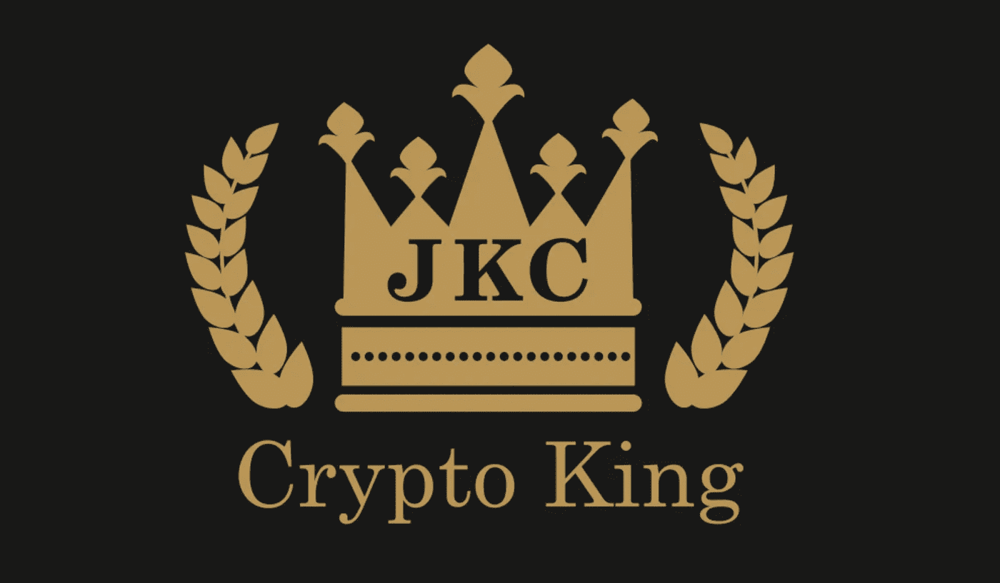

# 4 Cryptos 关注 2018 年 5 月 28 日这一周(ZCL、阿农、EOS、ONT)

> 原文：<https://medium.com/hackernoon/4-cryptos-to-focus-on-the-week-of-may-28-2018-zcl-anon-eos-ont-d2d7a1e2e491>

由[杰克加密](https://btcmanager.com/author/jakethecryptoking/)

**从 5 月 28 日开始的一周是令人兴奋的一周，因为它处于共识之后、夏季公告之前的时期。市场一直停滞不前，许多替代硬币只是乘着炒作和新闻上涨的浪潮。由于加密交易商打算保持领先一步，期待他们专注于加密货币，如；ZCL、阿农、伊奥斯和 ONT 进入六月。**

# 即将到来的一周

5 月 26 日到 6 月 2 日有许多令人兴奋的最后期限即将到来。EOS 和 ONT 将在接下来的七天内发布 mainnet。从最近宣布的匿名比特币( [ANON](https://www.anonymousbitcoin.io/) )分叉和一个想要完全接管 ZCL 的新开发团队，ZCL 在多个方面都有消息。[比特币(BTC)](https://btcmanager.com/news/bitcoin/) 比特币本身即将迎来重要的一周，因为自上周两套 Cboe 期货到期以来，交易量和价格均有所下降。

[共识](https://btcmanager.com/cryptocurrency-conference-consensus-2018-kicks-off-with-lamborghinis-and-protests/)通常是“重大”新闻和事件发生的时候，但由于今年的共识并不令人印象深刻，预计今年夏天将继续发生重要事件。EOS 和 ONT 在几个月前宣布了他们的 mainnet。通常，当市场强劲看涨时，加密货币希望获得这种规模的消息。

市场似乎不愿意北上，但场外交易(柜台交易)的压力在买方仍然很大，比特币的价格几乎没有变动。ZCL 背后的原始团队已经转移到其他项目，但这并没有阻止社区完全拥抱 ZCL，现在两个开发团队正在竞争 ZCL 的社交媒体的权利，而三个团队(或更多)继续其发展。

ONT 和 EOS 发布了 mainnet，这是加密货币最重要的特性之一。ZCL 有与他们的 ANON fork(白皮书发布和顾问公告)相关的消息，而 BTC 将接受测试，它会回到 10，000 美元或继续修正低于 7，000 美元的趋势吗？

# 经典和匿名比特币(ZCL 和匿名)

本周对于 ZCL 和 T2 来说都有令人兴奋的进展。不到一个月前，ZCL 推特评论说 ZCL 不再有开发者支持。上个月事件的重大转折导致多个开发团队争夺 ZCL 社交媒体频道的权利，许多忠诚的开发人员渴望承担一个新项目。

两个著名的开发团队 ZClassicCE 和 ZClassicBlue 都已经开始在 ZCL 上工作，正在与社区合作，并且在短期和长期都考虑到了社区的利益。

除了 ZCL 有多个团队致力于他们的核心代码，另一个团队，匿名比特币，已经在进行 ZCL 和 BTC 的 masternode 专用隐私分叉。

实现这种 1:1 分叉的唯一方法是在快照日(2018 年 9 月 15 日)持有 ZCL 或 BTC。

快照之后，ZCL 持有者和 BTC 持有者将获得 1:1 的匿名比例。目前，ANON 团队正在欧洲的[区块链](https://hackernoon.com/tagged/blockchain)会议上传播对该项目的认识，并在全球范围内建立一个网络。匿名比特币团队承诺翻译成多种语言(德语已经完成)，白皮书将于 6 月 1 日发布，并增加了一个重要的顾问。他们目前正在欧洲旅行，参加国外重要的[区块链会议](https://btcmanager.com/events-list/)就在网站翻译即将完成的时候。

ANON 打算成为加密货币历史上第一个透明的分支，在本周发布他们的白皮书、翻译网站、欧洲、亚洲和美国巡回会议的计划，以及一个惊喜顾问。一个新的叉子加上多个开发团队急切地工作，使 ZCL ASIC 再次抵抗，使 ZCL 成为一个令人兴奋的硬币，在 5 月的最后一周和夏季的剩余时间观看。来自主要开发人员的一个有趣的更新是，他们实际上超前于计划，并考虑提前时间表和分叉日期(可能是第一次开发事件被加速而不是延迟)。

**要了解白皮书发布的最新消息，surprise advisor 和 fork updates 请确保在** [**Twitter**](https://twitter.com/ANON_BTC?lang=en) **和**[**Telegram**](https://t.me/anonymousbitcoin)**上关注匿名比特币。**

# 本周维护网:本体论(ONT)和 EOS

许多顶级交易所在上市前都需要主网和测试网。Ontology 和 EOS 都将在未来十天内发布 mainnet。EOS 和 Ontology 是今年讨论较多的两个密码。ONT 股价为 6.67 美元，市值为 8.2 亿美元。EOS 的每枚硬币价值 12.81 美元，市值超过 110 亿美元。在这些非常重要的日子到来之前，EOS 和 ONT 都享受了不错的增值。

EOS 的市值在此前三个月翻了一倍多，从 3 月 8 日市值 50 亿美元的加密货币到 5 月 27 日超过 110 亿美元。这可能是由于市场从 2 月份的低点反弹，加上个人急切地涌向 mainnet 推出的高度宣传的加密货币。 [EOS](https://eos.io/) 将区块链解决方案的水平和垂直扩展推向了新的高度。

每次 Dapp 变得太受欢迎时，EOS 都承诺解决以太坊所面临的问题。他们本周推出的 mainnet 是第一个真正的挑战，以确定多年后它们是否仍将是一种相关的加密货币。这是 EOS 从 ERC-20 平台转换到他们自己的 EOS 区块链平台的一周。如果成功完成，EOS 应该继续他们的趋势北，如果有打嗝，预计 EOS 的调整。

Ontology 的(“ [ONT](https://ont.io/) ”)第一轮项目在 GitHub 上直播，同样，他们的 mainnet 也将很快推出。本体是一个高性能的区块链项目，是一个分布式的信任协作平台。他们能够通过提供高性能的公共区块链来实现这一目标，其中包括一系列完整的分布式总账和智能合同系统。

ONT 区块链框架支持公共区块链系统，可以为不同的应用定制不同的区块链。ONT 能够根据个人目标定位定制区块链。ONT 有一个很好的价值增长导致他们的 mainnet 发布。从 3 月 8 日到 5 月 26 日，ONT 的市值增长了 350%以上。ONT 很可能成功地启动了他们的 mainnet，但是任何延迟都可能会付出巨大的代价。

市场仍然看好即将发布 mainnet 和 testnet 的 cryptos，ONT 和 EOS 将在未来十天内发布。

# 结论

白皮书发布、顾问补充和 mainnet 发布等重大事件都为加密货币增加社区提供了催化剂。当社区增加时，信心增加，如果代码和区块链架构在那里，效用增加。

上面提到的四种加密货币都有几周和几个月的时间，应该密切监控价格波动。市场可能看起来是熊市，但由于买方面临场外交易的压力，卖方很少，似乎市场作为一个整体正在成为一个准备弹出的螺旋弹簧。

*要阅读加密王之前的文章，了解他目前推荐哪些 ICO，或者直接与加密王取得联系，可以在 Twitter (@JbtheCryptoKing)或者*[*Reddit*](https://redd.it/81hj5q)*(ICO 更新和每日报告)。*

*上述出版物不构成投资建议，建议每个人进行自己的研究。本文作者拥有但不交易上述加密货币。*

要阅读文章的原文，或阅读 BTCManager 上的更多精彩专题，请访问:BTCManager。