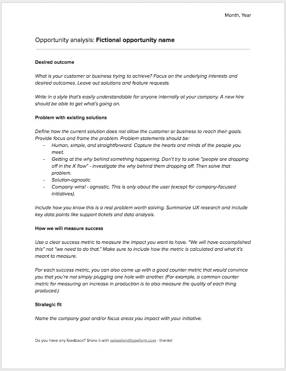
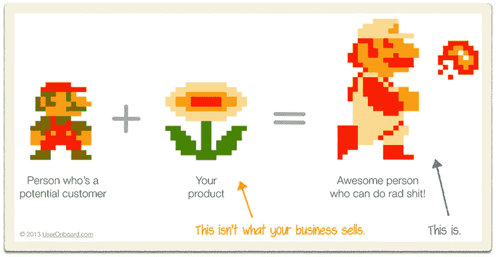

# 在确定产品创意的优先顺序之前，要问的 4 个基本问题

> 原文：<https://medium.com/hackernoon/4-essential-questions-to-ask-before-you-prioritize-product-ideas-a5c6d9549be2>

## 如何做出正确的决策并让你的利益相关者参与进来，包括我在 Typeform 使用的文档模板

Photo by [Nikita Kachanovsky](https://unsplash.com/photos/L7CwfCSmpfM?utm_source=unsplash&utm_medium=referral&utm_content=creditCopyText) on [Unsplash](https://unsplash.com/?utm_source=unsplash&utm_medium=referral&utm_content=creditCopyText)

你的团队可以建造一百万个东西。同时，作为项目经理，你的工作是确保你运送最有价值的产品。您希望用尽可能少的努力解决最重要的客户问题。

找到新的产品创意非常简单。您的客户分享他们的[反馈](https://hackernoon.com/tagged/feedback)并请求新功能。你收集的关于客户行为的[数据](https://hackernoon.com/tagged/data)凸显了可用性问题。你的团队和公司高管一直在和你分享他们的新想法。

难的是找到好主意。你应该在哪里投入时间和精力？团队下一步应该往哪个方向实验？哪个想法会比现有的解决方案好 10 倍？

在这篇文章中，你会发现一个简单的工具，通过问 4 个问题，帮助你从其他想法中辨别出最有前途的想法:

**机会分析 doc。**

# 评估产品机会的模板

当你评估一个有前途的想法时，你要问自己 4 个基本问题:

1.  期望的结果。客户(或企业)想要实现什么？
2.  **现有解决方案的问题。**当前的解决方案如何让客户或企业无法实现他们的目标？
3.  **衡量成功的标准。**我们如何知道我们已经解决了问题？
4.  **战略契合。**解决这个问题对我们的战略目标有何贡献？

这个想法是把你对这些问题的答案写在一个文件里，不要超过 2-3 页。当你写下来的时候，你可以和整个组织分享你的思考过程。这是一种向团队和利益相关者传达所有重要信息的轻量级方式。它看起来是这样的:

You can find a link to the template at the end of this post.

让我们更深入地了解每一部分的内容。

## 1/期望的结果

你的客户或企业想要实现什么？关注潜在的利益和期望的结果。省去所有解决方案的想法。不要将功能需求和客户的想法等同于期望的结果:

> “如果我问人们想要什么，他们会说是更快的马。”—亨利·福特(或者[可能是其他人](https://hbr.org/2011/08/henry-ford-never-said-the-fast)，这并不重要)

我个人喜欢使用“要做的工作”框架，专注于功能性和情感性的工作。如果你还没听说过，你可以[在这里阅读](https://hbr.org/2016/09/know-your-customers-jobs-to-be-done)或者[在这里看一个关于它的精彩演讲](https://blog.intercom.com/jobs-to-be-done-doubter-believer/)。

具体一点很重要。让期望的结果变得切实而具体。这里有一个来自[的 Jason Evanish](https://medium.com/u/72a695d4edd2?source=post_page-----a5c6d9549be2--------------------------------) 关于什么是期望的结果*而不是*的很好的例子:“作为一名营销人员，我想要一个移动应用程序，这样我就可以离开电脑访问我的数据”。

而是:“在地铁上班的路上，内容营销人员喜欢查看他们当天早上或前一天发布的内容的博客流量。这有助于他们进入工作状态，在坐下来之前就知道自己在做什么。如果一个数字很低，他们可能会尝试额外提高它，以试图提高这个数字。如果人数很多，他们可能会与团队中的其他人分享胜利。”

不要问自己“为什么有人会使用我的产品？”，问“这个人想达到什么目的？”。

Source: Kathy Sierra’s [talk on building badass users](https://vimeo.com/106659444) © 2013 UserOnboard.com

以公司内部任何人都容易理解的方式写作。一个新雇员应该能了解正在发生的事情。

客户报价是说明你的观点的有力方式。有一个小小的警告:不要孤立地使用它们。确保它们反映了一种模式，而不仅仅是个人观点。

## 2/现有解决方案的问题

定义当前的解决方案如何不允许客户或企业达到他们的目标。提供焦点和框架问题。我使用脸书的这些[指导方针来确保问题陈述是有效的:](https://uxdesign.cc/the-three-questions-facebook-uses-to-guide-their-product-development-504791d7a232)

*   做人，简单，直白。抓住你遇到的人的心和思想。
*   了解事情发生背后的原因。不要试图解决“人们在 X 流中掉队”——调查他们掉队背后的原因。那就解决那个问题。
*   远离解决方案。
*   保持公司获胜！不可知论者。现在还不要考虑赚钱，只关注用户(除了以公司为中心的计划)。

解释一下你怎么知道这是一个真正值得解决的问题。我喜欢总结客户研究，包括关键数据点，如支持票和数据分析。如果您发现几个问题，请按照客户的优先顺序排列。

## 3/我们将如何衡量成功

有一个清晰的成功标准是非常重要的。在你启动任何东西之前，你应该确切地知道你将如何衡量成功。如果你不这样做，确认偏见将导致对你收集的数据的错误和误导性的解释。

专注于你想要的影响。“我们将会完成这件事”，而不是“我们需要做那件事”确保包括指标是如何计算的，以及它要测量什么。

你也可以想出一个衡量标准，让你相信每次你修复一个东西时，你并没有破坏两个新东西。这里有一个来自对讲机的[示例:](https://marketing.intercomcdn.com/assets/pm-book/v3/Intercom_on_Product_Management.pdf)

> 在你的产品上放一个新按钮，人们就会点击它。获得足够的点击，你可以称之为参与度的增加。但那是无稽之谈。一个衡量标准是“人们停止做其他事情了吗？”。因此，如果你在
> 跟踪产品的一个领域时添加一个指标，你还必须分析
> 可能受到影响的其他领域。

## 4/战略契合度

说出你的计划所影响的公司目标。这一部分作为一个健全的检查，并确保所有的努力是一致的。例如，如果你的产品主要面向中小型企业，不要优先考虑面向企业客户的功能。

## 避免一个常见的错误:为了文档而文档

不要把机会分析文档误认为是你任务清单上的另一个没有生命的项目。你不能只是“打出一份产品文档”。遵循僵化的方法将意味着你错过了整个要点。

该文档不会取代产品发现过程。doc 只是书面形式的过程结果。它提醒你要问正确的问题。[杰森·伊万尼什](https://medium.com/u/72a695d4edd2?source=post_page-----a5c6d9549be2--------------------------------) [把](https://jasonevanish.com/2014/06/03/how-to-write-a-product-thesis-to-communicate-customer-needs-to-design-and-engineering-teams/)总结得整整齐齐:

> 如果你不知道论文中某个章节的答案【他们对机会分析文档的称呼】，就去找吧。深入分析，与客户交谈，开展调查，与定期与客户互动的销售/客户管理/支持团队交谈。如果你的设计师和工程师知道你总是有一个客户故事和/或数据来支持他们在论文中可能会问你的所有问题，你就会赢得他们的充分尊重。

就是这样！按照上面的方法，你会确保在投入太多精力在一个想法上之前，你已经问了所有重要的问题。把它写下来会帮助你构建你的思维过程，并使你与利益相关者的交流更容易。

如果您想自己使用该模板，[单击此处](https://docs.google.com/document/d/1zr85gvsrC3OUTVfVc2Lo-Xefxy0lE1T4DCl2F_4Q7uI/edit?usp=sharing)在 Google Docs 上找到它。复制一份，根据自己的需要改编就行了。感谢阅读。

> "如果没有清晰的思路，要写一份六页的记叙文结构备忘录是不可能的."—亚马逊杰夫·贝索斯