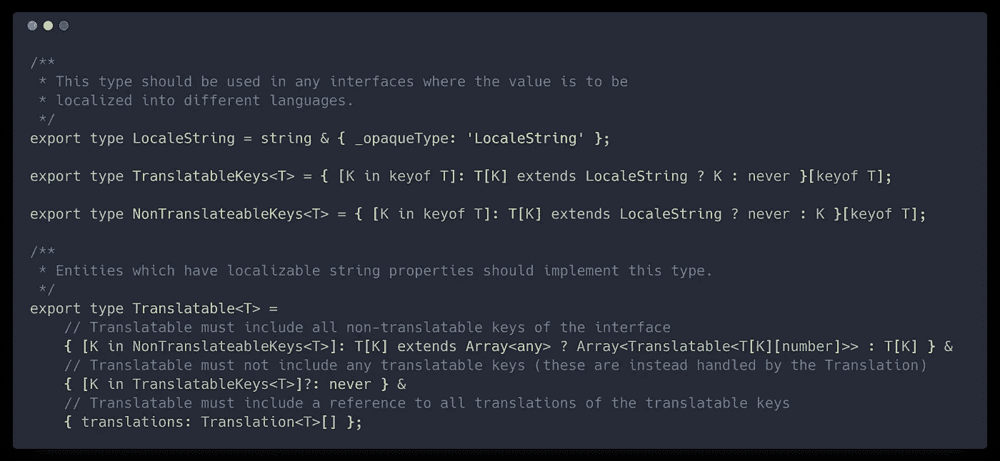
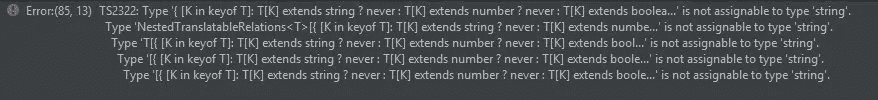

# TypeScript 的未来挑战

> 原文：<https://medium.com/hackernoon/4-future-challenges-for-typescript-e3ae90563d7e>

类型化的 [Javascript](https://hackernoon.com/tagged/javascript) 给 web 开发带来了一个新的层次。更好的自动完成，更自信的重构，[更少的错误](http://earlbarr.com/publications/typestudy.pdf)——有一个类型检查器很棒。有几种类型化的语言风格可以移植到 javascript。有 TypeScript，Flow，Elm，ClojureScript，Reason，Kotlin 等。其中最[流行的](https://stateofjs.com/2017/flavors/results/)，是打字稿。

虽然我认为 TypeScript 很棒，但它并不全是阳光和彩虹。以下是我认为 TypeScript 未来面临的四大挑战。

# 配置 TypeScript 可能会让人不知所措

这是 JavaScript 世界中的一个普遍问题。对于新人来说，构建系统并不容易理解。Webpack 无法配置是一个笑话，还有 babel——现在还有 TypeScript，它有自己的设置困难。

我认为这种复杂的迷宫是像 angular cli，Create React App 和 ParcelJS 这样没有配置的固执己见的构建工具正在获得动力的原因之一。

虽然 TypeScript 有一些合理的默认设置，但在设置项目时创建的`tsconfig.json`文件中仍然有(count 'em) **54** 个编译器标志。现在，它们中的大多数都有合理的默认设置，而且它们中的许多都是为了防止破坏性的改变而添加的——但是在帮助调试了我那份有问题的`tsconfig`文件之后，我可以告诉你们这些人*肯定*弄错了。

*All 54 of them!*

现在，`tsconfig.json`是用每个标志作为一个注释生成的，这无疑是有帮助的，因此可以看到要调整什么旋钮，但是要确定使用什么 JavaScript 目标、使用什么模块系统、要包含什么库等等仍然是一件很困难的事情。

## 让 TypeScript 融入 JS 生态系统

现在，虽然 TypeScript 附带了一些配置选项，但是当您希望将它与其他构建工具结合使用时，复杂性才真正开始激增。

假设我们想在 webpack 构建管道中使用 TypeScript。我们使用装载机来完成这项工作，但是我们应该使用 [ats](https://github.com/s-panferov/awesome-typescript-loader) 还是 [ts-loader](https://github.com/TypeStrong/ts-loader) ？或者我们应该只是运行`"tsc --watch"`然后使用编译后的输出并将其输入 webpack？

每个 webpack 加载器都有自己的一组选项。`ats`有 18 种设置，`ts-loader`有 19 种不同的选项。

但是也许我们根本不应该使用类型脚本加载器？Babel 7 支持 TypeScript 它仍处于测试阶段，但许多大型项目已经在使用它，而且它看起来很稳定。然而，babel TypeScript 支持在一些你很少使用的东西上是有限的(常量和名称空间是最大的两个)——所以这是你愿意为了额外的简单性而做出的一个折衷吗？

[@iamdevloper](https://twitter.com/iamdevloper) knows how it feels

然后你当然也需要让它和你的测试框架一起工作——[Jest](https://jestjs.io/)有 [ts-jest](https://github.com/kulshekhar/ts-jest) 作为 TypeScript 的预处理器，但是它也有一些限制和 10 多个配置选项。您最好确保它的配置方式与上面的 typescript-loader 相同，否则您会遇到难以调试的不一致。

所有这些都是完全可行的，现在我建立打字稿项目并不需要很长时间，但是我已经花了*许多*小时，并且我已经被*许多*次弄清楚发生了什么。入门肯定会很难。

# 类型系统错误消息是含糊的

虽然 TypeScript 的目标是按原样键入 JavaScript，但考虑到 JavaScript 极其动态，这可能很难做到。像这样的任务需要一个复杂的类型系统，因为它必须输入的真实生活场景非常复杂。

好的方面是，TypeScript 类型系统功能非常全面，你可以用它做一些令人惊奇的事情。

坏的一面是，当它不起作用时——完全不可能弄清楚到底发生了什么。想想我前段时间在 twitter 上的这段对话:

[@michlbrmly](https://twitter.com/michlbrmly) 对条件类型做了一些很酷的工作:

具体细节并不十分重要，但是使用一些聪明的类型系统魔术，它定义了一个包含可翻译和不可翻译的本地化键的对象。

这里要注意的第一件事是，虽然这些类型非常聪明——它们也足够聪明，即使有评论描述它们，我也很难弄清楚发生了什么。

现在，第二个问题是——如果一个库使用了这些类型，而你指定了一个错误的类型。这是您将得到的错误消息:

因此..这里到底出了什么问题？从错误信息上肯定是看不出来的。这并不是一个孤立的案例，我以前在使用 react-redux 等工具时也尝试过类似的错误消息。

对我来说，这是一个真正的恐惧，随着类型系统变得越来越复杂，在某一点上它会变得如此复杂以至于无用。如果你不知道这些类型告诉你什么，它们就没有多大帮助，因为它们只是一把无法理解的错误信息的加特林机枪。TypeScript 3.0 在[路线图](https://github.com/Microsoft/TypeScript/wiki/Roadmap)上有[更好的错误消息](https://github.com/Microsoft/TypeScript/issues/25310)，所以希望这是团队关注的事情。

# 生态系统破碎化

React Native 0.56 在[的变更日志](https://github.com/react-native-community/react-native-releases/blob/master/CHANGELOG.md)中包含了这个片段

*“我们正在从 PropTypes 和运行时检查中迁移出来，转而依赖于 Flow。您会注意到在这个版本中有许多与流程相关的改进。”*

对于上述 trans file-to-js 语言的几种变体，我认为存在生态系统分裂的真正风险。

*“本库只有 TypeScript 类型。嗯？这个只能在你使用 Flow 的时候使用。但是我在用 ReasonML，怎么办？”*

我认为目前在不同的 JavaScript 方言之间为互操作输入相同的库有很多重复的工作。这个问题没有简单的解决方案，例如，Kotlin 中的类型系统不能开箱即用地使用 TypeScript 中的类型，因为 Kotlin 中的类型系统不够动态，无法理解映射类型之类的东西。

我认为为了生态系统的利益，考虑我们是否需要某种标准的类型格式是有意义的，就像我们对源地图一样。它可能不会像 TypeScript 的打字那么复杂，但这也很好——大多数图书馆都没有那么复杂的打字，

我认为如果我们最终在不同的围墙、不同类型的花园里，那将是一个悲剧。

# 边界类型检查

打字稿的目标*非目标*之一是[这个](https://github.com/Microsoft/TypeScript/wiki/TypeScript-Design-Goals):

*在程序中添加或依赖运行时类型信息，或根据类型系统的结果发出不同的代码。相反，鼓励不需要运行时元数据的* [*编程*](https://hackernoon.com/tagged/programming) *模式。”*

我觉得这个有利有弊。在很大程度上，这很好。在你的应用程序中，有一些地方你会想要使用类型信息，依赖注入可能是最大的。然而，这是通过使用实验性的`emitDecoratorMetaData`标志在诸如 Angular 和 [InversifyJS](https://github.com/inversify/InversifyJS) 中解决的。

然而，这将真正有所帮助的一个重要方面是在应用程序的边界进行类型检查。在大多数类型化语言中，你可以用一个 X 形状的对象来表达你正在接受一个请求。

在 TypeScript 中，您当然可以做同样的事情——但是由于类型信息在运行时不做任何事情，因此无法确保您所说的类型就是您实际得到的类型。

如果您关心对象的结构，您将需要在运行时使用类似于[类验证器](https://github.com/typestack/class-validator)或 [io-ts](https://github.com/gcanti/io-ts) 的东西来指定它，但是这要求您以某种方式指定类型，在我看来，这比 TypeScript 接口要差得多。

现在，TypeScript 实际上正在对新的顶级类型 [unknown](https://github.com/Microsoft/TypeScript/pull/24439) 进行边界检查，这基本上是一种我们一无所知的类型。您可以接受一个类型为`unknown`的边界对象，然后您被迫在运行时检查它实际上是什么类型。

我仍然认为类似运行时检查的东西，ala [flow-runtime](https://github.com/codemix/flow-runtime) 对于 TypeScript 来说是有意义的。像一个`"validate"`关键字或者一个`“validateType()”`函数编译成一个函数，确保对象实际上是指定的类型。

尽管这明显违背了设计目标，但我可能不会对此抱太大希望——我们现在只能用`unknown`了。

您认为 typescript 还面临其他问题吗，或者您不同意其中的一些问题？伸手在[*@ GeeWengel*](https://twitter.com/GeeWengel)