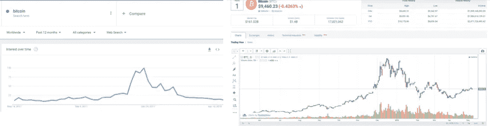
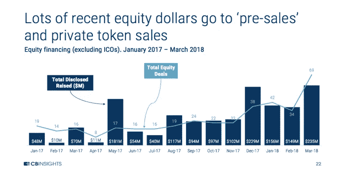

# 阻止机构投资者投资加密货币的 4 大障碍

> 原文：<https://medium.com/hackernoon/4-hurdles-stopping-institutional-investors-from-investing-in-cryptocurrency-b08eab5b649a>

## 以及区块链和电竞的相似之处。

Photo by [Alyssa Ledesma](https://unsplash.com/@alyssaledesma14?utm_source=medium&utm_medium=referral) on [Unsplash](https://unsplash.com?utm_source=medium&utm_medium=referral)

*免责声明:我是*[*BlockchainWarehouse*](http://www.blockchainwarehouse.com)*的合伙人，我们在这里帮助公司推出代币销售和代币生成活动，以下表达的所有观点，除非另有明确说明，否则均为我个人观点，并不代表我公司的观点。*

大约两年前，我潜入区块链。我有涉足新兴行业的历史，我之前的创业公司 LVLUP Dojo 专注于电子竞技和流媒体。我们创建了电子学习内容来帮助有抱负的职业游戏玩家和全职玩家实现他们的抱负。区块链就像电子竞技/流媒体一样，是一个令人兴奋的新行业。我听说，“[在此插入行业]是野生的，野生的，西方”，用来形容两者。

让他们兴奋的是他们仍在发展，他们还没有达到最终形态。这里有创新的空间，有机会作为一名企业家，一个新领域的先驱而扬名立万。

不幸的是，虽然令人兴奋:作为一个新的，有时两极分化，行业带来了自己的一系列问题。例如，在电子竞技领域，我很难让业外人士认真对待它。

“你是说，人们喜欢看别人玩电子游戏？这听起来很白痴”，我会从一个铁杆 NFL 球迷那里听到。一晃两年过去了，多亏了我们的一位 LVLUP 道场老师 [Ninja](https://www.lvlupdojo.com/profile?Name=Ninja&i=8) 之类的流媒体，流媒体几乎成了主流。区块链也经历了类似的发展，多年来一直受到嘲笑和奚落——就在美国消费者新闻与商业频道播出一段如何购买加密货币的节目后不久。

**人们嘲笑自己不懂的东西，直到不懂的人变成了被嘲笑的人。**

在区块链，你面临的一系列问题更加宏大。流媒体挑战了人们对娱乐的认知，而区块链挑战了人们对金融和银行业的认知。电子竞技和流媒体是过去十年左右从头开始建立的新行业，它们具有创新性，但没有挑战除当前娱乐之外的任何现有基础设施——娱乐不需要改变其运营方式来采用这种新的媒体形式。

另一方面，区块链挑战的金融基础设施几乎和美国一样古老。为了让区块链达到大规模采用，那些花了一生时间构建基础设施来支持其业务模型的组织必须重建这些基础设施来采用它。

区块链行业的另一个不利因素是监管的不确定性。风险投资家可以非常容易地投资一个电子竞技团队，或者一个也受益于其受欢迎程度上升的支持公司。

另一方面，风险投资家进入区块链的过程要稍微困难一些。

依我拙见，电子竞技和区块链的关键区别在于，如果机构投资者想把资金投入区块链，他们需要面对几个障碍，而这些障碍在游戏世界中并不存在。机构资金对于一个行业的快速增长是必要的，尽管这违背了区块链本身背后的一些核心原则，但如果我们希望区块链成为它有潜力成为的样子，我们就需要大银行和对冲基金更多地参与进来。

文克莱沃斯兄弟提出的比特币交易所交易基金是一些系统性问题的快速解决方案，这些问题阻止了对冲基金、家族理财室和主权财富基金探索这一新的资产类别。不幸的是，接受或拒绝 ETF 的决定被推迟了 30 天，这意味着在这段时间结束时，SEC 将被迫做出决定。

在与 [BlockchainWarehouse](http://www.blockchainwarehouse.com) (BCW)的合作中，我花了相当多的时间研究老练的投资者面临的障碍。作为一家公司， [BlockchainWarehouse](http://www.blockchainwarehouse.com) 认为机构资金和加强监管对于大规模采用都是必要的——因此我们对市场格局以及市场的整体增长需要做出哪些改变进行了积极的研究。我下面分享的信息是我整理的一些研究的快照。

**从机构投资者的角度来看，可以把它想象成加密货币市场。**

*注意:您可以在底部的“来源”部分找到本文中包含的所有数据来源。*

# 简而言之，密码市场

自 2009 年 1 月 3 日比特币诞生以来，加密货币市场已经发展到包括超过 1600 种不同的加密资产。市场的大部分增长发生在 2017 年。在 2017 年 1 月 1 日至 2018 年 1 月 1 日期间，总市值从 183 亿美元增长到 5980 亿美元，同一日期范围内的日交易量从 1.4 亿美元增长到 248 亿美元。市值在 2018 年 1 月 8 日创下历史新高，达到 8209 亿美元，日交易量达到 680 亿美元的峰值。尽管市场迅速扩大，但加密资产仍处于起步阶段。与其他资产类别相比，它只代表世界货币的一小部分，但考虑到这些其他资产必须发展的时间，以及加密资产获得资本的速度，加密市场的未来看起来很光明。

虽然传统股市主要由于机构投资而处于八年牛市，但加密资产市场在 2018 年初经历了市场回调。值得注意的是，机构投资者在 2017 年底获准了他们的第一个加密投资工具:比特币期货。为了轻松进入市场，芝加哥商业交易所和 CBOE 集团推出了首个比特币期货合约。这标志着机构首次涉足加密资产。加密市场在很大程度上由散户投资者或缺乏金融培训和一般交易经验的个人投资者主导。这在一定程度上解释了为什么加密资产市场极其不稳定，并且受情绪驱动。众所周知，比特币价格的波动和飙升与谷歌对“比特币”一词的搜索量有关。尽管区块链技术因其透明度而受到吹捧，但市场却出人意料地不透明，缺乏可信的信息和数据供传统或专业投资者用来指导他们的交易决策。

*Google search volume for “Bitcoin” vs. Bitcoin price*

尽管市场的局限性阻碍了机构投资，但热切的散户投资者仍继续涌入市场。两个最大的交易所，币安和比瑟姆，在 2017-2018 年新用户数量破纪录。币安报告称，在他们和 Bithumb 被迫向新客户关闭大门之前，他们每天要接纳大约 25 万名用户，以便扩展其基础架构，安全地满足需求。

对加密资产的需求是不可否认的。而在过去，机构兴趣一直追随个人兴趣。虽然这些资产的市值相当可观，但它还没有实现其全部潜力。在机构投资者接受它之前，它不会发挥出全部潜力。就像最近股市经历的历史性的八年牛市一样，推动高速增长的是机构资金，而不是个人资本。

## 机构投资追随个人兴趣。

尽管加密货币在 2017 年呈指数增长，但一些机构投资者仍对进入加密货币市场犹豫不决。

其中不乏对比特币以及围绕其萌发的周边山寨币的猜测。让人联想到花园里的杂草——一些替代币没有任何用途，它们的创始人没有创造价值的长期目标；然而，它们与该领域的严肃项目几乎没有什么区别。加密资产不呈现传统股票所呈现的传统投资评估数据或指标。如果没有重要且公认的数据分析点，确定真正的价值主张会更加复杂。老练的投资者回避市场，因为在确定可行性时，他们的潜在投资很少清晰可辨——这在很大程度上使家族理财室和对冲基金冒险进入这一投资领域变得不切实际。在管理这些大型投资组合时，风险管理是绝对必要的。

尽管普遍缺乏信息，但市场已经看到，在预售期间，风险投资公司促成的股权融资金额大幅上升。预售通常是在首次发行硬币(ICO)之前的一轮私人融资。尽管机构投资者仍保持沉默，但一些认真的投资者已经进入。

例如，比特币期货创立的最初成交量乏善可陈，直到 2018 年 4 月创下历史新高；19，000 多份到期日不同的期货合约。这是 CBOE 之前日均交易量的三倍。该领域需求的增长导致其他大公司考虑进入。高盛向华尔街日报发布了一份声明，宣布正在研究在这个“有争议的市场”为客户提供的投资产品

# 机构投资者的 4 个加密障碍

此时此刻，有 34，000 名经验丰富的投资者有可能进入市场，其中包括:全球 23，000 多家对冲基金和 11，000 多家家族理财室。值得注意的是，这些数字并不反映个人客户，而是拥有数百或数千客户的基金，通常控制着数十亿美元。如果你将这些集团控制的财富与主权财富基金(全球管理着价值 7 万亿美元的资产)和高净值个人(HNWI 的)持有的财富结合起来，**这些集团占据了世界财富的很大一部分。**

## 1.缺乏机构级交易平台

老练的投资者习惯并需要“彭博风格”的交易方案。但是在密码市场中，没有什么能满足传统投资者所习惯的决策数据分析。**没有一体化的企业级机构工具可用，**也没有让老练的投资者像交易传统证券和货币那样交易的机制。

现有的市场基础设施与法定资产配合良好，但 crypto 则不同。市场全天候开放，很难进行传统意义上的监控。此外，还有一些密码特有的信号可以为交易策略提供信息，但由于缺乏可信的信息，这些信号经常被忽视。这些信号很大程度上是未知的，完全陌生的那些来自菲亚特的市场。例如，一个家族理财室可能不知道什么是硬分叉，也不知道采矿协议的散列能力的增加会对与之相关的资产价格产生什么影响。

部分原因是散户投资者可以进行大量的交易商对客户(D2C)交易；没有经过核实的市场信息来源，或有助于理解交易所之间加密交易对传播的信息。缺乏监管使得它们保持不透明。由于缺乏传统数据点，机构投资者在这一领域面临诸多挑战。

## **规定**

目前围绕加密资产的监管环境充满灰色地带，留给法律团队去解读。这对于任何创新都是正常的，尤其是与金钱相关的创新。但是，无论多么正常，政府都在争先恐后地尽快了解和监管这一领域。这些团队经常解读全球各地的法律，试图确定建立业务实体的最佳地点。

对散户投资者来说，这种缺乏监管清晰度的情况很麻烦，但对老练的投资者来说，这使得有效管理加密资产投资几乎不可能。

**了解你的客户(KYC)**

KYC 是一项监管要求，它迫使交易所确认他们的交易对象，无论是散户还是机构投资者。普通交易所的 KYC 流程通常需要数周时间才能完成，并且简化这一流程所需的数据因交易所而异。这些要求很难满足，而且效率低下。没有一个单一的解决方案可以在所有交易所实现 KYC 实体，而且因为没有一个交易所可以满足所有加密资产的需求，投资者被迫在几个不同的平台上经历 KYC 过程。这对于经验丰富的投资者来说非常耗时，他们需要一个简化的解决方案来有效、高效、安全地管理他们所控制的资本量。

**反洗钱**

金融行业监管局(FINRA)将反洗钱规则定义为帮助发现和报告可疑活动的规则，包括洗钱和恐怖融资的前提罪行，如证券欺诈和市场操纵。本质上，反洗钱旨在阻止非法获得资金的人利用这些资金创造额外收入。

如果你习惯于在加密货币市场交易，你可能已经经历了几个这样的过程。然而，对于经验丰富的投资者来说，在每个交易所都必须经历这些过程是乏味且低效的。不幸的是，这也是必要的，因为每个交易所只提供市场上总硬币的精选%,而且大多数交易所没有足够的流动性来满足这些投资者的需求。

这个问题只能由政府和监管机构来真正解决。目前，各国政府正试图让区块链和加密货币符合为传统投资工具创建的参数，这根本行不通。有些人试图解决这个问题，但事实证明，面对创新，他们步履蹒跚。变化是可怕的，尤其是当它威胁到数十年的金融基础设施时。只有少数监管机构和政府真正接受了区块链，其中一些比其他的意图更可疑。

## **缺乏流动性**

币安的交易量足以满足像我这样的散户投资者，但机构投资者的交易量超过了目前交易所的交易量。如果缺乏交易量是他们唯一的障碍，他们的最佳选择是通过场外交易柜台——但这不利于长期交易策略，不够快。

即使一个交易所有足够的交易量，对冲基金和家族理财室通常下达的买入/卖出指令的规模也会极大地左右市场。想象一下，看着一个价值 1 亿美元的买卖墙出现在已经动荡和被操纵的市场之上。

目前，没有任何交易所、公司或平台为机构投资者解决流动性问题。一些 ICO 已经筹集了资金来创建理论解决方案(如 Omega.one)，但没有一个成功实现。

长期以来，在这个市场创造流动性一直是老练投资者的一个障碍。即使是最大规模的加密货币，其流动性也远不如传统市场中的资产。一些最有前景的加密货币的市场深度有限，这使得较大的买家很难不影响资产价格，也很难向更广泛的市场披露他们的交易策略。

**在 BarclayHedge 进行的一项研究中，52%接受调查的商品交易顾问表示，对流动性的担忧阻止了他们交易比特币期货**，这种担忧不仅局限于期货合约，还延伸到了普通加密市场，其中**在 2017 年接受调查的基金中，只有 28%表示有兴趣进入该市场**。虽然远未被广泛采用，但从全球对冲基金管理的资产总价值来看，这 28%反映了可能流入市场的 9910 亿美元。

对于老练投资者来说，没有安全访问加密流动性源的标准解决方案。正如上文所强调的，当前的生态系统是支离破碎的，老练的投资者将被迫利用几种不同的平台——往往在专业性和可用性方面各不相同。这些平台都没有提供机构投资者在不影响大众市场的情况下促进交易所需的功能或质量。

机构投资者需要大量数据来执行他们的投资策略。他们使用的系统完全不同于目前针对散户投资者定制的加密资产解决方案。虽然加密资产交易所每天交易数十亿美元，但随着机构资金准备就绪并准备进入市场，对实时信息源的需求将是绝对的。

根据 BarclayHedge 的一项研究，2017 年第四季度，全球对冲基金管理的资产总额为 35376 亿美元。同时，Autonomous Next 的一项研究估计，目前对冲基金管理着 35-50 亿美元的加密资产。

## 钱包效率低下，缺乏保管解决方案

目前有超过 1600 种加密资产在流通。虽然该领域有几家公司提供多硬币钱包，但没有真正通用的钱包。创造一个兼容所有硬币的钱包是一项艰巨的任务。我甚至可以说这几乎是不可能的。

术语钱包指的是在区块链上访问和交易个人加密资产所需的密钥。虽然交易所为它们保护的加密货币提供钱包，但没有一家交易所能全面覆盖所有资产。此外，避免在 exchange 钱包上存储个人资产也是行业标准，因为这为黑客创造了一个“蜜罐”。

> 术语“蜜罐”指的是一个集中的组织负责存储整个社区或客户的资产。它为黑客创造了一个非常有吸引力的目标，因为攻击交易所的回报远远大于攻击任何个人钱包。

加密资产市场仍在寻找资产托管的解决方案。目前，加密和传统金融领域的主要参与者都在致力于为机构投资者提供托管选择。比特币基地正在寻求批准为客户提供符合资产保护标准的托管服务。Circle 和 BitGo 等其他专注于区块链的公司也在同时向监管机构表达同样的目标。在传统金融界，野村控股公司、纽约银行梅隆公司、摩根大通和北方信托公司都在致力于数字托管服务。最近，纽约证券交易所的母公司(ICE)开始以新交易所的形式为 crypto 提供直接结算。洲际交易所已经与金融机构就建立一项新业务进行了谈判，通过这项业务，银行可以购买一种被称为掉期的合约，该合约将在客户第二天拥有比特币时结束——由交易所提供支持和安全保障。

ICO 和 NYSE 提供掉期合约的这一可能发展，可能意味着它们已经找到了符合 SEC 合格标准的托管解决方案。这可能意味着这个特殊的路障正在被解决。

## 解决方案即将出现。

随着比特币基地希望提供托管服务，以及比特币交易所交易基金现在正在提议中，我们有可能在未来 6-12 个月内看到机构资本进入市场。有一些变量可能会阻止这种情况发生，比如美国证交会阻止这些交易所交易基金通过，或者比特币基地未能实现其当前目标。

然而，尽管存在障碍，以及数十年的基础设施和该基础设施中的利益相关者可能会阻止整个区块链的采用:我认为这可能为时已晚。

越多的人采用区块链，并开始理解加密货币的工作原理——越多的人将理解货币的工作原理。这可能看起来很傻，“人们当然理解多少作品”，你可能会想。我认为他们没有。就我而言，直到我开始研究比特币，我才真正理解了金钱以及它是如何产生价值的。当然，我知道如何递给别人一张纸，他们会给我一些东西作为交换，但不知道*为什么*。

随着越来越多的人理解*为什么*我们使用的法定货币具有价值，越来越多的人将开始看到加密货币的优点。所以，当我说“为时已晚”时，我的意思是太多的人理解了货币是如何运作的，以及当一项资产被分散时会出现的可能性。太多的人明白，我们可以改善现状，安于现状。

— — — — — — —

## 如果你喜欢这篇文章，并想了解更多关于区块链、密码和其他密码极客的随机漫谈——看看我的一些其他文章。

 [## 评估首次发行硬币(ico)的 10 个步骤

### 将 ico 或代币销售作为投资机会进行评估是一个微妙的过程。有几个变量…

hackernoon.com](https://hackernoon.com/the-basics-of-valuing-initial-coin-offerings-icos-cd1a90de1090)  [## 为什么越来越多的审查对 ICOs &它们所扰乱的行业有好处

### 似乎 2017 年(和 2018 年初)的首次硬币发行(ICO)热潮开始停止。当……

hackernoon.com](https://hackernoon.com/process-innovation-the-future-of-blockchain-applications-initial-coin-offerings-icos-1136ed550bb2)  [## 白皮书需要回答的 4 个问题

### 成功的代币销售或 ICO 有几个必要的组成部分，但如果你不能简洁地回答这 4 个…

hackernoon.com](https://hackernoon.com/4-questions-a-white-paper-needs-to-answer-67a90840ef48)  [## 根据白皮书复杂性评定的顶级 ICO

### 研究白皮书的可读性和筹集到的资金之间的相关性。

hackernoon.com](https://hackernoon.com/top-icos-rated-by-white-paper-complexity-a7d2a2fda93d) 

## 来源

https://www.bitcoin.com/bitcoin.pdf

[https://www . technology review . com/s/607947/the-crypto currency-market-is-growing-exponentially/](https://www.technologyreview.com/s/607947/the-cryptocurrency-market-is-growing-exponentially/)

[https://www . Reuters . com/article/us-bit coin-futures-contracts/cboe-CME-to-launch-bit coin-futures-contracts-iduskbn 1e 10k c](https://www.reuters.com/article/us-bitcoin-futures-contracts/cboe-cme-to-launch-bitcoin-futures-contracts-idUSKBN1E10KC)

[https://trends.google.com/trends/explore?q=bitcoin](https://trends.google.com/trends/explore?q=bitcoin)

[https://www . sec . gov/news/public-statement/statement-Clayton-2017-12-11](https://www.sec.gov/news/public-statement/statement-clayton-2017-12-11)

[【VI】](#_ednref6)[https://www . Bloomberg . com/news/articles/2018-03-05/crypto-exchange-raking-in-billion-emerge-as-king-of-coins](https://www.bloomberg.com/news/articles/2018-03-05/crypto-exchanges-raking-in-billions-emerge-as-kings-of-coins)

[https://www . the guardian . com/business/2017/dec/02/bit coin-it-a-bubble-it-a-waiting-to-burst-or-a-good-investment](https://www.theguardian.com/business/2017/dec/02/bitcoin-is-it-a-bubble-waiting-to-burst-or-a-good-investment)

https://bitemycoin.com/guides/what-is-an-altcoin/

【https://decenter.org/coins/374-crypto-analysis-en 

[https://medium . com/venture-views/tokenized-funds-to-shape-VC-funding-92260607 cf 04](/venture-views/tokenised-funds-to-reshape-pe-vc-fundraising-92260607cf04)

[https://www . coin desk . com/比特币-期货-成交量-峰值-周三/](https://www.coindesk.com/bitcoin-futures-volume-spikes-wednesday/)

[https://www . CBR online . com/opinion/historical-forex-regulations-shaping-future-crypto](https://www.cbronline.com/opinion/historic-forex-regulations-shaping-future-crypto)

[https://www . Switzerland-Family-Office . com/pdf/Family-Office-Elite-Magazine-Winter-2016 . pdf](https://www.switzerland-family-office.com/pdf/Family-Office-Elite-Magazine-Winter-2016.pdf)

[https://bitcoinmagazine . com/articles/crypto-assets-offer-new-opportunities-VCS-global-scale/](https://bitcoinmagazine.com/articles/crypto-assets-offer-new-opportunities-vcs-global-scale/)

[https://www . the guardian . com/money/2017/oct/01/bit coin-ever-be-safe-investment-gamble](https://www.theguardian.com/money/2017/oct/01/will-bitcoin-ever-be-safe-investment-gamble)

[https://www.trulioo.com/blog/bitcoin-regulation/](https://www.trulioo.com/blog/bitcoin-regulation/)

[http://www.finra.org/industry/aml](http://www.finra.org/industry/aml)

[https://www.investopedia.com/terms/m/marketdepth.asp](https://www.investopedia.com/terms/m/marketdepth.asp)

[https://www . barclay hedge . com/research/hedge-fund-manager-survey/2018/2018-1 . html](https://www.barclayhedge.com/research/hedge-fund-manager-survey/2018/2018-1.html)

[https://www . barclay hedge . com/research/indexes/GHS/mum/HF _ Money _ Under _ management . html](https://www.barclayhedge.com/research/indices/ghs/mum/HF_Money_Under_Management.html)

[https://coinmetrics.io/papers/dissertation.pdf](https://coinmetrics.io/papers/dissertation.pdf)

[https://www . barclay hedge . com/research/indexes/GHS/mum/HF _ Money _ Under _ management . html](https://www.barclayhedge.com/research/indices/ghs/mum/HF_Money_Under_Management.html)

【https://next.autonomous.com/cryptofundlist/ 

[https://coinmarketcap.com/all/views/all/](https://coinmarketcap.com/all/views/all/)

[https://www . bitrates . com/news/p/the-road-to-universal-crypto-wallets](https://www.bitrates.com/news/p/the-road-to-universal-crypto-wallets)

[https://hackernoon . com/institutional-investors-想要买入加密货币-但是-他们却被套牢在场外-26e05f9e3725](https://hackernoon.com/institutional-investors-want-to-get-in-on-cryptocurrencies-but-theyre-stuck-on-the-sidelines-26e05f9e3725)

[https://pdfs . semantic scholar . org/2478/AEC 3c 2d 44 a2 b 39 CCE 3c D3 c 90d 53208 BF F2 aa . pdf](https://pdfs.semanticscholar.org/2478/aec3c2d44a2b39cce3cd3c90d53208bff2aa.pdf)

[https://pdfs . semantic scholar . org/2478/AEC 3c 2d 44 a2 b 39 CCE 3c D3 c 90d 53208 BF F2 aa . pdf](https://pdfs.semanticscholar.org/2478/aec3c2d44a2b39cce3cd3c90d53208bff2aa.pdf)

[https://www . Bloomberg . com/news/articles/2018-06-18/regulated-crypto-category-is-a-a-game-changer](https://www.bloomberg.com/news/articles/2018-06-18/regulated-crypto-custody-is-almost-here-it-s-a-game-changer)