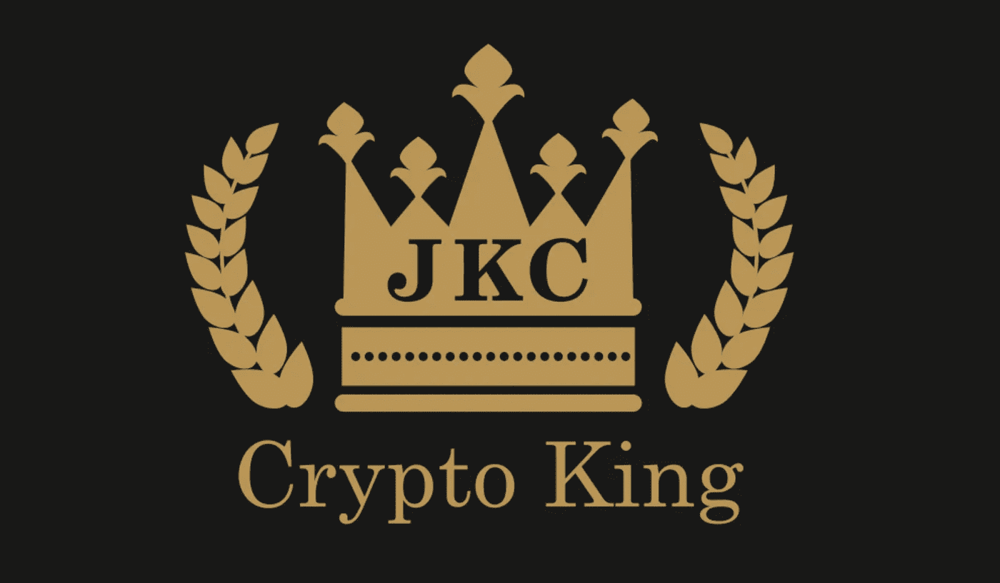
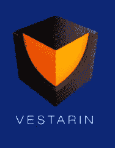
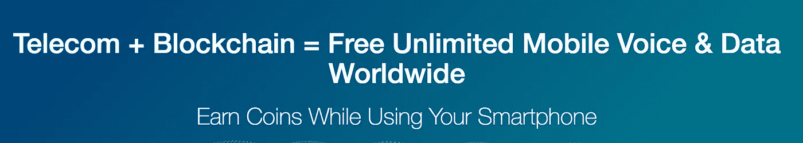
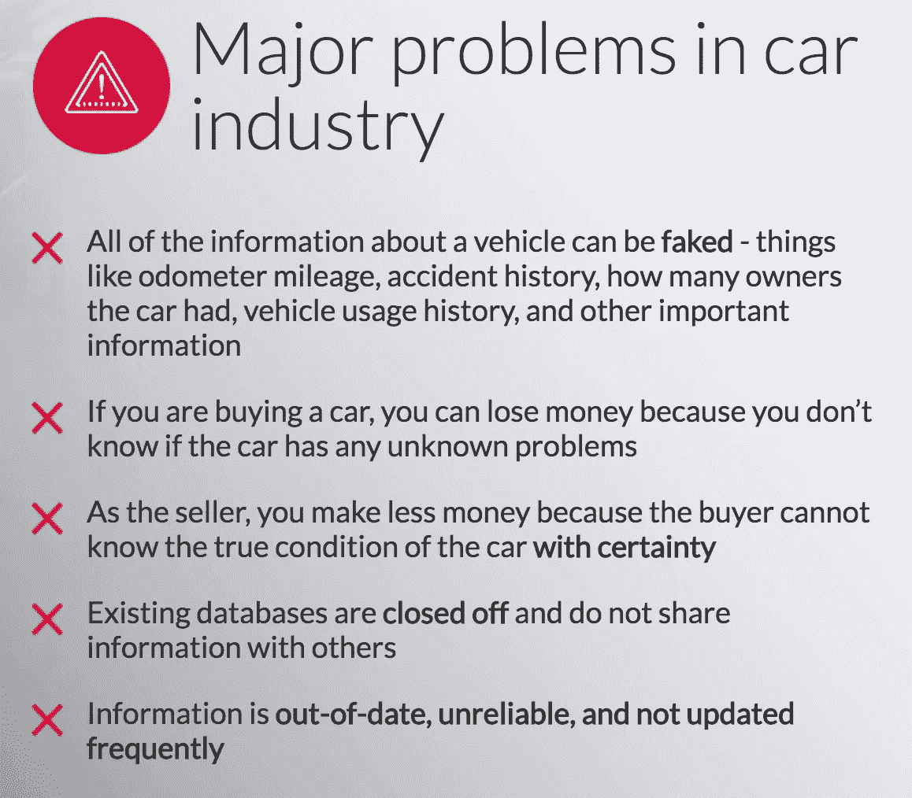
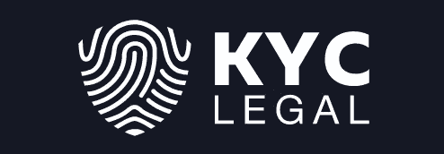

# 4 个 ico 已于 2018 年 3 月审核

> 原文：<https://medium.com/hackernoon/4-icos-reviewed-for-march-2018-e0cd503249e5>

**2018 年 3 月的 4 个 ICOS】**

这篇报道将聚焦于三月份举行的四场[ico](https://hackernoon.com/tagged/icos)。通过点击图标的粗体名称，读者可以购买它们。在访问 ICO 和 exchange 网站时要非常小心，确保您访问的是正确的网站。经常是错误的网站，稍有拼写错误，就会导致网络钓鱼诈骗。粗体 ICO 名称是所有正确的网站:

[**维斯塔林**](https://vestarin.io/?ref=38b3eff8baf56627478ec76a704e9b52) **(ICO 刚开始…预售触及 300 万美元硬封顶)**

Vestarin 的预售 ICO 期三天前就结束了。他们在预售期间筹集了 3000ETH(硬帽)，并正在全力以赴地推进他们的 ICO。在常规 ICO 期间，VST 将降至 1500 vst/1 ETH 的比率。目前你的奖金比例仍然远远高于这个数字！

[**在这里购买 VST**](https://vestarin.io/?ref=38b3eff8baf56627478ec76a704e9b52)

[**Mobilink**](https://dashboard.mobilink.io/?ref=94815b7c)**(无限免费蜂窝服务和数据…全球)**

Mobilink-承诺在全球范围内免费提供语音和数据。没有漫游，没有手机话费。用户只需更换 Mobilink SIM 卡，就可以开始使用了。

[在这里购买 Mobilink](https://dashboard.mobilink.io/?ref=94815b7c)

[**VINCHAIN**](https://vinchain.io/?aid=5a91d4c3c10da)**(接近软帽，软帽时加成减少)**

在软封顶之前，VINCHAIN 目前每季度提供 24，000 瓶葡萄酒。硬性上限是 23,250 ETH(约 2000 万美元)。VIN 从非常微薄的奖金开始，并且在达到软上限后只会继续减少。

[**在此购买长春花**](/hackernoon/Purchase Vinchain’s ICO here: https:/vinchain.io?aid=5a91d4c3c10da)

****(只剩 12%奖金)****

**距离它的硬上限已经过半，它有能力解决区块链和 ICOs 中最大的问题之一。《了解你的客户》(可怕的 KYC 表格)。如果你最近完成了一个 ICO，你就会知道我所说的形式。KYC 称他们的概念是区块链“个人身份的通用替代品”。他们的 ICO 很快就要结束了，比最终的 ICO 价格低 12%。**

**[在这里买 KYC](https://bookbuild.kyc.legal/?ref=23734776ffa2051a83eb8bc1)**

****关于上述 ico 的更多详情:****

**[**维斯塔林**](https://vestarin.io/?ref=38b3eff8baf56627478ec76a704e9b52) **(预售硬封顶打！)****

****

**VST 轻松达到了他们的预售硬上限，现在正在继续推进他们的 ICO。他们的预售筹集了 3000 个 ETH，有超过 5000 个捐助者。VST 被三个主要的 ICO 排名服务机构评为 4.3、4.7 和 4.9 分(满分 5 分)。).这些是来自 ICOBench、ICOMarks 和 ICOBazaar 等公司的巨大数字。**

**这个 ICO 在美国法学院有顾问，在东欧有一个团队。至少可以说，他们的首席执行官兼收并蓄。就好像俄罗斯的丹·布利泽里安拿着一个 ICO。**

**一个 ICO 的成功往往与宣传直接相关。拥有这样一个古怪的人物作为首席执行官以及包括美国法律教授在内的顾问，实际上可以让这个 ICO 在地平线上的其他基于加密的市场中占据优势。**

**即使 VST 未能成功获得巨大的市值，与一个月后常规 ICO 结束时相比，当前 ETH 定价的 100%奖金将使其具有产生稳定回报的巨大能力，即使其在交易所以常规 ICO 定价开盘。**

**他们的网站上已经有了一个演示版本，实际上非常令人印象深刻。VST 打算成为在线市场和信息及商品交换的结合体。这个团队是东欧人，所以他们的英语有些部分很粗糙，但 NEO 的主页也是如此。当 VST 上市时，早期的 ICO 买家似乎会获得巨大的回报，无论是 20%还是 100%。**

**[在此购买 VST](https://vestarin.io/?ref=38b3eff8baf56627478ec76a704e9b52)**

**[**Mobilink**](https://dashboard.mobilink.io/?ref=94815b7c)**(无限免费蜂窝服务和数据…全球)****

****

**Mobilink-承诺在全球范围内免费提供语音和数据。没有漫游，没有手机话费。用户只需更换 Mobilink SIM 卡，就可以开始使用了。它将如何工作？**

**嗯，用户将有基于他们的手机的广告，通过他们的 SIM 卡来衡量使用情况。目前，Mobilink 处于 ICO 之前的阶段，奖金仍高达 25%。Mobilink 打算终身释放无限的数据和文本，同时允许每月 SIM 卡持有者每月赚取收入。令牌持有者将能够收到可在解锁手机上使用的 SIM 卡。170 多个国家的无边界连接。Mobilink 币(MBX)将根据 SIM 卡用户的每日收入进行支付。**

**使用一部没有手机账单、没有数据限制、没有漫游的手机似乎是未来的事情。区块链带来的未来。这个 ICO 看起来很有前景，特别是有 25%的奖金(在这个月内减少到 0%)。**

**[在此购买 Mobilink】](https://dashboard.mobilink.io/?ref=94815b7c)**

**[**VINCHAIN**](https://vinchain.io/?aid=5a91d4c3c10da) **(接近软帽，软帽时加成减少)****

****

**VINCHAIN 是多年来困扰汽车行业的一个简单的解决方案。一辆车几乎所有的信息都可以造假。如果区块链没有到位，里程表里程、事故历史、车主数量、车辆历史都是可以被操纵的方面。这是一个简单的利基市场，需要一个早期进入者来接管。供应链管理领域的一些大公司已经开始在车辆跟踪方面取得进展。**

**然而，VINCHAIN 打算只专注于它。VINCHAIN 在 ICO 的头几天就筹集了数百万美元，很明显，它将拥有资金支持，在汽车跟踪行业掀起波澜。通过确保汽车历史的准确性，VINCHAIN 解决了困扰汽车行业的一个主要问题。**

**[在此购买 VINChain】](/hackernoon/Purchase Vinchain’s ICO here: https:/vinchain.io?aid=5a91d4c3c10da)**

**[**KYC 法律**](https://bookbuild.kyc.legal/?ref=23734776ffa2051a83eb8bc1) **(只剩 12%奖金)****

****

**《了解你的客户》(可怕的 KYC 表格)。如果你最近完成了一个 ICO，你就会知道我所说的形式。他们最后给你的表格，在你寄出你的. 5th 之后，但在他们发放代币之前。基本上说明你理解这个市场是不受监管的，等等。区块链代币从本质上解决了这个问题。**

**我讨厌 KYC 表格，如果 KYC 系统的设置能让你不必为每个 ICO 重复填写表格，那对所有投资者和 ICO 公司来说都会更方便。KYC 法律部正打算这么做。据创始人 DR 称，“这是一种简单快捷的完成客户身份识别程序的方法，然后可用于在各种金融操作中验证客户的身份(所谓的 KYC(“了解你的客户”)要求，金融机构和使用私人资金的公司在开始金融交易前使用该要求来识别和验证交易对手)。”这个利基是完全未开发的，我讨厌 KYC 形式足以认为这是一个辉煌的想法。在区块链，他们称之为“个人身份证的通用替代品”。**

**[在这里购买 KYC](https://bookbuild.kyc.legal/?ref=23734776ffa2051a83eb8bc1)**

****ico 是高风险领域(加密)中风险最高的投资。这绝不是财务建议。这仅仅是对即将到来的 ico 的回顾，其中指出了许多亮点。****

**我感谢我所有的忠实追随者！我正在努力建立一个社交媒体形象，希望你能在 Instagram 和 Twitter 上关注我！在被发布到留言板前几个小时，关注**insta gram:JaketheCryptoKing**和 **Twitter: JbtheCryptoKing** 获取提示和策略。现在上**不和谐:**[**https://discord.gg/qTjQp8W**](https://discord.gg/qTjQp8W)(加入王国直接联系我)。**