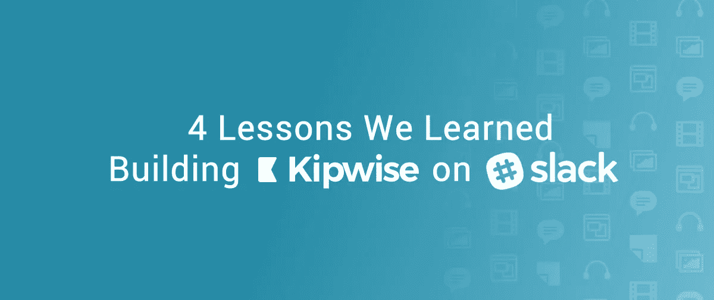
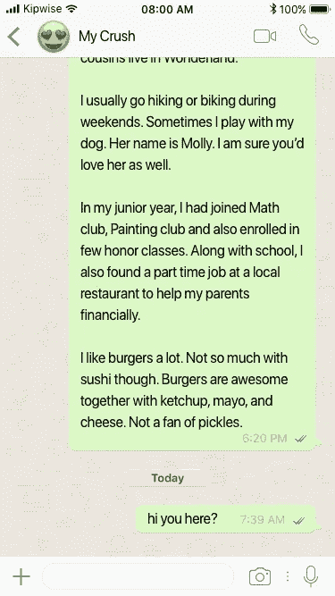
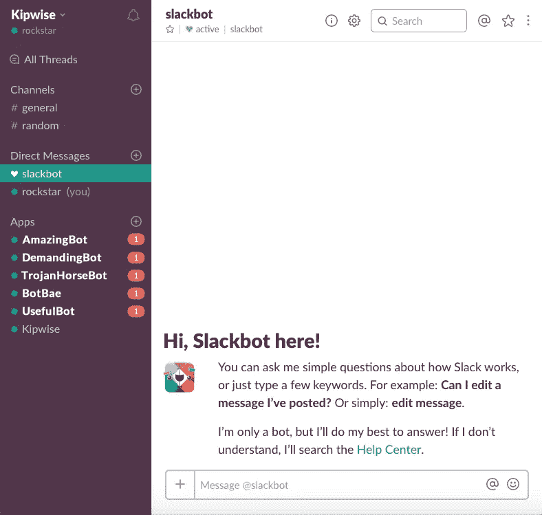
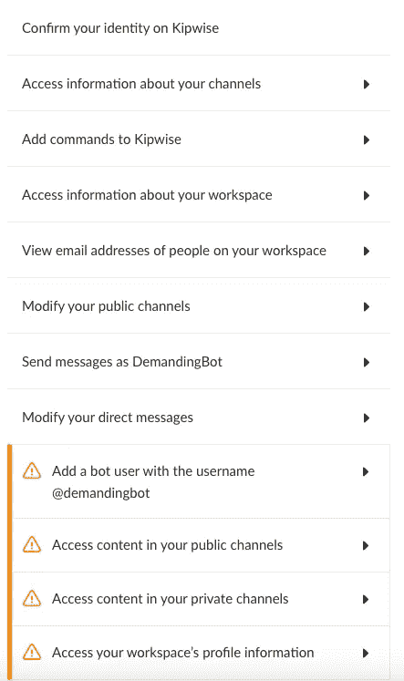

# 构建 Slack 应用程序的 4 个教训

> 原文：<https://medium.com/hackernoon/4-lessons-we-learned-building-a-slack-app-7afef1492b3c>

我们开始 [Kipwise](https://kipwise.com) 通过在 [Slack](https://hackernoon.com/tagged/slack) 中添加亮点和对共享内容的评论来帮助团队更有效地学习。

为了实现我们促进知识转移的使命，我们决定分享我们在建设 Kipwise 的过程中吸取的经验教训；与建立一个网站相比，在建立一个 Slack 应用程序(或一般的聊天机器人[时，你应该注意的事情可能会非常不同。](https://hackernoon.com/tagged/chatbot)

在聊天界面内构建一个太烦人的 Slack app/chatbot 是如此容易陷入陷阱。很多时候，很难在正确的时间发出正确的信息。就像建立亲密关系；惹人讨厌不是接近你喜欢的人的最好方式。

以下是我们学到的四个最佳实践。

# **1。不要只是坐在那里。也不要说太多。**

*简单明了地表达你的入职信息*

入职是每个软件最重要的部分，包括 Slack 应用。它始于用户安装 Slack 应用，但只要有新成员加入和新功能推出，它就永远不会结束。

当我们最初开始时，我们并没有真正提供一步一步的入职流程，因为我们认为用户会阅读我们的应用程序描述或网站。这是完全错误的，让那些信任我们、考验我们的朋友感到沮丧。(抱歉[凯斯](https://medium.com/u/3da47cdda7c5?source=post_page-----7afef1492b3c--------------------------------)！)

我们花了整整一个月的时间不断迭代，让入职流程变得足够好。感谢 [Kristine](https://medium.com/u/d4c68fb6c3d0?source=post_page-----7afef1492b3c--------------------------------) 的额外反馈。

要记住的一件重要的事情是，你的 Slack 应用程序可能会提供很多功能，但你的用户可能不想一口气学会所有的功能。我们了解到，如果指令太长，大多数用户会跳过指令，即使他们阅读了指令，当他们将来需要执行操作时，他们仍然会忘记确切的步骤。

许多 Slack 应用程序会给用户提供私人信息介绍，但大多数用户不会期望收到 500 字长的说明，如果他们看到了，会直接跳过。

Try to send a long message to your crush via WhatsApp/Facebook Messenger

我们发现，当用户真正需要执行某个操作时，一步一步地向他们发送指令会更有效，而不是一开始就一次性发送所有信息。在第一次接触时跳过一些不太重要的功能，而不是将所有可能的用例压缩到一个全屏消息中，这样会更好。

# **2。还不赶紧介绍自己**

*不要给新成员发送入职信息*

例如，ABC 公司已经为他们的团队安装了 5 个 Slack 应用程序。他们最近聘请了一位才华横溢的摇滚明星约翰，并邀请他加入 ABC Slack 团队。嘣！约翰立即收到了来自 5 个应用程序的 5 个新对话。

John 不太可能阅读所有消息，因为作为一名新员工，当他刚刚加入团队，甚至还不知道团队中的大多数工作流时，理解这些应用程序的好处可能还为时过早。

除了让新成员更加困惑之外，向新成员发送介绍没有明显的好处。

当新员工真正需要时，或者当要求邀请新员工的人触发入职信息时，介绍会更有吸引力。不同的 Slack 应用程序的流程可能会有很大的不同。尽管如此，当有人加入团队时尽快发送它可能不是最佳选择。

在合适的时候介绍自己，你会更特别。

# **3。不要太苛求**

*不要造木马机器人*

理论上，Slack 应用程序可以读取每个频道上的所有内容，包括所有私人频道，如果你给它权限的话。

通过在一开始就询问所有可能的权限，开发一个 Slack 应用程序总是感觉更容易。然而，它对用户来说看起来很吓人，而且大多数时候是不必要的。我们一开始是一个要求很高的机器人，遭到了很多拒绝(谢谢你，史蒂文，拒绝了我们)。

Look at that list

当看到一个*请求机器人*需要获得的权限时，用户会觉得他们要安装一个特洛伊木马，从他们的团队聊天中收集每一个秘密。用户对那么长的许可列表持怀疑态度是正常的。对一段感情来说，要求太高总是不好的。

Slack 将推出一个新的基于工作空间的流程[,让应用程序逐步请求权限。在此之前，按需请求权限需要更多的步骤，实现起来有点复杂，但绝对值得去说服用户。](https://api.slack.com/slack-apps-preview)

# **4。不要试图做所有的事情**

*不要通过聊天做任何事情*

不同的应用和平台存在是有原因的；它们是为不同的目的而建造的。有些动作可以在 Slack 之外以更容易的方式完成。

由于聊天界面的天然局限性，一些复杂的操作变得不可容忍。例如，没有一个好的流程来纠正输入错误，就像一个简单的 web 表单通过聊天请求用户自由输入一样。

聊天平台上有一些令人惊叹的互动，而 Slack 之外的一些互动效果更好。

没有必要在 Slack 上构建可能不适合聊天界面的每个动作。只要有帮助，在需要的时候把用户带到你的网站可能是一个更好的选择。

请在评论区告诉我们您使用不同 Slack 应用/机器人的体验。我们也很乐意向您学习更多。我们相信知识交流是增长的燃料。

如果你有兴趣讨论任何关于构建/运行 Slack 应用程序(或者一般来说，聊天机器人)的事情，请联系我，电话是[kl@kipwise.com](mailto:kl@kipwise.com)。乐于交流知识！