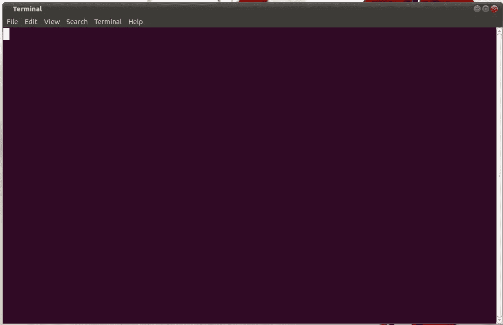

# 开发人员工具包:4 个 linux 命令行工具，用于调试所有开发人员都应该知道的日常问题

> 原文：<https://medium.com/hackernoon/4-linux-command-line-tools-for-debugging-issues-every-software-developer-should-know-e45a63f2c7a0>



我们一生中花了很大一部分时间来调试问题。有时候，我们只是需要一个非常简单的问题的答案，但是得到这个答案是一个真正的斗争，而且可能很耗时。有时我会看到一个复杂的第三方技术来解决这个问题，但通常在这种情况下，linux 已经解决了你的问题。其中许多命令行实用程序要么已经随标准的 linux 发行版提供，要么离从您的特定发行版的首选软件包管理器安装还差一行。这里有一个命令行工具的列表，我认为所有开发人员都应该知道如何使用它们来回答简单的问题。

# **ps**

为了回答这个问题:

> 我的机器上正在运行什么，它有什么进程 ID？

有许多有用的标志可以附加到命令中，例如:

```
ps -ef
```

以 unix 格式列出所有进程，或者:

```
ps -aux 
```

以 BSD 格式列出所有流程。

然后，您可以在这个列表中查找所需应用程序的 PID，例如，尝试查找正在运行的 tomcat 的 PID:

```
ps -ef | grep tomcat
```

以下是一些输出示例:

```
andy@desktop:~$ ps -ef | grep tomcat
andy   19822  1590 99 14:08 pts/1    00:00:06 /usr/lib/jvm/java-8-oracle/bin/java -Djava.util.logging.config.file=/home/andy/tomcat/apache-tomcat-7.0.56/conf/logging.properties -Djava.util.logging.manager=org.apache.juli.ClassLoaderLogManager -XX:MaxPermSize=512m -Xmx2048m -Dcom.sun.management.jmxremote.port=9012 -Dcom.sun.management.jmxremote.ssl=false -Dcom.sun.management.jmxremote.authenticate=false -Djava.endorsed.dirs=/home/andy/tomcat/apache-tomcat-7.0.56/endorsed -classpath /home/andy/tomcat/apache-tomcat-7.0.56/bin/bootstrap.jar:/home/andy/tomcat/apache-tomcat-7.0.56/bin/tomcat-juli.jar -Dcatalina.base=/home/andy/tomcat/apache-tomcat-7.0.56 -Dcatalina.home=/home/andy/tomcat/apache-tomcat-7.0.56 -Djava.io.tmpdir=/home/andy/tomcat/apache-tomcat-7.0.56/temp org.apache.catalina.startup.Bootstrap start
andy   19848  7377  0 14:08 pts/1    00:00:00 grep --color=auto tomcat
```

在这里，我可以看到一个 PID 为`19822`的进程正在运行

*注意:在这个输出中你还会看到你的****grep****(这个* `*19848*` *的 PID)。*

# netstat

为了回答这个问题:

> 我的机器和哪个端口上运行的是什么？

如果我想确定端口 **8000 上监听的是什么:**

```
sudo netstat tulpn | grep 8000
```

以下是对不同旗帜含义的解释——更多信息请见`netstat --help`:

```
-t   # tcp ports
-u   # udp ports
-l   # only listening ports
-p   # output PIDs
-n   # resolve hardware names
```

如果我在这个端口上运行了一些东西，我会得到如下输出:

```
andy@desktop:~$ netstat -tulpn | grep 8000
tcp        0      0 127.0.0.1:8000          0.0.0.0:*               LISTEN      16740/node
```

允许我在必要时`kill <pid>`或检查正在运行的进程。

# **tcpdump**

为了回答这个问题:

> 我的应用程序发出和接收了哪些请求/数据包？

如果我对进出端口 8080 的请求和数据包感兴趣，我可以使用以下命令获得流量、请求和消息体的完整转储:

```
sudo tcpdump -A -s 0 -i lo port 8080
```

`-i`是接口名。`lo`是环回接口，所有来自您机器的流量都将通过此网络接口。

`-A`会调试并省略一些奇怪的字符。

`-s 0`将打印所有数据包，因为默认情况下 tcpdump 不会这样做。

下面是一些示例输出，显示了对一个应用程序的简单 POST 请求，该应用程序使用用户名和密码组合执行简单的身份验证重定向:

```
13:49:04.701180 IP6 (flowlabel 0x8a77f, hlim 64, next-header TCP (6) payload length: 817) ip6-localhost.52870 > ip6-localhost.http-alt: Flags [P.], cksum 0x0339 (incorrect -> 0x3fa7), seq 1861:2646, ack 2002, win 1373, options [nop,nop,TS val 4948070 ecr 4947571], length 785: HTTP, length: 785
        POST /login/?sessionId=941b5ac4-5524-4b43-b4b1-b9e371a7f212 HTTP/1.1
        Host: localhost:8080
        Connection: keep-alive
        Content-Length: 49
        Accept: */*
        Origin: [http://localhost:8080](http://localhost:8080)
        X-Requested-With: XMLHttpRequest
        User-Agent: Mozilla/5.0 (X11; Linux x86_64) AppleWebKit/537.36 (KHTML, like Gecko) Chrome/64.0.3282.119 Safari/537.36
        Content-Type: application/x-www-form-urlencoded; charset=UTF-8
        Referer: [http://localhost:8080/login/?redirect=/myApp](http://localhost:8080/login/?redirect=/myApp)
        Accept-Encoding: gzip, deflate, br
        Accept-Language: en,en-GB;q=0.9
        Cookie: sessionId=941b5ac4-5524-4b43-b4b1-b9e371a7f212;

        username=username&password=password[!http]
```

还有许多其他标志可以添加到命令中，例如监视多个端口:

```
sudo tcpdump -A -s 0 -i lo port 8080 or port 8000
```

或者仅从单台主机捕获数据包:

```
sudo tcpdump -A -s 0 -i lo port 8080 and src host 1.2.3.4
```

# **telnet**

为了回答这个问题:

> 是否有网络问题阻止我连接到我的资源？

```
telnet <host> <port>
```

下面是一些输出示例—我没有在本地机器的端口 8000 上运行和侦听的活动进程，因此我无法连接到它们:

```
andy@desktop:~$ telnet localhost 8000
Trying 127.0.0.1...
telnet: Unable to connect to remote host: Connection refused
```

比方说，我正在尝试确定我是否可以连接到我的网络中的 postgres 的远程实例，我已经知道该实例已启动，并且没有网络问题—我已经知道主机名，并且知道 postgres 监听`TCP 5432`:

```
andy@desktop:~$ telnet myRDSinstance.eu-west-1.rds.amazonaws.com 5432
Trying 172.20.15.200...
Connected to myRDSinstance.eu-west-1.rds.amazonaws.com.
Escape character is '^]'.
```

我将收到一条消息，显示我已经与我的资源建立了 TCP 连接。或者，如果我无法连接，我会看到类似下面的消息:

```
andy@desktop:~$ telnet myRDSinstance.eu-west-1.rds.amazonaws.com 5432
Trying 172.20.15.200...
telnet: Unable to connect to remote host: Connection refused
```

为我提供证据，表明网络连接问题是我的特定问题的罪魁祸首。