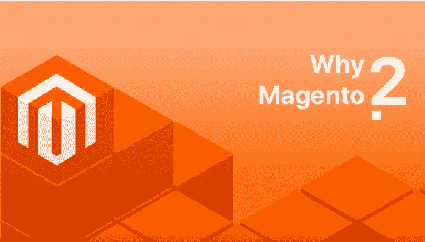

# 2018 年选择 Magento 2 的 4 大理由

> 原文：<https://medium.com/hackernoon/4-major-reasons-to-choose-magento-2-in-2018-5d9a47215e8>

Choose Magento 2 in 2018

> [**Magento 2**](https://magento.com/) 是一家网上商店，融合了高度可扩展的设计和广泛的支持网络。

Magento 2 是一个基于 PHP 的开源电子商务平台，是一个成熟的购物车解决方案，可以满足大中型企业的需求。这是一个功能丰富的平台，为用户提供了无与伦比的灵活性，他们可以管理他们的电子商务商店的内容，功能和布局。

首先，Magento 2 反应灵敏，搜索引擎友好。它有一个诱人的设计和更好的 UX。它提供了改进的产品创建、更好的数据查看和过滤以及管理导航改进。

除此之外，Magento 2 还提供了一个分割数据库的解决方案。产品数据、结账和订单有三个独立的数据库。有了[**Magento development**](https://www.goodfirms.co/directory/platforms/ecommerce-web-development-companies/magento)你还可以消除对你的电子商务商店有风险的不必要的 bug。

Magento 2 对产品数据也有数据保护措施。使用它们，多个管理员可以同时处理任何给定的产品数据。的管理导航界面更加整洁有序。此外，有组织的菜单使得查找页面更加容易和简单。

此外，根据您的业务需求，您可以从 Magento 提供的三个版本中进行选择:

*   Magento 社区版——它是一个完全开放的源代码，拥有最大和最活跃的用户社区
*   Magento 企业版—这是一个付费版本，根据您公司的需要和要求，您可以从提供的各种功能集中进行选择
*   Magento Go——这个版本是付费的，托管在 Magento 的服务器上

**继续，这里有一些你应该认真考虑 Magento 2 在 2018 年发展你的电子商务商店的理由:**

# 1.增强的性能参数

Magento 2 减少了服务器的负载，并大大增加了用户交互。此外，页面加载速度更快，购物车放弃率也降低了很多。然而，Magento 2 改进的主要参数是:

Ajax cart——使用 JavaScript，Ajax Cart 可以向购物车添加商品，而无需重新加载整个页面。由于这个原因，硬件上的负载更少，并且它为购物者产生更灵敏的体验。

[PHP 7](http://php.net/manual/en/migration70.new-features.php) — Magento 2 建立在 PHP 编程语言之上。因此，它针对 PHP 7 进行了优化，与旧版本相比，PHP 7 提供了增强的性能和更好的加载。

缓存——Magento 2 使用 Varnish 缓存和 HTTP 加速器，可以轻松地缓存请求。因此，多个管理员用户可以编辑电子商务产品信息，而不会有任何数据冲突。

主机环境 Magento 2 中有许多新的特性和功能，使用这些特性和功能，您可以轻松地将主机基础设施上的需求分布到多个服务器上。因此，处理流量高峰将相对容易。

# 2.简化的结账流程

对于电子商务平台来说，结帐是一个重要的参数。缺乏便捷的结账方式可能会促使顾客放弃他们的购物车。

Magento 2 改进了结账流程。Magento 1 有一个六步结账流程，而 Magento 2 只有两步结账流程。此外，在 Magento 1 中，不可能跳过任何过程。在经历所有这些程序之前，用户不能结帐。

Magento 1 中的六个步骤包括结账方式、账单信息、发货信息、发货方式、发货信息、付款信息，最后是订单审核。而在 Magento 2 中，运输的第一步和第二步是审查和付款。此外，它们显示在两个不同的页面上。

这种两步结账流程极大地改善了客户体验。它还允许客人结账选项。这消除了登录或注册的需要，并加快了用户的过程。

此外，它还提供动态运费率。费率根据您的地理位置显示，并根据国家、地区和邮政编码而有所不同。所有这些功能都可以减少摩擦，提高你的业务转换率。

# 3.改进的索引和工具包

Magento 2 提供了增强的索引，提高了查询性能速度。索引是一种提高查询处理速度和 web 商店性能的策略。它还通过创建索引表并定期更新来转换商家数据。

Magento 2 在所有用例中的表现都更好。Magento 2 有一个改进的工具包，提供:

*   高效的后端操作
*   优化网页，加快交付速度
*   所有网站活动的服务器响应时间更长
*   增强的数据库灵活性，可以处理峰值负载
*   为您的业务创建测试脚本的性能部件

通过更新部件和工具包，用户可以轻松地使用 Magento 2 来设置他们的电子商务商店。

# 4.高度兼容

随着大数据和类似 NoSQL 的数据库的出现，将属性与其他电子商务平台集成是一个挑战。但是，Magento 2 使集成数据、第三方工具、网络和云服务变得更加容易，没有任何困难。

Magento 2 还提供了与最新 PHP 框架如 Zend 和其他框架的兼容性。它还可以很好地与 Hadoop、Oracle 和 MySQL 等主流数据库配合使用。此外，由于 Magento 2 有一个 jQuery 库作为它的默认 JavaScript 库，所以 jQuery 和 Prototype 不会发生冲突。因此，用 Magento 2 编程并不麻烦。

此外，作为一个开源平台，Magento 2 以用户为中心，提供丰富的模板、模块、扩展和小部件来构建高效的电子商务商店。

## **总结一下:**

Magento 2 提供了许多强大的工具，如搜索引擎优化工具，目录管理工具和营销工具。

Magento 2 支持跨设备，也提供跨浏览器支持。由于所有这些强大的功能和工具，Magento 2 已经成为几乎所有希望拥有电子商务商店的企业的最佳选择。

对于仍在运行 Magento 1 的企业来说，尽管使用了数据导出/导入工具，但从 Magento 1 迁移到 Magento 2 不会是一个顺利的过程。因为迁移时所需的更改数量完全取决于您对 Magento 1 商店所做的定制数量。然而，你可以雇佣一个 [**电子商务开发者**](https://www.goodfirms.co/directory/platforms/ecommerce-web-development-companies) 来使迁移变得容易和顺利。

> Magento 2 是最终的电子商务平台，提供了一个安全的商业环境，它肯定会促进您的电子商务转换。