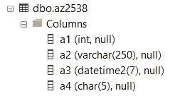
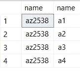

# 关于 SQL 注入漏洞的 4 个误解

> 原文：<https://medium.com/hackernoon/4-misconceptions-about-sql-injection-vulnerabilities-8f4a5be4df69>


有兴趣了解更多关于 SQL 注入袭击的信息，包括如何防范？ [*参加我的在线网络直播 2018 年 3 月 16 日星期五上午 9 点东部时间在免费的在线 GroupBy 会议*](https://groupby.org) *。*

作为开发人员和数据库专业人员，SQL 注入仍然是我们面临的最大的安全风险之一。

每年，数百万用户的个人信息因被 SQL 注入利用的糟糕的查询而被泄露。可悲的事实是，只要掌握正确的知识，SQL 注入是完全可以预防的。

我今天的目标是涵盖人们对 SQL 注入的四种常见误解，以努力打消任何认为注射攻击不会发生在你身上的幻想。

*更喜欢看我对这些常见的误解发火？* [*你可以在我的 YouTube 频道看这个内容。*](https://youtu.be/5Ev6ZSpQd54)

# 1.“我的数据库信息不公开”

让我想想，在我对您的数据库一无所知的情况下，我猜您可能有一些名称类似于以下的表:

*   用户
*   库存
*   制品
*   销售
*   等等…

这些听起来熟悉吗？

您可能不会公开发布您的数据库对象名称，但这并不意味着它们不容易被猜到。

恶意用户所需要的只是一个常见数据库表名的列表，他们可以遍历感兴趣的表名，直到在您的系统中找到匹配的表名。

# 2."但是我混淆了所有的表名和列名！"



哦天啊。我希望你不要这样做。

有些人这样做是为了工作安全(“因为只有我能理解我的命名惯例，我保证我自己有一份工作！”)这本身就是一个可怕的理由。

然而，出于安全原因这样做也同样可怕。为什么？嗯，你听说过一些像 sys.objects 和 sys.columns 这样的系统表吗？

```
SELECT 
  t.name, c.name 
FROM 
  sys.objects t 
  INNER JOIN sys.columns c on t.object_id = c.object_id
    on t.object_id = c.object_id
```

想要进入您的系统的黑客可以很容易地编写类似上面的查询，暴露您的“安全”命名约定。



默默无闻的安全感是行不通的。如果您有不常用的表名，这完全没问题，但是不要把它作为唯一的预防措施。

# 3.“注入是开发人员/DBA/其他人的问题”

你完全正确。SQL 注入是一个应该由开发者/DBA/其他人来解决的问题。

但这也是一个受益于多层安全的问题，这意味着这也是你的问题要解决。

[防](https://bertwagner.com/2017/08/29/warning-are-your-queries-vulnerable-to-sql-injection/) [sql 注入](https://bertwagner.com/2017/09/05/how-to-safely-parameterize-table-names/) [硬](https://bertwagner.com/2017/09/12/how-unicode-homoglyphs-can-thwart-your-database-security/)。

开发人员应该验证、净化、参数化等。数据库管理员应该参数化、净化、限制访问等..

应用程序和数据库中的多层安全是自信地防止注入攻击的唯一方法。

# 4.“我是大池塘里的一条小鱼——没有人会故意攻击我”

所以你经营一个利基业务，制造和销售定制的花园侏儒。

你只有几十/几百个客户，所以谁会费心去偷 SQL 注入的数据呢？

嗯，大多数 SQL 注入攻击都可以通过像 [sqlmap](http://sqlmap.org/) 这样的工具完全自动化。有人可能不太关心你的业务，以至于手工制作了一些 SQL 注入代码，但这不会阻止他们通过自动化手段窃取你手工制作的 garden gnome 客户数据。

没有一个应用程序，无论大小，能够免受自动化 SQL 注入工具的攻击。

*有兴趣了解有关 SQL 注入病毒攻击的更多信息，包括如何防范它们？* [*参加我在 2018 年 3 月 16 日星期五东部时间上午 9 点举行的免费在线 GroupBy 大会*](https://groupby.org) *。*

*感谢阅读。你可能也会喜欢在 Twitter 上关注我。*