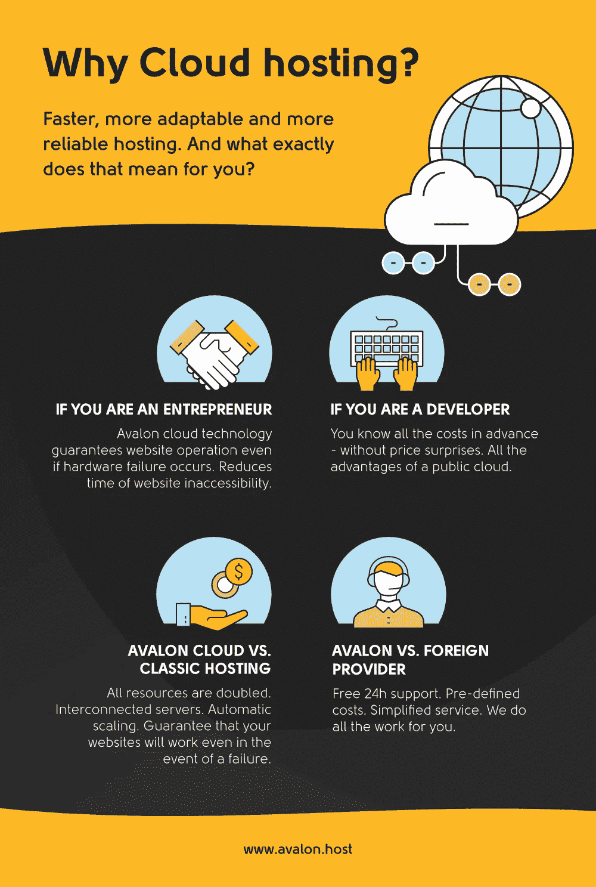

# 今年 4 个最重要的虚拟主机趋势

> 原文：<https://medium.com/hackernoon/4-most-important-web-hosting-trends-this-year-bfae1257e00c>

如果你已经迈出了最重要的一步，勇敢地踏入了创业的水域，开创了自己的事业，成为了自己的老板，那么你需要进一步思考的事情就是创建自己的网站！

好吧，你也可以考虑盈利，但如果有什么东西真的能帮你做到这一点，那么它对你或你的企业来说就是一个好的网络展示。

创建一个网站不再是一件美好的事情，因为它现在是绝对必须的。我们今天超过 95%的购物都是以某种方式从网上开始的。我们谈论的是大量使用互联网作为主要信息来源的用户。

拥有一个持续可用的网站意味着一年中的每一天，一天 24 小时，中午和午夜都在用户面前(类似于阿瓦隆的客户支持)，如果你想比克罗地亚造船公司更快地崩溃，那么你不必知道这方面的任何事情。

**你的网站**获得良好访客体验的先决条件之一是它将位于的[优质主机](https://www.avalon.host/pricing)。有一个网站没有好的托管，就像闭着眼睛开车。在这个虚拟的空间中，有许多机会，但也有更多的威胁，而且越来越危险。

如果你不能保持你的网站的功能性和有用性，你很难期待有显著的效果。随着技术每天都在进步(托管是技术包装的)，我们作为一个托管提供商只需要跟上潮流，跟踪这个行业中所有重要组件的技术发展。

据估计，到 2020 年，全球虚拟主机市场的价值将达到 1438 亿美元，而网站维护将变得更加便宜。

# 这些是今年最重要的虚拟主机趋势！

# 1.云

云托管已经成为标准。由于拥有一个网站是一种标准，基于云的网站也将很快成为规范，因为云是可靠的，服务器可用性几乎是恒定的，小用户已经可以访问它，并提供高正常运行时间。

不同于传统的托管和非托管，后者使用某些资源，如 RAM 内存、磁盘空间和固定带宽，云更加灵活。这些虚拟资源 24/7 可用，并采用按使用付费的模式，这意味着用户只需为他们需要的空间付费。

我们在阿瓦隆愉快地回忆起我们开始工作的时候，那时雅虎在网络上无与伦比，而谷歌刚刚从阴影中出现，就像某种小型的新搜索引擎，没有人清楚它实际上会提供什么服务。

当我们开始的时候，我们没有脸书，Youtube，智能手机(诺基亚 3310，有人知道吗？)，以及许多其他东西，没有它们我们无法想象今天的生活和商业。在 17 年的 web 托管之后，2014 年，云转型对我们来说是一个巨大的里程碑，我们从一个新的起点开始，以一种全新的、更好的方式，迎接新的技术和挑战。

> 今天， [Avalon hosting 提供的云是 20 多年经验和应用于主机的最新 IT 成就的最佳结合。](https://www.avalon.host/pricing)

正如我们已经提到的，技术不是一个幼稚的东西。你去度假，回来后，已经很难捕捉到新的趋势和新闻了。你需要克服和应用的新的更好的东西已经出现了。

自 2014 年以来，我们所有的网站和应用程序都存储在最值得信赖的服务器上，这些服务器都经过了彻底的现代化改造。然后，我们全面升级了我们使用的硬件和软件，并转移到一个新的计算机基础设施，称为云。

# 2.完整的解决方案和服务

越来越多的用户总是在寻找完整的解决方案，因此他们会从那些提供“其他东西”而不仅仅是一种特定服务的人那里购买更多。

如果你刚刚决定你需要一个网站，找一个可以为你提供网站托管、设计、开发、网站和服务器维护、搜索引擎优化(SEO)、电子邮件、营销等服务的人是一个合乎逻辑的选择。。

“*主持*这个词现在越来越不被追捧和流行了。根据谷歌趋势判断，在过去十年中，谷歌搜索“*虚拟主机*”的频率下降了 60%。

大家宁愿谷歌“*如何做网站和邮件*”，也不愿谷歌“*如何购买托管包*”。主机服务提供商必须适应客户的需求和询问。

因此，我们 Avalon 在过去 10 多年里一直在创建客户网站，仅在今年**我们就创建了 100 多个新网站**。我们的客户不断指出对网站设计和维护的信任，因为我们提供统一的域名注册服务、托管、网站创建和维护，这意味着[全面服务](https://www.avalon.host/full-service)。

# 3.托管分散化

根据业内一些领军人物的观点，虚拟主机作为一种服务，将从传统模式转变为分散模式。这实际上意味着用户将越来越多地使用自己的服务器，这将提高信息交换的速度，并改变创建软件所围绕的架构。今天，我们已经有了用于托管信息的云和全球 cdn，但在未来，我们应该预计基础架构将变得分散。

通过应用 IOT ( *物联网*)概念，并知道我们未来使用的所有设备都将连接起来，我们很清楚云将继续在一切事物中发挥重要作用。

与以往相比，我们将能够在任何时间访问任何设备。部分数据将存储在这些设备上，而不是全部托管在托管数据中心，这将特别指那些越来越基于客户端的应用程序，而普遍接受的标准服务，如 *mail* 和 *ftp* 仍然保留在数据中心。

但是我们仍然有一些限制。比如网站前端很难完全从服务器切换到客户端。Torrent 使用了类似的分发原则，问题是，当我们可以在数千台使用 Torrent 的计算机上容纳海量数据时，为什么我们仍然使用 Dropbox，Google Drive 和类似的数据存储服务。

如今拥有自己的数据中心的公司在未来将能够使用专门从事该业务的提供商的云服务，并且作为用户的公司将在其设备(移动和桌面)上拥有基于云的业务。Avalon 的云盘系统已经很大程度上去中心化了，因为它分布在多个服务器上，不像标准的 RAID 镜像。

具体来说，用户数据存储在三个不同的服务器上的三个副本中。如果一个磁盘或服务器出现故障，数据将存储在另外两个磁盘/服务器上。通常的 RAID(廉价(独立)磁盘冗余阵列)镜像大多基于主机，因此，如果主机崩溃，其上的所有内容都会崩溃。

听起来很熟悉？在这种情况下，我们必须修复主机或将磁盘迁移到另一台主机。例如，几年前，我们遇到过这样的情况:我们的一台服务器上的控制器坏了(这种情况确实发生过)，主机崩溃了，但是— **一切都还在工作**，如果系统没有在主机级别上分散和分布，这是不可能的。如果不是这样，那么我们的用户和我们都会有更多的麻烦。对于阿瓦隆，用户是第一位的。

在未来，我们可能期望这一原则在数据中心层面得到应用，尽管对许多人来说，这听起来像科幻小说。

让我们想象一下这样一种情况，一架飞机在一个数据中心坠毁并摧毁了它，几分钟后，我们让另一个数据中心的一切都可以运行，就像什么都没发生一样。**我们正在谈论*那个*。**

谷歌、亚马逊和微软等公司以及其他主要参与者已经有了这样的地理冗余，因此“备份”数据中心会从停机的数据中心取走一切。

# 4.人工智能

与 VR 和 AR 技术不同，人工智能在短时间内记录了巨大的增长，正是因为其应用的各种可能性。

人工智能几乎可以在任何地方找到它的应用，在网络托管中也是如此。它已经改变了许多行业，无论是在线还是线下，我们的行业已经感受到了一些初步的转变迹象，因为人工智能已经开始融入和影响世界各地的许多网站。

我们一直在谈论的云技术是实现人工智能软件解决方案的一个特别有用的基础。我们每天都在见证新的恶意软件的出现，而且看起来，它们的发展几乎不可能被及时跟踪和保护。

人工智能技术的一个巨大优势是**它可以在威胁出现的早期**识别威胁，并在损害出现之前通知我们潜在的危险(例如，如果我们的领域是潜在网络攻击的目标)。

在我们写这篇文章的时候，阿瓦隆只资助了一个这样的项目——“人工智能在托管中的*应用”，该项目正在斯普利特科学学院的一篇博士论文中进行。*

我们参与的研究有几个方向，其中之一是人工智能在技术支持方面的应用，然后是关于网站安全和用户个人信息的应用，我们也在考虑开发一些新的网络服务的可能性，这些服务将为我们的用户提供不同的用户体验，以及创建一些新的营销工具。

想法很多，时间会告诉我们哪一个会被证明是有价值的。该项目已经运行了大约一年，并计划以现有的形式再持续两年，我们主要与 IBM Watson 合作并依赖其解决方案。

基于所有这些，我们可以得出这样的结论:虚拟主机的未来已经出现，一切都变得云化和去中心化。没有人指望一个托管公司发明奇迹，因为我们已经生活在一个奇迹已经被创造的时代。

唯一的问题是——我们将使用它们做什么?“小”玩家何时才能在日常生活中实现它们？

*原载于*[*www . Avalon . host*](https://www.avalon.host/blog/4-most-important-web-hosting-trends-this-year/)*。*