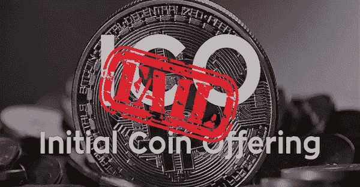

# ico 失败的 4 个主要原因

> 原文：<https://medium.com/hackernoon/4-primary-reasons-why-icos-fail-43274fd34e2e>

去年，如此多的 ico 被宣布和推出，但只有少数几个在市场上取得成功并实现了他们的目标。据统计，与成功的 ico 相比，**失败的比率非常高。**推出 ICO** 不是个好主意。如果 ICO 公司想要实现目标，在市场上与其他**成功的 ICO**竞争，还有很多研究要做。这就是为什么考虑在 2018 年推出新 ICO 的人应该有适当的规划、研究和良好的策略来营销他们的 ICO 非常重要。**

那么 **ICO 失败**的原因是什么呢？在进入 ICO 行业之前，这是一个你必须能够回答的非常重要的问题。以下是导致 **ICO 故障**的一些主要原因，包括避免这些故障的方法:

# 1.产品市场不充分:

大约 60%的 **ICO 在初始阶段**失败，因为他们的服务或产品在市场上没有任何价值和需求。因此，在你推出并**宣布一个 ICO** 之前，确保它拥有需要你产品的受众，这一点非常重要。如今，大多数 ico 都需要出售代币来筹集资金。对于这些 ico 来说，重要的是他们的 ico 能够尽快赶上 SEC 和相关的常规机构，以保护自己免受长期失败的影响。

此外，非常重要的一点是，推出 ICO 的人应该有一个完全了解项目的明确市场，建立信任和声誉对于**让你的 ICO 成功**也很重要。

# 2.未能创建品牌标识:

人们没有品牌意识。他们投资了一个听起来不错的项目，却忘记了它也应该看起来不错。这包括网站的每一个元素，如内容、徽标、视觉效果、字体、 [**ICO 白皮书**](https://www.ogscapital.com/ICOwhitepaper_writing/) 以及颜色的选择等。如果人们发现你的网站不专业，他们会质疑你的品牌。

ICO 不仅仅是你的想法，也是营销和品牌。你的产品代表着你的品牌，这就是为什么你花大量的时间来创造品牌形象是非常重要的，因为这将会在未来导致许多其他的沟通和营销方面。

# 3.不切实际的目标和预算:

新企业不切实际的预算和目标总是让企业陷入困境。你设定的目标越高，实现这些目标所需的预算就越多，在营销、公关、开发、设计和内容上的花费也越多。因此，为了避免这种情况，请确保您提供的目标应该与您的项目范围相匹配。在公开销售之前，如果你的团队对于一个 ICO 来说很小，最好先进行一次私下销售。

# 4.缺乏审计、报告和衡量:

大多数**失败的 ICO**都是由新来者发起的，他们对在线营销技术的了解非常有限，并且不理解持续审计、测量和报告以改进其 ICO 的需要。为了避免这种情况，请确保您了解可以帮助您完成所有这些事情的工具，这些工具允许您跟踪转换和用户行为，例如 Google Analytics。

请记住，ICO 就像一种产品或服务，除非你以正确的方式营销，否则无法生存。你需要了解你的受众是谁，如何找到他们，然后将他们转化为**使你的 ICO 成功**。