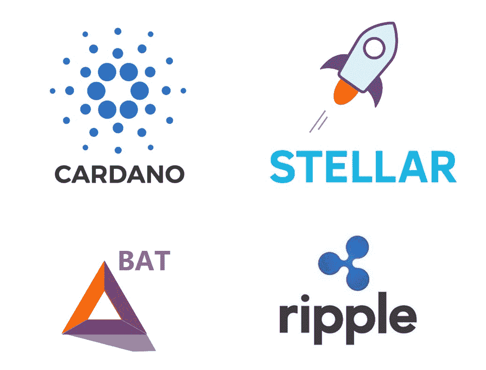

# 2018 年有望投资的 4 种加密货币

> 原文：<https://medium.com/hackernoon/4-promising-cryptocurrencies-to-invest-in-for-2018-4762e03232a4>

## 从 Javascript 的创造者，到以太坊的前联合创始人，这些加密货币都有坚实的团队和远大的抱负。

## 1.卡尔达诺

Cardano 是一个去中心化的计算平台，由以太坊的联合创始人 Charles Hoskinson 创建。

Cardano 与以太坊的相似之处在于其区块链支持智能合约和去中心化应用(dapps ),但 Cardano 的目标是通过使用侧链和对实施的技术进行科学同行评审，成为更先进和可扩展的区块链。

**注:**侧链是为特定用途设计的独立区块链。实施侧链减少了主区块链上的交易量，从而防止了拥塞。

Cardano 是分层构建的，其加密货币 ADA 运行在 Cardano 结算层(CSL)，而智能合约和 dapps 将运行在 Cardano 计算层(CCL)。侧链将用于连接 Cardano 不同层之间的交易。

这种多层方法允许通过使用软叉轻松更新区块链。在区块链技术中，软分叉是向后兼容的更新，而硬分叉是非向后兼容的，因为它创建了新的、独立版本的区块链，该版本不接受运行区块链的先前版本的节点。

**注意:**节点是一台安装了区块链的计算机。

Cardano 是区块链的名字，而 ADA 是基于这项技术的加密货币的名字。ADA 是以 19 世纪数学家阿达·洛芙莱斯的名字命名的，他也被认为是世界上第一个计算机程序员。

在我写这篇文章的时候，Cardano (ADA)目前是 0.18 美元。

## 2.基本注意力标志

基本注意力令牌(BAT)是一个建立在以太坊网络上的去中心化广告平台。BAT 的创始人是 Brendan Eich，他是 Javascript 的创始人，也是 Mozilla Firefox 的联合创始人。

BAT 是一个公用令牌，出版商、广告商和用户可以在 Brave browser 上使用，Brave browser 也是由 Brendan Eich 发起的。

最佳可得技术的潜在应用案例包括:

*   观看广告的接收球棒
*   在优质产品或功能上花费 BAT
*   向你最喜欢的出版商捐赠蝙蝠
*   实施 BAT 的其他浏览器作为补偿受 AdBlock 软件影响的广告商和出版商的一种方式。

因此，我们这里不只是有一个令牌，它是与它自己的独立互联网浏览器 Brave browser 一起发布的。

Brave 是一款内置广告拦截系统的网络浏览器，Brave 背后的团队声称，由于删除了广告，这款浏览器的运行速度比普通浏览器快 7 倍，从而降低了网页加载速度。

如果广告商希望勇敢的用户观看他们的广告，他们将不得不通过向用户支付 BAT 来补偿用户的时间，因此本质上用户将会因观看广告而获得报酬。

想想看，智能手机应用程序会因你观看广告而奖励你游戏内的货币，这是类似的，只是你会收到具有真实世界价值的加密货币。

BAT 有一个伟大的创始人，加上一个正在工作并已经发布的产品，这在我看来是显而易见的。

基本注意力代币目前价值 0.23 美元

## 3.瑞波(XRP)

Ripple 是由 Ripple Labs 开发的支付汇款协议。Ripple 的目标是允许银行在几秒钟内将大量资金转移到世界各地，同时节省大量资金。

Ripple 通过其加密货币 XRP 实现了这一点，该货币的交易时间平均约为 3 秒，交易成本仅为一美分的几分之一。

它的速度和低交易成本使其类似于 Stellar Lumens，但 Stellar 也作为一个开发平台，而 Ripple 是一个主要针对世界各地银行的支付协议。

目前，Ripple 与其他 100 家银行合作，包括 JP 摩根、桑坦德银行、美国运通和英格兰银行。

尽管银行是 Ripple 的主要目标客户，但日常用户可以使用 XRP 在全球范围内转移大量资金。例如，你可以以不到 1 美分的价格向另一个国家的亲戚汇去 10，000 美元，只需几秒钟就可以到达他们手中。

没有大量的银行转账费用，没有 3 天的等待时间。

Ripple 目前价值 0.61 美元

## 4.恒星流明(XLM)

Stellar Lumens (XLM)是一个分散式开发平台和加密货币，由 Ripple 的联合创始人 Jed McCaleb 创办。

除了 Ripple，Stellar 的交易费用比大多数加密货币低得多，交易成本不到 1 美分。交易速度平均也需要 2-4 秒。

低交易成本和快速不是 Stellar Lumens 的唯一优势，Stellar 还可以用作运行 ICO、智能合约、dapps 的平台，并创建将在 Stellar 区块链上运行的加密货币。

这类似于以太坊，它是通过 ICO 创建的基于以太坊的代币，不同之处在于基于恒星的代币将更快更便宜，因为它将分担恒星流明货币的交易成本和速度。

最近，Mobius 在使用恒星流明(XLM)区块链运行其 ICO 时筹集了超过 3900 万美元。

恒星流明目前价值 0.26 美元

## 如何投资这些加密货币

一些加密货币在基于现金的交易所可用，而大多数仅在仅加密货币交易所可用，例如 Stellar Lumens (XLM)和 Ripple (XRP)可以直接从 [**CEX** 用现金购买。](https://cex.io/r/0/up106280379/0/)

另一方面，卡达诺(ADA)和基本注意力令牌(BAT)现在可以用比特币(BTC)或以太坊(ETH)从**购买，将来它们可能会加入基于现金的交易所。**

## **最后的想法**

**如果这些项目继续实现其路线图目标，并继续确保战略合作伙伴关系，我可以看到它们在不久的将来会变得非常大。**

**没有多少项目有这么扎实的背景。**