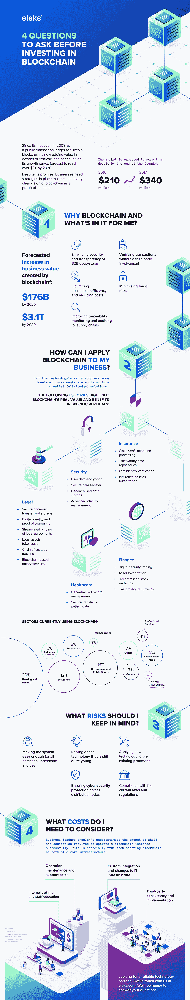

# 投资区块链前要问自己的 4 个问题

> 原文：<https://medium.com/hackernoon/4-questions-to-ask-yourself-before-investing-in-blockchain-d77f035acec4>

自 2008 年作为比特币的公共交易分类账成立以来，区块链现在正在改变几十个垂直行业，并继续保持增长曲线。虽然越来越多的企业在区块链投资，但该技术的商业价值预计到 2030 年将超过 3 万亿美元。

虽然信任是数字经济的基石，但由于安全且经济高效的智能合同，区块链正在消除行业边界。这些自动执行的计算机程序消除了停机、审查、欺诈或任何第三方干扰的可能性。随着这项技术的成熟，它可以为法律部门、房地产、知识产权等各种类型的资产创建安全存储和运行交易[。因此，企业现在积极投资区块链，以利用其上市速度和广泛的商业应用。](https://eleks.com/blog/benefits-data-tokenization-highly-regulated-industries/?utm_source=medium&utm_medium=refferal&utm_campaign=Republ-Blockchain-infogr-Blog)

区块链技术现在正在各个领域受到关注。对于具有前瞻性思维的公司来说，一些低水平的投资正在演变成潜在的成熟解决方案。大型企业开始积极推出区块链试验和试点。2017 年，英国石油公司(BP)开始[与区块链](https://www.ft.com/content/100622d0-a680-11e7-93c5-648314d2c72c)进行实验，以促进石油和天然气交易，因为他们探索了交易验证的“实践和道德”含义。同年，英国银行在其不断发展的加速器项目中加入了另一个区块链解决方案。

尽管前景光明，但区块链并非没有制约因素和相关风险，没有相关的技术专长，它不会成功。要充分利用区块链技术，您需要对区块链有一个非常清晰的认识，将其作为一个切实可行的解决方案、一个全面的战略和合适的专业知识。

# 在投资区块链之前，你应该问自己以下四个问题:

想深入了解区块链的风险和回报吗？查看我们关于采用区块链的风险和回报的白皮书。

如果您需要一个可靠的技术合作伙伴来确保区块链利益的充分实现，[请联系我们](https://eleks.com/contact-us/?utm_source=medium&utm_medium=refferal&utm_campaign=Republ-Blockchain-infogr-Blog)。我们很乐意回答你的问题。

*原载于 2018 年 7 月 26 日*[*eleks.com*](https://eleks.com/blog/investing-in-blockchain-infographic/?utm_source=medium&utm_medium=refferal&utm_campaign=Republ-Blockchain-infogr-Blog)*。*