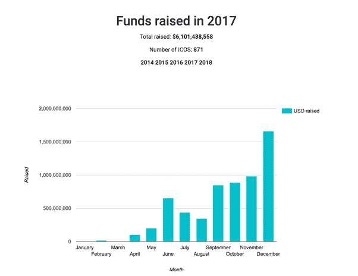
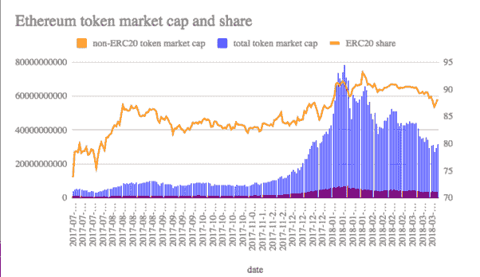

# 以太坊存在的 4 个理由

> 原文：<https://medium.com/hackernoon/4-reasons-ethereum-is-here-to-stay-75b88c7d639f>

我不知道以太坊是否会像今天一样继续成为市场领导者，但它肯定不会有任何发展。

最近我在网上收到了很多关于以太坊的问题。随着竞争对手的出现，人们开始怀疑 dApps 之王是否有失去王位的风险。

*“以太坊会重新崛起吗？”*

*“有了 NEO、EOS、QTUM，以太坊还会持续吗？”*

*“以太坊为什么会没落？*

*“其他替代币与之竞争是否意味着以太坊不会复苏？”*

**城堡里有一些更年轻更健康的王子，并不意味着他们就可以废黜国王。**

**为什么？**

Photo by [Thought Catalog](https://unsplash.com/@thoughtcatalog?utm_source=medium&utm_medium=referral) on [Unsplash](https://unsplash.com?utm_source=medium&utm_medium=referral)

## **先发优势。**

以太坊是第一个允许广泛创建令牌的平台令牌。在 NEO、EOS 和其他竞争对手发布白皮书之前，以太坊已经在他们的平台上成功发布了几个 ICO。

有人可能会提出 MySpace 对脸书的争论，MySpace 也是第一个。没有人知道老汤姆最近在忙些什么。但是，正如您将在下面的图表中看到的，在这种特殊情况下，早期移动优势带来了数十亿美元的支持。如果 MySpace 在脸书推出之前就达到了以太坊的估值，很难说这场战斗会有什么结果。

作为先行者的另一个好处是以太坊建立的开发者社区。通过成为第一个，并创建一个更容易被开发人员获得并添加到他们的工具包中的项目，他们已经创建了一个巨大的活跃开发人员社区，不断寻求改进平台。

> 人们倾向于忽略以太坊的开发者生态系统实际上是多么丰富和活跃。开发者生态系统是如此丰富，你有很多人在解决以太坊目前的大弱点。他们还有一个雄心勃勃的愿景，那就是在不影响权力下放的情况下扩大区块链的规模。
> 
> 感谢以太坊活跃的开发者社区，我们有了解决可扩展性问题的创造性解决方案。— [奥列格·谢尔盖金](https://www.quora.com/profile/Oleg-Sergeykin)，博士

以太坊有极好的文档，直到另一个项目可以在这方面与之匹敌，新的开发者将继续涌向以太坊区块链。

更不用说*以太坊企业联盟:*由几家成熟可靠的公司支持和组成。以太坊甚至有强大的 B2B 社区支持。

## 他们只是声称。

虽然很多公司声称比以太坊更好，但在这一点上，他们只是声称而已。没有人把他们的钱用在他们的嘴上，并真正展示他们的平台如何解决以太坊的可伸缩性问题。EOS 自称是“类固醇上的以太坊”，这就是 E O S 的字面意思。然而，他们的主网还没有启动，目前还没有证据。

更别说 50%的 EOS 货源都被 10 个钱包拿着。目前还远未分散。这么大的供应量被一小撮人拥有，操纵时机已经成熟，但那是另一回事了。

以太坊**后不久 NEO 发布。**我认为 NEO 是最接近的竞争对手，但还没有看到它真正构成威胁所需的 dApps 数量。

## **以太坊已经通过在其平台上推出的 ERC20 代币筹集了数十亿美元的资金。**

以太坊为任何有好主意的人(不幸的是，有很多坏主意的人)创建了一个 onramp 来创建他们自己的令牌。ERC20 代币的出现改变了游戏规则。现在，任何一个对坚固性稍有了解的人都可以对任何东西进行修饰。

以太坊是我们在 2017 年看到的 ICO 热潮的原因，当时硬币正在左右推出。有时筹集到数亿美元的资金。仅在 2017 年，871 个 ICO 总共筹集了**6，101，438，558** 美元。

[*图表可以在这里找到。*](https://www.icodata.io/stats/2017)

## 以太坊和其他 ERC20 代币占总代币市值的 **90%。**

[*现场图可以在这里找到。*](https://docs.google.com/spreadsheets/d/e/2PACX-1vTtCTNmQomnRc9a0WvbAZErmImX6R6Ditn-65YMsAU3UaZed10JwVFY0SNiCZR-CCO5oc9BPnypUujm/pubchart?format=interactive&oid=483410989)

因为生成 ERC20 令牌非常容易，所以它们构成了加密市场的大部分资本。如果以太坊失败了，这些硬币也会失败。

> 虽然其他平台有不同的，可以说是更好的方式来处理堆栈的某些部分，但事实是 90%的开发人员和企业构建新的区块链应用程序将在以太坊平台上进行。
> 
> 这是一种建筑效应。更多的开发人员意味着更多的项目，这导致人们制作更好的开发工具和学习材料，这创造了创建应用程序的更好机会，这创造了更多的开发人员和项目…— [布莱恩·舒斯特](https://www.quora.com/profile/Brian-Schuster-5)

说到底，在以太坊网络上建立的公司投入了太多的资金，ETH 不可能很快去任何地方。