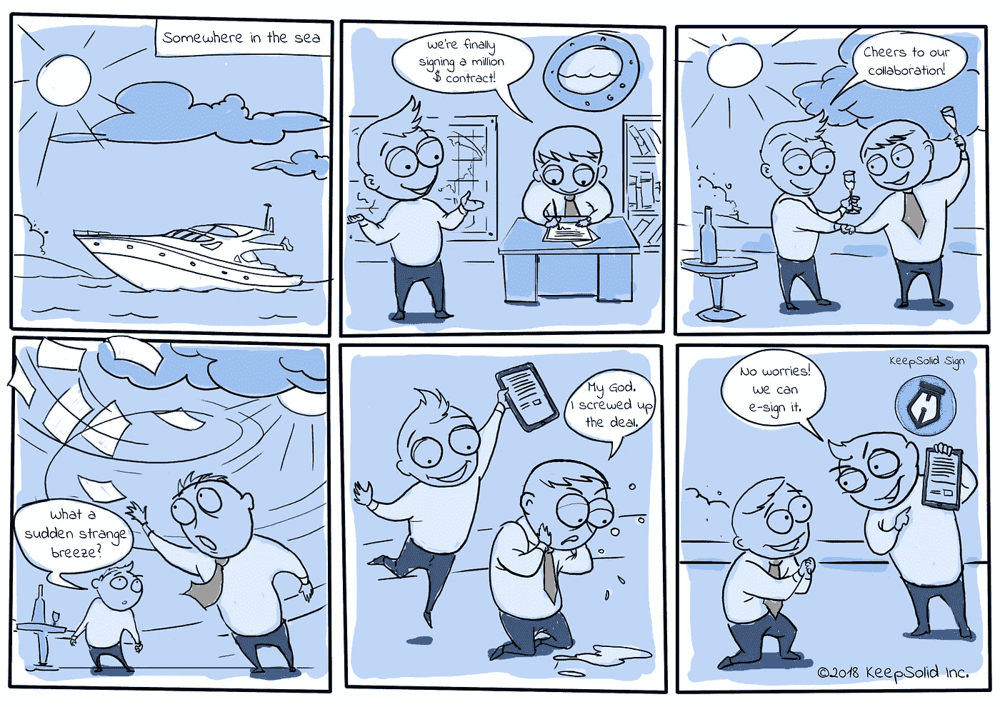
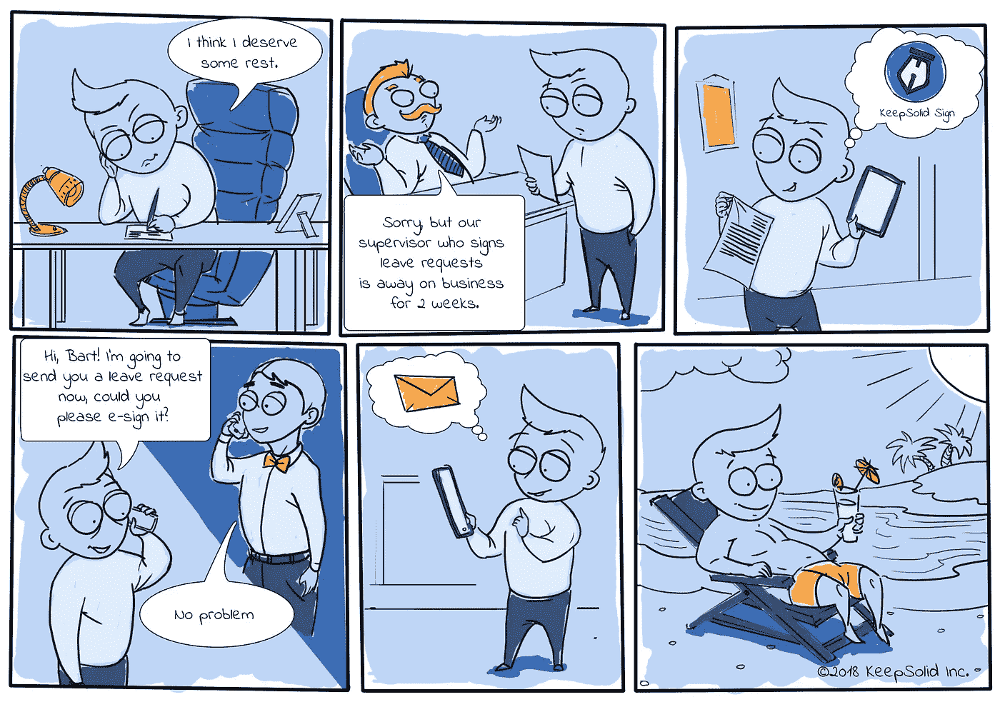
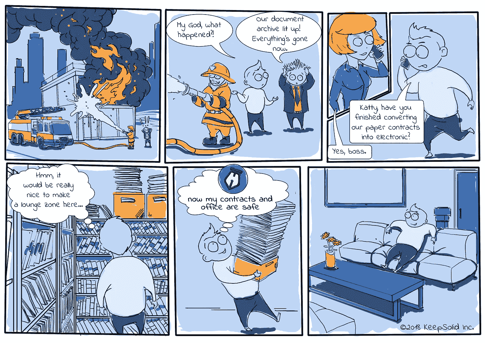
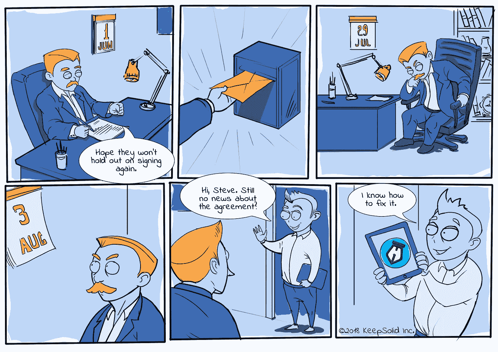

# 企业转向电子签名的 4 个原因:在 Pix 中

> 原文：<https://medium.com/hackernoon/4-reasons-for-businesses-to-switch-to-esignature-in-pix-309be5864f94>

与人工智能、加密货币和虚拟现实等技术趋势相比，电子签名看起来并不完全是一个奇迹——而是理所当然的事情。但是，在对我们的设计应用程序 [KeepSolid Sign](https://www.keepsolid.com/sign/) 进行测试时，我们惊讶地发现，65%的参与者(包括[企业](https://hackernoon.com/tagged/business)所有者和 IT 主管)仍然打印并手动签署他们的文档，尽管这种方法有很多缺点。

历史表明，坚持“传统方式”而忽视现代高效技术的企业往往会很快倒闭。

作为一个例子，柯达臭名昭著的决定是因为害怕新发明的数码相机会损害他们的业务(最终还是损害了，但原因完全不同)。因此，如果你是那些还没有为自己的公司采用电子签名的人之一，这里有 4 个理由让你现在就这么做，以免错失良机。

1.  **安全性和可访问性**

In the sea, on the plain or even offline — anywhere, anytime, on any device.

当谈到纸质签名时，**安全性**是一个很大的问题。您的文档可能会丢失、损坏、遗忘、被盗、被第三方复制，还可能会被茶水泼到等等。当使用电子签名软件时，这些和许多其他潜在的问题变得不可能。大多数电子签名提供商都提供高度安全的 AES-256 加密协议，因此您可以确保您的文件是安全可靠的。

此外，在您的所有设备之间同步您的所有文档非常方便。您可以随时随地通过您的帐户和任何设备立即**访问**它们。

2.**长途和多方协议**

Sounds familiar? One of the situations in HR department

你可能会惊讶于公司的生产力会因为文书工作的中断而受到多大的影响。这使得无论被签名人位于何处，都能够快速签署文档成为电子签名软件的最大优势之一。签订涉及多方的合同变得容易多了。在第一个人签署文档后，应用程序会自动将文件发送给工作流程中的下一个签署人，因此您的业务工作比以往任何时候都更快。

3.**材料和存储节省**

Well, we exaggerated a bit, but paper is a fragile thing

电子签名技术可以让您的企业更有效地利用您的办公空间，摆脱庞大而昂贵的办公架、书架和成堆的纸张。电子签名软件还可以防止您的公司因自然灾害、文件处理不当和其他事故而遭受潜在的金钱损失。此外，这是一项环保技术，使您的公司能够减少纸张和其他与打印相关的耗材的消耗。

4.**清除您文档的状态**

Moreover, you can even remind your participants about pending documents.

你有没有发现自己在想，“*他们已经签了吗*？”，"*如果他们根本没有收到文件呢？*"或"*如果我的合同被遗忘埋在一摞纸下面怎么办？*”。当您的业务的[未来](https://hackernoon.com/tagged/future)依赖于文档签署时，它是您最关心的问题，但如果持续进行，它很容易被遗忘。

这使得文档状态跟踪功能大大减轻了用户的负担，并且是任何电子签名服务的必备功能。有了它，您可以清楚地看到每个文档处于签名过程的哪个阶段。如果时间紧迫，您可以向所有或某些参与者发送提醒。有了这个方便的特性，像“*这样的猜测怎么花了他们这么长时间？*“会为你留在过去。

如果以上所有的理由都不够令人信服，只需考虑以下事实:

*   *全欧洲的企业一周几乎浪费了一整个工作日* ***(6.8 小时)*** *做文书工作。*
*   ***美国日常使用 653.95 亿张纸*** *。那是多少钱？这一数量的纸张花费相当于 6 个完全相同的帝国大厦* *，压倒****250 万相扑手*** *，并且需要差不多****81.5 万棵松树*** *才能生产出来。*
*   *典型的高管浪费* ***一年 150 个小时*** *(几乎整整一个月)，搜寻丢失的信息。对于一个年收入 5 万美元的人来说，这种损失相当于每年****3842 美元。***
*   *大约有 49%的***的财务员工* ***的时间*** *都花在了处理事务上。**

*你是赞成还是反对电子文档管理？*