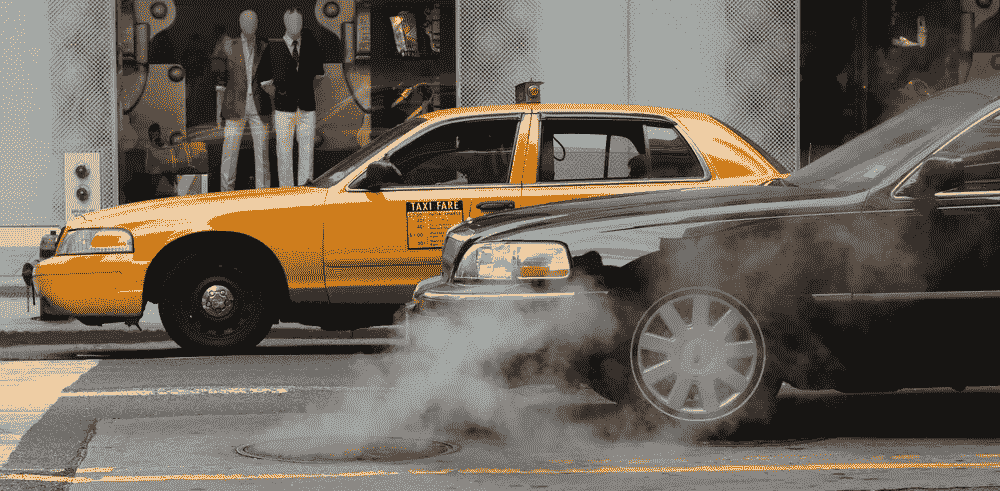

# 4 个迹象表明你的行业将被区块链颠覆

> 原文：<https://medium.com/hackernoon/4-telling-signs-that-your-industry-will-be-disrupted-by-blockchain-f0f822e6c64c>

当我们谈到颠覆时，我们脑海中会浮现出印刷媒体或出租车等经典例子。

在过去的 20 年里，各行各业一个接一个地采用新的经营方式，所有这些都是由创新技术推动的。

步伐不会很快放缓。

> 事实上，多亏了区块链，我们将会听到越来越多的行业面临颠覆。

你可能认为你的行业刀枪不入。它不能被打乱，或者至少，这次不会。

我不太确定。

看看这个列表，问问你自己，你的行业是否有这些特征。

# **1。由中央实体控制**

区块链是一个去中心化的平台，网络中的每个参与者都有股份和一定的权力。

如果你所在的行业有一个中央实体行使很大的控制权，或者有一个其他人都依赖的实体，那么你所在的行业可能已经到了被颠覆的时候了。

## 以 Dropbox 为例:

他们的业务相当简单——用户付费订阅，Dropbox 存储他们的文件。

但是今天，我们有了一种叫做 Filecoin 的数字货币。和比特币差不多。因此，如果 100 万人聚在一起创建一个网络，那么就可以使用 Filecoin 购买和支付存储。网络中的个人要么购买存储，要么提供必要的存储。

这种分散的网络可能会削弱像 Dropbox 这样的大型实体。

# **2。参与者之间的不信任**

你所在行业的参与者之间是否存在不信任感？

**如果答案是肯定的**，那么区块链也许能够扰乱你的行业，因为它是通过共享区块链的一群参与者之间的共识来运作的。

例如，如果你买一栋房子，你使用一个产权公司来核实一切，并把钱存在一个托管账户中。在某个时候，所有权被转让，资金被释放。

> 但是在区块链，商业规则(称为智能合同)被编码在软件中。

如果 *A* 发生，则自动触发 *B* 。一旦这些条件被自动化，你就不必担心参与者之间的不信任。如果满足条件，则保证执行该事务。在房屋购买的例子中，一旦资金存入，所有权将自动转移。

> 不会有不信任的机会。在区块链上可以很容易地识别出恶意的演员。

更重要的是，同时作为参与者和恶意者，不符合这些坏人的经济利益。

他们最好还是离开网络，或者按规则来玩。

# **3。中间商或中间人**

购房场景带来了另一个颠覆的机会。

> 使用中间商或中介的行业肯定会面临被破坏的风险，就像将买卖双方聚集在一起的市场一样。

这一切都要追溯到智能合约的运作方式。交易是自动进行的——它们被编码在软件中。

现在，如果你想购买谷歌的股票，你可以通过证券交易所。你出价，然后你被匹配到合适的卖家，卖家卖出股票并收到你的钱。像纳斯达克这样的交易所是一个中心实体或中介，它将人们聚集在一起并收取佣金。

使用区块链和智能合约有可能完全绕过纳斯达克。事实上，纳斯达克目前正在调查使用区块链的私人证券交易。

# **4。自动化的潜力**

如果您公司的业务规则可以轻松实现自动化，那么您的行业也可能面临中断的风险。

## 这里有一个例子:

假设你拥有许多自动售货机。

每周你派人去检查他们，收钱，补充机器里的东西。然后，您向可口可乐提交了一份订单，要求再订购 500 瓶。这相当简单。

**我们正在接近这样一个点，即利用机器对机器经济和智能合同，这一过程的大部分将实现自动化。**

这台联网的机器将有一个传感器，当它的供应不足时，它会自动触发与可口可乐的交易，购买一定数量的瓶子。这台机器甚至可以有自己的加密钱包，这样它就可以自动向可口可乐付款。

这个事务是一个非常简单的规则，它将省去一个中介，并使一个功能自动化。

> 如果规则足够简单，区块链可以实现自动化。

在与区块链的智能合同的推动下，物联网(IoT)和机器对机器(M2M)经济可以实现这些用例。

# **人为因素**

在某些方面，这听起来好像几乎每个行业都将彻底转型。

不一定是这样。

是的，很多行业会被颠覆，就像被互联网颠覆一样。但是也有相反的情况——人们喜欢和其他人做生意。

人际关系是这些企业实际运作的很大一部分。例如，你可以自己出售你的房子，并使用软件来完成。但是你可能想要一个人际关系。你可能想使用房地产经纪人，因为这是一个人会出去，给你找到最好的交易。

> 从本质上说，人们希望与关心他们最大利益的人一起工作，如果出了问题，他们可以打电话给他们。

我们还没有完全信任机器。如果你所在的行业是我提到的那种，或者有类似的特征，那可能是避免区块链破坏性影响的唯一方法。

因为它就要来了，可能比你想象的要快。