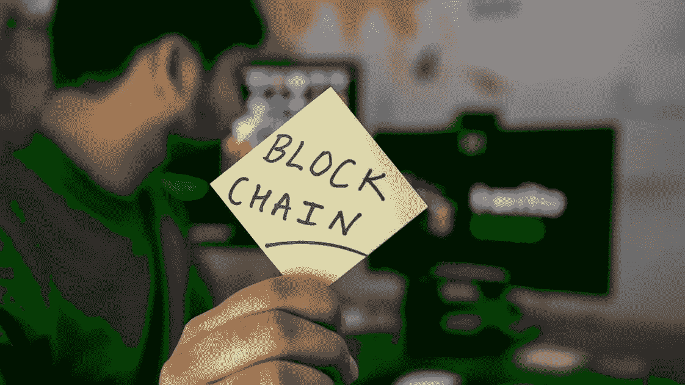

# 区块链顾问在新项目中寻找的 4 样东西

> 原文：<https://medium.com/hackernoon/4-things-blockchain-advisors-look-for-in-new-projects-3d701f2a99f9>

> 由[阿里·阿亚什](https://www.quora.com/profile/Ali-Ayyash)，区块链顾问(2018 年至今)。[原载](http://qr.ae/TUpNyY)于 [Quora](http://quora.com/?ref=hackernoon) 。

自从我开始为区块链驱动的公司提供咨询服务以来，我学到了一件事:项目的前景取决于推动项目的团队。

为了证明一个区块链项目的成功，它背后的团队必须有灵感，聪明，并且出于正确的原因对区块链感兴趣。

如果一家公司的创始人似乎对区块链的技术潜力不感兴趣，或者他们似乎只对它的短期经济潜力感兴趣，那么这家公司不会存在很久。

不，我建议的团队必须具备某些特征和特质，证明有可能取得真正的成功。

> 这里有四个最重要的。

# **1。一个团队必须充满激情、才华横溢、积极进取。**

在评估区块链项目时，我首先寻找的是推动项目的团队的坚韧和激情。

更具体地说，我寻找的是 hustle——一个相信自己的想法价值十亿美元，并会尽最大努力将梦想变为现实的积极进取的团队。

如果一个团队看起来没有做好努力的准备，如果创始人没有适当的激情，无论他们在做什么项目都不会成功。

相反，一个团队必须具备向投资者推销、在活动中发言、大规模营销其产品所需的热情和坚韧。他们一定渴望磨砺。

# **2。一个团队必须很好地理解他们正在做什么以及为什么。**

区块链空间仍然非常新。正因如此，大多数参与区块链公司的人——从创始人到投资者——都缺乏实际经验。

这意味着，在我签约为一个新项目提供建议之前，项目的创始人必须能够证明他们已经做了功课。换句话说，他们必须能够表明，他们明白在区块链创建一家公司需要什么，以及这项技术为何如此令人兴奋。

然而，鉴于最近代币销售的成功和比特币等加密货币的快速文化崛起，情况越来越不一样了。许多公开推介区块链项目的创始人对技术知之甚少。我避免这样的创始人，因为我不想给一个每一步都需要填鸭式培养的团队提供建议。我没时间做那个！

一个创始团队应该知道不同类型的区块链之间的区别。他们应该了解共识机制，以及他们已经仔细考虑过某些问题的证据。我们交易量低一点可以吗？我们需要一个更快的区块链吗？我们需要利害关系证明还是不同的实现？

他们不需要非常深入的知识，但创始团队必须了解基础设施。他们必须对空间中的工作原理有一个大致的了解。

# **3。一个团队必须有一个好的产品和在加密以外领域的专业知识。**

现在，和区块链特有的情报一样重要的是，区块链项目的创始团队拥有他们公司经营的任何领域的专业知识也很重要。区块链的理念和使命必定是公司的主要灵感来源。

举例来说，我目前为其提供咨询的一家公司叫做 teachur.co 的。他们开发教育技术，为用户提供高质量的教育内容，帮助他们掌握各种学科。创始人分别拥有博士和硕士学位。两人都从事教育事业，都是设计课程内容的专家。

我目前为另一家公司提供咨询，该公司名为[透明](https://lucidity.tech/)，是一种确保交易透明的数字广告协议。创始人对广告充满热情，并充分了解这个领域。他们也了解区块链。事实上，他们已经构建了自己的 plasma [代码](https://github.com/luciditytech/lucidity-plasma)实现，这满足了他们每秒处理更多事务的需求。但他们的主要灵感是改善他们认为广告业存在问题的低效率。

这同样适用于我正在参与的其他区块链项目 [IoTBlock](http://iotblock.io/) 和 [Style.me](http://style.me/) 。创始人对他们的特定领域有深入的了解，并应用区块链技术在该领域进行创新。在这些案例中，想法和需求是主要的灵感——区块链只是给了他们启动项目的能力。

# **4。一个团队必须是长期的，而不是短期的现金攫取。**

当然，寻找区块链项目顾问的主要挑战可能是找到那些不仅仅是为了短期赚钱的创始人。碰巧的是，大部分 ico 都是不需要的。

一个区块链项目要想成功，它必须寻求解决现实世界的问题。这意味着背后的团队必须主要受到解决问题的需要的激励。

这就是为什么我错过的项目比我接手的多的一个原因。很少有创始人能如此真诚地受到鼓舞，尤其是在区块链这个不断变化的新领域。

在一天结束时，因为想法或产品的创新性或者潜在的利润，签约为一个项目提供建议是很有诱惑力的。当然，许多顾问正是这样做的。有些机会很难错过。

但对潜在顾问来说，最终最重要的是想法或产品背后的团队。有灵感的团队造就成功的公司。

## 我在为一些激动人心的新区块链项目招人。联系我了解更多信息:

*   电子邮件:[ali.k.ayyash@gmail.com](mailto:ali.k.ayyash@gmail.com)
*   LinkedIn: @akayyash
*   推特:@akayyash

> 区块链顾问[阿里·阿亚什](https://www.quora.com/profile/Ali-Ayyash)(2018 年至今)。[原载](http://qr.ae/TUpNyY)于 [Quora](http://quora.com/?ref=hackernoon) 上。
> 
> 更多来自 Quora[的趋势科技答案，请访问](/@quoraofficial)[HackerNoon.com/quora](https://hackernoon.com/quora/home)。