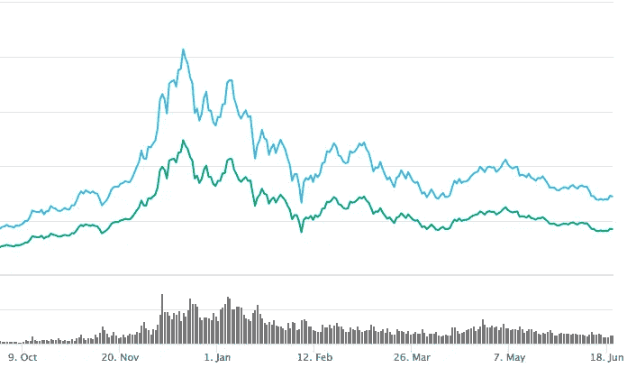
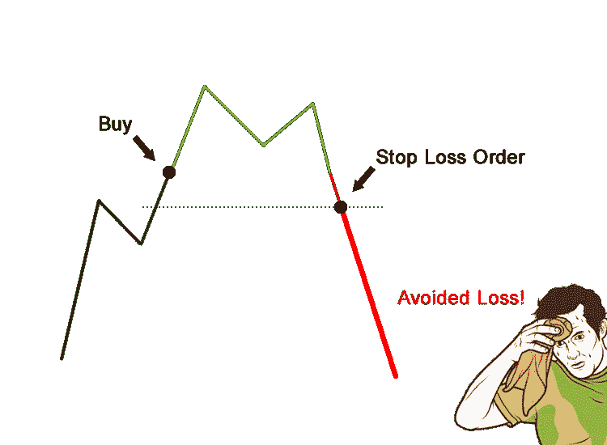
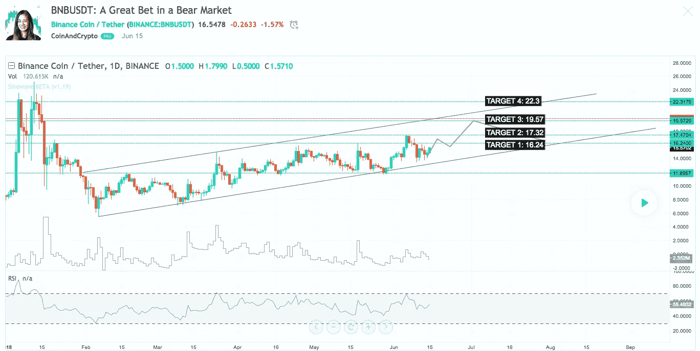

# 在熊市中生存的 4 个交易技巧

> 原文：<https://medium.com/hackernoon/4-trading-tips-for-surviving-in-a-bear-market-41a5139a630f>

在熊市中，你需要做的第一件事就是不要亏钱。

没错，如果你这样做，当事情发生转机，你错过了下一次登月集会时，你不会很开心。

Bitcoin and Total Market Cap since October 2017

在熊市中，你必须玩得更聪明。HODL 不工作。在熊市中，你必须是一个交易者。

从好的方面来看，通过在这里磨练你的技能——**你会做好准备**。**如果你能在事情下跌时赚钱，当事情好转时，你会赚 10 倍以上。**

这是你完善自己技能的机会，现在就赚，以后再赚更多。为了帮助你做到这一点，这里有一些重要的提示，让你的交易账户在情况好转时准备充分。

> 更新:在你继续阅读之前，有些事情你应该知道。我们开发了一个工具，让交易者在止损的同时获利。如果那是你的事情，检查它！
> 
> 👉[https://signalgroups.com](https://telegram.coinandcrypto.com/trading)

# 提示 1:止损(SL)

*如果我不提止损，这算什么熊市生存指南？*

你可能已经知道，止损是你在特定支撑位附近下的卖单。这里的想法是，如果价格触及这个点，它可能会下跌，因为它已经突破了支撑。

它们也是你减轻交易风险的主要方法。如果你的止损设置在进场线以下 9%，这意味着如果情况变糟，价格开始下跌，你的资本损失被限制在 9%。不太好，但比在价格持续下跌时被套牢要好得多。

在牛市中，你可能只是持有，最终价格会回来。但不是在这里。在熊市中，如果你不设置止损，你的资本就会被套牢。到那时，你就不再是交易者了，因为你无能为力。

一个很棒的止损技巧是设置一个[跟踪止损点](http://www.investinganswers.com/financial-dictionary/stock-market/trailing-stop-1183)。这样，如果价格上涨，你的止损也跟着上涨。如果由于某种原因你错过了你的目标，它至少会在你的入口附近执行。经常锁定利润，消除交易中的所有风险。

# 技巧 2:获利了结

也被称为目标，止盈是退出交易的好方法。

目标的存在是为了帮助我们保持头脑清醒。当价格上涨时，人们很容易不断地说“当价格达到 x 时，我就卖出。当价格达到 Y 时，我就卖出！一碰到 Z！！!"。最终，价格会停止上涨，你会错过你的出场机会，贪婪会战胜 T2。

这里的诀窍是把你的目标放在重要阻力点的**下方。这样你就能成功退出市场，带着你的利润继续下一次交易。**

另一个关键是设置**多个目标**。这可以让你在降低风险的同时仍然赢得大奖。当硬币开始转动时，你想达到你的目标——锁定越来越高的回报。

类似于止损，你也可以使用机器人来设置跟踪获利。这让你可以在价格上涨时推迟卖出，只有在形势好转时才扣动扳机。

[Coin and Crypto targets for BNB/USDT](https://www.tradingview.com/chart/BNBUSDT/IUx5zRBu-BNBUSDT-A-Great-Bet-in-a-Bear-Market/)

# 提示 3:将你的 SL 和 TP 设置在正确的位置

如果你在错误的价格上设置了止损和目标，上面的建议是没有用的。

这就是技术分析和所有令人兴奋的东西发挥作用的地方。阅读图表、检查音量、使用算法等等。

在一天结束时，它真的归结为仅仅[发现趋势](https://www.tradeciety.com/how-to-know-direction-of-the-trend/)。作为一个交易者，你总是想跟着趋势走。在熊市中，趋势是向右下方。因此，除非你在做空，否则由你来决定是否注意到看涨的情况。在它开始走神的时候进场，在它恢复主要趋势之前套现。

这可能发生在任何时间，任何硬币。一些好消息或市场情绪的变化会推动硬币的运行，并引起一些价格波动。一个熟练的分析师可以立即发现这些变化，知道有些事情已经发生了变化。

然后就是简单的**应用过去运行良好的模式**和**计算在哪里退出**。

这里要记住的关键是 **TA 不是水晶球。我们无法预测未来，市场也总是无法预测。相反，强有力的助教会帮助你根据你所掌握的信息做出最好的预测。**

我们是交易者，不是赌徒，技术分析才是关键。

# 秘诀 4:拥有一个社区

加密交易是一个战场。你不会一个人进入战区，那你为什么要自己交易呢？

要想在这个领域获胜，你肯定不想被打败。每当你按下“买进”时，别人就在按下“卖出”。每次你卖出，另一个人就会买入。**要么你做了一个错误的决定，要么他做了。**

交易另一方的家伙有一个分析师、机器人和最新消息的团队，*你最好带上你的顶级游戏*。或者运气好——真正的交易者不依靠运气。

公平竞争的方法是**拥有一个强大的社区**。这意味着有一个知道自己在做什么的导师。有可以依靠的同伴。甚至，与直觉相反，让没有你经验的人也加入进来。你会惊讶地发现，给别人提建议会让你犯多大的错误。

一个好的社区会**穿过噪音**只提供你需要知道的要点。他们将在技术分析方面拥有**深厚的领域专业知识**，并将足够大胆地**做出预测**(永远不要相信那些想“教”却不把钱花在嘴上的人)。

Platforms for forming cryptocurrency communities

# 额外提示:同时设置你的 SL 和 TP

知道你什么时候想卖出是很好的，但是如果你的闹钟在凌晨 4 点响起，而你没有醒来去改变你的订单，这可能是徒劳的。

大多数交易所要么让你设置止盈，要么让你设置止损，但**不会同时**。幸运的是，有一些工具可以提供这种功能。在这方面，一个新的但可靠的选择是 [**信号**](https://signalgroups.com/) 。用[投资组合](https://blockfolio.com/)设置警报可以在短期内奏效，任何想要认真对待交易的人都应该考虑使用**合适的工具。**

# 结论

如果你做了这些事情，你可以提高你的技能，同时也可以最大限度地减少你的损失，锁定收益。

1.  使用止损来限制你的风险。
2.  用获利了结来控制你的贪婪。
3.  利用技术分析，聪明地进场和出场。
4.  通过建立一个社区来增加你的机会。

我希望你喜欢这篇文章。如果你知道有人有足够的勇气在这个市场交易，那就把它送给他们。如果你想对你的 SL 和 TP 积分更有信心，请加入我们的[免费电报频道](http://telegram.coinandcrypto.com/medium2)。即使在这个艰难的熊市中，我们也获得了两位数的回报。

## 我们现在有电报信号组了！

我们发布**简单有效的交易信号**。所以你可以花更少的时间做技术分析，花更多的时间**得到结果。**
👉[https://t.me/coinandcrypto](http://telegram.coinandcrypto.com/medium2)

*如果你觉得这篇文章有用或者有趣，请* ***点击那个拍手按钮*** *👏还有* ***随时分享给你的朋友同事*** *。
——writers@coinandcrypto.com*