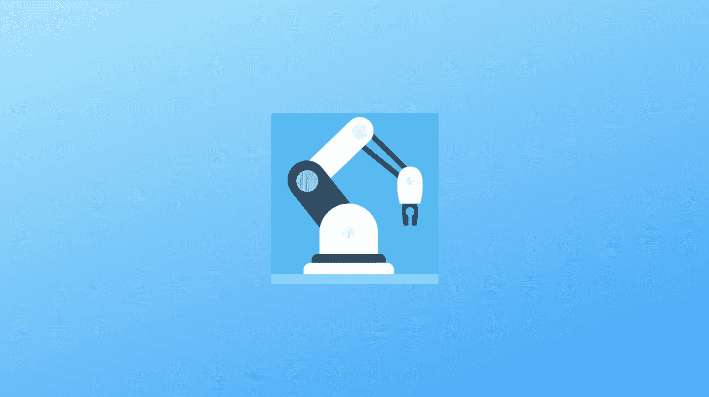
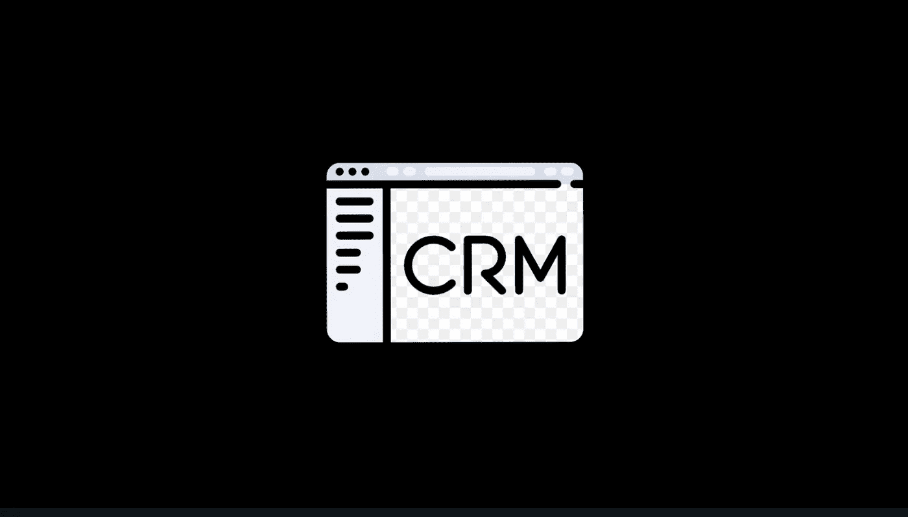

# 合格营销自动化工具的 4 个重要特征

> 原文：<https://medium.com/hackernoon/4-valuable-traits-of-a-qualified-marketing-automation-tool-4735007070d9>

## 人工智能和自动化不再是“时髦词汇”

Made using **Canva**

人工智能和自动化不再是“时髦词汇”，至少在营销领域不是。

无数的智能自动化应用程序是专门为营销人员设计的，以提高他们的营销成功率。

事实证明，营销自动化通过理清角色和职责，给组织带来了清晰性。

多余的营销流程(如社交媒体帖子和营销投标)可以实现自动化，以便团队将更多精力放在创新和业务成功上。

为了帮助你做到这一点，这里有一个清单，在你投资下一分之前，你可以在营销自动化工具中寻找一些东西。

1.  **自动化电子邮件的能力**

通过获取必要的数据，根据用户的行为对他们进行细分，从而更好地了解用户。

之后，利用电子邮件自动化的能力，向你的目标受众发送**上下文信息**。

一个自动化工具以及 **A/B 测试**非常棒，因为它可以让你试验你的细分。这两者共同带来了跟踪转换率和用户/客户档案的能力。

**2。CRM 集成**

寻找一个包含内容创建，内容优化，电子邮件营销，社交互动平台的工具。

重要的是，一个分析仪表板可以立即了解您的出站和入站营销工作的状态。

像 [HubSpot](https://medium.com/u/8732e73183e5?source=post_page-----4735007070d9--------------------------------) 和 [Salesforce](https://medium.com/u/f4fb2a348280?source=post_page-----4735007070d9--------------------------------) 这样的集成为工具增加了巨大的价值。

**3。活动自动化**

如果你的用户**在社交媒体或网络上的任何地方再次**使用你的品牌，用相关的广告和内容重新定位他们。

不管他们使用的是什么平台或设备，都要为他们提供及时的和高度个性化的内容。

根据用户在转化漏斗中的级别，为用户的每个内容做**定制预算**。寻找一个能让你完全控制广告支出的平台。

**4。来电分析**

通过了解**语音互动的质量，分析并优化您的销售线索通话体验。**

利用关键字呼叫跟踪、电话调查、通话评分、对话分析、呼叫者资料数据、反向查找等。

充分利用关键字呼叫跟踪器，这是了解你的服务对用户是否可行的最有效的方法。

> 在下一篇博客中会有更多关于自动化和人工智能的内容。