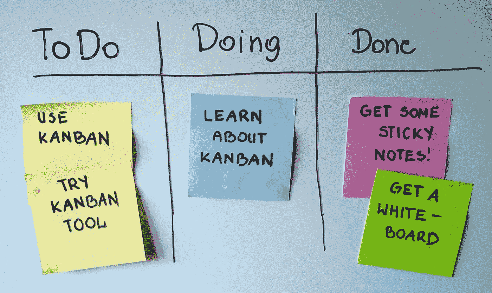

# 42 种改进回顾的方法

> 原文：<https://medium.com/hackernoon/42-ways-to-improve-retrospectives-e3067886c7f5>

Retrospectives are important because you want to improve

> **TL；DR；这里我整理了一份可能的回顾改进列表。我希望你能在评论中分享你的经历。好的。这个列表比 42 稍大一点。享受这 57 个回顾性改进。**

一个[回顾](https://hackernoon.com/tagged/retrospective)是一个在你的团队中改进过程的会议。这应该发生在任何团队中，而不仅仅是使用 Scrum 的[软件开发](https://hackernoon.com/tagged/software-development)团队。拥抱它！

Here are things you and your team could use to improve retrospectives:
1\. Prepare and plan well (data, place, team)
2\. Get the correct people in. It is beneficial if everybody in the team attends it, but it may not always happen.
3\. Start the conversation by reviewing the actions from the previous retrospectives
4\. Get the unbiased input by asking people prepare their data or evidence
5\. Timebox every section of a retrospective meeting.
6\. Don’t use anonymous item creation. Every item should have an owner.
7\. Split into positive and negative items.
8\. **Make a retro-battle** — ask people to take randomly a particular side and fight for it… It is fun, I promise you!
9\. Group related items on the board to have fewer items to talk about. If you can make 1 it is amazing!
10\. Ask the owner of every issue to highlight what happened, but not how to fix it or why it happened.
11\. Vote on the items in real time. Everybody has a restricted amount of voting.
12\. Sort item by votes. Imaging your meeting get suddenly stopped and you should be able to get out of it anyways.
13\. Select items to discuss in more detail and let the owner(s) drive the conversation.
14\. **Be blameless.**
15\. Propose actions for every important item.
16\. Every voted item must have an action, even if it is a positive one. An action can be a short blog post or something else to increase team visibility.
17\. If there are many actions you could vote to decide which one to tackle.
18\. Select an accountable person for each action. Let him drive the execution.
19\. Use issue trackers like Jira, Trello, Asana to track the progress of all actions.
20\. Add actions to the sprint or Kanban backlog otherwise you may not do them. Make them part of your routine work.
21\. Set the deadlines for actions.
22\. Create a **actions summary that you will review during the next retrospectives**, so you have what to do in point 3.
23\. Actions from the retrospectives need estimates, planning, cooperation as other stories.
24\. **Change the retrospectives facilitator**. Time to time or every time to increase team cooperation.
25\. Use high-quality equipment if you have remote team members.
26\. Use asynchronous retrospectives if you have a distributed team without a time overlap.
27\. Record video from your retro for future references or for people who could not make it.
28\. Do them timely. It is a good cadence to do them every sprint, but many teams do them monthly.
29\. Do them more often if your team is new. If your team is morphing often or many people join every few months. It makes sense to have a short retro before the sprint to review a few previous retrospectives. It will help new team members to ramp up faster.
30\. Create next retrospectives artefacts after you finish the current one. It will help people to note the input down and they don’t forget it. Please don’t postpone noting down impediments till the meeting itself.
31. **Invite random people** from your organization. The experts who you believe can improve processes. Like experts in Design Sprints.
32\. Attend retros of others to gain knowledge how they do them.
33\. Count the cost of it. Many people are in, so you can do simple math. It can be more effective to volunteer this time :)
34\. As any other meeting, don’t hesitate to finish it earlier if you can.
35\. If some things need a discussion with a subset of the team, take it offline and do it afterwards.
36\. **Make a retrospectives burn-down chart** which compares progress over the last few meetings. 5 to begin with.
37\. Measure happiness factor and watch it over time.
38\. Use feedback cycle to improve the effectiveness of retrospectives.
39\. Make it optional and see who comes, find out why people didn’t attend.
40\. **Celebrate failure every month**. And give away prices for sharing the biggest failures and lessons learnt.
41\. Introduce Ironman trophies. For example, for solving the most customer impactful story, improving a process etc.
42\. Once in a while do retrospective for retrospective meetings (can be a smaller team and less often).
43\. Set focus for your actions.
44\. **Introduce a black secret box** (the real is better, online is possible). If they don’t want to share it during the meeting their can provide feedback about retrospectives and past iterations. What if they don’t care enough?
45\. **Go outside to a park** or other office (make something like an offside).
46\. Make walking retrospectives if your team is small enough. Many people think better on the feet.
47\. **Bring some nice food** and make a celebration out of retrospectives. I am sure you will find what to celebrate. RIP bad mood.
48\. Use tools that facilitate collaboration. Something like Trello will do.
49\. Be obsessed about improving.
50\. **Shut up!** Yes, listen please!
51\. Take 3–5 minutes at the beginning of the retrospectives to do a **mindfulness practice**. It will increase concentration and leave other things behind the doors.
52\. Don’t let anybody into the room after the meeting has started. Finish on time as well.
53\. **Think how can you improve 10X at least**.
54\. Blog about retrospectives, actions and achievements to increase team and organisational transparency.
55\. Create a team play for effective retrospectives and share it with other teams.
56\. Introduce a “Retro-prize” in your company for the most actionable teams in relation to retrospectives.
57\. See it as opportunity to improve and not to complain or blame.

**根据您的需求混合并调整**以上所有要点。这里只有食材，你是主厨！

由[将工作向前推进](https://www.moveworkforward.com/)——[微软团队吉拉连接器](https://www.moveworkforward.com/product/microsoft-teams-jira-connector)开发者为您带来。

我确信我错过了很多东西，所以请在下面的评论中提出其他改进建议。