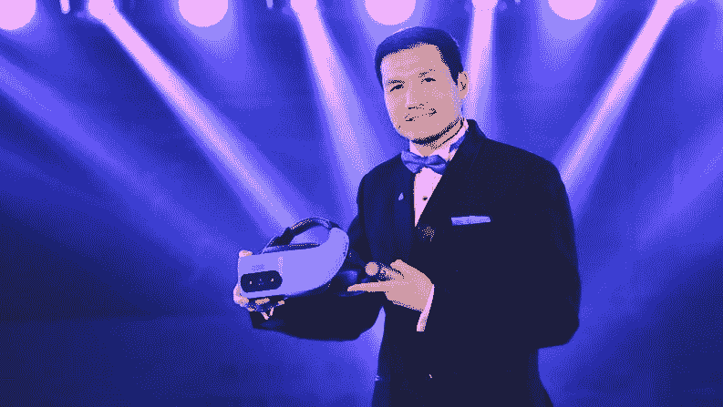
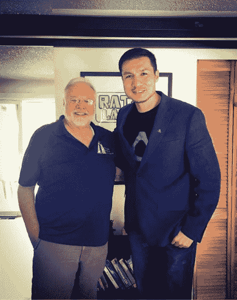
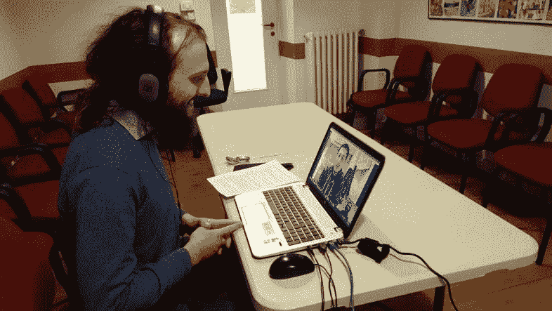
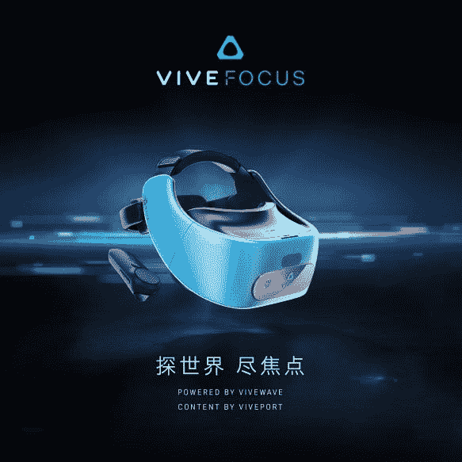
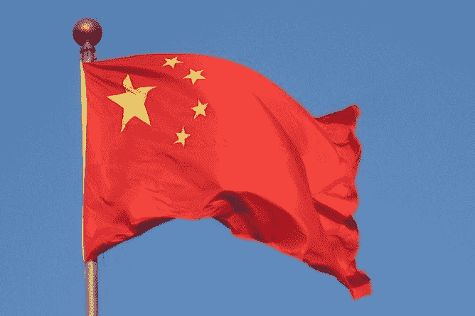
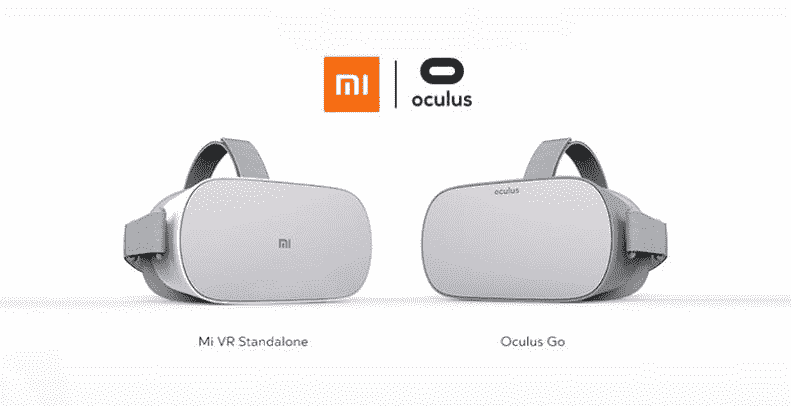

# 我从 Vive 中国总裁那里学到的 5 + 1 鼓舞人心的创业经验

> 原文：<https://medium.com/hackernoon/5-1-inspiring-entrepreneurial-lessons-that-i-learned-from-vive-china-president-bec8c999dbcb>

上周我发表了我整个博客生涯中最重要的文章之一:对 Vive 中国总裁 Alvin Wang Graylin 的采访。

**格雷林先生是我一直钦佩的人，因为他对虚拟现实的热情、善良的态度以及非凡的人生成就**:他能够成为一名非常重要的商界人士，尽管他出生在一个卑微的中国家庭。采访他并直接在 Skype 上与他交谈，我有了一个史诗般的机会**受到如此成功的人**的启发，并从他身上学到了很多。

所以，除了所有与虚拟现实相关的技术东西(我问他 Vive Focus 何时会来到欧洲，Vive Pro 的价格会是多少)，我学到了很多关于如何成为成功的个人和企业家的知识**，我想告诉你我学到的这些有趣的事情。**

# 1.找到你的人生使命

在采访的最后，他说了最重要的一句话:我问他什么是在生活中获得成功的正确态度，他回答说

> 我如此努力支持虚拟现实的原因是因为它是我真正相信的东西

在这句话里，有一切。你必须找到你真正相信的东西，你的人生使命，一旦你找到了，就为之努力。它应该成为你的目标，你早上醒来的原因，你应该**对它充满热情，甚至每天工作 20 小时都应该成为可能**(好吧，也许不是每天，但你有这个想法)。

Mr. Graylin with Mr. Furness, one of the fathers of VR. He tried VR in Furness’s lab and from that moment one, it has become his life goal (Image by Alvin Wang Graylin, taken from Huffington Post)

他在 90 年代尝试了虚拟现实，当时有对它的大肆宣传，但它没有机会在主流采用中获得成功。但他真的相信这项技术，他非常努力地工作，最后，他发现自己在一家让虚拟现实广泛传播的公司中担任了最高职位。一个可以改变世界的公司。这是一段漫长的旅程，在此期间，他开始了其他的生意，但他的远见卓识使他成功了。找到你的使命，勤奋努力，你会得到你想要的。

关于这次任务，他在结束采访时向我的所有听众提出了一个问题:

> 如果你生活在一个金钱和位置不再重要的世界，你可以拥有任何你想要的东西，去任何你想去的地方，你还会花时间做你今天正在做的事情吗？或者你会做别的事情吗？

这个问题很有启发性，让我进行了肯定的思考。时间非常宝贵，是我们无论如何都无法挽回的东西。**你是在做你真正相信的事情吗？**你是在完成任务后度过的吗？还是你只是遵循实用的东西？

好吧，我知道这些陈述并不总是适用的…也许你有孩子，有房租要付，等等…但是如果你仍然有选择的余地，你是在追随你的激情吗？你是在努力创造你梦想的生活，或者改变世界吗？(“让世界变得更美好”，正如所有创业者所说？)

# 2.友善并微笑

格雷林先生没有用他直接对我说的话来给我上第二课，而是用**在采访**期间以及我们接触社交媒体前后表现出的态度。

在我们的谈话中，我向他提出了许多关于 HTC Vive 产品的问题，他不被允许回答(例如，Vive 2 将如何？)，但是他从来没有生气过，他从来没有用不好的方式回答过我。在整个面试过程中，他反而非常友好，只是指出了他不被允许回答的问题。

当采访开始谈论更舒适的话题(创业、中国等…)时，我记得**看到他经常微笑**。当时是北京时间下午 5 点，所以我想他已经工作了很长时间。他正和一个随意的意大利人聊天，这个人问了他一些不舒服的问题，但他仍然笑得很开心。这太棒了，而且**也让我感觉好多了**:这次采访**对我来说就像和一个朋友聊天**，尽管事实上他是总统先生，而我是无名小卒。

Me interviewing Mr. Graylin over Skype. It has been a great talk for me, I came out from it very inspired

即使我不是顶级的虚拟现实博客作者(我的意思是，我不是上传)，他也同意接受这个采访，只是因为我邀请了他。之前他也是把自己宝贵的时间，投入到阅读我与 Vive 产品相关的文章，给我反馈。他这样做当然是因为第一点的激情，但还有更多:**一种开放的态度，一种对所有事情和所有人都非常积极的态度**。他是一个给人们带来价值的人，这就是他达到那个位置的原因。

在这一点上我还有很多工作要做。

# 3.初创公司必须解决一个真正的问题

我问他成功的虚拟现实创业公司最重要的特质是什么，他用这条黄金法则来问我

> 你必须解决一个真正的问题，人们会为解决这个问题付费。你有资格解决它

所以，如果你是一个企业家，追随他/她的激情，并且你有一种为人们创造价值的态度，这很好。但是，如果你的公司不是建立在一个真正的问题上，一个人们将要为之付费的问题上，它注定会失败。

因此，在将一生投资于一个项目之前，**问问你的目标市场，他们是否对你要打造的产品感兴趣**。以及他们愿意花多少钱来解决这个问题。如果这个调查给出了肯定的结果，那么继续你的项目。否则，停下来，否则你将很难把你的一生都投入到一个从第一天起就注定要失败的项目中。

**小心恭维，它们非常危险**:虚拟现实爱好者和其他企业家对我的 [Immotionar](http://immotionar.com/) 初创公司赞不绝口。有时候我觉得自己像个摇滚明星。但是**赞美不是货币**，随着时间的推移，我们发现人们对购买我们的产品不感兴趣，最后[我们关闭了](https://skarredghost.com/2017/04/26/immotionar-post-mortem-what-errors-we-made-in-our-vr-startup-and-how-to-avoid-them-for-yours/)。

**“创业都是为了钱”**是我爱说的一句话。所以，追随你的激情，但是要找到一种方法，通过给别人真正的价值来赚钱。

# 4.运送运行良好的产品

我问他的第一个问题是，为什么 Vive Focus 配备了一个 3 自由度控制器，而我们都在等待两个 6 自由度控制器。这使得 Vive Focus 对我们这些虚拟现实爱好者来说感觉不完整，因为没有给你真正置身于 VR 中的感觉，因为你没有两只手在虚拟世界中移动。

The Vive Focus device (Image from VR Scout)

他回答我说，当**设计一个产品的时候，有很多事情要记住**，比如价格、可用性、稳定性、用户的需求等等……考虑所有这些事情意味着**做出妥协。**

他知道用两个 6 自由度控制器对焦会更好，但是**他们** **没有设法用这样的控制器做出稳定且易于使用的解决方案，所以他们没有实现**。这是一个艰难的选择，但却是必要的:最好是发布一些功能很少但运行良好的东西，而不是那些有无数功能但没有一个以令人满意的方式实现的东西。

当构建你的 MVP 或最终产品时，关注最重要的事情，以及如何以一种完美的方式实现它们。不要仅仅为了提升你的营销或者因为你的客户需要而添加有缺陷的功能。如果它们不起作用，人们只会抱怨，会发现你的产品无法使用。他们开始会很兴奋，但后来会失望。**如此少的特色，却是史诗般的特色。**

# 5.中国是一个困难的市场

China!

每天我们都会读到关于**中国市场如何巨大而丰富**以及中国如何在某些技术领域成为全球领导者的文章。所以，世界上所有的公司都想进入这个金矿。

但问题是这个市场远非易事:格雷林先生告诉我中国市场是一个竞争非常激烈的市场，西方公司很容易输给中国本土公司(例如易贝输给了淘宝和阿里巴巴)。

在中国取得成功的**关键因素**是:

*   **本地诀窍:**你必须知道中国市场是如何运作的；
*   执行速度:由于竞争激烈，你必须快速改进产品，才能领先于其他公司。这是 VR 在中国如此受欢迎的原因之一:所有公司都希望实现它，以提供比竞争对手更多的东西；
*   耐心了解市场:不要一开始就急于求成，不要认为既然你是一家成功的西方公司，你也会在中国做出伟大的事情。花时间去了解市场，以及如何让你的产品和策略适应红龙国；
*   寻求当地的支持:如果有政府的人支持你会更好。否则，找一家成熟的中国公司成为你的合作伙伴。想想 Oculus，由于与小米的合作，Oculus Go 正在中国销售。一个中国伙伴会大大增加你成功的机会。

Oculus partnered with Xiaomi to enter the Chinese market (Image by Oculus)

# +1.你的梦想可能会实现

这是我通过这次采访间接了解到的一些情况。我向格雷林先生提出面试，但是我认为我没有机会得到……他是一个非常重要的人物。我不敢相信他接受了，直到他开始用 Skype 给我打电话。他打电话来晚了，我一直在想，直到那一刻才会发生。但是后来一切都是真实的。

这篇关于采访的文章获得了不错的浏览量，但是，最重要的是，**被引用在** [**一篇被 Road To VR**](https://www.roadtovr.com/htc-vive-pro-targeted-prosumers-will-expensive-consumer-vive/) 的文章中。虚拟现实之路是两个最重要的虚拟现实相关网站之一(另一个是上传虚拟现实)，自从我开始使用这项神奇的技术(三年前)以来，我几乎每天都在这个网站上获得信息，**梦想着有一天在它的一篇文章中看到我的名字**。我总是失败，我认为这是不可能的。但在周三，**我的这个小梦想实现了**:在一篇谈论我做过的一些伟大事情的文章中出现了我的名字(采访格雷林先生)。我为此超级高兴，这太令人惊讶了。

我的激情是虚拟现实，每天我都为之努力。我尝试做很多事情，但大多数时候，我都失败了。但有时意想不到的事情发生了，奖励也很高。

**超越自己的极限，用勤奋做好日常工作，但也要尝试那些能让你更接近梦想的事情，哪怕你认为它们是不可能的**。95%的时候你会失败，但你不必放弃。继续战斗，因为那 5%的回报是很甜蜜的。并能改变你的生活。

还有 [**这次采访**](https://skarredghost.com/2018/01/29/alvin-wang-graylin-talks-vive-focus-vive-pro-china-vr-market/) **改变了我的生活**:我受到了一个伟大人物的鼓舞，我成功地让更多人看到了我的努力。但是现在，我没有安定下来:我想走得更远…

# 与我联系

如果你喜欢这篇文章，请为它鼓掌…但是，最重要的是，**跟我来，对我每天的辛勤工作表示感谢**:

*博客*:[http://skarredghost.com](http://skarredghost.com)(订阅我的时事通讯！)
*推特*:[https://twitter.com/SkarredGhost](https://twitter.com/SkarredGhost)
*领英*:[https://www.linkedin.com/in/antony-vitillo-vr/](https://www.linkedin.com/in/antony-vitillo-vr/)

*咨询公司*:【http://ntwalkers.it/en/】T2(如果您需要一些 AR/VR 或 web 项目，请联系我们！)

**我也会尽全力支持你的**。祝你愉快！