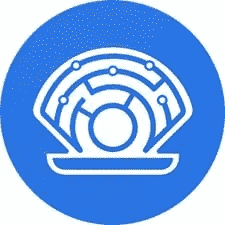
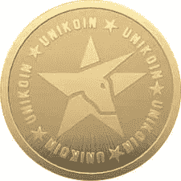
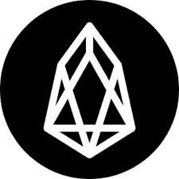
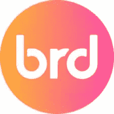
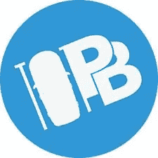

# 2018 年 4 月 1 日一周的 5 枚备用硬币

> 原文：<https://medium.com/hackernoon/5-altcoins-for-the-week-of-april-1st-2018-38e21fbc170f>

## 本周有 5 个有重大事件的 alt coin:[PRL](https://coinmarketcap.com/currencies/oyster/)、 [UKG](https://coinmarketcap.com/currencies/unikoin-gold/) 、 [EOS](https://coinmarketcap.com/currencies/eos/) 、 [PKB](https://coinmarketcap.com/currencies/parkbyte/) 、 [BRD](https://coinmarketcap.com/currencies/bread/) 。

# PRL — OYSTER 协议(SHL AIRDROP，交换支持)

SHL 空投到 PRL 持有者终于一个星期了！在 2018 年 4 月 6 日，每个 PRL 持有人将收到 1:1 比例的 SHL，以换取其持有的每个 PRL 加密。上周没有交易所宣布支持空投。然而，本周，交易所 PRL 主要是对空投表示支持。现在，钱包中或主要 PRL 交易所中的 PRL 持有者可以很容易地获得 SHL 令牌。

PRL 计划彻底改变网络主持人的收入方式。而不是广告收入构成了网络主机的大部分收入；PRL 打算取代广告收入。网络主机将很快能够在他们的网站上输入一行代码，允许没有广告，但仍然根据总浏览量/访客数提供收入。这是怎么完成的？嗯，网站的访问者并没有意识到，但是他们很少的空闲计算能力被用来确认 PRL 网络上的交易，以 PRL 令牌奖励网站主机。

从移除广告客户获得的收入金额预计将超过从运行广告获得的金额。PRL 是一个很好的加密工具，不需要空投 SHL，但是 SHL 以空投的形式增加了任何全新程度的价值。SHL 打算让互联网去中心化，如果它接近它的野心，它的价值将会成倍增长。

当空投接近时，底层加密通常会增加，直到交换支持被宣布或拒绝。如果一个主要的交易所支持空投，那么在空投日之前，潜在的密码的价值往往会增加。如果交易所拒绝支持空投，加密通常会显著收回，因为个人必须决定将加密转移到基于桌面/应用程序的钱包或以当前价格出售。PRL 收到支持他们的 SHL 令牌空投在主要交易所进行交易。

本周对 PRL 来说应该是非常积极的一周。空投之后，PRL 的价格应该会有一个明显的调整，因为许多人目前持有 SHL 令牌。

# UKG — UNIKOIN GOLD(电子竞技现场博彩、观众博彩)

Unikoin Gold (UKG)是一种 ERC-20 令牌，已纳入 Unikrn 平台。Unikrn 平台专门从事电子竞技锦标赛和比赛的特许合法博彩。UKG 为电子竞技的团队、玩家和参与者提供了一个奖励和激励结构。Unikrn 项目的最大支持者之一是臭名昭著的马克·库班，亿万富翁、投资者、达拉斯小牛队老板和电视名人。随着马克·库班等投资者和即将到来的重要一周，UKG 应该会在短期内看到一个强劲的反弹。

如果没有电子竞技直播和观众投注平台，UKG 是毫无用处的。嗯，这些平台据称将于 2018 年 4 月 6 日在本周上线。如果 UKG 能在截止日期前完成交易，UKG 的价格将会做出相应的积极反应。同样，如果 UKG 错过了这个最后期限，无论马克·库班有多重要，公众都会失去信心。UKG“应该”是什么，他们路线图的主要方面，以及平台的主干应该在不到一周的时间内上线。吸引观众和电子竞技博彩的能力赋予了 UKG 效用。在加密领域，实用程序比其他任何东西都更有价值。

如果 UKG 能够在本周实施旁观者和电子竞技直播博彩，UKG 应该会看到对硬币的情绪和 UKG 的潜在价值的良好提振。

# EOS — EOS(曙光 3.0 版)

EOS 是一种类似于[以太坊](http://bitcoinist.com/ethereum-bitcoin-price-gain-2018-survey/) (ETH)的[加密货币](https://hackernoon.com/tagged/cryptocurrency)，但擅长 ETH 失败的领域。EOS 专攻可伸缩性，这是 ETH 深受其害的领域。然而，ETH 已经获得了最重要的东西:市场渗透。过去一年绝大多数 ico 都是基于 ERC 20 平台的 ETH。这一数量导致了 ETH 的许多扩展问题，而这正是 EOS 的优势所在。

对于那些技术不先进的人来说，理解 Dawn 3.0 是什么是相当困难的。总而言之，Dawn 3.0 终于足够稳定，可以作为 Alpha 版本发布，并将很快成为 EOS 的 GitHub 主分支。只要 ICOs 继续推出，EOS 的这一重大发展将确保其在未来的相关性。

EOS 即将得到全面实施和运作。一旦他们的路线图中的这些基准得到满足，与其他专注于 ico 的 cryptos 相比，EOS 将具有固有的优势。许多密码爱好者期望 EOS 是唯一能够处理全面商业分散应用的平台。一旦实现了这一点，开发者和投资者就会因为 EOS 平台相对于其他 ICO 平台的优势而蜂拥而至。黎明 3.0 是能够理解这些进步真正包括什么的开始。

# BREAD 面包(IOS 和 ANDROID 更新)

BRD 代币在 ICO 期间出售，为面包应用程序(iOS 和 Android 的一个伟大的移动钱包)筹集资金。这似乎很奇怪，但目前，面包应用程序只能购买、出售和转移[比特币](https://hackernoon.com/tagged/bitcoin) (BTC)。面包应用程序目前不具备持有 BRD 令牌的能力。随着 2018 年 4 月 7 日成为目标日期，这种情况在短期内将明显改变。根据 BRD 的计划是更新 iOS 和 Android 应用程序，以支持 ETH、ERC-20 令牌和比特币现金(BCC)。BRD 目前没有任何效用，甚至不能放在面包应用程序中。

本周应该是面包应用程序不能持有 BRD 代币的最后一周。通过将 BRD、联邦理工学院、ERC-20 代币、BTC 和密件抄送都集成到一个移动钱包中，许多人可能会开始使用面包来获得其压倒性的好处。一旦 BRD 可以在面包应用程序上持有，该计划将允许 BRD 用于“解锁”应用程序内的特殊功能。例如，如果一个钱包用户有 10，000 BRD，他们可能能够以 1%的费用购买 BTC，而不是超过 4%的行业标准。你钱包里的 BRD 越多，用户获得的利益就越多。

BRD 的令牌即将被赋予重要的效用，它能够在面包应用程序中为持有者提供特殊的好处。这个系统创造了一个环境，BRD 的持有者不出售，而是继续购买，因为他们将根据持有的数量获得利益。通过减少公开市场上的供应，同时增加 BRD 的效用，价格应该相应增加。

# PKB——park byte 退市(BITTREX，简称)

在加密领域，并非所有的新闻都是“好”的。PKB 将于 2018 年 4 月 6 日从 Bittrex 退市。PKB 无法在 7 天时间内提供 Bittrex 要求的所有文件。对 PKB 持有者来说不幸的是，这导致他们被 Bittrex 摘牌。MTL 等其他加密公司在退市后有所反弹，但 PKB 似乎可能会落入多数类别，并逐渐被遗忘，除非他们能够很快创造积极的情绪。从 Bittrex 退市通常是“棺材上的钉子”,除非重大变革、公共宣传和强大的团队仍然存在。

PKB 有一个强大的团队，但市值不到 50 万美元，在 Bittrex 退市后，他们似乎不太可能重振他们的项目。然而，如果他们能够在 Bittrex 上购买这种市值非常小的加密技术，其价值将会飙升。在这份名单上的硬币中，这是唯一一种有理由被认为会继续被遗忘的。没有真正的能力来做空这个密码，这将是一个建议，但如果你觉得有风险，做公众所做的相反！这是密码，任何事情都可能发生。

如果 PKB 能够让自己重新上市，或者提供改变市场情绪的项目更新，预计这个市值非常小的加密技术将大幅升值。鉴于目前有关退市的负面消息，持有这种股票风险很大，但它比这张清单上的任何一种股票都有更大的好处。

要阅读全文或查看扩展的市场分析，请查看这里:[http://bitcoinist . com/5-alt coins-major-events-week-April-1-2018-gains-likely-beat-bit coin-returns/](http://bitcoinist.com/5-altcoins-major-events-week-april-1-2018-gains-likely-beat-bitcoin-returns/)

***阅读国王之前的文章，了解他目前推荐哪些 ICO，或者直接与国王取得联系，可以在 Twitter (@JbtheCryptoKing)或者***[*Reddit*](https://redd.it/81hj5q)***(ICO 更新和每日报道)。***