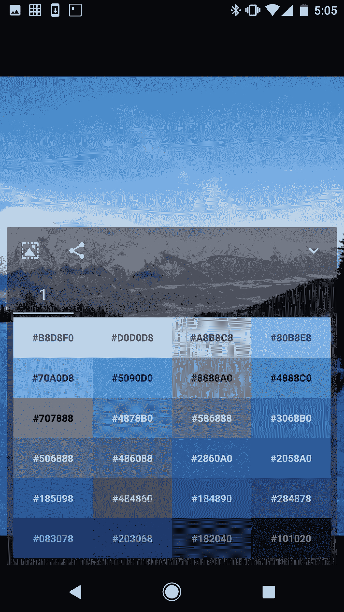

# 面向 Android 开发人员和设计人员的 5 款令人惊叹的 Android 应用

> 原文：<https://medium.com/hackernoon/5-amazing-android-apps-for-android-developers-designers-4678b8d231b4>

## 我的最爱列表


作为 Android 开发者，我们主要是为消费者开发应用，但我们不要忘记那些为其他开发者开发应用的了不起的开发者。

以下五款应用直接来自我 Pixel XL 上的“开发者”文件夹。它们不是那个文件夹中唯一的应用程序，但它们是我工作流程中不可或缺的。

## 泰尔穆克

啊，泰莫。我可以写一整篇文章来描述 Termux 有多棒。

哦，等等。我做到了。

[](https://hackernoon.com/how-termux-saved-my-ass-73db53b2dea1) [## Termux 是怎么救了我的

### 安卓摇滚的原因之一

hackernoon.com](https://hackernoon.com/how-termux-saved-my-ass-73db53b2dea1) 

Termux 是一个 Linux 终端仿真器，具有包管理器、主题化功能、浮动窗口小部件——所有的模块。它有一个巨大的软件包列表可供下载，而且非常简单

```
apt-get install { package-name }
```

我的用例？我使用 Termux 为我在 2013 年 Nexus 7 上的一个应用程序运行一个轻量级 node.js 推送通知服务器。这意味着我必须在 Termux 上安装 node.js、express 和各种 node_modules，这很简单。

昨天，我想安装一个 TypeScript 编译器，因为我想看看它输出的 JavaScript，作为一个学习练习。我一时有点沮丧

```
apt-get install tsc 
```

没有成功，直到我意识到通过 **npm** 安装 **typescript** 包成功了。


I’ll be damned, there’s actually an node package called awesome.

[*Termux 在玩商店*](https://play.google.com/store/apps/details?id=com.termux) *是免费的，虽然*[](https://play.google.com/store/apps/details?id=com.termux.styling)**[](https://play.google.com/store/apps/details?id=com.termux.window)**[*外挂*](https://play.google.com/store/apps/details?id=com.termux.widget) *是付费的。付钱给他，他应得的。*****

**[](https://www.buymeacoffee.com/XozUExS) [## 给安东尼斯·查加利斯买杯咖啡——BuyMeACoffee.com

### 我是一名 Android 开发人员和设计师，热爱漂亮的用户界面！

www.buymeacoffee.com](https://www.buymeacoffee.com/XozUExS) 

## 筛

所以你制作了你的应用程序，现在你想在 Play Store 中发布它。

你知道什么能让你的清单看起来很棒吗？将这些截图放入设备框架中！

Screener 可以让你下载一船的设备框架，并把你的截图放在里面。你甚至可以添加屏幕眩光(好的那种)和设备后面的阴影，以增加额外的时髦度。另外，生成的背景是基于截图本身着色的。全部免费。

为什么贴这个


Ugh, really?

你什么时候可以发布这个


Sex me now!

除非你是个没品味的恶心次人类？

难倒我了。

[*放映员在播放商店*](https://play.google.com/store/apps/details?id=de.toastcode.screener) *免费。*

## 材料提示

如果你要尊重材料设计准则，你将需要材料线索。

谷歌不需要材料线索。

但你知道。


“Respect the grid and the grid shall respect you” — Leviticus 5:12

Material Cue 会在屏幕上放置一组网格覆盖，以便您可以检查元素的位置。用于导航抽屉元素、FAB 定位等。这是非常宝贵的。

[*素材 Cue 在播放商店*](https://play.google.com/store/apps/details?id=com.actinarium.materialcue&hl=en) 免费

## 图形

Graphice 是由神奇的、无与伦比的开发者弗兰西斯科·佛朗哥开发的颜色提取工具。在短暂的法西斯独裁者生涯后(太快了？可能不会)，弗朗西斯科决定通过创建华丽的 Android 应用程序来救赎自己，Graphice 是一系列大热门中的最新一个。

自从调色板 API 引入以来，颜色提取应用程序在 Play Store 中已经很便宜了(甚至我也尝试过一个)，但是 Graphice 可能是最好的一个。是的，比我的还要好。该死的。

Graphice 做的一件事是我没有见过任何其他类似的应用程序做的，它允许你选择照片中你想从中提取调色板的区域。它还允许您指定要从每张照片中提取的颜色数量。



因此，如果你正在为你的下一个应用程序寻找性感的调色板，你知道去哪里。

不，*不在那里，*你这个变态。

[*Graphice 在 Play Store*](https://play.google.com/store/apps/details?id=com.franco.graphice&hl=en) *是免费的，只需非常合理的 2.49 美元 IAP 即可解锁一些高级功能。*

## 口袋模型

我知道，我知道。播客应用程序在这里做什么？

嗯，你可以用它订阅[碎片化](http://fragmentedpodcast.com/)和[安卓开发者后台](http://androidbackstage.blogspot.com.cy/)(亚行！那是聪明的，切特)，自然。

这些都是非常博学的人和非常博学的客人，你不能错过他们的节目。

额外推荐:在安卓秀的间隙，你会想听牛肉网络播客。相信我，你会的。但是不要告诉任何人第五块肉的事。


[*口袋施法*](https://play.google.com/store/apps/details?id=au.com.shiftyjelly.pocketcasts&hl=en) *在 Play Store 的售价非常合理 3.99 美元。*

## 不名誉提及:助手

哦，助手。你是如何伤了我的心。

我曾经很喜欢 AIDE，因为它是一种轻量级的、非常棒的移动编写 Android 应用程序的方式，尤其是在我刚开始的时候。

然后，他们决定把它膨胀到沼泽地里一具超过一周的尸体(是的，我曾经看了很多 CSI: Miami)，干他们所有的忠实用户(在屁股上，我想补充一下)，并添加一大堆教程和某种奇怪的订阅模式，完全出乎安·兰德的意料。


“Hello, would you like to be fucked in the ass?”

助手是 Play Store 里的任何东西，我在这里没有链接到它。去他妈的。**