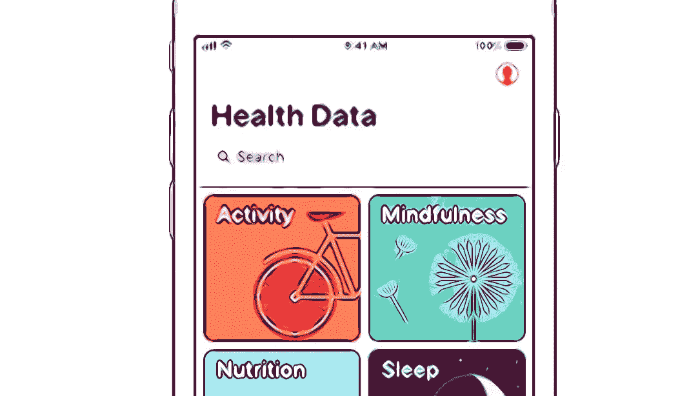

# 2018 年值得关注的 5 大应用盈利趋势

> 原文：<https://medium.com/hackernoon/5-app-monetization-trends-to-watch-in-2018-9b1674673681>

哪些趋势将塑造 2018 年的应用货币化？随着世界越来越适应移动，开发者将从比以往更多的收入中受益。然而，要做到这一点，他们必须平衡用户的需求与应用程序的盈利实践。

我们将关注影响 2018 年应用货币化方式的五大趋势。

# 对于依靠广告创收的开发者来说，应用体验将变得更加重要。

对于开发者来说，应用内广告仍然是一种流行的应用盈利方式。尽管它们在应用不当时有明显的缺点。

2018 年，应用广告将完全围绕[用户体验](https://www.tamoco.com/blog/mobile-app-design-ux-ui-engagement/)。开发者必须在广告的数量、广告出现的位置以及用户与广告的互动方式之间取得平衡。这将是应用盈利成功的关键。2018 年，应用程序所有者还必须考虑这些变化将如何影响他们的用户。过多的广告会对用户体验产生负面影响。但这并不意味着不可能在提供应用内广告的同时提供价值。

移动应用广告正在迅速成熟。确保你寻找的[网络](https://hackernoon.com/tagged/network)使用安全品牌，智能广告定位，并为互动广告提供支持。

当整合一个应用广告策略时，你可能会在整合的容易性和广告的垃圾性之间找到一个平衡点。在 2018 年，花时间专注于将用户体验放在第一位可能是值得的。

不要指望应用广告的收入会很快达到新的高度。如果有什么不同的话，那就是随着越来越多的应用采用应用内广告，应用广告收入将会下降。或许 2018 年可以用另一种方法来补充你的应用收入。

# 随着越来越多的用户习惯于应用程序在使用时免费，越来越多的应用程序将采用免费增值模式。

免费增值允许应用程序所有者增加会话长度并产生参与用户。这是一个将用户转化为健康收入的好地方。在积极的应用体验之后，应用用户更有可能选择加入高级功能。在此之前有机会培养和教育你的用户，对你的应用盈利战略有积极的影响。

尽量不要显得你在欺骗你的用户。明确你的 app 从一开始就是免费增值的 app。他们不想在游戏或应用程序上投入大量时间来意识到他们必须付费才能使用某些功能。

免费增值似乎会一直存在下去。用户发现在购买时不为应用程序付费是标准做法。正因为如此，开发商发现更难证明前期费用的合理性。免费增值应用货币化模式是吸引和培养应用货币化受众的绝佳机会。

# 如果用户不得不投入大量时间或金钱来解锁所有应用程序功能，他们将会变得不满意。

应用内购买作为应用货币化的一种方式仍在健康增长。由于将“服务”包括在采购中，这可能有点夸大(想想优步等)。

我们将在 2018 年看到的一个主要趋势是，应用开发者将需要更加关注[参与度](https://www.tamoco.com/blog/app-engagement-and-retention-guide)，而不仅仅是增加应用的货币化。

一旦用户购买了应用内的内容，他们就更有可能回来并在应用上花更多的时间。这转化为更好的参与和保留，并进而更好的货币化。

没有哪个类别比游戏类别从应用内购买中获益更多。在这里，开发者通过将参与放在第一位而受益。现在，用户可以选择付费来更快地进入游戏，或者使用各种功能。

开发者需要确保他们得到了正确的平衡。应用内购买之所以有效，是因为少数用户花了很多钱。总会有用户只想免费玩你的游戏。诚然，这些用户不会产生收入，但他们对你的应用程序的存在仍然很重要。

虽然不是一个移动应用程序，开发者仍然可以在新的前线游戏中从 EA 的失败中学到很多。用户很快注意到，要解锁某些功能，他们必须玩 1000 个小时。或者，他们可以付费解锁。这似乎相当不公平，尤其是当他们已经预先购买了游戏。

为了让用户满意，开发者需要在盈利和体验之间找到平衡点。

2018 年，越来越多的用户将意识到应用如何将他们的用户货币化。这就是为什么应用程序的盈利方法必须清晰和公平，从长远来看，这将有利于你。

# 需要与用户就数据货币化和选择退出方法进行对话。

用户比以往任何时候都更加意识到开发者需要将他们的应用受众货币化。围绕应用货币化的对话正在转向帮助用户理解为什么应用是免费的。

2018 年，消费者个性化将是品牌的重中之重。他们将通过使用消费者数据来帮助提供更好的用户体验来实现这一目标。

移动应用程序所有者坐拥用户周围的大量[行为数据](https://www.tamoco.com/blog/marketing-advertising-location-data-intelligence/)。这对那些希望改善用户个性化的人来说是有价值的。

[数据货币化](https://www.tamoco.com/blog/app-monetization-heaven-how-to-get-there)安全、私密，在开发者中越来越受欢迎。用户更有可能理解这些数据将有助于产生改进的个性化。通过向用户传达选择加入的好处和教育，开发者可以通过这种方式将他们的应用货币化。

应用数据货币化的一个好处是用户体验保持不变。没有侵扰性的广告，也不需要用户预先支付任何费用。这意味着用户将在应用程序上花费更多时间，并参与应用程序的功能。应用货币化战略可以与其他货币化方法一起采用。

数据货币化允许开发者货币化更高比例的用户。用户不需要参与它的工作。你从每个用户身上获得的收入也会更高。这意味着你不必担心与平台相关的盈利问题。不管什么设备都一样。

随着更好的[技术](https://hackernoon.com/tagged/technology)，预计数据货币化的收入将在高起点上增加。2018 年，消费者将更加意识到大数据的力量，并更好地了解大数据对他们的影响。

# 应用订阅模式将更类似于 SAAS 订阅。

订阅模式看起来将在 2018 年继续流行。同样，用户习惯于在掏钱之前试用一款应用及其功能

订阅模式正变得比简单的买或不买更加复杂。事实上，现在许多定价结构更类似于 SAAS 模式。常见的情况是，几个定价层具有许多不同的功能。

这使得应用程序开发人员能够说服以前不愿意支付任何现金的用户订阅较低等级的会员资格。这种应用程序货币化的方法仍然最适合服务应用程序。

这样做的一个副作用是，开发者需要清楚地帮助用户理解升级的好处。更多的层和特性意味着需要更好的解释。

【2018 年结束语

开发者将继续从应用经济中受益，应用货币化的收入将在 2018 年全年增长。与之前单一付费购买最受欢迎的情况相比，免费应用将成为新常态。这将允许开发商在更长的时间内产生更多的收入。

开发者需要更加重视货币化体验。这意味着，如果应用程序体验不达标，开发者更有可能错过应用程序货币化的收入。由于免费下载文化，需要更加重视体验和教育。这将有助于说服用户进入高级模式和订阅，或参与应用内购买。

越来越多的开发者需要采用混合盈利策略。开发者不应该依赖单一的应用盈利方式。相反，通过多种策略分散货币化将提供稳定性。尤其是在一个瞬息万变的市场中。app 用户的偏好是不稳定的。围绕应用货币化的平台规则变化也可能在 2018 年影响开发者。领先一步很重要！