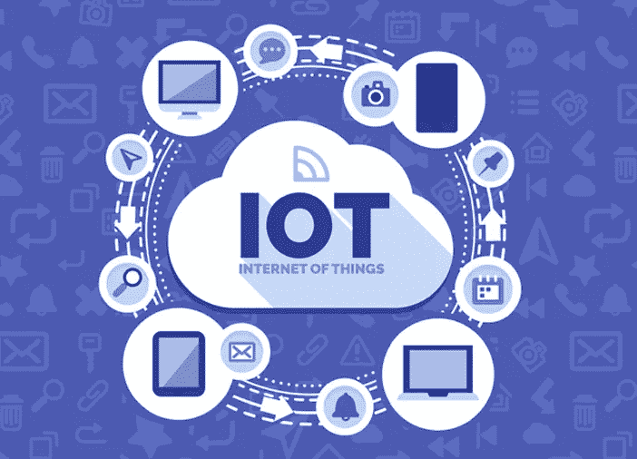

# 5 家提供最佳物联网平台的最佳印度公司

> 原文：<https://medium.com/hackernoon/5-best-indian-companies-offering-the-best-iot-platform-ef07d553423b>

物联网是业界的热门话题。它将所有设备连接到互联网，并依次将它们相互连接。一旦这些设备相互连接，它们就可以收集和共享数据。物联网将是一个巨大的变化，它将使我们周围看到的所有小型或大型设备变得更加智能。根据一份报告，2017 年有 84 亿台物联网设备相互连接。到 2020 年，这一数字很可能会增加到 200 亿台物联网设备。

这些设备需要物联网平台作为中间人，帮助弥合数据网络和设备传感器之间的差距。正是这些物联网平台将物体、系统和人之间的现实和虚拟世界结合在一起。此外，这些平台是基于云的，旨在为开发人员提供随时可用的联网设备应用功能。

简而言之，物联网平台是一种多样化的服务，将有助于在线转换物理对象。有很多由亚马逊、谷歌、IBM 等设计的大型物联网平台。然而，有一些印度物联网初创企业将在未来几年成为重大的游戏变革。以下是即将上市的五大印度公司，它们为运行物联网应用提供了最佳平台。

**Altiux**

[Altiux](http://www.altiux.com/index.html) 是一家专注于向用户提供物联网产品和服务的公司。他们的服务包括数据分析解决方案、边缘节点、网关和数据分析解决方案。Altiux 还根据客户的需求和要求提供定制服务。他们的物联网工具包为用户提供了一个平台，可以将无线设备连接到网络，并为这些设备创建应用程序来收集他们的数据。该公司还提供各种其他定制服务，这些服务将在建立广泛的互联网络时有效。

**阿蒂松的拿托尼斯**

Datonis 是 Altizon 设计开发的物联网平台。 [Altizon](https://altizon.com/) 是一家工业互联网平台公司，它将允许您安全地连接和处理可扩展的物联网数据。该平台还能让你实时分析数据，并将其整合到你的业务中。借助 Datonis 物联网平台，您可以在几周内构建物联网设备。为此，该公司提供了设备连接套件、大数据分析引擎、设备管理层和监控服务。此外，该服务对 Saas 和托管模型开放。Datonis 与您现有的 IT 系统相结合，可在您的物联网设备和 IT 基础设施管理工具之间实现无缝过渡。

**IoTSense**

这个基于印度的物联网平台提供智能、安全、可扩展和可定制的物联网解决方案。有了 [IoTSense](http://www.iotsense.io/) ，你将能够连接众多厂商的各种设备。IoTSense 提供了现成的功能，可以根据项目要求进行定制。有了这个平台，用户将获得强大而安全的安全机制。除此之外，该平台还提供 M2M 通信、实时流分析、可扩展框架和基于规则的操作。IoTSense 从传感器收集数据，并使用智能功能将其发送给云提供商。

**尤克蒂克斯**

这家位于班加罗尔的初创公司致力于通过物联网为农业和环境传感提供下一代基于传感器的智能解决方案。 [Yuktix](http://www.yuktix.com/) 拥有基于云的物联网平台，支持允许用户接收、存储、分析和可视化数据的功能。此外，Yuktix 的平台包括一个传感器目录，它从传感器和各种其他网络选项中生成信息，以便将收集的数据从任何地方发送到云。用户可以根据他们的行业和背景从该目录中选择所需的传感器。这些传感器可以插入设备，让用户开始在云上接收数据。此外，他们的云平台还允许您将几个设备分组。

**通过机器脉冲退出**

[Exiris](https://www.machinepulse.com/cloud-erixis.php) by Machine Pulse 是一个强大的云平台，专门用于数据存储和高级分析，具有安全的&可扩展选项和内置设备管理功能。云平台有助于创建可扩展且安全的端到端物联网解决方案。他们的云平台是一个智能系统，能够学习并适应不断发展的技术环境。Exiris 提供的一些有趣的功能是数据工程、设备管理、灵活的架构、安全性和丰富的可视化。