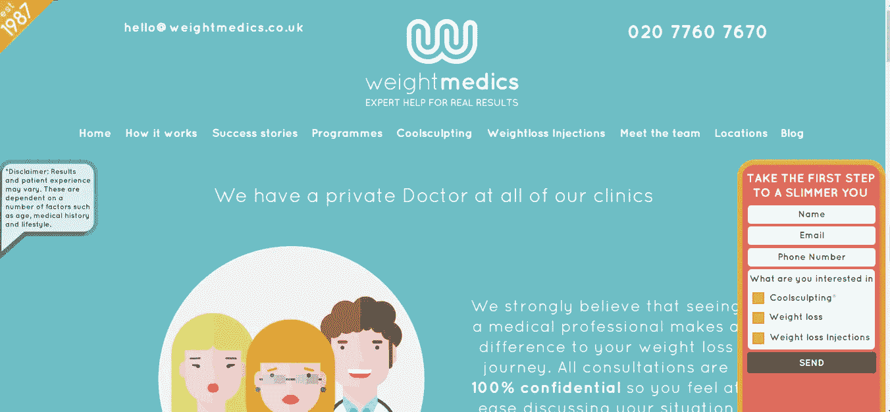
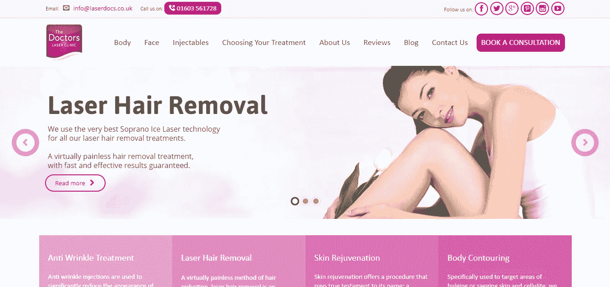
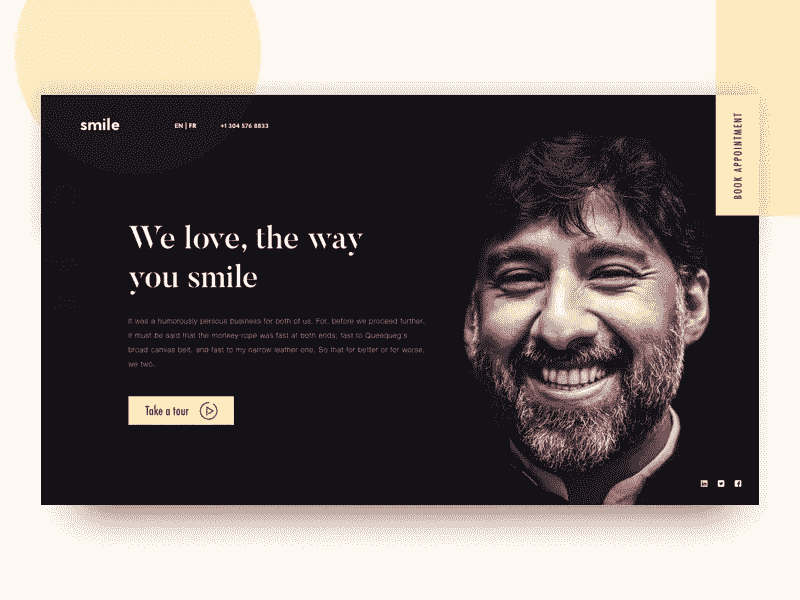
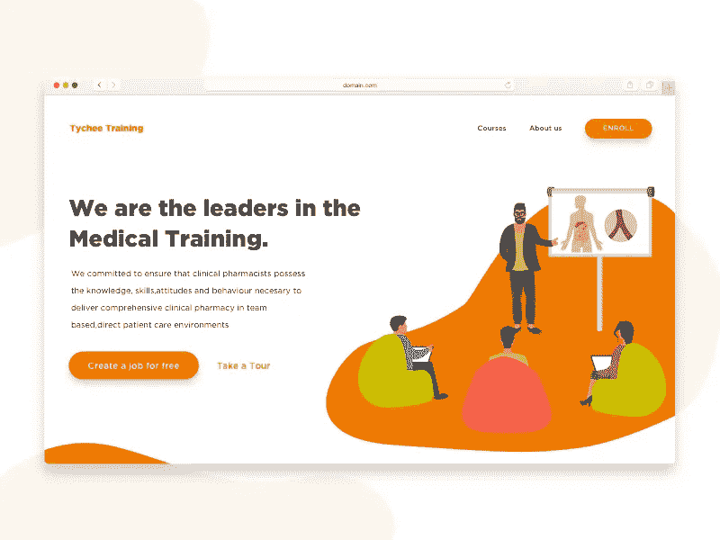
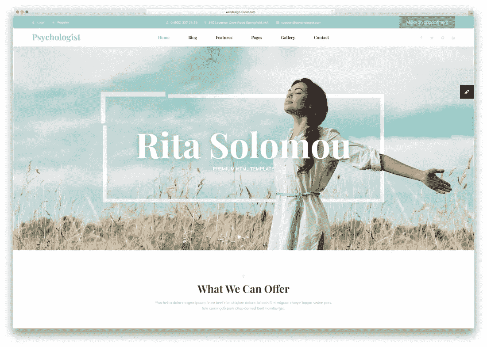
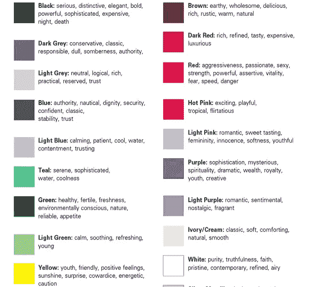
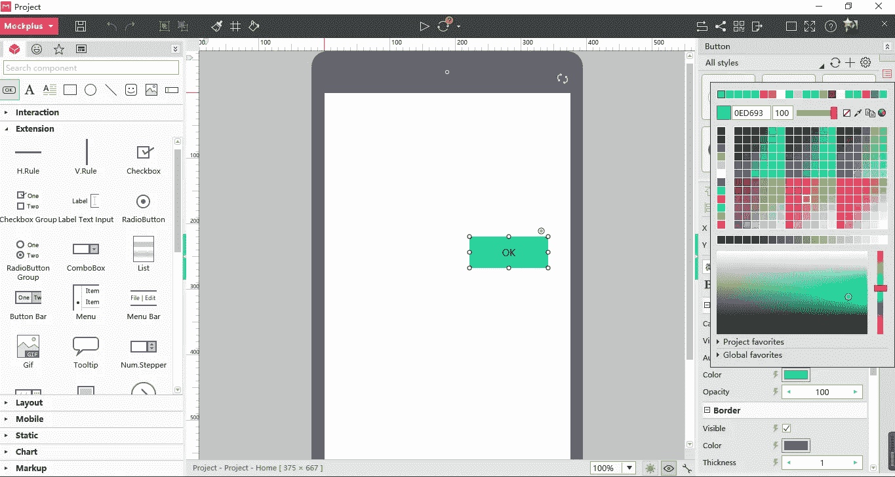

# 2018 年 5 个最佳医疗网站设计实例及色彩分析

> 原文：<https://medium.com/hackernoon/5-best-medical-website-design-examples-and-color-analysis-in-2018-413295a0b833>

人们更加了解医疗网站服务。这里有 5 个顶级的医学网站设计例子，用色彩分析来帮助你设计更好看的网站。

随着医疗保健意识的增强，医疗服务和医疗网站设计越来越标准化。从网页设计的角度来看，医疗网站是连接医院和需要医疗护理的患者的信息高速公路。对于患者来说，优秀的标准化设计可以更好地引导他们准确、快速地获取医疗信息。

**如何设计一个好的医疗网站？**看看下面优秀的例子，给**避免网站设计常见错误的可能性。**

# 1.weight medics——减肥网站设计模板

**特点:卡通风格，扁平化设计，活泼优雅的色彩**

与通常的减肥网站不同，它没有密集的减肥计划推荐，也没有夸张的“前后”减肥对比。网站整体设计呈现卡通风格，可爱又萌。浅蓝色的背景色搭配白色的字体，让网站简洁优雅。而且局部协调的橙色调，让场地显得活泼而不单调。

# 2.医生激光诊所——医疗美容网站设计模板

**特点:女性审美，卡片设计，优雅紫色**

医疗美容网站的大多数访问者是女性。所以，一个有效的医疗美容网站，不仅要通过产品服务，还要通过设计来迎合女性的审美。在这个模板中，紫色网站上方的卡片设计看起来优雅大方，并在颜色加深时为客户做出选择提供指导。CTA 部分的设计以深紫色突出，这是吸引点击和增加转化率的好方法。

# 3.美丽就是力量；微笑是它的剑——牙科网站设计的模板

**特点:黑色背景，黑白搭配，色彩对比**

健康美丽的牙齿是灿烂笑容的基础，这也是这个网站的宗旨。这个牙科网站设计的特别之处在于，它没有利用通常的“白衣医生”和拟人化的牙齿图案来突出主题。相反，它侧重于一个独特的有吸引力的微笑，以展示设计理念。它不仅仅是一个牙科网站，也是一个很好的服务广告。黑色的地面，因为巧妙的色彩组合，并不沉闷，反而辉煌。

# 4.Tychee 培训—医疗培训—医疗网站设计模板

**特点:活泼的橙色、插画、扁平的设计**

网站的背景颜色是橙色和白色，使整个页面看起来清新而充满活力。这完全符合现代人对健康生活的追求。主页采用流行的插画风格，结合扁平化的网页设计，传递出一种温暖活泼的感觉。

# 5.心理学家——心理健康网站设计模板

**特色:响应式设计，HTML5，清新淡绿**

以浅绿色为主色调，整个网站设计给人一种清新和充满活力的感觉。导航栏的颜色、字体和天空的颜色融为一体。网站的响应性和卓越的性能是促进转化的要素。基于这一点，免费的响应式 HTML5 web 模板将是一个很好的参考范例。这个心理健康网页设计模板也可以作为新手很好的参考。

正如你可能从上面的分析中推测的那样，我们并不仅仅专注于选择最好的健康网站设计。相反，我们更喜欢关注设计原则，尤其是网页设计中颜色的使用。

**网站色彩是影响整个设计的重要因素。不同的颜色产生不同的效果。**

那么，在设计网站的时候，涉及到颜色的选择，应该注意些什么呢？

**①红色:**红色使人兴奋和紧张。因此，它不应该作为医学网站设计的主色调。

**搭配:**红色中的粉色调更适合用在医美网站。它有助于营造一种迎合女性的柔美纯净的氛围。

**(2)黑色**:黑色是一种庄严的颜色，让人联想到死亡。我们建议在网站设计中避免使用过多的黑色。

**搭配:**黑色和亮黄色能产生清晰整齐的效果。这是一种适合实现生动外观的配色方案。

**(3)蓝色:**蓝色适合打造一页宁静与干净。因此，蓝色是在医院网站上使用的合适颜色

**搭配:**浅蓝色优雅、清新、浪漫、高贵。它常用于化妆品、女性美容和医学网站的设计。

**(4)绿色:**代表希望、成长、理想。因此，绿色是服务、医疗卫生、教育和农业等行业的好颜色。

**搭配:**绿色可以和多种颜色搭配，达到和谐的效果。也是医院网站使用最广泛的颜色之一。

**(5)紫色:**紫色象征着女性、高贵、优雅和奢华。它也代表着神秘、庄严、神圣和浪漫。

搭配:紫色与浅白色的结合会变成一种非常美丽柔和的颜色。

**(6)橙色:**橙色有健康、活力、勇敢、自由的象征意义。它给人以庄严的荣誉和神秘的感觉。它的使用营造了医院网站设计的温馨氛围。

**搭配:**橙色不能大面积使用，只能小块搭配其他颜色。

**(7)白色:**白色是网页设计中最常用的颜色。

**搭配:**将白色与黑色相结合，可以营造出现代、都市的观感，但不适合作为医疗网站设计的主色调。

**(8)黄色:**在很多设计中，黄色用来表达喜庆的气氛，突出华丽的产品。

**搭配:**黄色是中性色，所以在网站设计中几乎可以搭配任何颜色。

在高保真网络原型中正确使用颜色也是一个额外的好处。正确配色的原型项目有助于获得投资和赢得客户。那么，你需要的是选择一个支持宽颜色数据库的原型工具，而不是单色线框工具。Mockplus 是一个原型设计工具，可以使用颜色编号或颜色选择器直接设置组件和图标的颜色。这使得网页和应用程序设计更加容易。

# 总结:

色彩的重要性不仅仅适用于医学网站设计。一般来说，使用合适的颜色在网页设计中是至关重要的。设计任何网站时，创意都是关键。设计师必须避免陷入导致无聊创作的常规。通过向他人寻求灵感来继续学习和提高你的手艺。

# 更多关于医疗网站设计的资源:

[免费设计资料——为设计师提供的 1208 种谷歌字体包](https://www.mockplus.com/resource/post/free-package-of-1208-google-fonts-for-designers)

[免费设计资料——24 种平面字体免费下载](https://www.mockplus.com/resource/post/24-flat-fonts-for-free-download)

[免费设计资料——2000+四种格式的免费可爱图标包](https://www.mockplus.com/resource/post/2000-plus-free-cute-icon-package-in-four-formats)