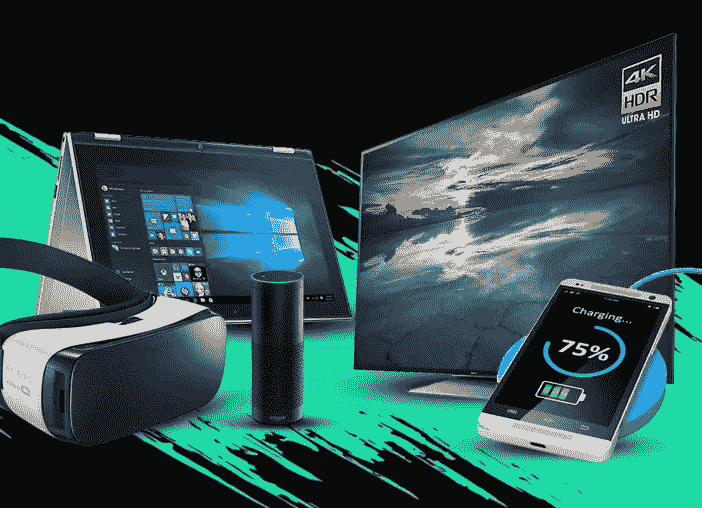
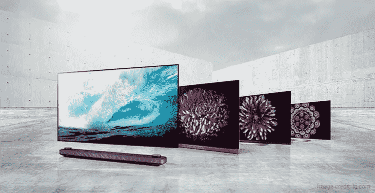
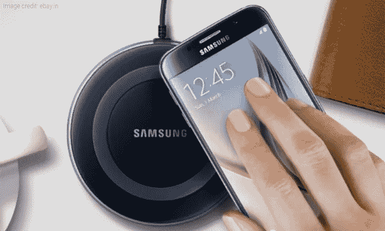
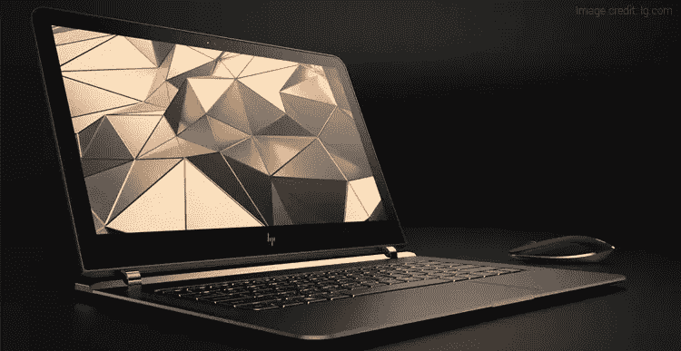

# 2018 年值得关注的 5 大技术趋势

> 原文：<https://medium.com/hackernoon/5-best-technology-trends-to-watch-out-for-in-2018-f13455b99a4>

Pricekart.com

每年的新年都会让科技世界充满兴奋。2017 年是充满创新和惊喜的一年，对 2018 年的期望也是最高的。随着时间的推移，技术趋势不断发展变化。它们决定了我们生活、工作和走向未来的方式。在所有进入市场的技术趋势中，只有少数能够树立里程碑。记住这一点，下面是我们列出的 2018 年值得关注的 5 大技术趋势。

# **5。更大更清晰的电视**

pricekart.com

随着 4K 电视概念的深入人心，各公司已经推出了分辨率仅次于它的电视。LG、三星和索尼等公司已经提出了 8K 电视的概念。LG 在 [CES 2018](https://www.pricekart.com/blog/ces-2018-top-gadgets-inspired-us/) 上展示了其首款 3300 万像素的“88 英寸 8K OLED 电视”。尽管这还不够，该公司还展示了一款“65 英寸可滚动电视”。

这款可滚动电视将具有 4K 分辨率，可以卷成管状，放在盒子里随身携带，使其成为一款便携式电视。同样，三星推出了第一款名为“The Wall”的模块化电视。这是一台 146 英寸的模块化电视，可以根据用户需要调整大小。所有这些创新构成了今年绝对值得关注的趋势。

# **4。四周无线充电**

这并不是无线充电第一次被提及或用于为设备充电。但这种趋势肯定会在今年的大多数设备上随处可见。无线充电的工作原理是将智能手机放在 Qi 兼容的充电垫上。垫子从插座插入电线以供电。

然而，今年可能还会看到空中无线充电。这将通过空中向设备供电来实现。电力可以传输到至少两英尺或更远的设备，最远可达 80 英尺。空中无线充电可以用于智能手机、智能扬声器、智能手表和无线键盘等设备的充电。

# **3。AR Over VR**

我们已经看到虚拟现实(VR)是去年最具趋势的技术之一。[虚拟现实耳机](https://www.pricekart.com/mobile-accessories/vr-headsets)帮助我们沉浸在一个并不真实存在的 3D 环境中。但今年看起来像是增强现实(ar)年。AR 的整个概念围绕着提供沉浸式体验，而不必将自己与现实世界隔离开来。

增强现实通过在真实世界上叠加虚拟信息来展示真实世界的更好版本。在用户的真实世界视图上使用计算机生成的图像来增强用户感觉、看到和听到的一切，这就是增强现实的意义所在。像金莫、柯达、卡尔·蔡司、索尼甚至网飞这样的公司将在今年将 AR 引入技术市场。这种技术趋势可能会给日常生活带来很大的帮助。

# **2。一体式语音助手**

语音控制将主宰 2018 年。语音助手决定了我们与计算机互动的方式。谷歌助手、[三星 Bixby](https://www.pricekart.com/blog/amazing-samsung-bixby-tricks/) 和亚马逊的 Alexa 已经通过做要求他们做的事情取得了一席之地。像播放音乐、获取天气更新、根据你的当前位置推荐附近的地方，这些都是我们已经见过的。

但是 2018 年的语音助手将能够执行不仅仅是基本的命令。例如，关于你每天的日程安排、烹饪食谱和其他需要你的语音助手执行的命令的信息将被添加进来。此外，不仅仅是智能手机和扬声器，这些助手也将被集成到电视、耳机甚至汽车中。

# **1。超薄笔记本电脑**

lg.com

技术从台式机发展到笔记本电脑，是为了便携性和重量等特性。如果这还不够的话，[超薄笔记本电脑](https://www.pricekart.com/laptop)将在这里占据一席之地。宏碁最近推出了世界上最薄的笔记本电脑，宏碁 Swift 7。这款笔记本电脑薄至 8.9 毫米，内置指纹传感器。同样，甚至戴尔也推出了其新版本的 Dell XPS 13 笔记本电脑，薄至 11.66 毫米。这很明显地表明，今年即将推出的笔记本电脑将在所有其他功能中竞争纤薄。