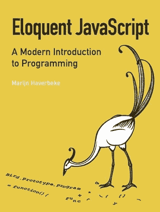
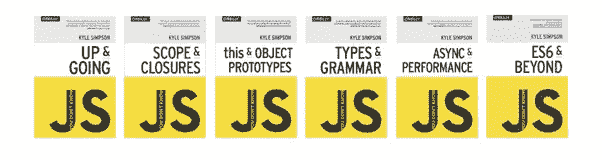
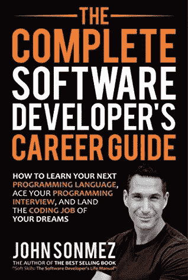
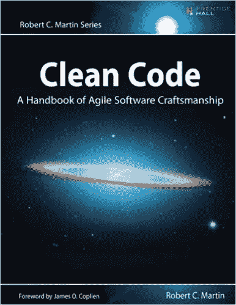
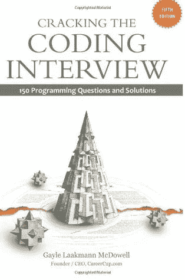
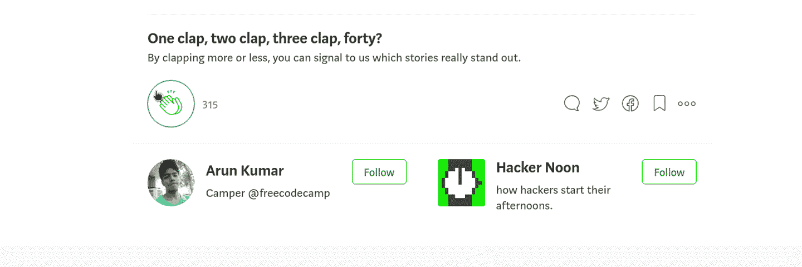

# 给开发者的 5 本书推荐

> 原文：<https://medium.com/hackernoon/5-book-recommendations-for-developers-1781df7ebdd1>

Photo by [Kobu Agency](https://unsplash.com/@kobuagency?utm_source=medium&utm_medium=referral) on [Unsplash](https://unsplash.com?utm_source=medium&utm_medium=referral)

> 你读得越多，你知道的东西就越多。你学得越多，你去的地方就越多。—苏斯博士

毫无疑问，阅读会帮助你学习一个新概念或更好地理解一个话题。阅读给了我许多难忘的瞬间。阅读书籍不仅会拓宽你的知识面，还会增加你的词汇量，提高你的理解能力。现在，我要分享一份帮助我成为更好的开发人员的书单。

# 雄辩的 JavaScript:编程的现代介绍

这是一本适合初学者的好书，T2 可以免费在线阅读。这本书分为三部分。第一部分讲述 JavaScript 的基础知识，第二部分讲述如何在浏览器上使用 JavaScript，最后一部分专门讲述 Node.js。它涵盖了高阶函数、正则表达式、模块、异步[编程](https://hackernoon.com/tagged/programming)等主题。

购买这本书:[附属链接](https://www.amazon.com/gp/product/1593275846/ref=as_li_tl?ie=UTF8&camp=1789&creative=9325&creativeASIN=1593275846&linkCode=as2&tag=arun4033622-20&linkId=39f826e2ed4f274e781cf2f34475ea7e) | [非附属链接](https://www.amazon.com/Eloquent-JavaScript-2nd-Ed-Introduction/dp/1593275846) | [在线阅读](https://eloquentjavascript.net/)(免费)

Book cover of Eloquent JavaScript

# 你不知道的 JS(丛书)作者凯尔·辛普森

你不知道 JS 是关于你猜对了，JavaScript 的六本书系列。它深入研究了 JavaScript，并深入介绍了该语言。第一个标题是关于 JavaScript 的基础知识以及本系列其他书籍的结构。其余的标题涵盖了以下主题:作用域和闭包、this 和对象原型、类型和语法、异步和性能、ES6 和超越。绝对推荐给任何使用 JavaScript 的人。

购买这本书:[附属链接](https://www.amazon.com/gp/product/B01AY9P0P6/ref=as_li_tl?ie=UTF8&camp=1789&creative=9325&creativeASIN=B01AY9P0P6&linkCode=as2&tag=arun4033622-20&linkId=a1e553b25e74680decc259c82a3b4428) | [非附属链接](https://www.amazon.com/You-Dont-Know-Js-Book/dp/B01AY9P0P6) | [在线阅读](https://github.com/getify/You-Dont-Know-JS)(免费)

Book covers of YDKJS

# 完整的软件开发人员职业指南

这是这个列表中唯一一本非技术性的书。这本书有五个部分。第一部分是关于开发人员入门。在这一节中，约翰详细阐述了所需的技术技能以及如何培养这些技能、编程语言、新兵训练营的利与弊、大学和自学。第二部分是关于找一份开发人员的工作。第三部分涵盖了 web 开发、移动开发、源代码控制、调试等主题。第四和第五部分是关于开发人员的工作和职业发展。

Book cover of The Complete Software Developer’s Career Guide

购买这本书:[附属链接](https://www.amazon.com/gp/product/0999081411/ref=as_li_tl?ie=UTF8&camp=1789&creative=9325&creativeASIN=0999081411&linkCode=as2&tag=arun4033622-20&linkId=ad74deb2038eea6d95f8da6fb459a3fa) | [非附属链接](https://www.amazon.com/Complete-Software-Developers-Career-Guide/dp/B073X6GNJ1/)

# 干净的代码:敏捷软件工艺手册

这本书是关于编写干净代码的。这本书包含三个部分。第一部分讨论了编写干净代码的原则、模式和实践。“什么是干净代码？”你可能会问。我抓住你了，

> 干净的代码是易于理解和易于更改的代码

这本书旨在帮助你的代码变得干净。我会把这推荐给任何写代码的人。

Book cover of Clean Code

购买这本书:[附属链接](https://www.amazon.com/gp/product/0132350882/ref=as_li_tl?ie=UTF8&camp=1789&creative=9325&creativeASIN=0132350882&linkCode=as2&tag=arun4033622-20&linkId=349738e80142e81e333a26b179fb0de3) | [非附属链接](https://www.amazon.com/Clean-Code-Handbook-Software-Craftsmanship/dp/0132350882/)

# 破解 Gayle Laakmann McDowell 的编码采访

这本书包含了 189 个编程面试问题和解决方案，涵盖了大 O 符号、数据结构、算法等主题。如果你准备技术面试，这是必读的。

Book cover of Cracking the Coding Interview

购买这本书:[附属链接](https://www.amazon.com/gp/product/0984782850/ref=as_li_tl?ie=UTF8&camp=1789&creative=9325&creativeASIN=0984782850&linkCode=as2&tag=arun4033622-20&linkId=ddee390bab5d8d10225d4e1812cb7553) | [非附属链接](https://www.amazon.com/Cracking-Coding-Interview-Programming-Questions/dp/0984782850)

# 在你走之前

请务必在下面的评论中分享你最喜欢的编程书籍，并随时在 [linkedin](https://www.linkedin.com/in/arun4033622) 、 [twitter](https://twitter.com/Arun4033622) 和 [github](https://github.com/Arun4033622) 上与我联系。感谢您花时间阅读本文。祝你好运！

