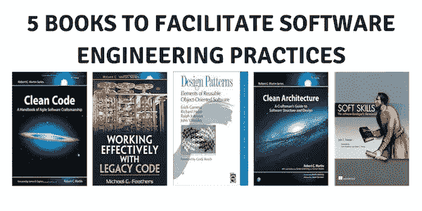
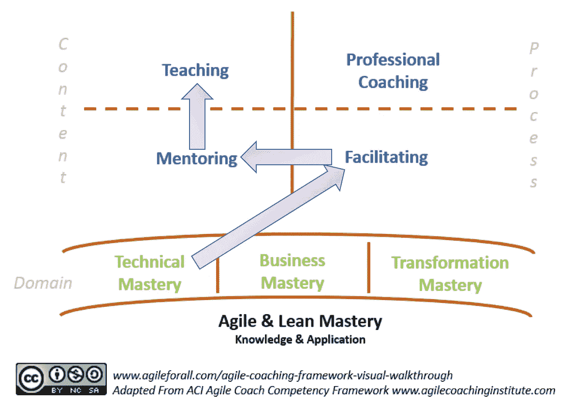
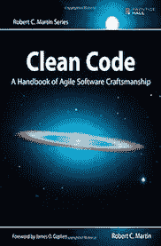
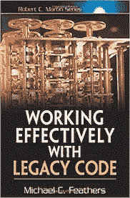
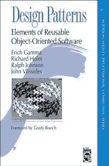
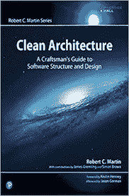
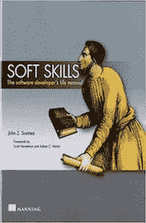

# 我将阅读 5 本书来促进软件工程实践

> 原文：<https://medium.com/hackernoon/5-books-ill-read-to-facilitate-software-engineering-practices-2f42a7df3a0d>

## 一个为开发者的旅程提供便利的计划

## 背景

在我的新旅程中，作为敏捷蔻驰(是的，敏捷蔻驰)，我在第一季度有一个巨大的挑战:促进、指导和训练敏捷团队中的技术人员。

你一定在想:技术领先或相关的东西在哪里？因此，我们团队中的技术领导很少，我也像你一样相信，我们需要一些技术经理或任何相关的职位。

今天，我们有 21 个敏捷团队，大约 60 名技术人员(程序员和测试人员)。他们中有些人非常擅长编程和测试[软件](https://hackernoon.com/tagged/software)，有些人则不然。

## 我的开始计划是什么

首先，我在一些团队中(像一个新成员)帮助他们实现一些技术上的不足，主要是关于质量和测试实践，遵循持续集成和持续部署实践的思维和应用。

我相信 Lissa Adkins 的[敏捷教练能力框架](http://agilecoachinginstitute.com/agile-coaching-resources/)会给我很大帮助。所以我立刻想起了从[到](http://agileforall.com/agile-coaching-framework-visual-walk-through/)[敏捷教练的这篇文章](http://agileforall.com)以及从到进入敏捷教练方法的不同方法。

我决定创造一条道路来帮助团队实现他们作为团队和个人所能达到的最佳结果。下图是完整的计划，将从作为*领域*的*技术掌握*开始，遵循*引导*流程，在作为*内容*的*辅导*和*教学*之后。

> 我是一名质量工程师[QE](间接是一名知道如何开发软件的开发人员)，我知道教一些程序员有多难，但为其他人提供便利、指导、教学和专业辅导是我的血液里流淌着 QE 的血液。

有了这个计划，我必须复习一些关于软件工程的概念。有些我知道，我每天都在申请，有些对我来说是个挑战。

## 我选择了哪些书

我们需要从简单开始，但不要这么简单……
一直以来，当我和开发人员谈论一些实践，他们需要跳过一些步骤(相信他们已经知道一些步骤)时，我会提到新的《空手道小子》电影，当时大师教了一件简单的事情:穿上夹克，脱下夹克。

我们需要首先学习基础，或者作为有经验的开发人员，记住一些基础步骤以及它们如何像一些设计模式、算法等等一样重要。

[**干净的代码:敏捷软件工艺手册**](https://www.amazon.com/Clean-Code-Handbook-Software-Craftsmanship/dp/0132350882)

软件开发人员必读的[书籍](https://hackernoon.com/tagged/books)之一。当我读这本书时(很久以前),我完全改变了我写代码的方式，所以我认为开发人员会改变他们写代码的方式。

我将重温干净代码的所有概念，并开始与开发人员讨论他们理解代码的难易程度。

[**有效处理遗留代码**](https://www.amazon.com/Working-Effectively-Legacy-Michael-Feathers/dp/0131177052)

我们有一个遗留代码的 L.O.T，不是针对金融机构的 Java 或其他编程语言，当我谈到遗留代码时，我会谈到 [Clipper](https://en.wikipedia.org/wiki/Clipper_(programming_language)) (是的，这个老家伙)。

对于 Clipper 或 Java(这是我们的语言)中的遗留代码，所有开发人员必须记住，并非所有代码都会变成新功能或改变为新技术，所以我们需要[小心地]改变现有代码，并将其变成可读性更好、更容易出错的代码，用测试覆盖代码。

[**设计模式:可复用面向对象软件的要素**](https://www.amazon.com/Design-Patterns-Elements-Reusable-Object-Oriented/dp/0201633612)

你有没有选择过用你写代码的软件工作？如果你的答案是肯定的，你一定知道设计模式。

可能有一天(在大学、会议、工作等场合)你听说过 GoF(四人帮)，毫无疑问，这是一本关于 OO 和设计模式的最好的书。

当我们至少有一个最基本的架构和应用时，软件开发设计模式的其他原则将帮助我们编写灵活和可重用的代码和设计。甚至大部分代码都是 C++的，值得一读。

我将使用书中描述的 23 模式来促进一些设计和改变决策。

[**干净的架构:软件结构和设计的工匠指南**](https://www.amazon.com/Clean-Architecture-Craftsmans-Software-Structure/dp/0134494164)

每个软件(一个像样的软件)都有一个架构，有时还有不同的编程范例(面向对象、函数、结构化)和一个好的设计。这本书将帮助我和开发人员为我们的环境和设计原则选择正确的范例(单一责任、Liskov 替代、依赖注入等等)

[**软技能:软件开发者的生活手册**](https://www.amazon.com/Soft-Skills-software-developers-manual/dp/1617292397)

最后一本书，同样重要，是关于软技能的。
这个话题帮助我成为一名更好的专业人士，我敢打赌你也能帮到你。

这本书涵盖了许多不同的主题(软技能)，我想我会更多地使用第 3 章——学习和第 4 章——开发人员的生产力来推动这两个主题。

你面对过相关的事情吗？在我的 [Twitter](https://twitter.com/eliasnogueira) 、[脸书](https://www.facebook.com/elias.nogueira.teste)或 [Linkedin](http://linkedin.com/in/eliasnogueira) 账号上说一说，交流一下经验吧。