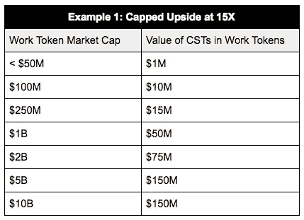
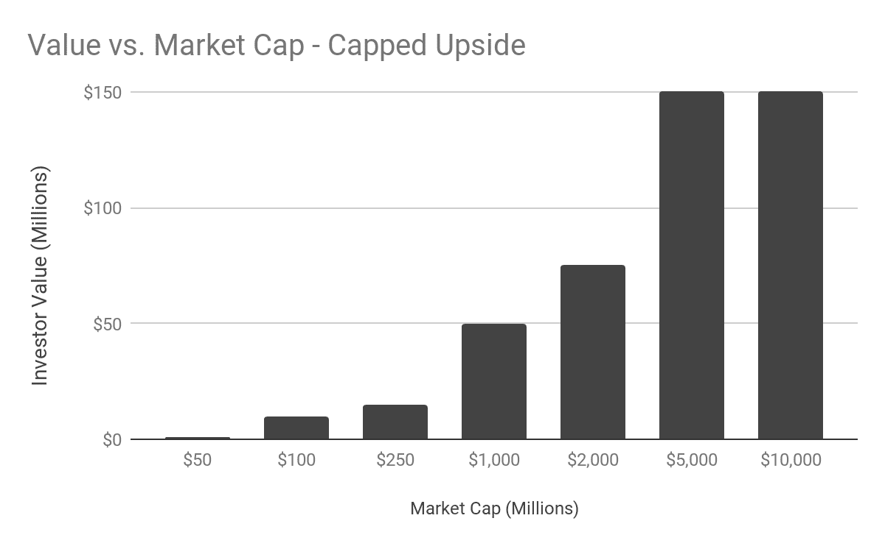
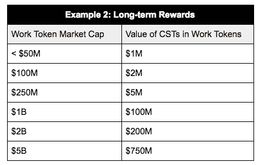

# 加密项目面临的 5 个挑战(以及如何用可编程证券解决它们)

> 原文：<https://medium.com/hackernoon/5-challenges-crypto-projects-face-and-how-to-fix-them-with-programmable-securities-f4f719532b64>

*由*[诺亚杰索普 ](https://twitter.com/njess)

在 crypto 1.0 中，令牌机制很简单。代币是为限量供应的新项目创造的——它们是一种价值储存手段，一种交换媒介，也是进入网络的途径。以太坊可能是这里的典型代表——全球计算和金钱交织在一起。这些是“简单”的日子。

在区块链 2.0 中，这种模式已经开始瓦解。随着主流硬币(可能通过提供隐私或低波动性的硬币来增强)已经成长为价值储存手段，每个新的加密项目都变得越来越困难。为什么我们会相信，在效用代币越来越长的尾巴中，任何玩家都会被许多代币持有者选为价值储存手段？

在早期，有一种货币对投资者和投机者来说非常有用——网络创建者可以自由分配来帮助启动他们的网络。稀释(以股票计算)或膨胀(以货币计算)来换取平台上的工作。最简单的是，投机者购买并持有一个令牌，这为矿工(或其他工人)在网络中做出长期资本投资决策提供了自由市场价值透明度。

快进到今天:事情要困难得多。下一波实用工具式令牌发放项目将面临完全不同的挑战。当我帮助一些项目设计他们的生态系统时，很明显，我们正在一个完全不同于 3、6 个月前的竞技场上航行。

想象一下，如果你的手机供应商向你收取苹果股票的月度套餐费用，价值的变化将远远快于电话公司为你的联系重新定价的速度。

加密项目——用自己的令牌购买和销售服务——正面临这个问题。我见过的一些挑战示例:

*如果我们正在构建一个公用令牌供电的网络，设计用于实际的近期商业用途，我们如何为客户提供网络接入？*

*客户能否在第三方交易所轻松获得我们的效用令牌？*(我们是否应该运营自己的交易所，让客户轻松购买我们的代币进行访问？)

*我们如何稳定美元或其他法定货币的价格？*(特别是如果网络有长期交易。)

我们不能直接接受瑞士法郎或其他储备货币来使用网络吗？(我们的企业客户能够直接购买在这里使用吗？)

投资和投机显然有助于资助和推动这些网络的采用——但就像电话公司一样，如果你的系统没有像你的新令牌价格波动那样迅速地改变价格，你的客户可能会成为投机浪潮的受害者。

我们在市场上看到的早期解决方案往往不太理想:

1)为真正的公用事业代币用户提供一种以相对于法定价格或储备价格稳定的价格购买代币的机制。

这往往对投资者/投机者不利。也很复杂。如何防止投机者冒充消费者，与这些市场博弈？你如何防止真实需求的高采用对生态系统的高度稀释？

*2)围绕一个股权令牌来定位项目——例如，从网络的总使用中提取 ETH“rake”或类似金额，并按比例(如股息)分配给受监管的股权令牌持有者。*

虽然这对于看起来很像典型业务的东西来说很好，但这是一条与区块链 1.0 中可用的选项完全不同的道路。**当网络中内置了直接的价值提取时，你如何创建一个完全无许可的系统？**如果所有的网络部分都是开源的，那么用什么来阻止一个去掉 rake 的分叉呢？

也许更微妙的是:如果项目没有自己的货币(只有“股票”)来深思熟虑地激励网络上的正确行为，它将如何锁定网络效应，以防止对早期支持者没有任何奖励(或税收)的分叉？

我提出一个更好的方法:可转换的安全令牌(CST)

以下是该系统将解决的加密项目面临的五大挑战:

1.  为项目提供早期融资机制
2.  创建团队和投资者可以共同持有的对象类别，以创建一致性
3.  实现对底层公用事业网络的轻松访问，以供实际使用
4.  不要把真正的公用事业买家和投机者/投资者混为一谈
5.  保持简单(尽可能)

可转换的安全令牌如下:

***一种安全令牌，根据底层网络的总规模，按照给定的时间表转换为底层实用程序(或工作)令牌。***

现在，考虑一个主要为访问网络而设计的底层工作令牌。它可以是对早期持有者有利的单一价格资产(如[片段](https://www.fragments.org/))，甚至可以像简单的合同一样简单:为发送到水龙头合同的每个 ETH 发行一个 NoahWork 令牌。

为了简单起见，让我们假设每个工作令牌的价值大约为 1 美元，并且不是为了纯粹的推测而设计的，而是为了工作。

可转换证券代币将成为(合格的)投资者为网络发展融资的途径。这些可以是基于百分比或基于美元成本的。

## **%**

让我们先看一个简单例子中的百分比。

该项目共出售 10 个 CST，每个 CST 可兑换 1%的已发行工作令牌总市值。

网络用户意识到，当这些 CST 最终被转换为工作令牌时，他们将在某个点遭受膨胀(稀释)。

CST 的早期买家可以与其他合格投资者自由交易(也许是在符合 [Harbor](https://harbor.com) 的证券代币交易所或直接二级交易中)。每个 CST 代表一个网络未来价值的看涨期权——更多地以总市值衡量，而不是每个工作令牌的价值增值。

因此，通过采矿、价格稳定或其他方式，工作令牌可以是固定的(再次为简单起见，假设为 1 美元)，具有大量创造——但投资者可以选择何时行使他们的期权，或在二级市场上找到流动性。

## **基于美元的国家技术服务小组**

CST 发行人可以进一步设计回报曲线——没有什么可以阻止我们明确地塑造曲线，v.s .产生一致的所有权百分比。

考虑下面的例子:

项目发行价值 1000 万美元的 CST 以资助网络开发。同样，为了简单起见，假设工作代币仍然设定为票面价值约 1 美元。

Project 设置了以下兑换表:

## **例 1:上限上涨 15 倍**

在这个例子中，该项目激励 CST 在生态系统增长的后期进行转换，并将总收益限制在 15 倍。

我们可以创造一条回报曲线，在转换前极大地激励长期持有，而不是限制上涨:

## **例 2:长期奖励**

这有一个显著不同的支付曲线(和对各方的激励)，都由可转换的安全令牌设计驱动。

这里还有更多的东西可以建立——例如，想象一下将工作令牌的市值表现作为 CST 美元价值的一个组成部分。这可能很简单，当市值至少在过去 3 个月一直在增长时奖励赎回(或在下跌时惩罚赎回)。

无论选择哪种风格的可转换安全令牌，系统的所有规则都可以向其他网络参与者公开，从而为早期生态系统支持者提供公平透明的回报。让创客们有能力拥有自己的代币，为他们的项目筹集资金，建立他们生态系统的机制设计。

让我知道你的想法——或者如果你看到 CST 的其他变体: [@njess](https://twitter.com/njess)

感谢 [Evan Kuo](/@evan_29274) 、 [Chris McCann](/@mccannatron) 和 [Hart Lambur](/@hal2001) 阅读本文草稿。