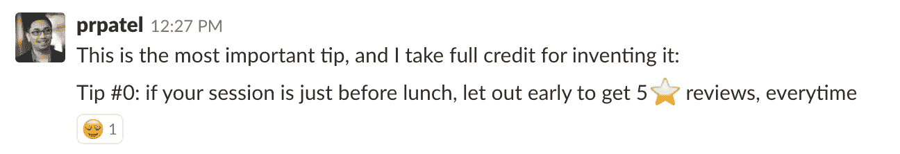
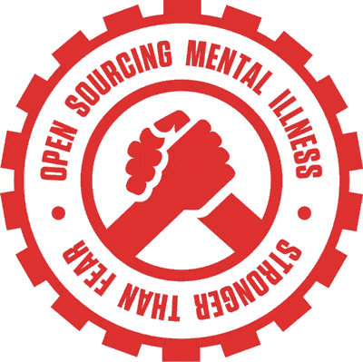

# 来自技术大师的 5 个会议演讲技巧

> 原文：<https://medium.com/hackernoon/5-conference-speaking-tips-from-tech-gurus-2f7d1a250af3>

## 给任何上台的人的实用建议

# 秘诀 1:分清轻重缓急

> “做你自己，别人都已经名花有主了。”——奥斯卡·王尔德

紧张、喝醉、疲劳或过于自信会立刻让谈话陷入僵局。如果你不小心的话，很容易过分消耗精力。以下是一些常见的演讲者陷阱。

**阶段健康是真实的。** 当肾上腺素流过你的血管时，你会站得更高，感觉精力充沛，反应也更快。把这些都留给舞台吧。谈论的兴奋感是很棒的，但是当你在第一天开始这种感觉，并且你的谈论是在第三天，你应该寻找放松的方法，这样你就不会耗尽你的注意力。

**时差是真实存在的。如果你在大洋上旅行，尽可能给几天时间适应环境。除非你经常旅行，否则你会发现自己会在凌晨 4 点想起你的演讲。如果你没有准备好，即使几个小时也会让你头脑混乱。有计划。**

分心是真实的。演讲者晚宴很有趣，有很多饮料，和与会者交流是很好的社交方式。只有你知道你的幻灯片是否可以再浏览一遍，或者你是否可以安全地和其他人一起熬夜。不要害怕断开连接，说“不”。不去郊游，甚至不去聊天，休息一会儿是明智的。

# 提示 2:在高能量的环境中制作幻灯片

> "积极的能量和积极的结果之间有着直接的联系."—乔·罗根

演讲者知道，环境决定了基调。作为一个演讲者，我们无法控制我们将要演讲的环境。会不会出现视觉障碍，会不会隔着墙壁的隔板听到其他人说话，会不会出现像众所周知讨厌的公共演讲者/作者斯科特·伯昆(Scott Berkun)那样的又大又丑的吊灯？*世卫组织知道？* **但是**，你可以在你的演示之前*控制环境，这多少会影响你的幻灯片。*

畅销书作家罗伯特·恰尔迪尼团队发现，当他在大学办公室写作时，他的文字符合大学的腔调。上下文枯燥而科学，但当他在家里写这本书时，他的章节发生了直接相关的变化。他的家庭办公室的章节更加务实和人性化。你的环境会改变你演讲的基调。对于演讲者来说，我们一些最好的会议想法是在我们开会的时候产生的。高能量的环境让我们在与观众见面之前，甚至在完成演讲之前，就能与他们建立联系。

克里斯·德马斯(GDE)对工作和幻灯片有一套特别有趣的方法。他在酒吧里做的。

 [## 忘记咖啡——我在酒吧工作的故事。

### 下班后，甚至在周末，你有没有过这样的感觉，“我真的想喝点咖啡，在……

medium.com](/@saltnburnem/forget-coffee-my-story-of-working-from-a-bar-8d521f0de94e) 

当你写幻灯片的时候，想想你在哪里。更重要的是，当你在不同的心情和不同的环境下回顾它们，激发新的想法。

# 提示 3:知道你在计划中的位置

> “知道你要去哪里比快速到达那里更重要。不要把活动误认为成就。”—等比率

如果可能的话，你的演讲应该根据时间表稍微调整一下。根据你前面的演讲者和一天中的时间，小小的调整可以给你的演讲增添专业的光泽。

如果你是一天中最早发言的人，你拥有每个人最聪明的头脑。别浪费了！随意抛出复杂的问题，并允许人们去解决、欢笑，并与他们的能量互动。早期的谈话可以也应该利用听众的能量。

如果你在午饭前说对了，你的观众仍然很兴奋……但是**不会超过你的时间。当排队领食物的队伍即将形成时，每个人都成了看钟的人。我完全同意[普拉蒂克·帕特尔](https://medium.com/u/c739214450ba?source=post_page-----2f7d1a250af3--------------------------------)的建议:**

[Pratik](https://twitter.com/prpatel?lang=en) speaks at and runs quite a few conferences

如果你刚吃完午饭，期待一群无精打采但快乐的人。我发现这些群体最难得到回应。因此，你可以用跳跃动作或深蹲来唤醒他们，就像我见过的几个演讲者那样。有相当多的技巧可以让你的人群热血沸腾，如果你在午餐后，考虑这样做。如果你没有，那也没关系。只是不要把他们的沉默当成一种侮辱，你更有可能迷惑而不是激发这群人。

如果你已经接近了一天，考虑一下你的观众已经花了一整天(有时是几天)用他们的大脑。他们的葡萄糖被抽干了，他们的注意力开始动摇。美好的一天近距离交谈强调兴奋而不是技术规格。当你做总结发言时，新鲜感比批判性洞察力更有价值。

最后，但最明显的是，在单线或双线会议中，找出谁将在你之前和之后发言。向他们介绍自己，了解他们的话题。有一份准备好的参考资料可以帮助你激发和强调你的观点，这种方式对别人来说是奉承的，对你的听众来说也是完美的。

# 秘诀 4:了解阶段

> “有时候我只想蜷缩在舞台上，躺一会儿——这很奇怪”——迈克尔·赫钦斯

并不是所有的会议都会告诉演讲者会议将会是什么样的，所以你自己去调查是至关重要的。要找出的问题:

**麦克风**

*   我会有麦克风吗？
*   是领夹式还是手持式？
*   如果是手持设备，话筒支架在哪里？
*   听众的问题会有麦克风录音吗？还是我必须通过 PA 重复？

**其他影音**

*   舞台上的演讲台上会有哪些插头？
*   会有适配器吗，还是我应该自己带一个？
*   录音团队会有遥控器吗，还是我可以用我的？
*   如果他们的遥控器有激光，后退按钮，甚至工作正常吗？
*   我的时钟/计时器会在哪里？
*   我什么时候可以在投影仪上测试我的设置？

**舞台和工作人员**

*   我会被宣布还是我只是设置？(多轨道对小轨道)
*   我要和司仪握手吗？
*   我会从后台来还是从观众席来？
*   我应该什么时候向舞台监督/主持人报告？
*   如果设备有问题，我应该通知谁？

这些是你上台前需要回答的典型问题。鉴于你的情况和会议的布局，这些可以而且通常会增长。通常情况下，所有这些问题都是在你没有问的情况下为你解答的，但是一份心理清单比在你的演示开始时就发现要好。

# 技巧 5:“演讲者的袋子”

> “信心来自于准备”——约翰·伍登

如果你想成为一名严肃的演讲者，那就意味着要为任何场合和任何场合做好准备。让别人的悲剧成为你的智慧，装个满满的**“演讲包”**准备好！

## ⚠️链接免责声明:

以下所有亚马逊链接都是推荐链接。购买带有链接的物品不会影响你的价格，但会将你购买的一部分捐赠给开源精神疾病非营利组织。感谢 Nic Steenhout 让我接触到这个组织。

[https://osmihelp.org/](https://osmihelp.org/)

## 扬声器包内容:

1.  备用眼镜/隐形眼镜(没有它们，我就像蝙蝠一样瞎)。
2.  [买一个幻灯片点击器+激光](https://amzn.to/2tKXPpS)持久耐用，为你工作。
3.  准备好头痛药(和其他关键药物)。
4.  有男士或女士的[手帕](https://amzn.to/2NeHTEp)。有型！但也是随机有用的。
5.  止血笔[+创可贴是伤口的绝佳后台救生工具。](https://amzn.to/2tIn4ZE)
6.  薄荷糖/口香糖/牙刷，用于饭后交谈。
7.  给你的观众的贴纸、名片或纪念品。
8.  备用充电电源组和笔记本电脑充电器。
9.  水、[、补液粉](https://amzn.to/2KCIUaW)、[唇彩](https://amzn.to/2lNHw72) —普通说话者所需。
10.  [国际电源适配器和 USB](https://amzn.to/2tKXiEo) 供全球旅行者使用。
11.  您的笔记本电脑输出转换为其他一切连接器。

Do you have usb-c? Make sure to have [usb-c to HDMI](https://amzn.to/2tInn6K), and ALSO have [usb-c to VGA](https://amzn.to/2tR9Av5).

*特别感谢几位演讲者，他们帮助我完成了上面的列表。翻遍自己音箱包的人有* [*乔治·莫尔*](https://medium.com/u/583c7fbf0a8e?source=post_page-----2f7d1a250af3--------------------------------)*[*克里斯*](https://medium.com/u/68501a71a258?source=post_page-----2f7d1a250af3--------------------------------)*[*玛丽莎·莫比*](https://medium.com/u/18179f7ef5a0?source=post_page-----2f7d1a250af3--------------------------------)*[*杰森·伦斯托夫*](https://medium.com/u/6a98eb806571?source=post_page-----2f7d1a250af3--------------------------------)*[*普拉克·帕特尔*](https://medium.com/u/c739214450ba?source=post_page-----2f7d1a250af3--------------------------------)****

****更新:**由令人惊叹的[西蒙娜·斯宾塞](https://www.instagram.com/Simone_Spence/)**

**这里还有一个:**

# **再来五个小技巧！？！？**

**这些只是我们准备中的一些小技巧，很多其他演讲者也有一些小技巧可以让这篇博文永远流传下去。打破它是有意义的，因为我们已经在做后续工作，即将推出另外 5 个技巧。订阅查看下一期，一定要将所有这些优秀的演讲者添加到你的 Twitter 订阅源中，这样你就可以在任何会议上找到我们并向我们问好。**

## **有线索吗？**

**我们错过了什么关键的东西吗？如果你是一名科技领域的公共演讲者，并且你想分享你的一些知识，请务必[发微博给我](https://twitter.com/GantLaborde)告诉我你的演讲经验，我们会联系你与他人分享你的建议。**

## **信用**

**观众照片由[阿方索·斯卡帕](https://unsplash.com/photos/e12EkMYv44U?utm_source=unsplash&utm_medium=referral&utm_content=creditCopyText)在 [Unsplash](https://unsplash.com/?utm_source=unsplash&utm_medium=referral&utm_content=creditCopyText) 上拍摄**

****

**Gant Laborde 是 [Infinite Red](http://infinite.red) 的首席技术策略师，出版作家，兼职教授，世界范围内的公共演讲者，以及正在接受培训的疯狂科学家。请鼓掌/关注/发微博或在会议上拜访他。**

** [## 远程工作的 5 大弊端

### 远程工作的陷阱+建议的解决方案

红色](https://shift.infinite.red/5-things-that-suck-about-remote-work-506b98dd38f9)  [## 团结——开发人员理智的 CLI

### 为您的项目增加团结，让多机安心

红色](https://shift.infinite.red/solidarity-the-cli-for-developer-sanity-672fa81b98e9)**