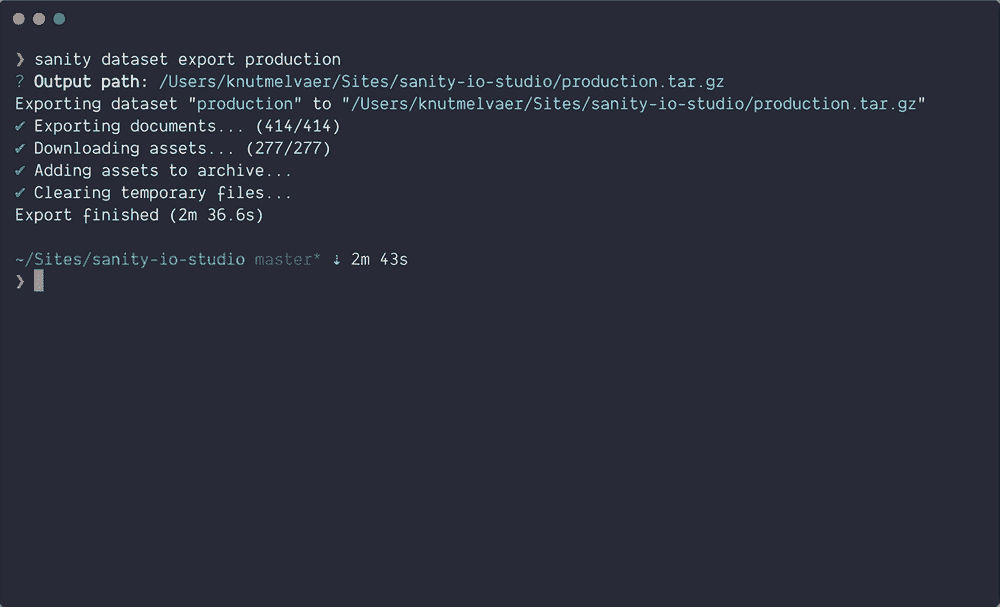

# 使用 Sanity CLI 可以做的 5 件很酷的事情

> 原文：<https://medium.com/hackernoon/5-cool-things-you-can-do-with-the-sanity-cli-39030e91d040>

## 我们💖克丽丝。所以我们不断赋予自己新的能力。了解你可以用你的理智项目在终端中做的 5 件很酷的事情。最后一个是御心术，我们保证！😇


在[理智总部](https://www.sanity.io)，我们在航站楼里生活和呼吸。老实说，我们一直在开发 Sanity CLI [工具](https://hackernoon.com/tagged/tool),因为我们每天都用它来与我们的结构化内容进行交互。我想借此机会分享一些你可以用它做的很酷的事情。

**在终端中运行** `**npm install --global @sanity/cli**` **安装 CLI，运行** `**sanity init**` **开始项目。**

# 1.查询您的数据

```
sanity documents query "*[_type == 'post']{_id, title}"
```

您可以使用 [sanity documents 命令](https://www.sanity.io/docs/documents)做一些事情，但是我们使用最多的一个命令是用于查询数据集的[命令。在你的项目文件夹中运行这个会让你的数据在终端中打印出来。如果你加上`--pretty`，你也会得到一些漂亮的高光。这对于测试查询和探索您的内容非常方便，但是如果您仔细想想，这也是在您的内容上使用这些 UNIX 超级能力的一种方式。例如，您可以使用它来](https://www.sanity.io/docs/data-store/how-queries-work)[将您的数据导出到 csv 文件](https://www.sanity.io/blog/exporting-your-structured-content-as-csv-using-jq-in-the-command-line)。我经常使用它，所以我在我的[外壳配置](/@rajsek/zsh-bash-startup-files-loading-order-bashrc-zshrc-etc-e30045652f2e)中添加了`alias sdq="sanity documents query"`。

# 2.以简洁的包形式导出数据集

```
sanity dataset export <datasetName>
```

结构化内容管理系统的全部意义在于，它应该能够很容易地将您的内容从中提取出来。通常这是通过查询 API 来获得您想要的内容，但是有时，您希望所有的内容一次打包好。该命令将您的所有文档导出到一个`.ndjson`-文件中，并将您的资产导出到一个专用文件夹中。它下载一个 gzip 文件，您也可以使用`sanity dataset import`将该文件导入到一个新的数据集。例如，您还可以解包文件，对所有数据运行查找并替换全部操作，然后再次将`dataset.ndjson`文件导入数据集。



Getting *ALL THE DATA*

# 3.管理 CORS 设置

```
sanity cors add [http://localhost:8000](http://localhost:8000)
```

[CORS 是个东西](https://www.sanity.io/docs/browser-security-and-cors)。当你正在建立你的新前端时，很容易忘记它。那么有一个简单的方法从命令行添加一个新的 CORS 原点就很好了。你也可以把`delete`和`list`他们赶出去。

# 4.获得项目的概述

由于你可以拥有尽可能多的免费开发者计划，并且开始一个新的项目是非常容易的，所以用不了多久你的账户中就会有一些项目。然后，有一个简单的方法列出所有项目，并提供一些与您的帐户相关的关键信息，这很好。

# 5.在您最喜欢的编辑器中创建和编辑文档

```
sanity documents create --id myDocId --watch --replace
```

这个命令是我最喜欢的。它会创建一个新文档，在您终端中设置的编辑器中打开它(我的是`export EDITOR='code -w'`)，并允许您在文档同步到数据存储时实时编辑该文档。如果您将一个现有的文档 id 放在`myDocId`位置，您将获得该文档并能够编辑它。运行`sanity documents create --help`来了解更多关于这个命令的功能。

It’s truly headless when you can edit content live from your favorite editor.

通过在您的终端中运行以下命令，开始使用 [Sanity](https://www.sanity.io) :

```
npm install -g @sanity/cli && sanity init
```

*原载于*[*www . sanity . io*](https://www.sanity.io/blog/5-cool-things-you-can-do-with-the-sanity-cli)*。*