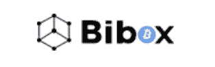
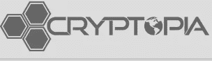

# 审查了 5 个加密交换(外加一个赢家！)

> 原文：<https://medium.com/hackernoon/5-crypto-exchanges-reviewed-plus-a-winner-2613e7c61d8e>

有许多伟大的交流，但每一个体面的有多个可怕的。下面我整理了一份我实际开户、存款、取款的交易所清单，并对这个网站感到满意(或不满意)。这是我发现的五个不同交易所的有益、有害、有吸引力或有问题的功能的综合评论(单击交易所名称注册):

[**币安**](https://www.binance.com/?ref=15316928)

**[**Bibox**](https://www.bibox.com/login/register?id=11305470&lang=en) **(#1 兑换 SNOV)****

**[**隐视**](https://www.cryptopia.co.nz/Register?referrer=JaketheCryptoKing) **(适用于小帽隐视)****

**[**比特币基地/GDAX**](https://www.coinbase.com/join/5a09ab7b4a50da030fd58b20)**

**Bittrex(必须通过电子邮件申请注册)**

****

******:******

****(我个人的最爱)****

****币安最近在任何给定的加密货币交易所的交易总量上(视具体日期而定)都位居第一或第二。对于一家 2017 年才开始运营的交易所来说，他们已经设法在不到 365 天的时间内超越了整个竞争对手。币安与 BTC、瑞士联邦理工学院、USDT 和 BNB 有大量的贸易伙伴。****

****BNB 代币是币安交易所的代币，也是它成为许多交易者喜爱的交易场所的原因之一。币安的起征点为 0.1%，相对于整个行业来说是相当低的。但是，如果您持有 BNB 令牌并启用它，则 0.1%的费用将降至 0.05%。与 Bittrex 相比，Bittrex 收取 0.25%的交易费。这意味着 Bittrex 上的每笔交易在两端的执行成本都要高出 250%。随着时间的推移，这 0.15%会非常显著地增加(每增加一笔交易)。****

****在拥有 BNB 代币的情况下，在币安进行交易会将费用从 Bittrex 的 0.25%降至 0.05%。为投资者每次交易节省 80%的费用。币安目前是加密投资者的首选，费用为 0.05%，前一年的声誉无可挑剔。****

****报名参加#1 交易所按卷访问币安这里:[**币安**](https://www.binance.com/?ref=15316928)****

********

****[**Bibox**](https://www.bibox.com/login/register?id=11305470&lang=en) **(#1 兑换 SNOV)******

****Bibox 目前是 BTC 和 ETH 配对的绝佳选择。它们也是本周我最喜欢的硬币之一(SNOV)交易量排名第一的交易所。如果你拥有 BIB token，Bibox 目前有一个很好的推荐计划和收费结构。与 BNB 代币非常相似，Bibox 大大降低了交易成本，这使得 Bibox 成为那些寻求更好选择的小型交易所的首选。币安是收费结构最好的大型密码交易所，但如果你想在有许多小型密码交易所交易，Bibox 是一个很好的选择。****

****Bibox 并不适合所有人，因为小型密码的风险更大。然而，风险越大，收益也越大。如果加密完全是一场赌博，那么一些投资者选择了最有上升空间的硬币，即使它们的风险更大。****

****由于 Bibox 的费用结构、推荐计划、BIB token 以及对许多小盘股 cryptos 的大量接触，Bibox 仍然是一个很好的选择。****

****要开始探索 Bibox 的小型大写字母，请点击这里: [**Bibox**](https://www.bibox.com/login/register?id=11305470&lang=en) **(#1 交换 SNOV)******

********

****[**隐视**](https://www.cryptopia.co.nz/Register?referrer=JaketheCryptoKing) **(适用于小帽隐视)******

****隐视在瞄准小型隐字的能力上类似于 Bibox。几乎每周都会从 Cryptopia 中选出一小盘(市值约 100 万美元)本周最佳密码(在 BTCManager 上)或本周最佳替代硬币( [Bitcoinist](https://hackernoon.com/tagged/bitcoinist) )。大多数时候，Cryptopia 是唯一一家交易这些小盘股的交易所。隐国在新西兰是一个安全的选择，但是他们最大的缺点存在于他们的范围内。24 小时内的最高限额为 5000 新西兰元(约为。5000 美元)。这成为许多投资者的一个问题，他们希望在他们的努力中投资超过一个 BTC。****

****Cryptopia 不应该回避，即使他们的下限，因为他们提供了一个安全的，易于使用的，交换的一些最小的市值硬币神奇的暴露。最大的缺点包括取款的时间限制(有时需要几个小时)和较低的取款限额。****

****有这么多小市值的 Cryptopia 和伟大的团队，Cryptopia 应该是最喜欢高风险、高回报硬币的交易所，持有账户。****

****对于那些对本周最佳硬币或本周前 5 名替代硬币感兴趣的人，请确保查看 Cryptopia:[**Cryptopia**](https://www.cryptopia.co.nz/Register?referrer=JaketheCryptoKing)**(对较小的 Cap Cryptos 很好)******

******Bittrex(易于使用，难以注册，费用最高)******

****如果你想在注册时经历一段艰难的时期，而且费用很高，那么 Bittrex 是一个很好的选择。它们是目前活跃的日交易中最昂贵的交易所之一，但仍然是最容易使用的网站之一。易用性通常会带来更高的成本，Bittrex 已经将加密交易简化到最简单的形式。在很长一段时间里，Bittrex 没有接受新的注册用户，但最近开始接受新用户向他们发送电子邮件请求帐户。看到 Bittrex 再次开始接受新的交易者是非常积极的，即使他们的费用与许多其他交易所相比非常高。****

****由于交易费起价为 0.5%，取款费为 0.5%，Bittrex 是一家不太推荐的交易所。对于交易不多的投资者来说，Bittrex 是一个完美的网站，因为它非常容易使用，位于美国，并且有保险。这些保证在加密领域并不常见，知道你的资金在一个美国网站上受到保护，有一个易于使用的平台，可能非常值得他们每笔交易收取 0.5%的费用。****

****[**比特币基地/GDAX**](https://www.coinbase.com/join/5a09ab7b4a50da030fd58b20)****

****比特币基地/GDAX 是另一个美国平台，是一个简化的交易所。我称它为“懒惰的美国人”(我是美国人，尽管有点不那么懒惰)的交易所，因为它只有 4 个硬币，没有交易对，对于那些只有 1 个账户的人，它通常在比特币基地。电话申请流程贯穿了整个过程，老实说，我的父母都只有比特币基地账户，因为那是他们最想涉足区块链科技的地方。****

****比特币基地的优点包括可以用你的银行账户购买密码，最容易使用的交易所，自动 GDAX 账户，以及一个可爱的手机和电脑界面。****

****比特币基地的缺点包括非常高的交易费用(购买、销售和转让)以及一只手就能数完的选择。****

****比特币基地是一个所有投资者都可能拥有账户的网站，但它将主要用于初始购买和最终套现。他们的界面是顶级的，最大的缺点是缺少硬币和较高的交易费用。****

****可在此开立比特币基地账户: [**比特币基地/GDAX**](https://www.coinbase.com/join/5a09ab7b4a50da030fd58b20)****