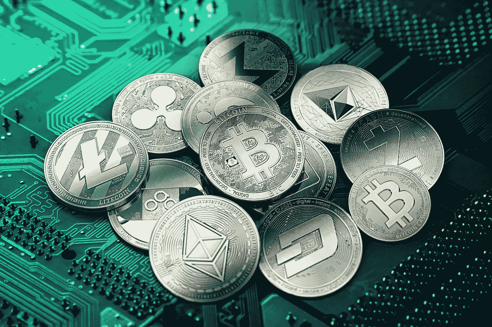

# 正确分析加密货币投资的 5 个技巧

> 原文：<https://medium.com/hackernoon/5-cryptocurrency-investment-tips-6e9e23e223be>

在过去的几周里，我被类似于*我应该投资 X 吗？* *你对 Y 项目有什么看法？*过去几周，市场变得不理性，催生了一些不会带来任何“真正”价值的项目。当即将到来的崩盘到来时(过去几天发生的事情仅仅是一次必要的修正)，只有根基稳固的硬币才能存活下来。所以在开始投资你辛苦赚来的钱之前，这里有 5 个小贴士可以帮你——有些可能是常识，但常识并不常见。

## 它解决什么问题？

首先要问自己的是——这个项目试图解决什么问题？他们想达到什么目的？T4 真的需要区块链或有向无环图吗？

就拿**比特币** (BTC)来说吧。这是一个大男孩，也是第一个为区块链带来真实用例的项目。比特币以加密货币的形式呈现在世人面前，费用极低，具有一定程度的匿名性，交易时间接近即时，分类账分散且不可改变。自那以后，事情发生了变化，但比特币的初衷对区块链来说有一个真正的用例。

BTC 可以在菲亚特的各种交易所购买，包括[比特币基地](https://www.coinbase.com/join/529df01d7d14fead4f000261)、 [Bitstamp](https://www.bitstamp.net/) 、[双子座](https://gemini.com/)和[北海巨妖](https://www.kraken.com/)。

## 代币价值

根据定义，投资是将金钱或资本投入到一项事业(企业、项目、房地产等)中的行为。)，期望获得额外的收入或利润”。当投资一种特定的数字货币时，你需要思考——XYZ 的价值来自哪里？是什么让 XYZ 的物价上涨？

让我们举两个真实的例子:

*   [**DOGE coin**](http://dogecoin.com/)**(DOGE)早在 2013 年就被创造为一枚“仿作”硬币。价值纯粹来源于供给&需求和人们对其价格的感知。这枚硬币没有特定的用途，没有带来任何技术进步，也没有解决任何现实世界的问题(无意冒犯狗主人！).它已经超过 2 年没有更新了，但是它的市值(稍后会有更多的介绍)仍然接近$1B。**
*   **另一方面，****(ETH)有明确的价值。此外，由于 ETH 的价格来源于人们(即购买和出售它的人)的感知，因此它还用于支付在以太坊网络上实现&执行智能合约的费用。因此，我们可以暗示，ETH 是由这些智能合约提供的价值“支持”的。******

******我不是在争论你是否应该投资 DOGE 这样的硬币，因为它们可以在短期内带来可观的投资回报(ROI)，但肯定是风险更高的投资，一旦阻碍崩溃的到来，更容易消失。******

******DOGE 和 ETH 可以在[比特币基地](https://www.coinbase.com/join/529df01d7d14fead4f000261)， [Bitstamp](https://www.bitstamp.net/) ，[双子星](https://gemini.com/)，[北海巨妖](https://www.kraken.com/)， [Bittrex](https://bittrex.com/) ， [Gate.io](https://gate.io/signup/820917) 等等上购买。******

## ******硬币供应和市值(市值)******

******在继续之前，我想先弄清楚一些定义([由 CoinMarketCap](https://coinmarketcap.com/faq/) 提供):******

*   ********流通供应量**是市场上流通的和普通大众手中的硬币数量的最佳近似值。******
*   ******总供应量**是目前存在的硬币总量(减去任何已经被可验证烧毁的硬币)。****
*   ******最大供应量**是加密货币生命周期内最大硬币数量的最佳近似值。****
*   ******市值**是对加密货币的相对规模进行排名的一种方式。它是用**价格**乘以**流通供应量**计算出来的。因此，**市值=价格*流通供给**。****

****我看到许多人犯的一个巨大错误是投资一枚硬币，因为“每枚硬币的价格”很便宜(呃)——这是完全错误的。例如，我们有项目 A 和项目 x。项目 A 供应 1000 枚硬币，每枚价值 1 美元。项目 X 有 10 枚硬币，每枚价值 100 美元。两个项目的价值完全相同，因为它们都有相同的市值，然而，许多人都有一个错误的印象，认为投资项目 A 是更好的选择。尽可能简单地说——硬币越多，越不值钱。****

****请考虑以下情况:****

*   ****发行量、总量和最大供应量是多少？密切关注三者之间的差异，并始终研究以理解硬币的经济学，为什么会有差异以及如何“弥合”差异。寻找供应品的一个很好的资源是 CoinMarketCap。****
*   ****有 3 种类型的硬币；**通货膨胀的硬币**随着时间的推移**增加**它们的供应量，**通货紧缩的硬币**随着时间的推移**减少**它们的供应量，以及**既不**的硬币——它们的供应量总是保持**不变**。忽略外部因素，通货膨胀的硬币**在新的硬币进入流通时**价值下降(因为它们现在更丰富)，通货紧缩的硬币**在硬币退出流通时**价值上升(因为它们现在更稀缺)。 **BTC** 是通货膨胀硬币的一个例子(直到达到 2100 万的最大供应量)[**Iconomi**](https://www.iconomi.net/)【ICN】是通货紧缩硬币的一个例子，而 **IOTA** 是两者都不是的硬币的一个例子。你应该一直质疑你投资的是哪种类型的硬币，以及背后的原因。****
*   ****硬币创始人占百分之几？始终研究创始人持有多少硬币，如果这是一个重要的百分比(假设超过 25-30%)，问为什么。他们持有这一数额有正当理由吗？他们打算用它做什么？****

****上述硬币可在[比特币基地](https://www.coinbase.com/join/529df01d7d14fead4f000261)、[币安](https://www.binance.com/?ref=10881502)、[北海巨妖](https://www.kraken.com/)等处购买。****

## ****团队和透明度****

****投资一个项目时要考虑的一个非常重要的因素是项目背后的团队。需要考虑的一些问题是:****

*   ****该团队在项目所涉及的行业中有任何经验吗？这不是必须的，但如果它在行业中有专长和知识，肯定会有帮助。一个完美的例子就是金恩的****(ENJ)团队。他们在游戏行业已经有一段时间了，并且有必要的了解来在这个领域推出加密货币项目。********
*   ******为什么在一个不要求匿名的项目中，团队是匿名的？例如，如果他们正在开发一种隐私硬币，这是可以理解的，但如果他们正在开发一种专注于电子竞技的硬币，这就不是了。******
*   ******团队是否参与社区并提供及时的更新？他们有望实现他们的路线图吗？[**district 0x**](https://district0x.io/)**(DNT)是一个团队应该如何沟通的完美例子。快速浏览一下他们的博客[这里](https://blog.district0x.io/)你就明白我的意思了。********

******令人欣慰的是，我们生活在一个数字时代，你可以浏览网页，找到更多关于项目背后工作人员的信息。******

******本节提到的硬币可以在[币安](https://www.binance.com/?ref=10881502)、[科斯](https://sso.coss.io/api/invite/UG924F1RQ2)和[比特雷克斯](https://bittrex.com/)上买到。******

## ******投资者和合作伙伴******

******在决定投资什么时，我发现非常积极的一点是当前的项目投资者和合作伙伴。原因应该不言自明，但有了成熟实体的支持，该项目就有了更大的合法性。吸引眼球的投资者和合作伙伴的几个例子是:******

*   ******[**请求网**](https://request.network/) (REQ) —由 [**Y 组合子**](http://www.ycombinator.com/companies/) **撑腰。********
*   ****[**VeChain**](https://www.vechain.com/)(VEN)——合伙企业包括 [**【普华永道】**【普华永道】](https://www.pwccn.com/en/press-room/press-releases/pr-150517.html)[**DNV GL**](https://cdn.vechain.com/vechain_global_rebranding_event.pdf)[**KUEHNE+NAGEL**](http://www.trustnodes.com/2016/09/06/worlds-largest-freight-company-use-blockchain-tech-asset-management)**等等。******
*   ******[**IOTA**](https://iota.org/) — [从**博世**集团的法人风险投资公司 (RBVC)获得投资](http://www.bosch-presse.de/pressportal/de/en/robert-bosch-venture-capital-makes-first-investment-in-distributed-ledger-technology-137411.html)。合伙企业包括 [**如维**、](https://blog.ruuvi.com/iota-camp-b4acf5ea5917) [**大众**](https://www.pscp.tv/edocalia/1yoJMpznXDOGQ?t=6m55s) 等。******
*   ****[**恒星**](https://www.stellar.org/)(XLM)——与 [**IBM**](http://www-03.ibm.com/press/us/en/pressrelease/53290.wss) 合伙。****

****本节讨论的硬币可以在[币安](https://www.binance.com/?ref=10881502)、 [COSS](https://sso.coss.io/api/invite/UG924F1RQ2) 、 [Gate.io](https://gate.io/signup/820917) 、 [Bitfinex](https://www.bitfinex.com) 和 [Bittrex](https://bittrex.com/) 上购买。****

## ****结论****

****以上建议只是我在决定投资哪个项目时所做研究的一部分。我不能强调知道你投资什么是多么重要。抓住“最热门”的硬币可能会给你带来短期收益，但如果你正在寻找一个严肃的长期投资，就必须进行适当的分析。****

****可以在 Twitter [**@ermos_k**](https://twitter.com/ermos_k) 关注我，了解最新博文。****

**** [## Ermos K (@ermos_k) | Twitter

### Ermos K 的最新推文(@ermos_k)。大约在 2012 年，加密货币爱好者

twitter.com](https://twitter.com/ermos_k)**** 

****想支持我的工作，多看看？请在此捐款以示支持:****

******BTC**:395 jpxqaqlvyp 2 CP 4 uvmdbppartdkbfzk
**BCH**:181 fsplrfwvk 3 tpfmev 678 plrua 2 kpeofh
**LTC**:lgj w5 vjo 2 exxftqawuljvbrtqdiscxng 7 u
**ETH**:0x4c 7195 e 074 cf 0 ab 6 f 77 BD b 7****

*****免责声明:这篇博文中的所有信息和数据仅供参考。我对任何信息的准确性、完整性、适用性或有效性不做任何陈述。我将不对任何错误，遗漏，或任何损失，或因其展示或使用引起的损害负责。所有信息均按原样提供，不含任何担保，也不授予任何权利。*****