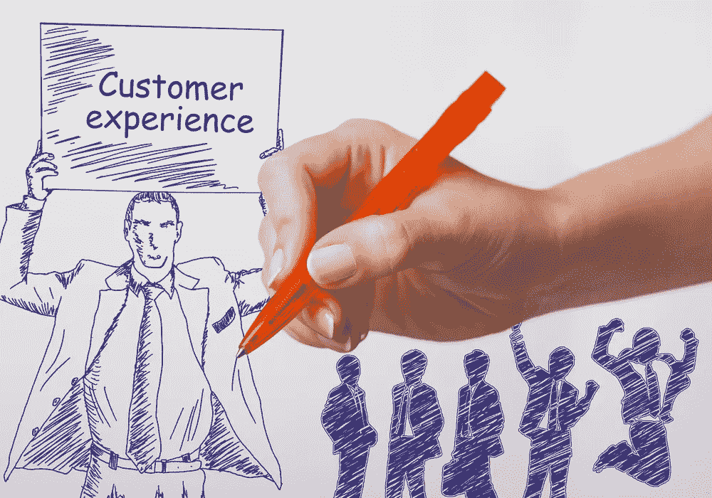

# 从不让人失望的 5 个客户体验成功指标

> 原文：<https://medium.com/hackernoon/5-customer-experience-success-metrics-that-never-disappoint-c1b7a9d75e41>

随着多渠道成为常态，全渠道成为优先事项，数字化转型不再是一场辩论而是一种需要，人工智能(AI)和机器学习(ML)已经迈出了不止一步，客户同理心和个性化占据了主导地位— [客户体验](https://pimcore.com/en/products/experience-manager/customer-experience-management/introduction) (CX)已经成为过去十年中出现的最有趣的现象之一，并继续困扰和吸引着企业。

据 Gartner 称，改善客户体验是组织寻求的首要结果之一。这是有充分理由的，因为客户对公司的期望[理解他们的需求](https://www.salesforce.com/research/customer-expectations/)已经达到全新的高度。

但是，对于许多企业来说，一个仍然没有答案的问题是，他们将如何衡量他们的 CX 改进。在这里，我们来看看五个客户体验指标，无论你来自哪个行业，它们都会为你指明正确的方向。

# 1.客户忠诚度

关于平均购买期限、购买频率、各种购买渠道的使用、平均订单规模和重复订购的信息可以帮助您评估客户长期保持客户关系的可能性。

另一方面，流失率指的是不再从同一个卖家那里重复购买或者在使用一次或几次后就永远停止使用某个公司的服务的客户的百分比。

虽然除了通过不断努力满足客户需求之外，似乎没有赢得客户忠诚度的秘方，但奖励和忠诚度计划是一种经受住了时间考验的策略，作为一种在忠诚客户的购买周期中引入利润和快乐的方式。

2015 年 2 月，[加拿大航空公司被评为客户忠诚度最高的航空公司](https://www.prnewswire.com/news-releases/air-canada-named-top-airline-in-customer-loyalty-292215781.html)，因为它不断奖励其常旅客，比如它[给居住在伦敦的加拿大人带来惊喜](http://www.torontosun.com/2014/12/05/air-canada-surprises-canadians-with-free-trip-home-for-the-holidays)免费的假期往返机票。

当然，只有在满足了客户体验的基本原则(质量、便利性、价值、易用性和一致性)之后，奖励和忠诚度计划才会作为附加项目出现。

# 2.客户满意度(CSAT)

从广义上讲，顾客满意度可以被描述为顾客在与一个品牌接触后的“满意度”。它通过各种技术来衡量，通常在回顾中进行，包括问卷调查或评级，旨在调查客户在使用服务或购买产品后的满意度。

问题可以集中在交付速度、与客户代表交谈后的问题解决、整体体验或服务，或者只是产品或服务的质量等因素上。

虽然每一个小的客户互动都很重要，但麦肯锡公司的一项调查发现，与其衡量具体的互动，不如衡量整个客户旅程的满意度，这比总体客户满意度的预测性高 30%。同一项调查确定了为持续的客户满意度奠定基础的三个领域:客户旅程一致性(在一个日益多渠道、多点触摸的世界中)、情感一致性(赢得信任)和沟通一致性(言行一致)。

# 3.品牌宣传

你的品牌拥护者明显比你的回头客多。这些人与你的品牌有着深厚的情感联系，这促使他们愿意认可或推荐你的产品、服务或组织。

同样，它需要所有营销渠道的高度一致性和个性化，以及客户获得的少量独家关注，这将使你在他们眼中与你的竞争对手截然不同。品牌倡导者通过社交媒体、电子邮件、在线聊天和论坛、电子商务网站，以及通过口碑的力量(被[尼尔森认定为最可信的广告](https://www.nielsen.com/id/en/press-room/2015/WORD-OF-MOUTH-RECOMMENDATIONS-REMAIN-THE-MOST-CREDIBLE.html))分享他们的想法。

越来越多的了解你的顾客，不仅仅是他们的需求，还有是什么激发了他们，这是宣传的生命线。诚实、透明、倾听客户的需求、适应他们的偏好并快速解决他们的问题可以作为起点。观察社交媒体上的情绪得分、信任评级、民意测验或活动参与度是判断客户群支持度的几个参数。一旦你确定了他们，接下来的事情就是创建激励计划，并授权你的拥护者去影响他们的社交圈。

# 4.客户努力得分(CES)

客户喜欢寻找最简单的方法来解决他们的问题或完成任务。从更大的角度来看，它可以是任何事情:从提出服务请求到找到产品。让你的客户为实现他们的目标奋斗太久，你会看到他们很快改变忠诚。

客户努力分数(CES)通常与客户服务有关，在互动后通过评审表或有时甚至通过致电客户来衡量。评级或评论通常采用 0(表示非常不满意)到 5/10(表示非常满意)的范围，并且通常伴有可选的评论部分。然而，尽管尽了最大努力来提高互动的门槛，公司还是不能从客户的角度来看待客户服务解决方案。

根据微软的全球客户服务报告，95%的受访者认为客户服务是决定他们对一个品牌忠诚度的关键因素。

# 5.员工敬业度

想象一个星巴克的服务员愉快地与顾客互动。现在想象同一个人面无表情地为顾客服务。员工参与度和客户体验紧密交织在一起。想想西南航空、捷步达康、塞恩斯伯里甚至亚马逊。这些公司的员工对他们的客户体验所做的贡献是非常显著的。

然而，尽管有明显的优势——例如更高的生产率、更好的销售和更高的员工保留率——许多公司仍然没有非常认真地对待员工敬业度。根据 2015 年[盖洛普民意测验](https://news.gallup.com/poll/188144/employee-engagement-stagnant-2015.aspx)，只有 32%的美国工人专注于他们的工作。

如果在与客户打交道时，个性化和关怀对你的组织很重要，那么快乐和满足的员工很可能会比不满意的员工更容易实现你的质量和价值承诺。

# 对客户需求的坚定承诺

Forrester 的调查结果再次肯定了客户体验的重要性，72%的公司将[改善 CX 作为他们的首要任务之一](https://www.forrester.com/72+Of+Businesses+Name+Improving+Customer+Experience+Their+Top+Priority/-/E-PRE9109)。围绕客户体验技术和客户体验管理的计划变得越来越重要，使其成为实现运营效率和盈利能力的企业业务战略不可或缺的一部分。

卓越的客户体验源于对客户需求的坚定承诺。这包括反复提供清晰难忘的体验、无与伦比的个性化和直观性。它始于你自己的人，他们为你的客户提供服务，但永远不会结束，甚至在客户离开很久之后(有时永远不会回来)。

与留住现有客户相比，获得新客户的成本很高，这一点已经写得很多了。显然，这并不意味着你停止寻找新客户，但这只是你应该为现有客户提供最佳体验的又一个理由。

让您的客户体验成为同类最佳，不断衡量对他们来说最重要的东西，并将这些衡量标准转化为行动。

Pimcore 客座博客发布于 [CMSWire](https://www.cmswire.com/customer-experience/5-customer-experience-success-metrics-that-never-disappoint/?utm_source=dlvr.it&utm_medium=twitter&utm_campaign=cm&utm_content=all-articles-rss)