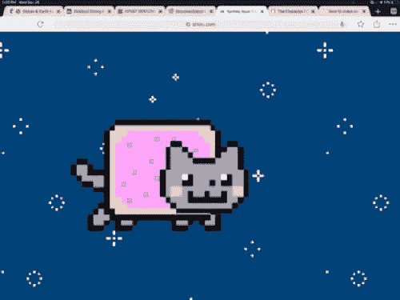

# 这个假期和孩子们一起做 5 个简单的编码项目

> 原文：<https://medium.com/hackernoon/5-easy-coding-projects-to-do-with-kids-this-holiday-3fc62780f604>

想为下一代的代码未来做好准备吗？想让他们知道编码也可以很有趣！

这里有 5 个你可以在一个小时或者假期的一个周末完成的项目。他们适合青少年。

# 什么年龄？

我的孩子分别是 7 岁和 3 岁，我不会和我 3 岁的孩子坐下来尝试这些。有一些很棒的游戏可以教年轻人计算机的逻辑，比如 iPad 版的 Kodable。

如果每次你说“关闭花括号”时，你的孩子都要花 5 分钟扫描键盘并试图按住 shift 键，他们会很快感到沮丧。

所以年龄实际上可以归结为以下几个因素:

*   他们使用鼠标和键盘的技能
*   基本算术
*   他们在一项任务上静坐不动的耐心

# 贸易工具

如果你的孩子有幸在这个假期得到一盒乐高玩具。你有没有注意到他们打开盒子开始玩的速度有多快？不用翻抽屉找备用的 D-cell 电池，不用摸索小螺丝刀。孩子们都在掌控之中。

如果在他们开始有创造力之前，他们不得不安装软件、解决问题并不断向你寻求帮助，你很容易失去他们的注意力。

我在这里列出的所有项目都有最小的设置，并且不需要昂贵的硬件。

# 1.《我的世界》航海水上挑战(块状)

微软与 code.org 合作，基于 2D 版的《《我的世界》》创建了一系列挑战和教程。如果你的孩子喜欢《我的世界》，这可能是一个让他们向你解释角色是什么并分享他们对 3D 世界的热情的好方法。

这些教程是基于 code.org 工作室，这是一个“块状”拖放逻辑块环境。它确实可以在平板电脑上运行，所以对 5 岁以上的儿童来说非常棒。

[我喜欢这些挑战的一点是，](https://code.org/minecraft/facilitator)他们为不同年龄组和不同语言制作了辅导员指南。如果你的孩子母语不是英语。

这些教程中的工作室环境被限制为简单易用，但是一旦孩子们熟悉了这些基于块的编程工具，他们就可以从头开始了。

# 2.阿尔·斯威加特的 Scratch 编程游乐场

Al Sweigart 是一位很受欢迎的初学者编程书籍的作者。他写了一本书[，这本书也可以在网上找到](https://books.google.com.au/books/about/Scratch_Programming_Playground.html?id=HZG7DQAAQBAJ&printsec=frontcover&source=kp_read_button&redir_esc=y)，里面有一套可以从头开始构建的游戏。Al 也在 YouTube 上录制了许多这样的教程。

能够遵循简单的指示是一项了不起的技能，但如果孩子是新手，他们将需要你的帮助。在做这些练习之前，先熟悉一下是很有用的。

一旦他们建立了游戏，你就可以讨论每个逻辑块做什么，并尝试改变游戏的一些参数。

许多学校使用 Scratch，但是一个班有 20-30 个孩子，老师通常不太了解 Scratch，这是一个一对一教学的机会。

# 3.动画精灵(JavaScript)

非常适合有创造力的孩子，向他们展示如何使用与任天堂 80 年代和 90 年代相同的技术将他们的画变成现实。

[Spritely 有一个最简单的 API，](http://spritely.net/documentation/)你可以使用任何绘图应用程序创建一系列图像，或者在纸上绘图并扫描图片。

如果你想抓住他们的注意力，看看你如何制作有趣的动画人物，就像这个 [NyanCat](http://shiou.com/nyancat/) 。

这需要最少的编码和零设置。你可以开始使用任何像样的浏览器，并在 [codepen.io](https://codepen.io) 上创建一个账户。

# 4.构建一个 bot (Botkit.io，JavaScript 可选)

我喜欢这个项目，因为设置是最少的，它可以扩展到更复杂的用例。

试着想出一个与孩子们的兴趣和爱好相关的主意。讨论机器人的角色，给它起个名字，画个头像，保持趣味性。怎么样:

*   会讲笑话的机器人？
*   一个能和你谈论他们最喜欢的运动的机器人？

有一个免费的在线工作室，可以使用块状风格的界面设计机器人。

还可以下载 node.js 的 botkit SDK，在 node (JavaScript)中本地开发 bot。

微软也有一个机器人框架和更多商业应用的工作室。

# 5.用 Unity 黑一个游戏(C#)

Unity 是一个框架和游戏引擎，拥有免费和付费资产的生态系统，如人物、音乐甚至整个 3D 或 2D 世界。

在 C#中学到的技能与 Java 非常相关，可以移植到 Java 中。如果你的孩子想在利润丰厚的企业软件开发领域谋得一份职业，这可能是适合他们的项目！

说真的，Unity 有一些很棒的入门包，它是领先的游戏引擎和生态系统之一。

坐下来从头开始写一个游戏，即使对于最有经验的开发者来说也是一个严肃的项目。它需要对数学、物理和面向对象编程有相当好的理解。

Unity 在网站上有一系列演示游戏，免费提供给 https://unity3d.com/learn/resources/downloads

为什么不尝试黑掉它们，改变物理特性，看看游戏如何反应？可以加入新的游戏规则和概念吗？可以添加自己的角色吗？

在这个练习中学到的技能与任何软件职业都非常相关。如果你想学习一门新的语言，你可以从阅读别人的源代码开始，改变它看看会发生什么。

玩得开心！