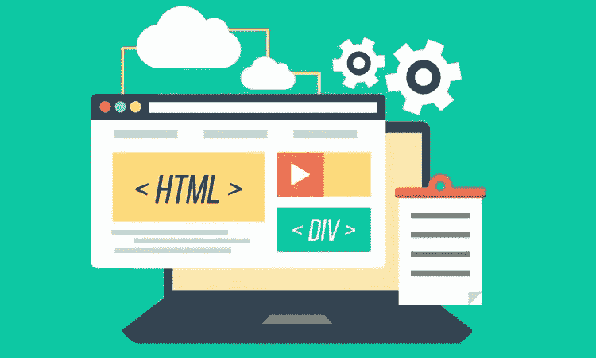
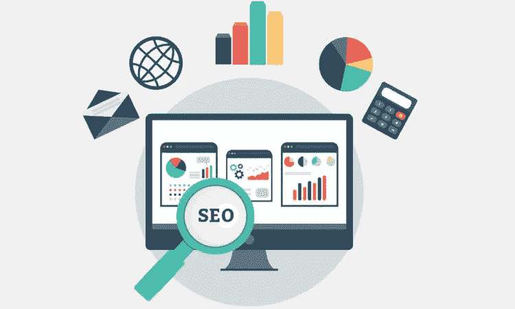

# 2018 年您的企业需要的 5 种电子商务营销策略

> 原文：<https://medium.com/hackernoon/5-ecommerce-marketing-strategies-your-business-needs-in-2018-83e1fab0455b>

你的电子商务网站已经上线，做得很好，但是下一步呢？你需要有一个无人能与之竞争的强大的营销策略。为了做成一笔生意，你需要让你的潜在客户看得见你。网上商店的营销策略是不同的方式，从砂浆和石头之一。正确的营销策略可以让你发财。

来看看 2018 年你的企业需要的 **5 个电商营销策略**。

# 1.一个易于浏览的有吸引力的网站

你的商店是在线的，因此它必须看起来有吸引力，才能给你的新访客留下第一印象。 [**打造一个不言自明的网站**](http://www.nethority.com/services/web-design-development/) 。该网站应该有一个恒定的所有页面布局。不要选择明亮或黑暗的颜色来使某些内容吸引眼球，因为这可能会困扰眼睛。

一件非常重要的事情是建立一个用户友好和易于导航的网站。当客户访问你的网站时，他应该能够很容易地找到他正在寻找的产品。

现在，作为一个电子商务网站，您的网站可能有数千个页面，而且每天都有更多的页面添加进来。因此，管理这些产品页面非常重要。确保将产品分成适当的类别和子类别。现在，一旦决定了类别，就在菜单中添加到这些类别页面的链接。该菜单应该可以访问所有的主要类别页面，这些类别页面应导致产品页面。

你的网站主页应该可以很容易地通过菜单或者标签和横幅访问所有的产品页面。在主页上，你可以添加横幅和滑块来炫耀你提供的折扣和优惠。

Nethority.com

# 2.创造好的内容

正如所说，“内容为王”。你的网站必须有好的独特的内容来描述你的网上商店和产品。请一个好的内容作家为你的网站写内容。内容必须是独特的，易于阅读和信息丰富。

既然你是在网上销售产品，每件产品都应该有一个产品说明，详细说明产品的每一个细节。添加一个评论部分，您的客户可以在这里评价和评论您的产品。您的客户在做出购买决定之前会阅读产品说明、查看评论、查看产品图片。

写博客总是一个添加内容和推广内容的好主意。你可以在你的网站上开一个博客，在那里你可以写一些与你正在销售的产品相关的博客。在各种社交媒体平台上分享这些博客。博客甚至可以吸引一些买家到你的网站。

# 3.别忘了 SEO

你有一个网站，但如果你的客户在谷歌的第一页看不到它，因为你的竞争对手已经占领了那里的空间，该怎么办？你必须被看到，以获得流量到您的网站。

如果你认为创建一个网站就足以满足你的电子商务业务，那你就错了。网站开发完成并在互联网上上线后，需要针对搜索引擎进行优化。搜索引擎优化使你的网站在搜索引擎上有机可见。确保你确定了正确的关键词，并在你的内容中恰当地使用这些关键词。用适当的关键词和元描述来起草标题，吸引客户点击你的网站。你的网站需要页面内和页面外的优化，以使其搜索引擎友好。

*变得太专业了？*

最好雇佣 [**电子商务搜索引擎优化代理**](http://www.nethority.com/services/e-commerce-seo-services/) 来优化你的电子商务网站搜索引擎。

Nethority.com

# 4.通过社交媒体提高品牌知名度

你的店是新的，还不流行。因此，你需要对你的商店进行品牌推广。社交媒体平台是最好的开始。在[脸书](http://facebook.com/)和 [Instagram](https://www.instagram.com/) 上创建你的在线商店的商业页面。还要通过 LinkedIn、Twitter 和其他社交媒体门户来推广你的商店。社交媒体是一个与你的客户直接交流和营销的好地方。

定期在你的网页上张贴展示你的产品的吸引人的图片。与对你的帖子发表评论的人互动。加入有电子商务企业主参与的小组和讨论。你甚至可以举办一些比赛，并宣布赠品来传播你的新在线商店。赠品永远是增加你的页面点赞和追随者的最佳方式，而且，你的品牌会被很多人所熟知。

你甚至可以雇佣 [**社交媒体营销专家**](http://www.nethority.com/services/social-media-marketing/) 为你做营销，因为他们能更快带来效果。

# 5.重新定位，让你的客户回来

许多客户访问了您的网站，却没有购买就离开了。现在，重新定位将帮助你带回那些客户。

重定向是一种在线展示广告的形式，广告从你的网站弹出后显示给你的买家。重定向跟踪您的客户，以查看他们最近在您的网站上查看了哪些产品，当他们离开您的网站时，您的产品的显示广告会在他们浏览互联网时显示给他们。

例如，如果一个人一直在你的网站上查看耐克鞋，他点击返回浏览其他网站上的其他内容，耐克鞋广告将显示给他，点击后他会再次进入你的网站。因此，你将重新赢得顾客，这一次他更有可能购买。

这不是很棒吗？

这 5 个营销策略保证给你的网站带来更多的流量。一个有吸引力和用户友好的网站将是你的商店的第一印象。确保第一印象最好。独特和相关的内容可以为你的网站增加很多价值。搜索引擎优化是一个必须做的策略，你不应该跳过，因为这是在谷歌排名的唯一方法。利用社交媒体来宣传你的新网店。应该选择重新定位来挽回失去的顾客。