# 5 个免费工具，让你的 SaaS 登陆页面转换更多

> 原文：<https://medium.com/hackernoon/5-free-tools-to-make-your-saas-landing-page-convert-more-6d4c193323b8>

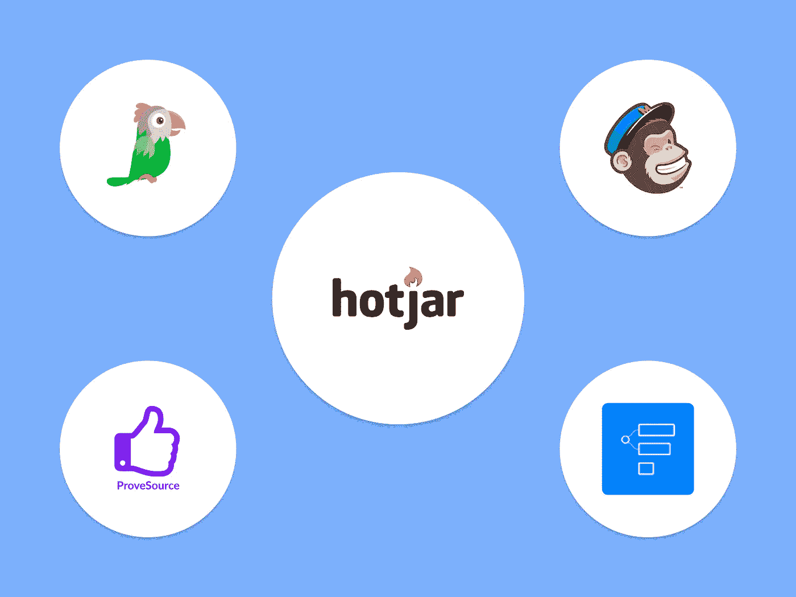

‍

实话实说，将访问者转化为顾客并不容易，尤其是如果你没有专业知识来正确定位他们的话。

在这篇文章中，我将向你展示如何使用 5 个免费的[工具](https://hackernoon.com/tagged/tools)，帮助你弥补没有理想的转换驱动的[登陆页面](https://hackernoon.com/tagged/landing-page)/网站的不足。

这并不能取代用一个好的登录页面来获得客户的正确方法，但它仍然可以帮助那些努力获得客户的人。如果你实现了这些免费工具，并获得了一些客户，这就是真正的免费！

‍

# 托托

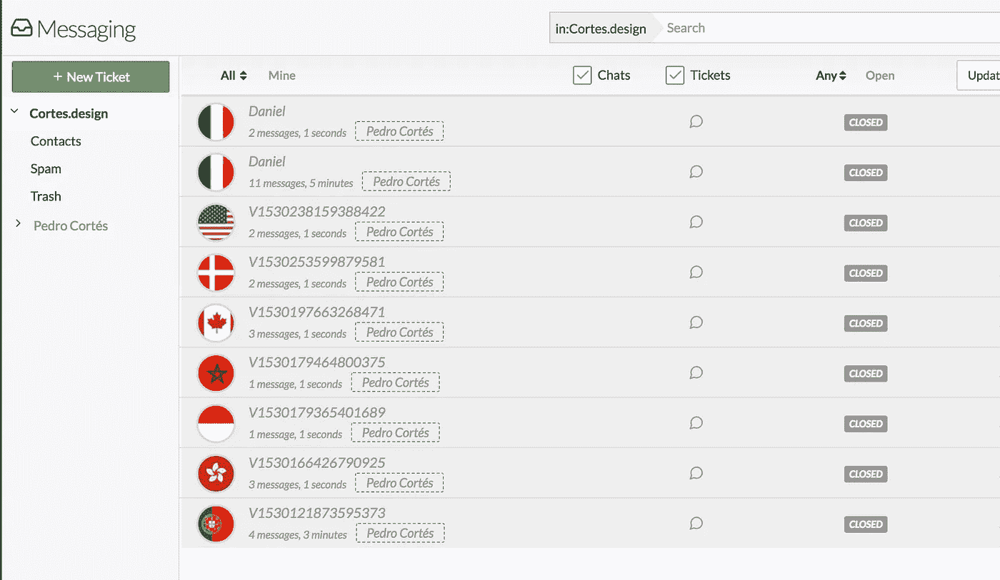

Conversations from my own leads

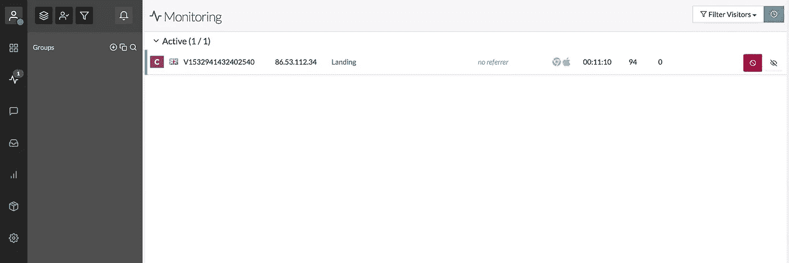

Chat with live visitors manually (if you want)

‍There 是许多你可以使用的聊天工具，但大多数都需要付费才能使用非常重要的功能，如:

*   确保你可以在它最有价值的时候触发它，比如在 faq 和定价页面。
*   控制办公时间，能够离线留言。
*   能够让团队中的多个人参与自由计划中的对话。
*   你可以监控访客，手动开始聊天(如果你愿意)。

唯一的缺点是有些设置不是很用户友好，但一旦你习惯了，这是一个很大的价值！

‍

# ‍Hotjar

这是我最喜欢的分析工具，也是这个列表中最有价值的！如果你一天的访问量少于 2000 次，你可以免费使用它。

有很多分析工具都有类似的功能，但是你不能在它的价值上打败 Hotjar，因为其他工具可以为完全相同的功能收取大约每月 200 美元的费用！

**以下是对 SaaS 登陆页面最有用功能的概述。**

‍

# 观察用户做什么是最好的分析方式！

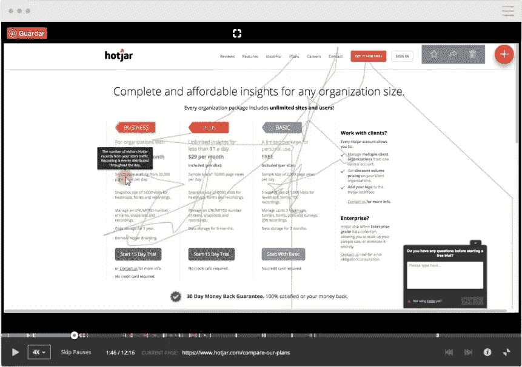

‍Image from Hotjar.com

‍This 是你能得到的最有价值的东西。在 Google Analytics 上看一堆数字，尤其是对那些经验不足的人来说，根本不能说明问题的全部！

通过观看真实访客的录像，你可以专注于重要的事情，比如:

*   ‍Where 游客会被卡住吗？
*   他们决定离开哪里？
*   什么可能还不够清楚？

想了解分析的 80/20 和这些重要指标吗？这是我免费电子邮件课程的第一步，[你可以在这里注册。](http://www.cortes.design/email-course)

# 热图

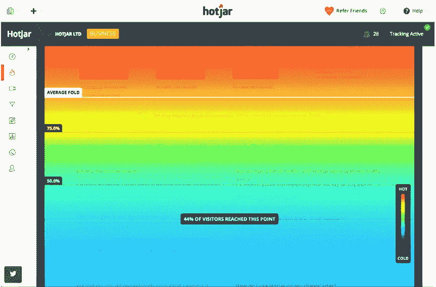

‍Image from Hotjar.com

如果您想要浏览所有记录，只需设置热图即可。

热图可以让你预览你的访客停留的时间，他们离开的地点，以及有多少流量可以看到你认为对销售/转化重要的东西。

‍

# 漏斗分析

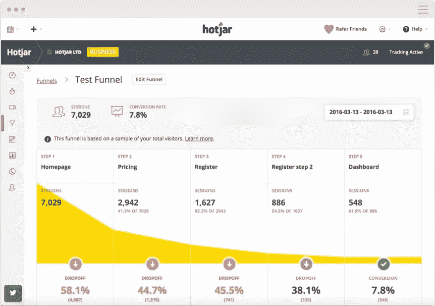

‍Image from Hotjar.com

‍This 是一个非常有用的功能！这可能看起来很简单，但我使用过的其他工具中，没有一个工具能让我如此容易地了解漏斗中的哪一步(或哪些步骤)没有发挥应有的作用。你只需要插入网址，它能够跟踪这些转换。

这也很好地告诉你应该关注漏斗的哪个部分，因为在不会给你带来更多结果的事情上浪费时间是非常容易的。创业公司不能浪费时间，更不能因为不知道改变什么而让转化变得更糟。

‍ **如果你想更有创意一点，你甚至可以分析表格的每一步！**

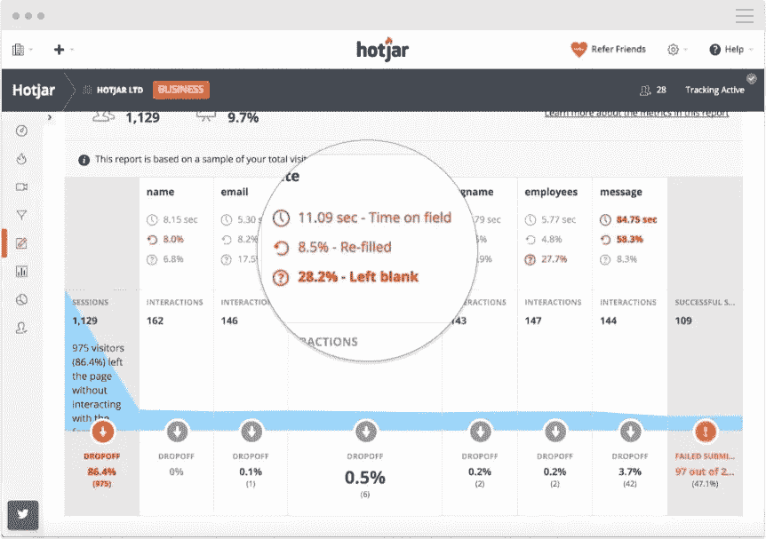

‍Image from Hotjar.com

‍

# 证明资源

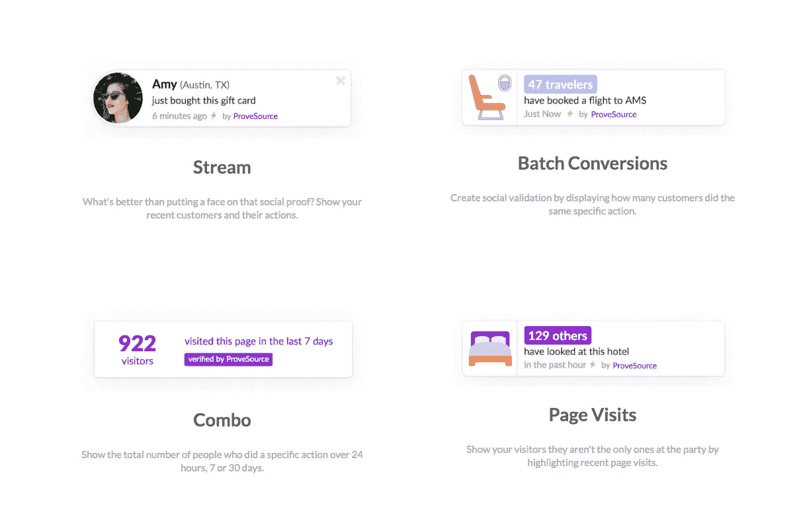

ProveSrc.com

这让你的社交证明达到了一个全新的水平！

它每月最多可免费访问 1000 次，让你可以控制它的行为、显示的信息和显示的位置，此外，它还可以在免费帐户中弹出几个窗口(不像类似的工具)。

人们对推荐越来越麻木，所以动态弹出窗口将帮助你在不同的页面和购买过程的不同阶段推广理想的社会证明，这是非常强大的东西！

‍

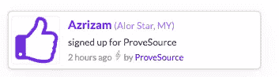

Use Case for ProveSource

‍ **这里有一些专门针对 SaaS 登陆页面的用例:**

*   显示有多少人在登录页面注册。
*   在定价页面显示有多少人购买了“X 计划”，以使潜在客户更有可能采取行动。
*   显示过去 X 天内访问过您页面的人数。
*   如果访问者也在表单的某个部分，显示有多少人完成了表单。

‍

# MailChimp

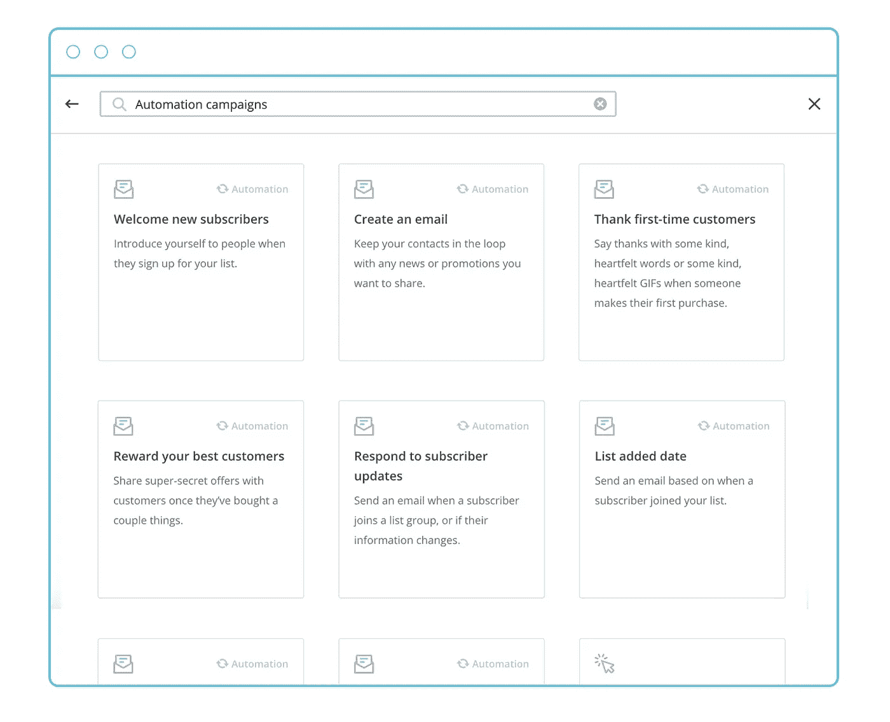

Mailchimp.com — Email automations

‍Of:你当然听说过 MailChimp，**但是你正确使用它了吗？**

不幸的是，大多数人不会马上准备好改变信仰，所以你需要跟进他们！

你是如何获取这些电子邮件地址，并创建一个简单的活动，试图得到至少一部分转换后呢？

MailChimp 能让你免费为多达 2000 人做这件事，**抓住并跟进 2000 条线索能带来多少收入？**

‍

# 漏斗学

‍

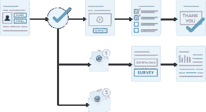

Funnelytics.io

‍This 一号可能看起来有点不寻常，但最大限度地利用你的网站并使其成为获得客户的工具是极其重要的。

漏斗网允许你 100%免费设计漏斗。

你可以定义和重复用户应该如何在你的网站上流动，并计划与他们保持互动的方式，教育他们了解你的产品，并试图在他们离开你的网站之前转化他们。

你甚至可以计划更复杂的渠道，包括电子邮件活动，让人们回到网站。

## ‍

## **为什么我要展示这个工具？**

就像我在 Mailchimp 一节中所说的，你需要一种方法来跟进大多数潜在客户，这些客户目前还没有准备好转化(或者需要更多信息)。

登陆页面不会转化所有人，相反，你需要将不同的人群发送到网站的不同部分，以长期转化他们。

我制作了一个简短的视频，解释了你如何能想出这样一个漏斗，从你的登陆页面产生可预测的收入，以及为什么大多数创业公司都没有做好。这是视频的链接。

‍

# 最后的想法

这些工具不能代替修复转换不良的登录页面，但是，它可以让您进行补偿，甚至可以让您获得一些关于以后可能需要更改的内容的反馈。

这些工具是免费的，如果你能用这些**获得更多的客户，我真的会给你免费的钱。**不客气！

## 📺[免费视频]

# 打破我用来帮助 SaaS 初创公司将访客转化为客户的漏斗

[**下面是视频的链接**](http://bit.ly/2Na6Of6)

# 📨需要帮助你的网站创收吗？

我很乐意讨论你的问题，所以请在评论中告诉我你的现状、需求或目标👇或者…

[**服务**](http://www.cortes.design/pricing)

**想聊天？** [此处安排免费咨询](http://www.cortes.design/consultation)

**邮箱:** pedro@cortes.design

## 关于 SaaS 登陆页面的进一步阅读

你可以在我的博客上找到关于为 SaaS 优化网站的每周文章。

 [## 没有转换？以下是您的登录页面无法转换的 4 个原因

### 根据我的经验，我可以告诉你，大多数页面转换不好的原因至少可以归结为以下四点之一…

www.cortes.design](https://www.cortes.design/post/some-traffic-but-no-conversions-here-are-4-reasons-your-page-is-not-converting-any-why)  [## SaaS 登陆页面如何在几秒钟内创造黑仔印象

### 如果你不能在人们访问你的网站的前几秒钟给他们留下好印象，你就没有机会…

www.cortes.design](https://www.cortes.design/post/how-saas-landing-pages-can-create-a-killer-impression-in-seconds)  [## 打破旨在获取更多线索的 SaaS 登录页面

### 在这篇文章中，我将向你展示我是如何设计一个概念页面来捕捉线索的，在这种情况下，它是…

www.cortes.design](https://www.cortes.design/post/breaking-down)  [## 围绕异议设计登录页面！

### 在我的每一篇文章中，我都试图解释可以改进产品的通用技术…

www.cortes.design](https://www.cortes.design/post/design-landing-pages-around-objections)  [## 优化 SaaS 登陆页面的交通温度

### 这些人对你的产品、你的公司或者你如何解决他们的问题一无所知，而你可以…

www.cortes.design](https://www.cortes.design/post/optimizing-for-traffic-temperature-in-saas-landing-pages)