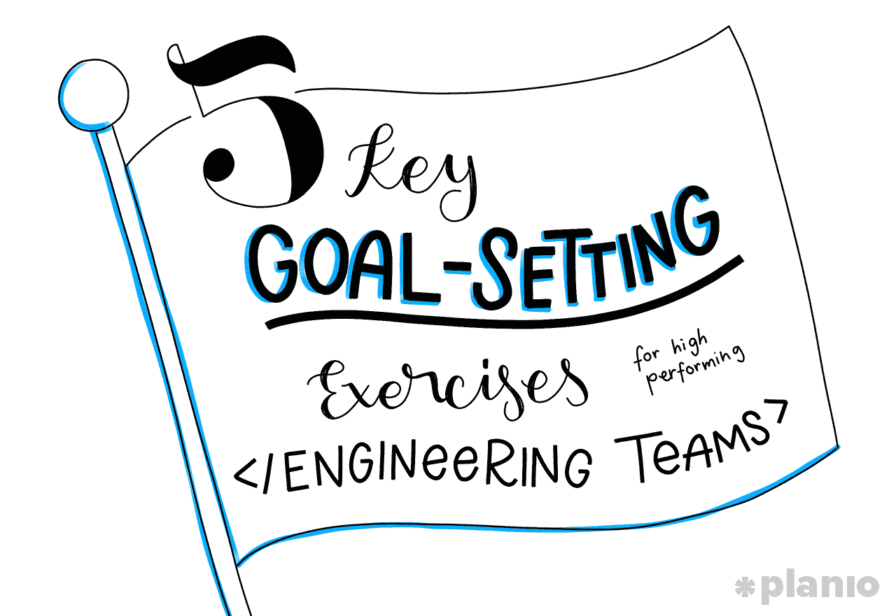
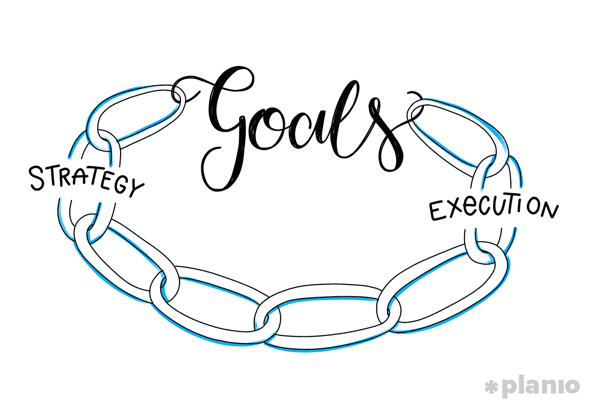
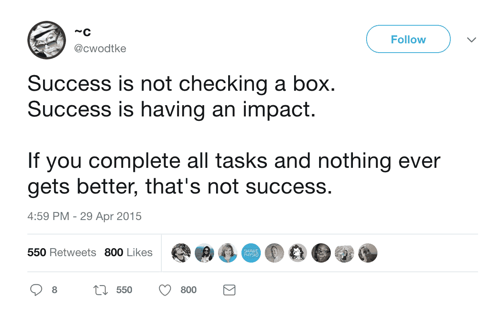
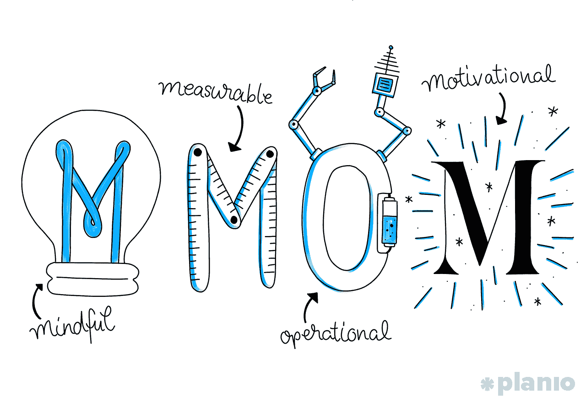

# 来自谷歌、LinkedIn、Dropbox 等公司工程团队的 5 个目标设定练习

> 原文：<https://medium.com/hackernoon/5-goal-setting-exercises-from-the-engineering-teams-at-google-linkedin-dropbox-and-more-1476db95eaab>

## 世界顶级技术团队如何设定和实现目标

> *“除非我们有一个目标，否则根本没有理由让个人去尝试合作，或者让任何人去尝试组织他们，”*

传奇管理顾问林达尔·f·厄威克在 1964 年的《哈佛商业评论》中写道。

好吧。我们在一篇关于 2018 年目标设定的帖子里引用一篇 50 多年前的文章做什么？

嗯，因为尽管我们所有的技术和社会进步，我们似乎仍然在这个问题上挣扎。

正如专注于战略的组织[*的作者*](https://www.bizjournals.com/bizjournals/how-to/growth-strategies/2014/09/aligning-organization-requires-effective-leader.html)所发现的，如今只有 **7%的员工完全理解他们公司的商业战略**以及为了帮助实现公司目标对他们的期望。

目标设定是一个严重的问题。一旦你的公司或团队[超越了一个房间的运作](https://plan.io/blog/how-to-manage-a-remote-team-and-stay-productive/)，确保每个人的目标都与公司的目的和愿景一致就不是一件简单的任务。

对于营销或销售团队来说，设定“获得 X 个用户”或“双邮件列表”这样的目标是很容易的但是对于技术团队呢？当你负责你的核心产品并需要对变化做出快速反应时，你不能坚持一成不变的静态目标。

那么，世界上最优秀的技术团队是如何在保持敏捷的同时关注最终目标的呢？让我们找出答案。

*这篇文章的一个版本最初发表在* [*Planio 博客*](https://plan.io/blog/goal-setting-exercises/) *上。查看更多关于项目管理、建立远程团队和创业繁荣的文章和实用技巧！*

# 目标是你的团队每天早上想要开始工作的原因

首先，目标设定不仅仅是告诉你的团队他们需要做什么。

如果处理得当，目标不仅仅是一个任务清单，而是一条通向公司愿景和目标的直线。

想一想这个数据:FitBit 用户比非用户多走了 43%的步数。为什么？事实证明，仅仅洞察他们的数据和朝着个人目标的进展就足以让人们每天增加额外的里程。

想象一下，如果你整个公司的每个成员都知道他们所做的工作正在推动整个组织前进，会发生什么。其实不用想象。

研究表明，[致力于一个目标可以帮助提高员工绩效](https://www.researchgate.net/publication/11152729_Building_a_practically_useful_theory_of_goal_setting_and_task_motivation_A_35-year_odyssey_American_Psychologist_579_705-717)和[有助于在整个团队中建立一种团结感和动力](http://amr.aom.org/content/13/1/23.abstract)。但更具体地说，研究表明 [*设定具有挑战性的具体目标*](http://onlinelibrary.wiley.com/doi/10.1348/096317909X468099/full) [可以进一步提高你的团队对实现这些目标的参与度](http://onlinelibrary.wiley.com/doi/10.1348/096317909X468099/full)。

为你的技术团队设定合适的目标不仅仅是让你的团队和开发人员与公司目标保持一致。它会带来更高的绩效、幸福感和主人翁感，并最终带来全面的成功。

正确的目标设定会起到润滑作用。它让你的团队比范·迪塞尔的头跑得更顺畅。如果事先做点工作，掌握起来并不难。

# 目标设定练习 1:有效的目标设定从顶部开始，逐级向下

如果你想为你的公司设定有效的目标，你需要确切地知道这个目标的内容。

光说“我们想做 X”是不够的，你需要清楚地定义 X 是什么，它为什么重要，你将如何实现它，以及你对帮助你实现它的每个人的期望是什么。

为了做到这一点，我喜欢把目标设定过程想象成一个纸牌屋。

最上面是你的公司愿景。它有最好的位置，并且(或者应该)对每个人都非常明显。但也很脆弱。如果底部的任何东西移动太多，整个事情都会崩溃。

那么是什么支撑着你的公司愿景呢？目标(以及子目标、目的和策略。)

目标是公司愿景的执行。

它们是将高级业务目标转化为可操作步骤的行动，因此您的团队所做的一切都在将您推向正确的方向。

作为 LinkedIn 产品的前 SVP，Deep Nishar，[解释了](https://www.youtube.com/watch?v=57PW9MZeFPM):

> *“没有卓越运营的愿景只是一个梦想。伟大的企业将目标意识与惊人的卓越运营相结合，并为如何实现这一愿景制定流程。”*

或者，正如麻省理工学院斯隆管理学院高级讲师 Don Sull 解释的那样:[目标是战略和执行之间缺失的一环](https://blog.betterworks.com/goals-missing-link-strategy-execution/)。他们为你的公司提供了一个线框，让你清楚地看到每个人在把那张卡安全地拿到最上面的过程中所扮演的角色。

问题是让所有这些部分协同工作并对它们有可见性是一个挑战。团队变得孤立。交流变慢。突然之间，你设定的目标与公司愿景不一致了。但是作为一个团队的领导者，你可以把它变得更好。

> *“随着团队和组织规模的扩大，传达你的价值观、阐述这些价值观的故事以及决策背后的背景变得非常重要，”*

[解释道](https://www.forbes.com/sites/quora/2017/04/17/what-seven-years-at-facebook-taught-me-about-scaling-products-organizations-and-teams/#45fb67a67d13) Kelly Graziadei 在脸书领导产品和营销团队达 7 年之久。

> 但是沟通经常被排在最后面。当你扩展你的团队时，这必须是最重要的。随着交流而来的是故事、优先权和背景。背景赋予工作意义，创造一致性，并给予人们做出决定的力量和信心。背景和良好的目标设定至关重要。”

这一切都始于围绕你设定的目标、你的成功文化进行沟通，然后将个人目标与更大的团队目标和你的公司愿景联系起来。

在我们开始讨论你应该为你的工程团队设定什么类型的目标以及如何设定之前，我们需要回答几个关于你通常设定的目标类型的问题。

这都是关于你公司的目标设定文化。你如何设定目标，你设定什么类型的目标，你如何知道这些目标的成功是什么样的？

# 1.作为一家公司，你设定了什么样的目标？

不是每个公司甚至个人都以同样的方式对待目标。

但是，为了让你们一起工作，支持将带你们到达那里的系统，每个人都需要知道目标线在哪里。换句话说，当你设定目标时，你设定的目标是:

1.  Moonshots(又名，几乎不可能击中)
2.  相当难(但你会击中他们 70%的时间)
3.  比你目前的技能和资源略多(80–95%的几率你会击中它们)
4.  在公园里散步(你会发现他们每周工作 20 小时)

现在知道这一点似乎并不重要，但请想一想:假设工程师 A 认为你正在设定 D 桶中的目标——简单明了。而工程师 B 认为你在 B 区设定目标——相当困难。当要检查每个人的进步时，会有各种各样的问题和不好听的话被扔来扔去。

为了让每个人都处于一个公平的竞争环境中，你需要知道这个环境是什么样的。最终，你的文化将决定这一点。所以，做出决定并[传达它](https://plan.io/blog/planning-and-running-fast-efficient-meetings/)，直到它成为你公司 DNA 的一部分。

# 2.成功是什么样子的？

击中目标=好。目标错过=不好。对吗？

也许吧。看情况。就像你需要定义你的公司追求什么样的*类型的*目标一样，你也需要知道*你如何处理达到或错过这些目标*。

Pinterest BlackOps 工程经理 Marty Weiner 解释说，以下是你可以选择的几个选项:

1.  你必须达到你的目标！
2.  努力实现你的目标。如果你做到了，那就太棒了。讨论如果你不这样做，什么会更好。
3.  目标只是指导方针。没什么大不了的。

只要把这些读出来，你可能就会明白，对于你的团队来说，意见不一致会有多尴尬。交流成功是什么样的有助于保持你的团队的一致性和积极性。

没有人喜欢自己失败的感觉。如果你认为一个问题(及其相关的目标)是一个“必须要达到的”，而不是一个指导方针，那么你处理这个问题的方式就会有很大的不同。

# 目标设定练习 3:使用 OKRs 为您的工程团队选择正确的目标

既然你已经了解了如何设定目标:

1.  你知道他们需要认同并支持公司的愿景
2.  你知道你要设定什么样的目标
3.  你知道对他们来说成功是什么样的吗

下一步是将公司愿景转化为可操作的目标，您的工程团队每天都可以朝着这些目标努力。

做这件事的一个好方法是使用 OKRs——或者说，目标和关键结果。

OKRs 最初由英特尔首席执行官安迪·格罗夫推广，现已被谷歌、亚马逊、Adobe、Dropbox、Slack 等主要科技公司用于将更高层次的公司目标与每个团队成员为实现目标所做的努力联系起来。

在 Grove 著名的手册*高产出管理*中，他通过提出两个问题介绍了 OKRs 的理念:

1.  **我想去哪里？**
2.  我怎么知道我什么时候到达那里？

**你的目标**是你努力的目标。它应该是定性的，鼓舞人心的，并与公司目标挂钩。想一想:让我们的主页成为最好的现场体验。(一般来说，韦纳和谷歌的领导层建议每个季度设立 3-5 个个人 okr。再多一点，你就有可能从真正需要完成的事情上分心。)

**你的关键结果**是你需要跟踪的衡量标准，以了解你是否在进步。关键结果应该是定性的，并指定一个测量窗口。例如，在 1 个月内降低 50%的站点加载速度。每个目标可能有 2 到 3 个关键结果。

关于 okr 要指出的一个主要问题是，它们应该很难。

你的目标不一定是你能在几周甚至一个季度内完成的事情，而不是真的无法完成。相反，一个好的经验法则是，一个目标的“成功”大约完成了 60-70%。这也是为什么对你设定的目标类型有一个共同的理解是如此重要。如果你有团队在合作，他们每个人都需要期望对方只达到 60-70 %,并采取相应的行动。

[正如 LinkedIn 首席执行官杰夫·韦纳](http://firstround.com/review/the-management-framework-that-propelled-LinkedIn-to-a-20-billion-company/)所描述的那样:

> “okr 是你想在一段特定的时间内完成的事情，倾向于一个延伸的目标，而不是一个既定的计划。这是你想要创造更大的紧迫感、更大的关注度的事情。”

对于你的工程团队，这意味着作为一个团队设定目标，然后**让每个人设定他们自己的目标**，这将帮助你更接近实现这些目标。

如果你正在使用敏捷或者 Scrum 项目管理，okr 仍然是一个很好的选择。它们不仅能确保你快速前进，还能定期重新评估你的前进方向。但是[他们通过将成功与一个更大的商业目标联系起来，帮助阐明成功不仅仅是一个产品特性。](https://www.infoq.com/articles/agile-goals-okr)

这是你真正开始看到目标如何支持你的公司愿景和目标的地方。

虽然你的使命、愿景和目标陈述了你希望你的公司做出的改变，但目标是用来衡量这些努力成败的工具。

因此，如果你的目标需要可衡量，那么显而易见的问题是:我们如何衡量它？

# 目标设定练习 4:使用 MMOM 指标来衡量您的目标进度

有各种各样的方法可以跟踪你在目标上的进展，但是一个好的测试是问你的妈妈。抱歉，我指的是 MMOM(有意义的、可衡量的、可操作的、激励的)。

# 你的指标有意义吗？

您的度量标准需要以某种非常明显的方式贡献或关联到您的业务目标。或者至少以一种很多人都能认同的方式。因此，如果你的总体目标是提高用户在你的网站上的体验，跟踪网站加载速度可能是有意义的。

当您有一个密切相关但不完美的指标时，就会遇到问题。正如 Pinterest 的工程经理马蒂·韦纳解释的那样:

> *“‘内容被标记的次数’有意义地衡量不好的体验吗？也许吧，但你更想知道‘某人有过多少次糟糕的经历’(这是无法衡量的)。”*

# 你的度量标准可以衡量吗？

您应该能够定期测量您的指标。很基本，对吧？因此，在我们的站点加载速度示例中，我们可以 A/B 测试更改前后的时间，以查看我们是否做出了积极的更改。

即使感觉你不能度量这个标准，也可能有一个方法可以。它可能不完美，但从任何事情开始都会帮助你向前推进，并寻找更好的方法。不要仅仅因为某个指标不明显，就抛弃它。

# 您的指标可行吗？

你能多快看到你的改变对你目标的影响？改变你的主页的背景颜色具有很强的操作性。你可以今天就做，看看几个小时后会不会有什么变化。衡量 30 天后有多少人会回到你的网站，并不那么容易操作。

您的度量对您所做的变更响应越快，您迭代的速度就越快。然而，这并不意味着你应该选择高操作性的。这取决于它们的意义。最好把它混合起来，包括一个对你的团队高度可操作的，和一个对公司其他人更有意义的不太可操作的。

# 你的衡量标准是激励性的吗？

你或你的团队实际上想在多大程度上推动这一指标？你和这里的人一起工作，人们对动力有反应。如果你了解你的团队(或你自己)，你应该能够自信地说出这个目标是否具有激励性。

如果不是呢？通常这可以通过将指标与更大的目标或目的联系起来来弥补(记住，这一切都是一起工作的！)[人们被各种不同的事情所激励:精通、声望、挑战、小吃。找到适合他们的方法，并尝试将指标与其联系起来。](https://plan.io/blog/11-solid-tips-for-a-highly-productive-work-day/)

**你的指标将决定你的时间表，以及你何时检查你的进度**

设定远大的目标和目的(记住，OKRs 应该很难！)意味着在你给自己的最初时间框架内，你可能不会击中它们。所以问题变成了在那一瞬间你能把这个度量移动多少？

一些指标应该覆盖整个季度，比如维护指标。而如果窗口太长，一些度量标准，尤其是涵盖快速改进领域的度量标准，可能会失去动力。

“选择你可以每天或每周追踪的目标，”脸书的 Kelly Graziadei 说。

> 你只能随着你的反馈速度而快速移动和改变路线。尽早并经常交流目标、进展、最佳实践和成功案例。”

一个很好的经验法则是寻找度量标准和关键结果，你可以在至少两周后检查。再短的话，通常会有太多的噪音。

# 目标设定练习 5:确保团队目标和个人职业目标相联系

到目前为止，我们只讨论了为您的工程团队设定团队目标。但是在个人层面上，[有效的目标设定](https://blog.rescuetime.com/effective-goal-setting/)也能解决团队成员的个人轨迹。

我们都想做能给我们带来渴望的东西的工作:声望、认可、晋升。像对待机器中的齿轮一样对待个人意味着他们会去寻找更好的东西。

“当你是一名技术经理时，你的工作主要是与人有关，”[聊天初创公司 Zulip 的联合创始人杰西卡·麦克凯勒](http://firstround.com/review/this-is-what-impactful-engineering-leadership-looks-like/)说，Zulip 已被 DropBox 收购。

> “有两件事你应该永远记住:人们的日常生活和他们的年复一年。”

这可能意味着围绕学习或更好地掌握新的编程语言和平台来设定目标。或者了解团队成员的兴趣领域，并确保他们的日常任务符合他们的兴趣。

你想一直提升团队中的每个人。处决就会随之而来。

# 工程团队的目标设定在实践中是什么样的

好了，在看一些为技术团队设定目标的例子之前，让我们快速回顾一下一切:

*   第一步:你的公司需要一个与目标一致的愿景
*   **第二步:**你需要一个清晰的文化，知道你设定的目标是什么类型的，成功是什么样子的
*   **步骤 3:** 你的团队应该设定与业务目标相关的目标，而不仅仅是产品特性
*   **步骤 4:** 每个人负责制定与团队目标相关的季度 okr
*   **第五步:**每个 OKR 都需要用 MMOM 标准衡量的关键结果

目标从你的公司愿景向下级联，而 okr 更快，允许你以敏捷的方式改变路线和重新定义团队级别的目标。

那么，这一切在实践中是什么样子的呢？

假设我们的团队负责一个面向用户的网站，比如博客或营销页面，我们希望改善用户体验。

*   **目标:**提高网站的性能
*   **关键成果 1:** 将本季度最后两周测得的网站可用性(即正常运行时间)从 97%提高到 99%
*   **关键结果 2:** 将站点加载时间从 5 秒减少到 3.5 秒

我们提高性能的目标与我们创造更好的用户体验的目标直接相关。而我们的主要结果涉及可用性和性能/速度，这两个因素与我们的目标直接相关。

最重要的是，我们的主要结果也讲述了一个相当不错的 MMOM 故事。

它们**有意义**，因为它们与我们的目标相关联，帮助我们实现创造更好体验和吸引更多客户的最终目标。

它们也很容易**测量**，因为我们有工具可以轻松地对加载时间和可用性进行基准测试，并查看我们的改进和优化如何有所帮助。

**从操作上来说**，第一个关键结果是在几周内测量的，这可能有点长。然而，通过添加第二个关键结果，它不是在一个更长的时间内测量的，你的工程师就有了可以测量和快速迭代的东西。

最后，网站性能会影响从转化率到 SEO 的一切，所以这是一个很好的激励目标！

目标设定对你业务的所有部分都很重要。

但是当涉及到为你的工程团队设定目标时，你需要在你的过程中特别勤奋。目标是创造共同愿景的绝佳机会。来推动贵公司的宗旨。挑战你身边的天才团队。

确保每个人都知道你如何以及为什么设定目标。将个人目标与公司愿景联系起来。确保每个人都有让他们每天都有动力和灵感去工作的标准。

# 嘿，我是乔里！

我帮助公司和有趣的人通过巧妙而专注的写作讲述他们的故事。想一起工作吗？给我发邮件到 hello@jorymackay.com

*这篇文章的一个版本最初发表在* [*Planio 博客*](https://plan.io/blog/goal-setting-exercises/) *上。查看更多关于项目管理、建立远程团队和创业成功的文章和实用技巧。*