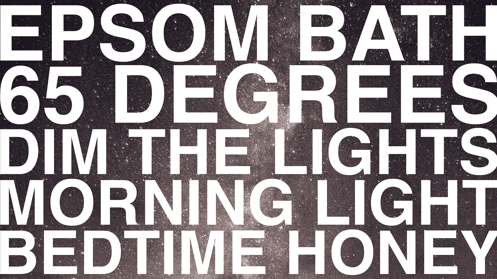
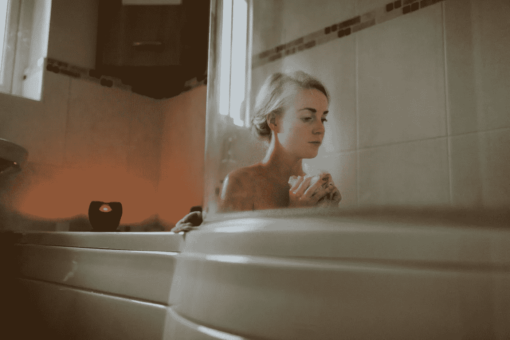
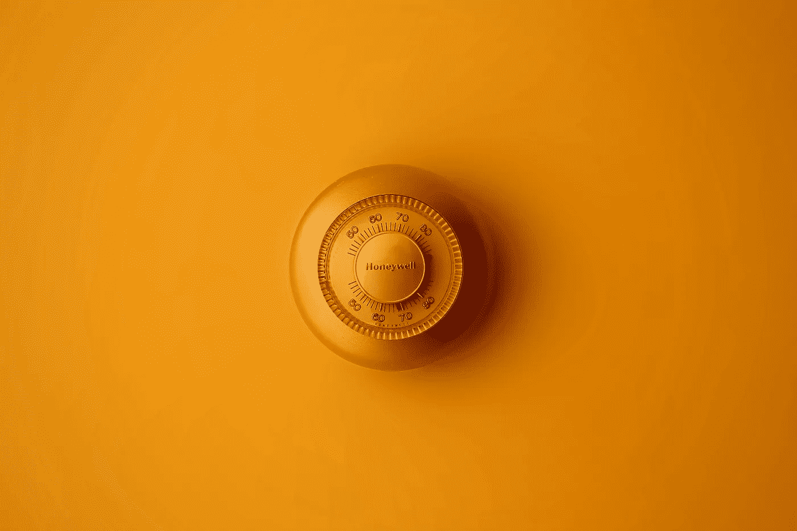
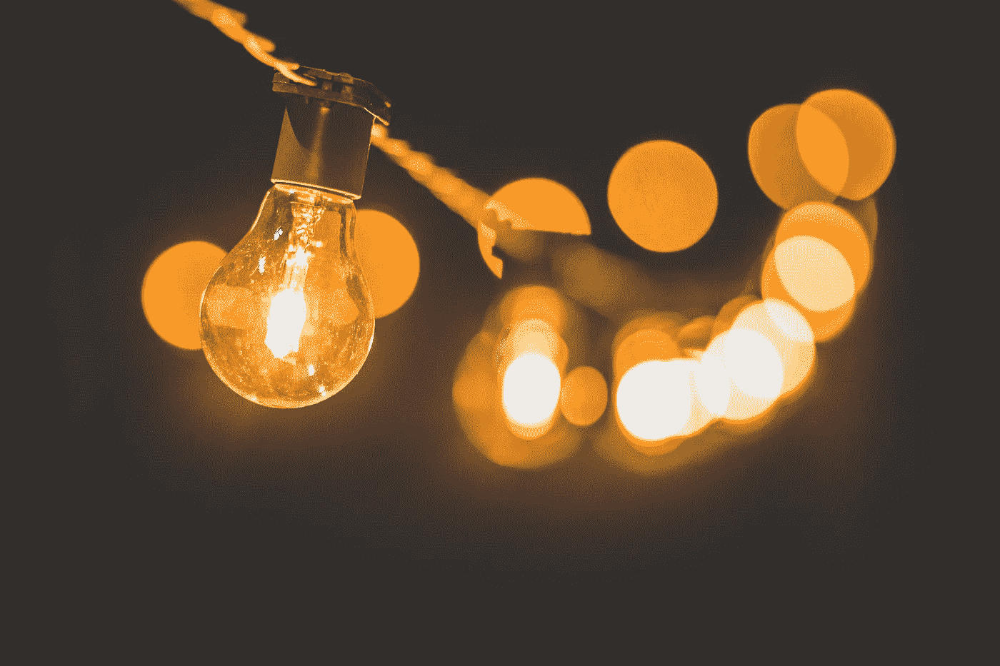
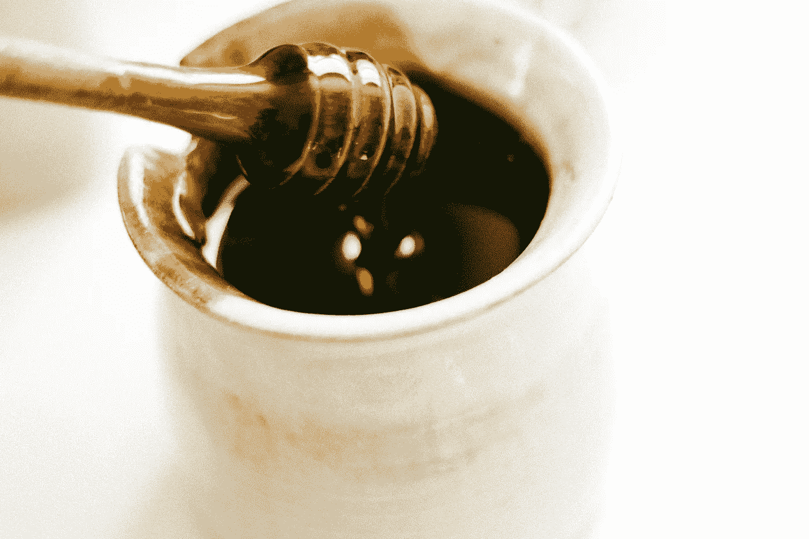

# 有史以来最佳睡眠的 5 个秘诀

> 原文：<https://medium.com/hackernoon/5-hacks-for-the-best-sleep-ever-50cd3079c546>

我们都知道睡了一夜好觉后感觉有多好。但是我们大多数人都没有得到足够高质量的睡眠。睡眠不足会损害我们的情绪、健康和表现。

让我们解决这个问题。这里有 5 个简单又便宜的方法可以让你睡得更好。

在 Youtube 上观看此视频[。](https://www.youtube.com/watch?v=kfNKlRiWUpk)

# 1.用泻盐洗个热水澡

Photo by [Mitchell Orr](https://unsplash.com/photos/wLqo3pgLB7k?utm_source=unsplash&utm_medium=referral&utm_content=creditCopyText)

热水澡将热量带到身体表面，离开浴缸后迅速冷却身体核心。核心的快速冷却是对你身体的一个触发，是时候睡觉了。

再加上泻盐，一种必需的矿物质镁的来源。[泻盐浴](https://www.livestrong.com/article/121914-benefits-epsom-salt-baths/)可以帮助肌肉放松，减少疼痛和炎症，使血压正常化，对抗失眠，甚至使皮肤更柔软。

许多成年人缺乏镁。[低镁含量](https://draxe.com/magnesium-deficient-top-10-magnesium-rich-foods-must-eating/)与老年痴呆症、心脏病和多动症有关。

我发现热水澡和泻盐的结合让我睡得像个婴儿。

为了达到最佳效果，请在睡前一小时内洗澡。洗澡应该持续至少 10 分钟。

你通常可以在杂货店和药店买到一大袋泻盐，只要几美元。或者你可以在亚马逊 *上买个包[。](https://www.livestrong.com/article/121914-benefits-epsom-salt-baths/)

# 2.调低恒温器的温度

Photo by [Kenny Pascal](https://unsplash.com/photos/vO9-gal54go?utm_source=unsplash&utm_medium=referral&utm_content=creditCopyText)

正如温水浴可以降低体温，促进睡眠一样，凉爽的环境也可以。[研究表明](https://www.huffingtonpost.com/dr-christopher-winter/best-temperature-for-sleep_b_3705049.html)最佳的夜间室温大约在 60°F 到 70°F(16°C 到 21°C)之间。一个很好的中间温度是 65 华氏度(18 摄氏度)。

如果 65°F 对你来说真的太冷了，你可以随时用被子和衣服来取暖。所以，睡前一小时，把你的恒温器调低到 65 度。

# 3.调暗灯光

Photo by [Luis Tosta](https://unsplash.com/photos/XpEIpQ6JDKY?utm_source=unsplash&utm_medium=referral&utm_content=creditCopyText)

我们的身体有一个内部时钟，被称为[昼夜节律](https://en.wikipedia.org/wiki/Circadian_rhythm)，它告诉我们什么时候感到清醒，什么时候感到困倦。当我们的环境中有大量蓝光时，例如白天的阳光，昼夜节律会获得一个信号，即现在是白天。

不幸的是，现代灯和电子屏幕也发出大量蓝光。所以，我们的昼夜节律被骗以为一直是白天。

当昼夜节律与昼夜周期不同步时，第二天的睡眠质量和表现就会受到影响。

减少夜间蓝光的一些方法包括:

*   调暗灯光
*   关掉吸顶灯，使用昏暗的灯泡
*   调暗设备上的显示屏
*   在你的设备上使用像 [f.lux](https://justgetflux.com/) 、[夜班](https://support.apple.com/en-us/HT207570)和[暮光之城](https://twilight.urbandroid.org/)这样的应用
*   戴着[蓝光阻隔眼镜](https://www.swanwicksleep.com?rfsn=970855.b19aca) *

当你运用这些策略时，你也会注意到更温暖、更暗的光线会让人感觉更舒服。

# 4.获得充足的晨光

Photo by [Edgar Moran](https://unsplash.com/photos/hLVkdmLU_V4?utm_source=unsplash&utm_medium=referral&utm_content=creditCopyText)

蓝光是[不全是坏事](/@yeutterg/whats-so-bad-about-blue-light-b04e13a801df)。你实际上希望白天暴露在蓝光下，以帮助同步你的生理节奏。

最好的方法是早上出去至少 10 分钟。这将告诉你的生物钟现在是白天，甚至可能降低夜间对蓝光的敏感度。这也能让你感觉更有活力。

不要喝清晨的咖啡，而是去晨间散步。

# 5.睡前吃一勺蜂蜜

Photo by [Sonja Langford](https://unsplash.com/photos/RQHzRELE2Ss?utm_source=unsplash&utm_medium=referral&utm_content=creditCopyText)

睡前一小勺蜂蜜[可能提高睡眠质量](http://archives.sethroberts.net/blog/2013/11/05/honey-at-bedtime-improves-sleep/)。一些人甚至声称睡前添加蜂蜜可以增强体力。

为什么会这样？[两个原因](https://draxe.com/the-many-health-benefits-of-raw-honey/):

*   蜂蜜补充肝脏中的糖原，防止大脑在半夜认为它没有气了
*   吃蜂蜜会产生胰岛素峰值，刺激大脑中色氨酸的释放。色氨酸转化为血清素，血清素再转化为褪黑激素。褪黑激素可以帮助你入睡

睡前蜂蜜的最佳量是一茶匙到一汤匙。超过这个时间，就会对睡眠产生负面影响

虽然任何种类的蜂蜜通常都有效，但还是要尝试寻找天然蜂蜜，这是一种抗氧化剂。你可以在一些杂货店或者亚马逊上买到生蜂蜜。

所以，这些是我的五大睡眠秘诀。给他们打一针，让我知道他们的进展。也许你今晚会睡得更好。

感谢阅读。如果你喜欢这篇文章，请点击上面的按钮，与你的朋友分享。我也鼓励你留下评论，[注册](https://goo.gl/forms/FVpO8AsXp6zCUUA72)我的电子邮件简讯，或者[直接联系我](https://gregyeutter.com/contact)。

*我可能会从点击代销商链接后的购买中获得一小笔佣金。