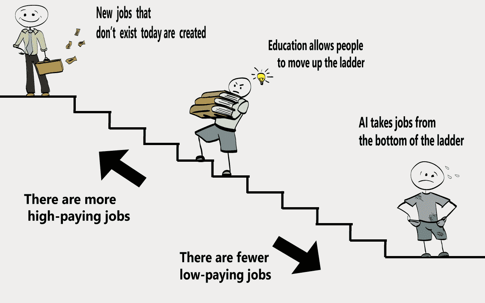

# 5 小时法则:为什么你应该花时间学习

> 原文：<https://medium.com/hackernoon/5-hour-rule-why-you-should-spend-time-learning-2538aff50eed>

*Photo credit from left to right: Pete Souza, gatesnotes.com, Wikipedia Commons*

迈克尔·西蒙斯写了一篇很棒的关于智力资本重要性的文章。我们完全同意他的观点，并将我们的意见添加到与区块链空间相关的原始文章中。

为什么世界上最忙的人，前总统巴拉克·奥巴马在任时每天阅读一小时？

为什么历史上最好的投资者沃伦·巴菲特**在他的职业生涯中投入了 80%的时间阅读**和思考？

为什么世界首富比尔·盖茨在职业生涯中每周读一本书？为什么在他的整个职业生涯中，他每年都有两周的阅读假期？

为什么要把时间花在学习上？

答案很简单:**学习是我们能做的最好的投资。或者像本杰明·富兰克林说的那样，“对知识的投资回报最高。”**

# 知识是新的财富

迈克尔·西蒙斯解释说，我们一生都在收集、消费、贪恋和担心金钱。事实上，当我们说我们“没有时间”去学习新东西时，通常是因为我们狂热地将时间投入到赚钱上。然而，现在正在发生的一些事情正在改变金钱和知识之间的关系。

我们正处于一个被著名未来学家彼得·迪亚曼蒂斯称为**快速去货币化**的时期的开端，在这个时期，技术正在使以前昂贵的产品或服务变得更加便宜——甚至免费。

**人工智能** (AI)是这场革命背后的**驱动力**。在许多情况下，低收入工作可以被技术解决方案取代。这类工作通常涉及可重复的任务，这使得它们容易受到技术自动化解决方案的影响。

> 智力资本将永远胜过金融资本。—保罗·都铎·琼斯

# 智力资本和区块链

关键是不要陷在你所做的事情中；每周投入一些空闲时间来学习新事物。探索不同的领域并挑选一些你感兴趣的是个好主意。举个例子，作为一个活跃在某个利基市场的市场商人，赚了适当的钱，市场变得饱和，你很难找到新的机会。此时，**不要卡在一个没有就业机会的职业**就很关键了。所以，你开始探索区块链空间，因为它是一个新的快速增长的空间。我们都是从阅读“区块链是什么？”开始的以及“区块链是如何运作的？”

过了一段时间，你有足够的信心开始推销自己，成为一名“**区块链营销者**”。经过一些尝试后，你得到了第一份工作，并有机会进一步增长你的知识。这是一个很好的例子，说明了**的智力资本如何帮助你快速进入另一个利基市场**和**运用你现有的技能**。

如果你有足够的毅力，你甚至可以学习编码。学习一项新技能有助于提高你在市场上的地位。你可以把范围缩小到产品层面。成为使用产品的专家。例如，您可以了解到 [iOlite](https://t.me/iolite) ，这是一款只需自然语言或代码输入就能帮助您轻松创建智能合同的产品。对智能合约开发者的需求巨大，所以这是一个很好的赌博。当然，达到称自己为“专家”这一步是需要时间的。慢慢来:不要急，读就好。

> **不要偷懒。不要找借口。把它做好。**