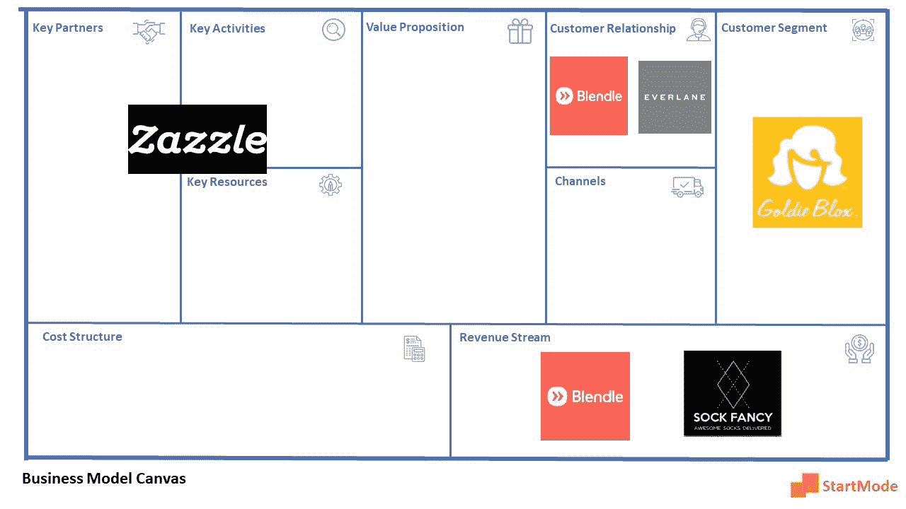

# 5 个能启发你商业模式的创新创业公司

> 原文：<https://medium.com/hackernoon/5-innovative-startups-that-can-inspire-your-business-model-5d9e98e21e8a>

业务模型描述了组织如何创造、交付和获取价值的基本原理。这意味着每个企业都有一个正式或非正式的商业模式。

业务模型可以分为 9 个部分，它们构成了业务模型画布。这些部分是:客户群、客户关系、客户渠道、价值主张、关键活动、关键资源、关键合作伙伴、成本结构和收入流。

> 由于大多数企业通常试图破坏价值主张，模型其他部分的变化也会造成破坏。

以下是 5 家可能会在商业模式的其他领域颠覆其行业的初创公司:

1.  

**Blendle 正在扰乱新闻业。这是一家新闻初创公司，在一个网络应用程序中提供所有报纸和所有重要杂志的所有文章，只有一个付费墙，用户只需为他们阅读的文章付费。这不仅扰乱了新闻业的传播渠道，也扰乱了微支付模式的收入模式。这种模式在游戏行业很常见。**

****2。****

****Zazzle 是一个在线市场，允许设计师和客户与独立制造商一起创造他们自己的产品(服装、海报等)。)，以及使用参与公司的图片。在创意产业中，Zazzle 正在破坏新产品的开发过程。这个过程是两种消费趋势的结合，称为共同创造(客户、合作伙伴和竞争对手之间)和开放式创新。可以说，Zazzle 同时破坏了商业模式画布上的关键资源、关键合作伙伴和关键活动部分。****

******3。**[**ever lane**](https://www.everlane.com/)****

****这是一个直接面向消费者的在线服装品牌，通过分解每件服装的制造成本和原因，专注于其透明度的价值，或者如他们所说的“消费者 wokeness”。它还使用心理定价，显示每件衣服通常卖多少钱，以及 Everlane 卖多少钱。这种类型的破坏集中在客户关系的角度。“X 的 Everlane”已经成为描述任何一家公司拉开采购和价格帷幕的电梯推销词。****

******4。** [**金凤花**](https://www.goldieblox.com/)****

****是一家互动建筑玩具公司，但针对女孩。他们的目标是厌倦了刻板的女孩玩具的女孩或妈妈，并帮助点燃女孩心中的建筑。这也是让人们意识到女孩也可以成为工程师的一种方式。这是一种叫做打破刻板印象的顾客趋势。人们可以说 GoldieBlox 通过瞄准服务不足的客户群扰乱了客户细分市场。****

******5。******

******你能想象破坏像袜子这样功能强大的东西吗？袜子！！这就是 Sockfancy 所做的。Sockfancy 是一个在线平台，每月随机发送一盒袜子，收取订阅费。与时尚服装行业常见的一次性付款不同，他们将收入模式改为订阅模式。******

******让我们看看业务模型画布(BMC)中每个中断的可视化表示******

************

******An overview of the above startups in one BMC******

******熟悉上述初创企业应该有助于你了解如何创新你的商业模式，或者已经存在哪些类型的颠覆。******

******这里有一张空白的[商业模式画布](https://drive.google.com/open?id=1Wy7w9bGCeVA8W47cU2bVOOPa91nKHkQc)供你下载并填写。请随时通过[邮件](https://www.startmode.co)向我们提交填好的 BMC，以便进行免费评估。******

# *********赠品*********

*******通过了解可供初创公司使用的经济高效的免费工具，创办和运营一家初创公司可能比你想象的要便宜。我们列出了创业公司应该了解的 40 种工具。这里是* [*链接*](http://bit.ly/2FF1g4o) *到 PDF。有什么问题吗？你可以为你想从 PDF 下载的任何东西付费，外加一个有折扣代码的证书。尽情享受吧！*******