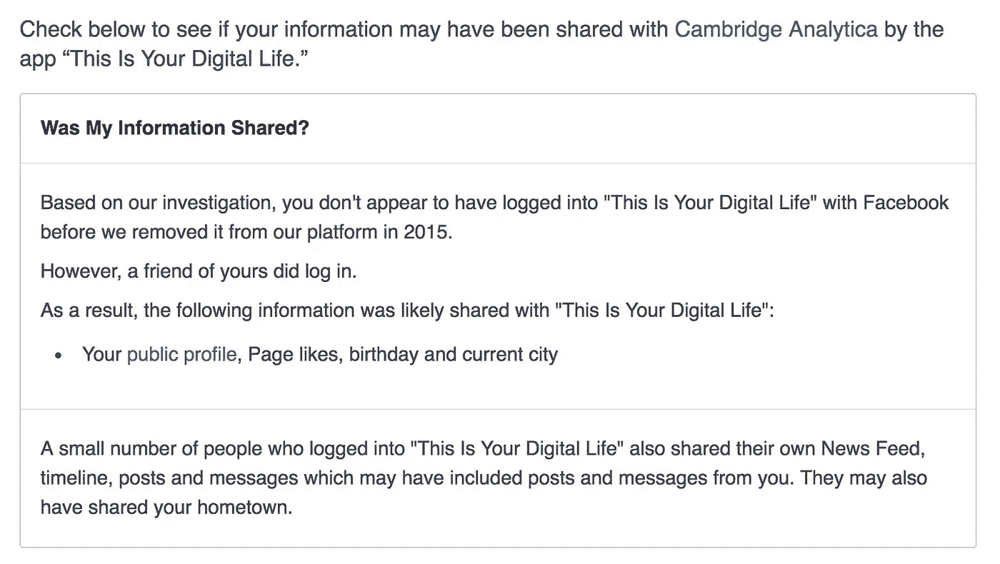
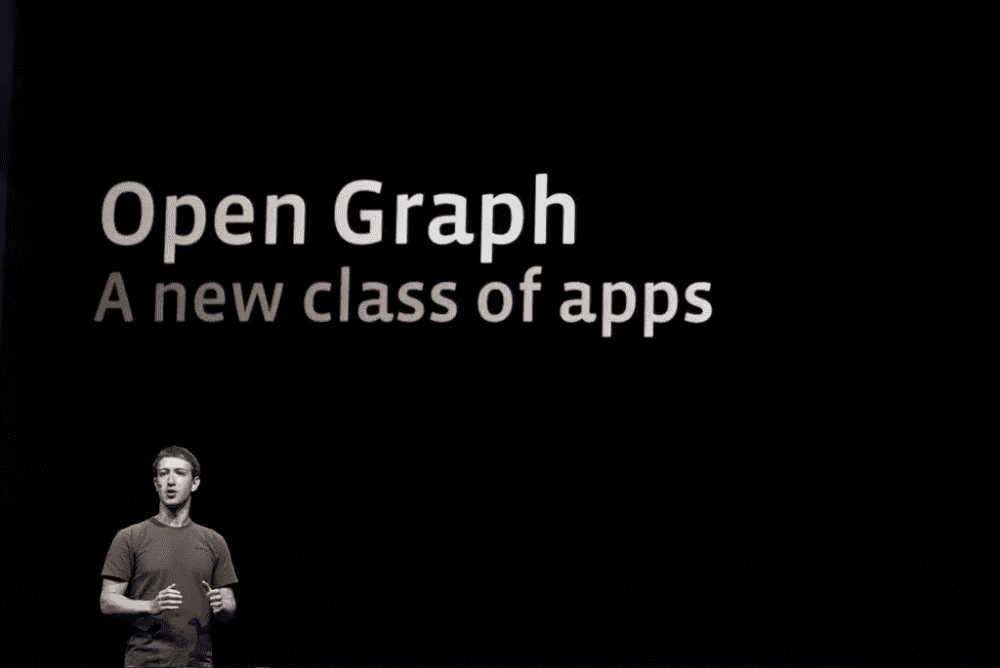

# 从脸书和剑桥分析看数字社会责任

> 原文：<https://medium.com/hackernoon/5-insights-about-digital-social-responsibility-in-light-of-facebook-cambridge-analytica-61ccb2709c16>

> 社区总是受到个体成员行为的正面和负面影响。那么，为什么人们在数字世界中的行为会有所不同呢？

如果您还没有，请查看 [**此链接**](https://www.facebook.com/help/1873665312923476?) 以了解您的脸书数据是否与剑桥分析公司共享。

以下是我的结果:

没错。我是与**剑桥分析**分享数据的 8700 万人中的一员，这是一个有争议的脸书应用**“这是你的数字生活”**的结果。有意思的是，我个人从来没有用过这个 app。**我唯一的错误？在脸书和这样的人做朋友。**截图中可以看到，我朋友的参与授权分享了我的公众号简介、页面赞、生日和当前城市。

辩论的含义、后果，以及这场争论是否真的对我造成了任何伤害，最好是另一篇文章。现在，我感兴趣的是挖掘一些潜在的因素，这些因素促使我的朋友认为与一个随机的开发者分享我的生日和邮政编码是社会可以接受的。这种相同的信息交易在现实生活中难道不奇怪吗？

Photo by [Brian Solis](https://www.flickr.com/photos/briansolis/)

## 与陌生人面对面聊天时，你会泄露朋友的生日或位置吗？大概不会。那么有什么不同呢？以下是 5 个潜在因素:

# 1)数字后果不明显

我的朋友谁使用这个应用程序肯定没有做任何恶意的事情。当使用这样的应用程序时，脸书会提醒你将要分享的项目，但缺乏对这些信息可能产生的后果。如果没有适当的教育，一个普通人如何权衡利弊，同时与吸引他们点击“继续”的战略用户界面做斗争？教育是谁的角色？脸书当然没有理由拖你的后腿。脸书没有包括导致我的数据被共享的朋友的名字。但是如果他们做了呢？这肯定会令人尴尬，但增加了透明度，潜在的公众反响肯定会促使人们在点击“授权”之前多看一眼。

# 2)数字结果被推迟

我们已经说服自己，如果我们的网上行为真的产生了后果，它们肯定会在遥远的未来发生——一个月、一年、几十年后。这是一种无知的辩解，也是为什么我们也要为 [@CamAnalytica](http://twitter.com/CamAnalytica) 受到指责。从我的经验来看，最初的决定没有很快带来的后果不太可能在未来阻止这种行为。在我发现我的狗把东西嚼烂后的几天里责骂它很少会导致行为的改善。

# 3)消费者低估了数据

马克·扎克伯格在制造数据收集机器方面非常成功。每一次击键和行为都会被分析并转化为可销售和可货币化的资产。脸书的[服务条款](https://www.facebook.com/terms.php)声明你拥有你的数据，但谁拥有这些从你的数据中获得的新见解和观察？你的点击、滚动和内容是有价值的。这个数字远远高于 0 美元。多少钱？ [Robin Bloor](https://medium.com/u/51e1e38ab781?source=post_page-----61ccb2709c16--------------------------------) 在这篇文章中做了大量的工作，试图量化你的数据[的价值。](/algebraix-data/how-much-is-your-data-worth-c28488a5812e)

# 4)消费者低估了互联网的可扩展性

当我们在现实世界中提供信息时，我们首先在大脑中运行一些简单的数学运算。"如果我把我的电话号码给这个推销员，最坏会发生什么？"我们计算这个人可能造成的潜在损害(基于现实的人类能力)，权衡利弊，做出符合我们风险承受能力的决定。然而，当涉及到计算机时，普通消费者大大低估了自动化辅助系统的速度、规模和范围。从长远来看，现成的[云资源](https://docs.aws.amazon.com/streams/latest/dev/service-sizes-and-limits.html)每秒可以处理 1000 多条记录。我相信你们中的一些人有更有力的例子。授权一个应用程序独立访问我的朋友列表似乎是无害的。然而，当与其他数据集混合、匹配和叠加时，页面点赞列表会产生可怕的结果。查看[乔治阿比-黑拉](https://medium.com/u/1e33011fdbc7?source=post_page-----61ccb2709c16--------------------------------)的文章“[你的脸书数据可怕得要命](https://hackernoon.com/your-facebook-data-is-creepy-as-hell-319ae47117e6)”。

# 5)无限数量的“朋友”

数字社区不是一块“固定的馅饼”。在现实世界中，个人圈子取决于一个人能处理的关系数量，而在数字世界中，个人圈子只受数据库容量的限制。例如，我发现，当我搬到一个新的城镇或工作时，结交新朋友几乎总是会让我把老朋友从我的社区中赶出去。毕竟，对我来说，管理一定数量的友谊只是人之常情。“邓巴的数字”指出“[人们一次只能管理 150 个朋友的关系](https://www.cnet.com/news/sorry-facebook-friends-our-brains-cant-keep-up/)”。似乎我们实施了某种先进先出的方法，将我们的泛泛之交保持在一个可管理的规模。此外，身体关系需要双方的关注。如果一方停止参与友谊，关系就会消失。然而这在数字世界中似乎并不存在。在我的脸书好友列表中，我不会主动添加 1000 个以上的好友，然而保持他们的好友关系显然存在一定程度的风险。较小的实体社区运作良好，因为有一套规范、期望和对个人决策如何负面影响群体所有成员的切实理解。然而，笨拙的社会团体似乎令人费解。当然，糟糕的决定不会影响所有这些人吗？LinkedIn 显然实施了一个 [3 万人的连接限制](https://www.linkedin.com/pulse/linkedins-30000-connection-limit-art-maurice/)。不知道他们这个具体数字的原因？社交平台上固定的社区限制能更好地反映我们的现实世界吗？

你怎么想呢?我们应该和脸书一起承担责任吗？或者他们应该从一开始就阻止这件事发生吗？我们如何才能创造更好的激励或监管机制，让人们能够做出更好的在线决策？

如果你喜欢这个，请随意鼓掌**👏
关注我的** [**推特**](https://twitter.com/JakeAStanley) **，或者查看我正在做的******。****