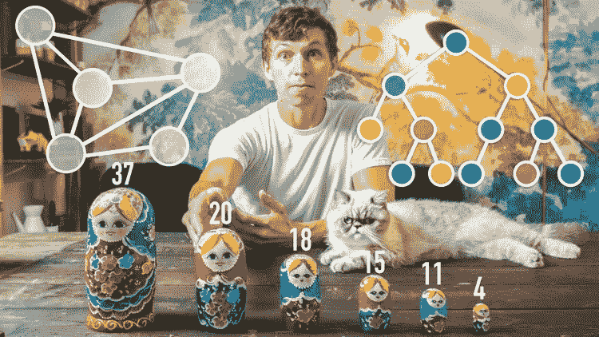

# 学习算法和数据结构的 5 门 JavaScript 课程

> 原文：<https://medium.com/hackernoon/5-javascript-courses-to-learn-algorithms-data-structures-501a0aa1b19b>

在这篇文章中，我将向你展示 Udemy 的五门关于算法和数据结构的精彩课程。

# [1) JavaScript 算法和数据结构 Masterclass](https://www.udemy.com/js-algorithms-and-data-structures-masterclass/)

by: Colt Steele

> 失踪的计算机科学和编码面试训练营

**200 多场讲座，为大家呈现了一场关于这一复杂话题的精彩课程！**

****一些话题:****

*   ***大 O 批注***
*   ***解决问题的技巧***
*   ***递归***
*   ***冒泡排序***
*   ***选择排序***
*   ***哈希表***

**还有更多…**

# **[2)编码面试训练营:算法+数据结构](https://www.udemy.com/coding-interview-bootcamp-algorithms-and-data-structure/)**

****

**by: Stephen Grider**

> **掌握数据结构和算法，赢得下一次 Javascript 编码面试。**

**Stephen Grider 很好地完成了这门课程，通过一种平静友好的方式，我们可以学习所有关于算法和数据结构的知识！**

*   **字符串和整数反转**
*   **回文**
*   **嘶嘶的嗡嗡声**
*   **堆栈，**
*   **树**
*   **二进位检索**

**还有更多…**

# **[3)从头开始学习 JavaScript 中的算法](https://www.udemy.com/learning-data-structures-in-javascript-from-scratch/)**

****

**by: Eric Traub**

> **通过使用算法使你的代码和程序更快更有效。为技术面试做好充分准备。**

**接下来的 3 门课程出自同一作者: [**埃里克·特劳布**](https://www.udemy.com/user/eric-traub/) **。他做了一件了不起的工作，解释了所有这些罕见的事情！****

**这一次，他教我们算法**

****一些话题:****

*   **嘶嘶的嗡嗡声**
*   **二进位检索**
*   **斐波纳契**
*   **冒泡排序**
*   **合并排序**

**还有更多…**

# **[4)从零开始学习 JavaScript 中的数据结构](https://www.udemy.com/learning-data-structures-in-javascript-from-scratch/)**

****

**by: Eric Traub**

> **通过学习数据结构编写更高效和高性能的代码。对技术性面试问题做好充分准备。**

**一个关于数据结构的简短而精彩的课程！**

****一些话题:****

*   **数据结构介绍**
*   **链接列表**
*   **二分搜索法树**
*   **哈希表**

**还有更多…**

# **[5) JavaScript 面试准备:练习题](https://www.udemy.com/javascript-interview-prep/)**

****

**by: Eric Traub**

> **通过做练习题赢得下一次 JavaScript 编码面试。学习重要的 javascript 技能和概念。**

**除了一些算法和问题之外，这门课程为我们提供了一个很好的 JavaScript 奇怪部分的汇编，为你的下一次工作面试做准备！**

****一些话题:****

*   **生活**
*   **关闭**
*   **这个关键字**
*   **范围**
*   **目标**

**还有更多…**

**我希望你喜欢它！**

****你有我的**[***Github***](https://github.com/germancutraro)**如果你愿意跟随我，我将不胜感激！****

**谢谢你😊**