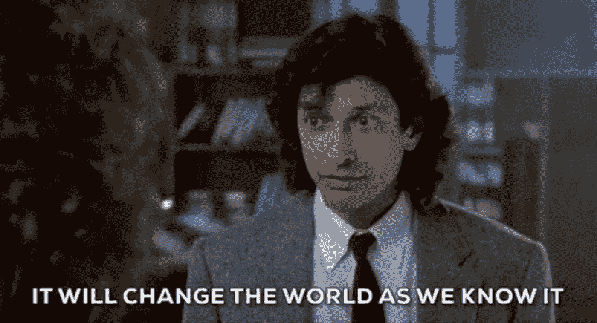
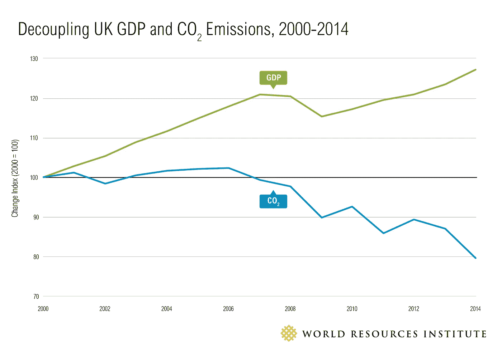
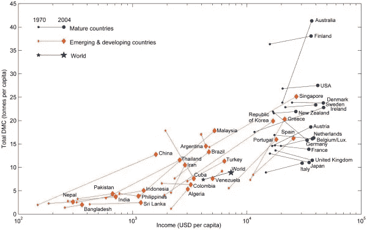
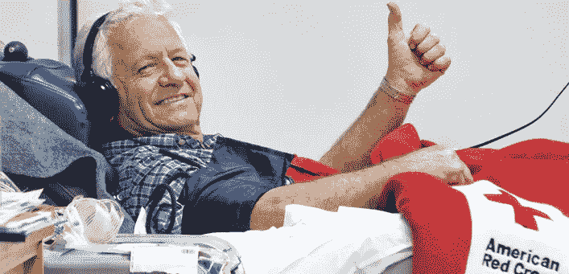
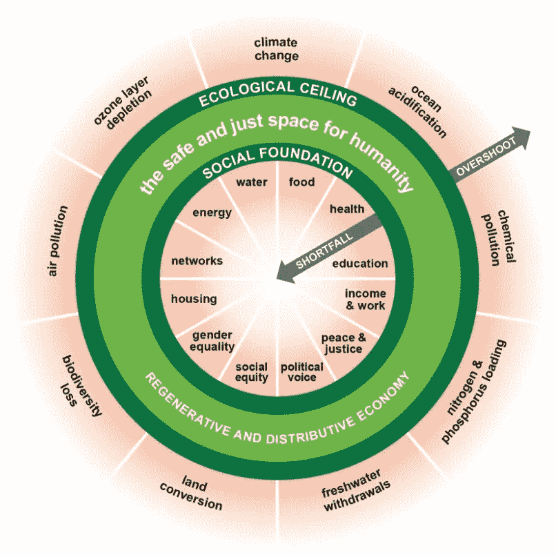

# 5 个杀手级应用，让区块链成为主流，同时让地球变得文明。

> 原文：<https://medium.com/hackernoon/5-killer-apps-to-take-blockchain-mainstream-98d32836ca6d>

*只想要例子？向下滚动到竖起大拇指的那个人。*

对我们中的许多人来说，包括我自己在内，[区块链](https://hackernoon.com/tagged/blockchain)仍然处于那个奇怪的、令人兴奋的、但*却真的*知之甚少的空间。这似乎是一个寻找问题的高科技解决方案，因此仍然相当花哨。我们正在等待“杀手级应用”,它能帮助人们理解它的真正用途。

这是完全正常的。社会需要一段时间来学习一项新技术，然后学习如何以及何时使用它。当我们学会如何利用电、核能、计算机、手机，毫无疑问还有纺纱机、电话和印刷机时，这一切就发生了。这就是变化是如何发生的。(我真的推荐[库恩](https://en.wikipedia.org/wiki/The_Structure_of_Scientific_Revolutions)做一个简单但严谨的总结。)

因此，冒着看起来像个十足的白痴的风险，我将利用这篇文章概述我多年来的一些想法，并邀请对它们的可行性进行评论，因为我无法辨别它们是可笑还是聪明，或者两者兼而有之。至少它们不会出现在我的脑海中，可以促使我思考、创新、受到应有的嘲笑，或者接受关于缺陷所在的教育。或者也许有人会读到这篇文章，并给我写一封短信，说“我们可以去改变世界”。

## 首先，让我们陈述一些假设。

在我看来，区块链最有趣的用途之一是作为一种荣耀的忠诚卡，你可以通过做不同的事情获得积分。这很好，因为我们做了很多事情，这些事情*应该*得到分数，但是社会目前没有足够的激励(或者用‘负分’来惩罚)。污染成本太低，我们没有让污染者支付足够的费用。健康和公共健康是另一个“回报”(活得更长)太遥远的领域，以至于我们的猴子大脑无法做出从长远来看对我们有益的决定。当前的反馈回路太弱，不足以推动我们需要或希望看到的变化。

这是我们继承的经济和监管体系中的一个悲剧性缺陷。

要查看(技术上不准确但适当的)简化模型历史:

1.  我们在本地交易
2.  然后我们需要完成更复杂的事情，所以我们开始正式化传统货币来帮助我们
3.  然后，我们发现有些东西(公共产品)是我们想要的，但自由市场并不能很好地提供(例如，道路维护不善，拦路抢劫，教育显然对社会有益，但对个人来说很难投资)
4.  因此，我们创造了政府来填补空白，用税收和激励措施来规范和引导我们朝着共同的目标前进。

这非常有效，数百年来，社会变得越来越复杂，商业为更多的人提供了更多更好的东西，健康和教育得到改善，人口呈指数增长，我们甚至离开了这个星球。如果我们认为文明是我们一起玩的游戏中的一系列关卡(存在→进化→交流→合作→成长→维护、修复和丰富→离开地球→离开太阳系→..？)，那么总的来说，人类在“成长”层面上做得非常好，值得大力赞扬。我们的策略有一些非常不愉快的滥用、问题和暴行，这很糟糕。但是文明仍然很年轻，还在学习，我们在不犯两次同样的错误方面做得更好。

现在游戏进入了下一关:维护、修复、丰富。或者换句话说:“如何管理我们的成功，而不让我们的野心摧毁我们”。(参见[德雷克方程](https://www.youtube.com/watch?time_continue=500&v=I-rc6S1JHdw)。)

要做到这一点，我们需要开始以不同的方式思考和衡量事物。[肯尼迪在他的名言中雄辩地谈到了这一点:](https://www.jfklibrary.org/Research/Research-Aids/Ready-Reference/RFK-Speeches/Remarks-of-Robert-F-Kennedy-at-the-University-of-Kansas-March-18-1968.aspx)

> 国民生产总值计算空气污染和香烟广告，以及清除高速公路上大屠杀的救护车。它包括给我们的门装上特殊的锁，以及给破门而入的人关进监狱。它记录了红杉的毁灭和混乱无序扩张中我们自然奇迹的丧失。[..然而，国民生产总值并没有考虑到我们儿童的健康、他们的教育质量..]、我们公开辩论的智慧或我们公职人员的正直。[..[英语背诵文选简而言之，它衡量一切，除了那些使生命有价值的东西。它能告诉我们关于[人]的一切，除了我们为什么为自己是[人]而自豪。

在过去的几十年里，我们在将经济增长与资源消耗脱钩方面做得非常好，如下图所示。

Reducing Carbon Emissions While Growing GDP — World Resources Institute

但是我们在这方面做得并不出色。我们的挑战是让图中的所有线条向右下方延伸。但是现在，他们没有:

Way to go, Cuba and Germany! — via Cleantechnica

现在我们正在走向失败，因为我们正在摧毁我们的生命支持系统，同时我们的生活越来越没有意义。哎呦。

区块链做得很好的是让我们重新思考货币是什么和做什么，以及它的价值和原因，并使用这些新的“忠诚卡”机制以新的方式衡量，计算和交易不同的商品和价值。

好了，这就足够合理化了。关于假设的例子。

*(名字都是瞎编的。像他们这样的东西可能存在，只是我不知道。如果有，请用链接评论。每一个都有缺陷和实现问题——这只是对这些想法的介绍——这篇文章已经够长了。)*

# 1.梅迪科因

解决许多医学问题的关键在于更好地了解遗传学。我们收集和分析的 DNA 数据越多，我们解决的问题就越多。

如果我们能够将个人 DNA 与生活方式联系起来，并随着时间的推移监测结果(即谁得了哪种疾病，何时，以及他们的身体如何应对它和对什么治疗做出反应)，我们将更快更好地找到治愈方法和治疗方法。

我们越快做到这一点，我们就能越快降低医疗成本并改善结果。

冰岛已经在这方面取得进展:[1/3 的人口已经为研究捐献了他们的 DNA](http://www.bbc.co.uk/news/magazine-27903831)。[基于这些数据的许多论文](https://www.wired.com/2015/03/iceland-worlds-greatest-genetic-laboratory/)已经发表，新的阿尔茨海默氏症治疗方法的试验正在进行中。谢谢冰岛！

但是……他们的数据是匿名的，这降低了它的潜力，人们也没有什么动力去参与。

与此同时，公共卫生保健系统发现越来越难支付账单和进行必要的实验。

区块链拯救世界。

我们可以建立一个系统，这样当你提供你的 DNA 时，你就被注册并获得 20，000 份医学鉴定。你的 DNA 是独一无二的，所以你只能做一次。这巧妙地解决了一个公平分配的问题——受益的不仅仅是富有的早期投资者，我们都平等地参与其中。

你可以像使用金钱一样使用药物。它们存放在你的钱包里，你可以随心所欲地消费和转账，随心所欲，随心所欲，随心所欲。

每 3 个月您会被问及一系列关于您健康状况的简单快速的问题。每次你这样做，你会得到额外的 100 分。这可以通过保存你的硬币的应用程序来完成，或者这样做的好时机，以及你最初的 DNA 投资，可能是在你献血的时候。又一次医学胜利。

如果你愿意，你可以把这整个事情看作是一个基本的收入系统，但是有一点交换条件。在医学杂志上，你会因为是一个为公众利益做出贡献的好人而被“感谢”。

我们可以通过增加奖金来进一步激励它:如果你的 DNA 包含治愈癌症的序列，你将获得足够的积分来舒适地退休。你可能还会收到许多友好的明信片，来自那些没有死于癌症的人。

这创造了一个巨大的 DNA 数据库，它至少在三个关键方面产生价值:数据的使用权可以卖给研究机构；销售新发现的疗法产生收入；如果由像 NHS 这样的公共卫生保健系统来运营，将会节省诊断和治疗费用。

如果我们不得不使用正常的$€为这样一个项目提供资金，那成本将过于昂贵:前期的长期投资将使其不可行。$€只是不太重视健康的生活。

“那太好了，但是拥有一个数据池只是其中的一部分。谁会为处理所有 DNA 和生物数学的研究和计算买单？”我听到你问了。

目前[的比特币](https://hackernoon.com/tagged/bitcoin)正在**耗费数十亿 CPU 时间和能量，完全是** **徒劳的**数学运算，只能证明其自身的存在。验证医学期刊交易的系统可以与这项研究相结合。这一过程可以用医疗费用来支付，同样的奖金制度也可以应用:如果你正在运行一台计算机来处理确定克罗恩病的手术，那么饮料就由你来付。

我真的很喜欢这个想法，因为它涉及公平分配，提供了一个与有目的的公民参与相结合的基本收入模型，并确保计算能力做一些有价值的事情。它还提供了让你使用你的 DNA 作为识别符的可能性，并对它拥有更主动的所有权——这一权利目前正被混杂的生物技术专利所侵蚀。

我们需要来自生物信息学领域的人来帮助我们构建问题，使之适合一个小规模的工作证明结构。

***[*cure coin*](https://curecoin.net)*和*[*folding coin*](https://foldingcoin.net/)*确实有这方面的要素，但远非全部。*

# 2.铁路硬币

前面的例子展示了新硬币如何通过更好地评估未来收益来释放额外的投资能力。这个例子做了同样的事情，但是有一个更清晰的机制，将红利(利益)返还给投资者，并用它们来改善系统。

我们做个 ICO 买个铁路公司跑火车吧。

在英国我们有一种(怪异？私营公司可以获得在公共轨道上运营列车的许可证。这意味着接下来的事情实际上是可能的。

1.  推出 ICO 来筹集大笔资金。
2.  购买铁路专营权和铁路车辆等。
3.  利用良好的 wifi 和充足的空间，再加上免费的自行车租赁等，让服务变得非常棒——如果你正在打造一个明智的联合交通系统，所有这些都是你所期待的好创新。
4.  使用铁路币给予那些投资铁路公司未来的人优惠待遇。
5.  利用人际关系和激励机制来优化系统。

基本上，这是合作拥有和经营的铁路公司，成员有额外的好处。

所以，让我们假设你以同样的价格购买 10，000 枚铁路币，就像你现在购买两年的季票一样。作为一名投资者，你可以享受 10%的门票优惠、wifi 优先接入/速度优惠、每次旅行都有一杯免费热饮、自行车租赁折扣/延长免费期等。

因为你有一个装着你的铁路币的私人旅行钱包，而且因为它对你来说是个性化的，铁路公司也可以开始以一种更加灵活和智能的方式来调整票价，与你合作以平滑需求。这与目前的铁路旅行不同，因为乘客被视为无名的群体——没有能力让我们每个人都参与到供需之舞中。

通过私人关系，铁路公司可以调整激励措施:*“嗨，乔，今天下雨了，所以需求增加了，因为骑自行车的人少了。如果你可以在家工作，勇敢面对天气和骑自行车，或者在上午 10 点后旅行，我们会给你 5 个铁路币，供你在任何非高峰时段使用。”*这些“赠送”的铁路币代表原本无法使用的容量，因此可以“免费”分配，从而改善所有用户的服务。

简而言之，你可以自己运行这个思想实验的其余部分:有许多变量可以调整，以动态优化高效和可持续的旅行。

*别担心，我会让接下来的例子更简短。继续前进！*

# 3.基本收入/代际不平等硬币

我们每年给每个人 30，000 个妖怪，怎么样..看看会发生什么？

这与所有现有的普遍基本收入实验的关键区别在于，这是新的货币供应。因此，它不会减少任何现有的好处，它坐在旁边。我们不必等待政府批准，它不与国家货币挂钩，它可以通过我们用它进行的交易找到自己的价值。

很多人会告诉你这是一个可怕的想法，但这些人也认为人类太愚蠢了，不会让维基百科成功。rgl 实验在做类似的事情时做得很好。最大的缺陷是如何确保价值得以保留:硬币必须从系统中移除吗？它们有时间限制吗？我认为我们应该进行 100 次实验来找出答案。

加快接受事物的一个好方法是告诉人们他们不能拥有它。所以作为一个转折，姑且给所有 30 岁以下(1987 年以后出生)的人吧。他们会更加精通技术，因此更容易共事，对新想法更开放，而且在经济上真的可以休息一下。

它可以以每年 2 或 3 年的速度扩大到包括 1987 年以前出生的人。

什么支付它？就像其他硬币一样运行它，但最好是基于一些有用的东西，如 CureCoin 或 Medicoins(这也会减轻对老年人的打击，因为他们比年轻人更想治愈阿尔茨海默氏症和癌症)；或者像 EcoCoin 这种年轻人关心的东西(见下文)。

如今，身份检查非常容易，因为银行和电话公司做了大量艰苦的工作，所以它可能像任何人一样简单，只要有一个有效的 SIM 卡和银行账户。

或者我们可以把没有银行贷款的穷人包括进来，让他们成为一个 SIM 卡和一些同行验证。不过，如果你有 SIM 卡，你可以很容易地获得一个 [Mpesa](https://www.mpesa.in) 或 [Compte-Nickel](https://compte-nickel.fr/) 或 [Starling](https://starlingbank.com/) 账户。(好吧，为没有银行账户的人提供唯一的 ID 更难，但我相信我们能想出一个办法。各种各样的难民团体和爱沙尼亚可能有所图谋。)

# 4.不可燃硬币

上市公司 60-80%的已知煤、石油和天然气储量在全球变暖不超过 2 摄氏度的情况下是“不可燃烧的”

但是这些化石燃料的价值在这些公司的账本上已经被认为是一种“资产”,所以人们在交易、投资和决策时，都是基于它会被利用的想法。如果不是这样，这些公司就会失去价值，每个人的养老金都会受到冲击。

这些被称为“T0”搁浅资产的资产估计价值从[4 万亿美元](https://www.carbontracker.org/reports/unburnable-carbon-wasted-capital-and-stranded-assets/)到[100 万亿美元](https://cleantechnica.com/2015/08/26/citigroup-predicts-100-trillion-in-stranded-assets-if-paris-summit-succeeds/)不等。*我们不能烧的东西。*

此外，去年全球花费了 6740 亿美元寻找和开发新的潜在搁浅资产。*哪个我们不能烧。*

化石燃料公司发现自己被逼到一个没有退出战略的角落，因此竭尽全力抵制立法和创新。

区块链拯救世界。

1.  把化石燃料留在原处
2.  创造 4 万亿美元的不可负担货币。这只能花在清洁能源生产或贸易上。
3.  给化石燃料公司 3 万亿美元，让他们退出。也许可以增加一些额外的规则，这样他们就只能用这些来投资新的清洁能源发电能力。
4.  将 6740 亿美元减少到 4000 亿美元，作为年度补充，以减轻债务负担，并将 2740 亿美元用于其他有益的事情。
5.  二氧化碳排放和污染直线下降，能源变得更便宜，世界变得更美好。

注意，这是*而不是*量化宽松。这是用有用的钱代替无用的钱。

# 5.生态币

宣布并同意黄金有价值，人们会忍受巨大的困难去挖掘它。假设每个塑料袋的最低成本为 0.05 英镑，突然之间，你水槽下的塑料袋从 0.0000001 英镑的可回收塑料变成了 1.45 英镑——远远高于它们的成本。

如果我们说树木(减少二氧化碳，从而减少全球变暖)的价值远远高于其成本，会发生什么？我们会去种树。想快速致富吗？种树。失业并想赚钱？种树。

当然，光有树是不够的。产生的生物多样性、寿命、树木的类型和位置都会增加或减少价值。

就实施细节而言，树木需要追踪:每棵树上的生物标记，空中监视可以在这方面有所帮助。工作证明甚至可以是二级团队每 5 年出去检查一次生物标记和增长，确保它是一项长期投资资产。

系统中的价值也可能来自/与未燃烧的成本相关联——即以滞留资产的 4 万亿美元价值为基线，或者通过**不必对气候变化的影响采取行动，一直延伸到[535 万亿美元的储蓄](http://theconversation.com/inaction-on-climate-change-risks-leaving-future-generations-530-trillion-in-debt-81134)。**

生态币可以让你做一些聪明的事情，比如用它的价值乘以当前的二氧化碳水平。我们的目标是 350ppm，因此我们可以通过这样的方式来引导市场:如果二氧化碳水平超过 405ppm(撰写本文时为[406.75](https://www.co2.earth/))，那么新树木获得的生态币将是 350ppm 时的 2 倍。低于 400，是 1.8 倍，等等。因此，您可以提前采取许多措施来避免以后的灾难。(低于 350ppm，我猜你会因为砍掉它们而得到报酬！)

这一个可以像你想的那样复杂:生物多样性的度量可以成倍增加，通过将它与预防洪水的[影响债券](https://en.wikipedia.org/wiki/Social_impact_bond)捆绑在一起为当地项目增加价值，等等。

# 牧羊人之音……经济？

我想补充的最后一个概念是..良好的..我们走的时候，我会解释的。这有点奇怪，但我忍不住觉得里面有东西。

经济在很大程度上取决于增长的概念。在有限的星球上无限增长[是行不通的](https://youtu.be/Sqwd_u6HkMo)。这就是为什么如介绍中所提到的，人类一直在尝试将增长与资源消耗脱钩。

我们能拥有一个无限上升并向正确的方向发展的经济来取悦经济学家并保持进步，但不扩张吗？

有一个很棒的概念叫做牧羊人音调。当你等待休息时，你可能会从俱乐部音乐中认出来，音调越来越高，你跳得越来越用力，因为休息时间很快就会到来，而且它还会继续上升，你会跳得越来越用力..它只是走了。打开。用于。永远。这就是谢博德的工作基调。

观看这个简短的解释性剪辑。他们经常在电影中使用它。

因此..经济能做同样的事情吗？

在许多方面，它已经做到了:我们的通货膨胀增加了零，但并没有使房子变得更大，当我们开发一个地区，然后开发另一个地区，再开发另一个地区，直到我们回到第一个地区，城市总是充满了摩天大楼。

但是，我们能更明智地做这件事吗？例如，我们能不能为这个图表上的所有东西都用硬币，然后在它们之间循环？

Doughnut Economics — @KateRaworth

行..遗憾的..最后一个想法:

# 也许不是所有的硬币都不应该是可交换的

目前我们有大量的新货币。但是我们需要多少呢？这是一场大规模的土地掠夺，就像 dot.com 繁荣时期一样。赢家得到了回报。2017 年，亚马逊占据了美国零售总额的 4%。

但就像在 dot.com 繁荣时期一样，有很多网上书店，但我们只需要一个赢家来发展，并带来更多创新，以确保持续增长。但是你必须在里面才能赢，所以有很多硬币。其中大部分将死亡或合并。

也许我们真的只需要，比方说，12 个硬币就能衡量一切。如果$€足够宽泛，可以对独木舟、可乐、鞋子和房子进行估价，那么我们可能只需要对$€ *不进行估价的每一类物品进行估价。一个关于健康，一个关于环境，等等。*

也许我们可以制定规则，规定你*必须*在这 12 个账户中的每一个账户上保持正余额，这样它们中的任何一个账户才能工作。你是一个生活在有限星球上的公共世界的人，所以交易的一部分——社会契约的一部分——是你必须在所有 12 个领域做出积极贡献。我们现在做同样的事情:如果没有$€的收入，你基本上就完蛋了，因为这就是社会目前对我们个人贡献的估价。给出一个更广泛的标准来衡量我们的价值，可以让人类有更多的自由、创新、表达和生存方式。

同样，在社会契约中:你当然可以乘坐短途航班，吃很多红肉，但是这将会减少你的环保预算。你不能因为有钱就买通了，因为这对我们其他人不公平。所以我们可以说，每个人可以从不使用他们的 EcoCoin 的其他人那里购买 5000 EcoCoin，**但是**你每年只能交易 5000，因为否则每个人都会购买 eco coin，雨林会燃烧，我们都会死。这将完全失去意义，我们无法毕业这一级别的游戏。

因此..给你。一堆想法。你怎么想呢?如果你想改变世界，请给我写封短信。