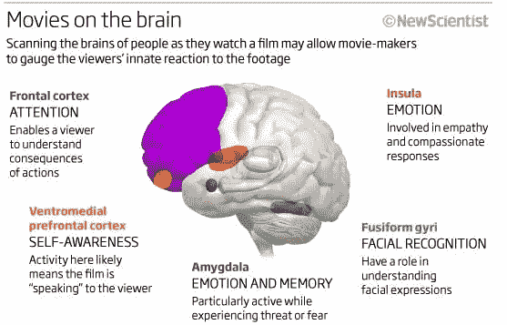

# 软件工程师从电影制作中学到的 5 课

> 原文：<https://medium.com/hackernoon/5-lessons-a-software-engineer-learned-about-movie-making-e3b56a9a7ffd>

我在谷歌有两个队友是奥斯卡获奖者。

Tom Lokovic and Eric Veach both were Google Engineers when they received 2013 Oscar Awards for their work at Pixar on the movie Monster Inc.

汤姆·洛科维奇和埃里克·维奇凭借他们在皮克斯电影《怪物公司》中的深度阴影渲染(还记得萨利的头发吗？).

汤姆曾经告诉我皮克斯的传统，在电影制作期间出生的婴儿将被包括在电影的结尾，他的孩子总是喜欢看怪物公司和看到他们自己的名字。

这给了我一个梦想，有一天，作为一名[软件工程师](https://hackernoon.com/tagged/software-engineer)，我可以制作一部动画电影，和我的孩子们一起看。

多年来，我从未接近过那个梦想。

直到上个月。

今年 2 月， [Leap.ai](http://leap.ai/welcome?utm_source=medium&utm_medium=blog&utm_campaign=yunkai&utm_content=movie) 决定制作一个视频来说明 Leap 的即时匹配功能。我们时间不够，人手也不够，所以我得到了一个独特的机会来密切关注它。我和我的团队开玩笑说，我在这个过程中担任导演助理。(注意助理**到**导演和助理导演有很大不同。)

这是我经历的过程。

1.  从众多候选人中选择一个视频制作团队。
2.  与视频制作团队一起开始，并解释我们想要做的事情及其背后的主要想法。
3.  由视频制作团队编写脚本来说明不同故事情节的几个版本，我们提供反馈并最终确定。
4.  演员试镜和选拔。
5.  视频拍摄。这花了一整天的时间，在从 Airbnb 租的房子里。我观察了导演、摄像组、麦克风组和辅助组是如何一起工作的，并近距离观察了演员们是如何工作的。
6.  粗切。
7.  配音演员的试镜和选拔。背景音乐选择。
8.  语音记录。这是通过远程配音女演员的变焦呼叫来完成的。所以我不完全知道这里需要什么设备。
9.  后期制作包括动画、编辑和声音混合。

这是最后的视频。

在这个过程中我学到了很多东西。以下是我最喜欢的 5 课。

# 第一课:设置摄像机位置就像工程一样

在观看视频拍摄时，我最喜欢的部分是观察摄像机是如何在不同的角度设置的，因为我知道稍后它们会被拼接在一起。

看一下从开始到 0:16 分的视频。你能找到多少个相机位置？

答案是 3。

*   第一个位置在门口(视频中看不到)。克里斯从门口走向冰箱。
*   第二个位置是冰箱里的特写镜头，只捕捉到克里斯的手是如何伸进去抓住外卖盒子的。
*   第三个位置就在楼梯旁边，当克里斯站在冰箱旁边边吃炒面边说话时，镜头对准了他。

Different camera angles for the same shooting.

这非常像软件工程，我可以很容易地联想到它。

*   在电影制作中，导演需要事先考虑不同的场景分解，指挥工作人员从不同的位置拍摄，最后将场景混合在一起，创建一个有凝聚力的剪辑。
*   在软件工程中，我们在设计阶段将服务分解成不同的组件，然后分别实现不同的组件，最后将它们集成在一起形成最终产品。

# 第二课:每次拍摄都不像工程学

每一个位置都设定好了，摄制组对表演进行了多次拍摄。同样的线，同样的动作，不同的变量。一次又一次。希望在多次录制后，不同的角度都被覆盖，其中一个足够好，可以包含在最终的视频中。

在拍摄过程中，很多事情都可能出错。以下只是我那天经历的一部分:

*   有人开始修剪隔壁的草坪。->我们给他们钱让他们离开，然后再回来。
*   风吹起了窗户上的盖子，使得额外的光线照进了相机。->我们让两名机组人员到外面手动扶住盖子。
*   冰箱压缩机启动了。->我们关闭了冰箱压缩机，但保持了冰箱电源，因为克里斯开门时，灯仍然需要打开。
*   Airbnb 的房主敲了敲门。->主人让我们做什么，我们就笑着做什么。

0:20 马克的镜头至少拍了 15 次，我为克里斯感到难过。哦，记得克里斯在吃炒面吗？他在拍摄过程中完成了近 2 个外卖盒。他肯定不喜欢吃那么多冷炒面。:)

一个剧组人员告诉我，有一次他经历了一个镜头被重复 80 次，当时一个(著名的)导演心情不好。

作为一名软件工程师，重复可能是最讨厌的事情之一。每当有东西需要重复的时候，我们就把它自动化成一个脚本(双关语)并让机器运行这个脚本。我很高兴我不需要日复一日地重复这些。

# 第三课:现实生活中感觉正常的东西在视频中感觉太慢了

在视频拍摄过程中，导演有几次要求演员在上一个动作之后马上做一个动作。看现场的动作，感觉动作很仓促，不自然。当我问导演这件事时，导演告诉我“相信我，你在视频里不会有那种感觉”。事实上，当视频出来时，现场动作中的那种匆忙感觉正是视频中的正确节奏。

例:克里斯在 0:27 马克停止说“我没时间追采访”，0:28 开始抢笔记本电脑，只有一秒钟的延迟。在真实的动作中，它非常不自然地快，但在视频中，你不会有这种感觉。

录音也是如此。0 点 32 分到 0 点 59 分听雅典娜的对话。当我和配音演员在电话里录制这首歌的时候，我觉得她说得很快。但在视频最终制作完成后，我们都觉得这一部分可能会更快。

这是为什么呢？我的假设是:当我们看视频时，我们的大脑更加专注，因此比我们在现实生活中吸收信息更快。如果有读者知道答案，请给我留言评论。我很想知道。

Original source: NewScientist

# 第四课:后期制作需要大量的工作

在视频拍摄和音频录制之后，很难(或者几乎不可能)改变这些材料。下一步是制作适合视频和音频材料的动画。

在我们的视频中，从 1:00 到 1:12 标记的片段只有 12 秒的动画，但它包含了大量的信息。它需要展示我们的产品如何工作，同时，不要深入产品的每一个细节。它需要在感觉真实和感觉抽象之间保持适当的平衡。我们还需要决定正确的视觉风格。字体/颜色/不透明度，都需要决定和实验。

Font / Color / Opaqueness were experimented with in this screen.

这需要大量的工作和多次迭代。

# 第五课:玩得开心

最终，这个视频制作项目对我来说非常有趣。在这个过程中，我有很多深深的喜悦，我的孩子伴随着我的每一步。他们是最终选择视频和配音演员以及背景音乐的重要因素。如果我能和我的孩子们一起拍一部电影，我会非常接近这种感觉。

不管做什么项目(一个人有多不合格)，都要玩得开心，享受！