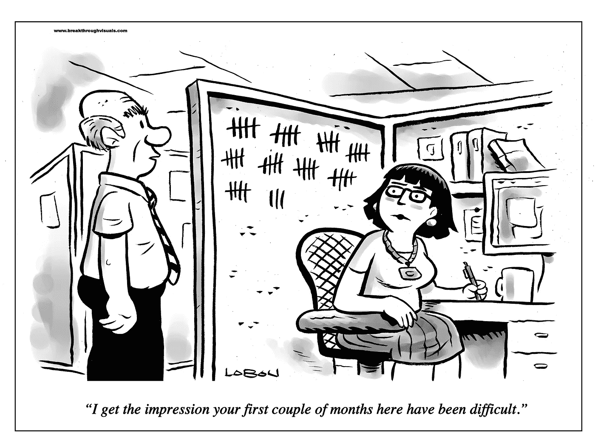
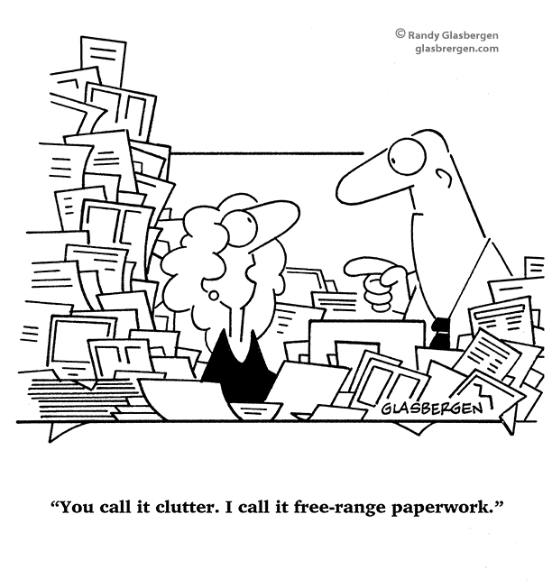

# 吸引和雇佣求职者的 5 堂课

> 原文：<https://medium.com/hackernoon/5-lessons-in-attracting-and-hiring-job-candidates-a0dca457faef>

*—从自己的求职经历中学到的。*

我曾经分别是两家 Y Combinator 创业公司的 CTO 和 VP。对我来说，无论是技术类还是非技术类职位，招聘都是一项挑战。

最近，我有机会坐在桌子的另一边寻找自己的工作。我希望我知道我现在所知道的，但至少我可以与你分享，以帮助你避免犯同样的错误。

我实地考察了十几家硅谷互联网公司，从家喻户晓的公司到即将上市的初创公司。让我告诉你我从与他们的互动中得到的五个关键经验:

# 第一课:第一印象的影响是惊人的

说第一印象严重影响决策是老生常谈，但当我亲身经历时，这一现象仍然令我震惊。



Creative Commons

首先，随着湾区创意办公空间的激增，老式或丑陋的办公空间会产生负面影响。这是求职者参加面试时首先注意到的事情之一。底线改善是值得的。

从人的角度来看，应聘者看到的每一个员工(不仅仅是面试官)都会成为他们第一印象的重要组成部分。作为一个在漫长的约会后很少能回忆起对方衣服颜色的麻木不仁的家伙，当我下意识地在眨眼之间捕捉到一个陌生办公室的动态时，我自己都感到惊讶:

“这家公司安静平和，员工专注于自己的想法，”

“这一个有着生动的氛围，工程师们聊天，跑来跑去，”

诸如此类。

我还注意到那些明显感到无聊并迫不及待想出去的人，这种态度似乎在他们的邻居中具有传染性。如果你的办公室碰巧有这样的人，至少要把他们藏起来，不让候选人知道。

有趣的是，我经常在同一家公司的面试官中观察到一些共性，尽管他们的资历和角色不同。这些共性如此明显，以至于在我看来，一个人在加入一家公司后不久就被“感染”了。只需要几分钟，这些共同的特质就会在面试中显现出来。

有一次，我通过看到他们的纹身，听到他们的个人故事，感受到了“多元与善良”的共性。在另一张照片中，我从他们打开话题的方式中感受到了“平静和开放”。第三种情况，我从工程师那里得到了“能量”，却从管理层那里得到了“迟钝”。

这些印象反映了一家公司根深蒂固的文化。欣赏这种文化，了解它如何创造第一印象，有助于你了解候选人的脑子里在想些什么，并让信息更符合他们的感受。

# 第二课。让合适的面试官参与进来

我的几个面试官看起来有点初级，不能完全理解我在某些取舍上的推理。我没有被拒绝，但结果是，与所有其他邀请相比，我得到了较低的排名。

的确，有效的沟通是一项基本技能，在真实的工作环境中这不成问题，因为只要有足够的时间，就可以达成共识。然而，在面试中，时间是有限的，尤其是对于系统设计问题，因为面试官需要涵盖广泛的话题。在一个棘手的问题得到充分讨论之前，我们常常不得不继续前进。面试官假定的优越感加剧了这一问题:他们可能没有时间在做出判断前吸收不同的思维框架。

理想的面试官是那些职位比候选人高、背景相似的人。我的一些面试官完全符合这种情况，他们之间的化学反应非常好。谈话进行得很顺利，因为他们理解我的思维过程，没有要求我解释一路上的每一步。

作为上面的樱桃，我也对他们的经历和智慧印象深刻。我觉得如果我们最终在一起工作，我可以从他们身上学到很多东西。一位面试官甚至成了我的榜样。

诸如此类的因素会对候选人对一家公司的看法产生重大影响。

我更喜欢所有的面试官都比我级别高，背景和我相似。当不可能时，更多的初级面试官可以在算法和编码问题上提供帮助，这些问题的解决方案空间更有限。

# 第三课。超级有条理



对于一天接 30 个电话的人来说，错过一个电话不是什么大事。但这会严重打乱候选人日程。一封延迟的邮件在同事之间通常无关紧要，但可能会成为候选人的绊脚石。

即使后果不严重，我们也想给人留下好印象。招聘人员是候选人窥视一个组织真实运作的窗口，不管面试官在面试中试图描绘一幅多么美好的画面。

利用工具并持续投资自动化。像 Zapier 和自动化调度助手这样的服务集成工具很有前途。

当面试官在我面试的前一天发给我一份日程安排时，我发现它非常有价值。面试官名单帮助我了解他们的背景，写下合适的问题；主题的顺序(编码、系统设计等等)帮助我在每次会话前调整焦点和能量水平；而且时间表帮我跟踪时间，决定早餐吃多少(说真的)。

作为一名公司招聘人员，我建议在面试前几天通过电子邮件发送日程安排。有的公司当场把资料递给我，我发现用处不大。如果日程是暂定的也没关系。就这么告诉候选人。他们会感谢你的信息和体贴。

# 第四课。尽量缩短周转时间，并提供定期更新

在我职业生涯的早期，我会放慢与候选人通信的速度，以显得不那么急切。然而，硅谷的人事经理和招聘人员非常绝望，应聘者也知道这一点。更重要的是，好的候选人消失得很快。有时我们仍然需要玩时间游戏，但你明白我的意思。

我很感激招聘人员，他们在整个过程中经常给我更新信息，不管这些信息看起来多么微不足道。体现了细心和专业。了解他们不断应对数百项任务的挑战只会让我更加感激。

```
I want to give a special shout-out to [Neha Shrivastava](https://www.linkedin.com/in/nshrivastava/) at Google. She not only organized one of the best interview loops for me (see Lesson 2) but also impressed me greatly on her speed and passion for her job.For example, she collected feedback and provided me with a tentative result in half a day, whereas formal reviews usually take one week. More incredibly, merely one hour had elapsed from the time an extra interview with a Senior Director was requested until she brought me on site. And she did all that remotely. The usual lead time for interviewing at this level is in weeks because of their extremely packed schedules.When we met in person, Neha talked a lot about helping candidates and peers succeed. She even asked me for advice. My interaction with her and her colleagues gave me a strong impression on Google's culture. Through them, I see no shortage of hardworking and passionate people at Google.
```

我也有过负面的经历。一家公司花了两周时间才拿回一个肯定的结果。另一个人因为两个招聘人员之间的沟通失误而错过了一个关键的时间窗口。

对我来说，这些延误反映了公司的总体文化，尽管它们可能是罕见的不幸事件。然而，由于与一家公司的互动非常有限，我很难不浮想联翩。

# 第五课。体贴点

当我接到招聘人员临时打来的电话时，我很惊讶。这有点令人不快(根据美国礼仪)，甚至会引起麻烦:如果你的公司的名字突然出现在候选人的手机上，而他们正好要会见他们的老板，而你的公司是他们的竞争对手之一，那该怎么办？

像这样的小事确实很重要，因为它们不能很好地展示公司。同样，反复催促候选人做出决定，或者通过提及候选人申请的职位的稀缺或竞争来唤起 [FUD](https://en.wikipedia.org/wiki/Fear,_uncertainty_and_doubt) 也不是什么好事。如果竞争是真实的，我们可以谈论事实。

从积极的方面来说，这里有一个真实的故事:一个应聘者结束面试后，直接去见他现在的雇主，名字标签还在。标签清楚地显示了访问的目的和公司名称。这是一个招聘人员带我走出办公室时告诉我的故事。然后他提醒我摘下我的标签。多有礼貌啊！

为每个候选人完善细节是非常具有挑战性的。我在招人的时候几乎维持不了底线。我现在相信额外的努力是值得的。候选人不知道也不在乎他们只是你现在必须处理的 50 个候选人之一。

**感谢**Tyler Becks 阅读本文草稿并提供宝贵意见。