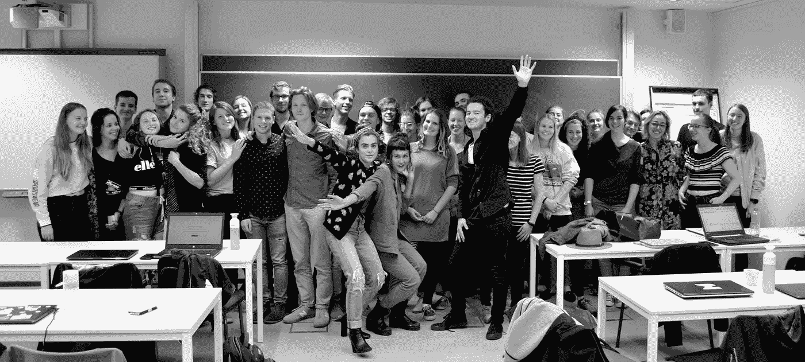
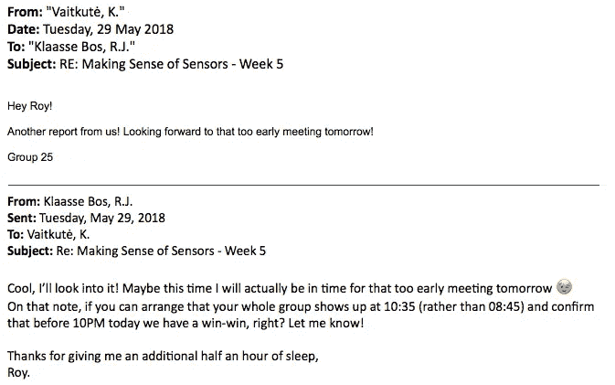
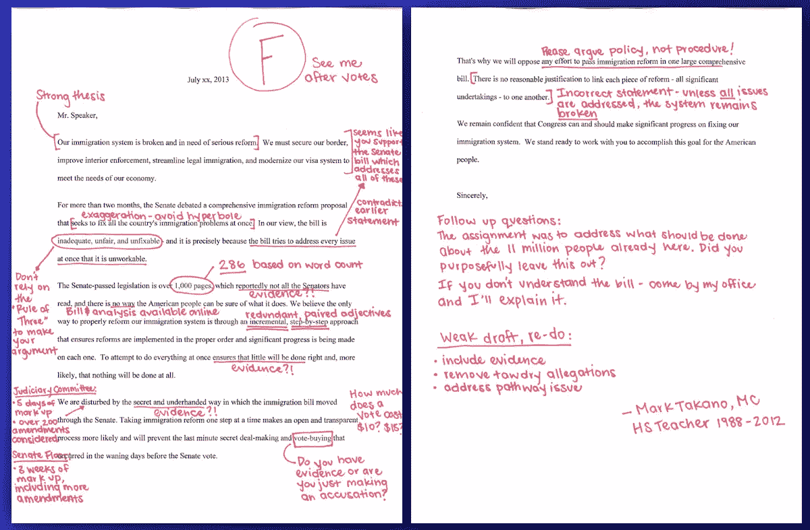
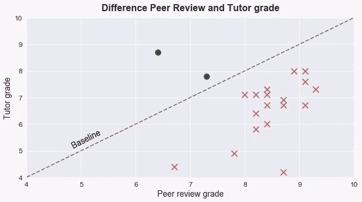
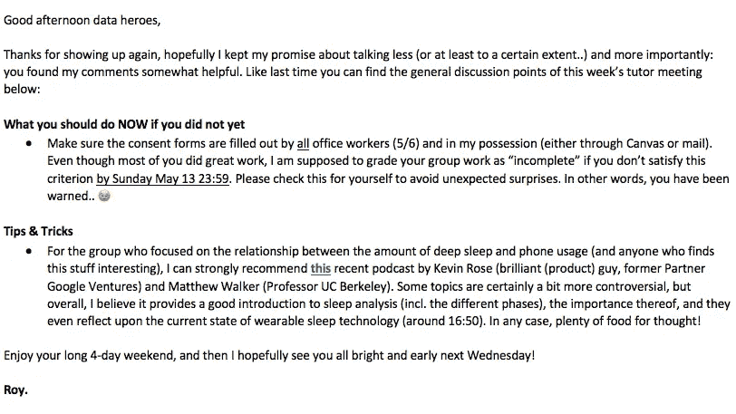

# 5 经验教训教学数据

> 原文：<https://medium.com/hackernoon/5-lessons-learned-teaching-data-c7be9b17ae54>

> 教别人是你能做的最有回报的事情之一，你能从中学到很多。在过去的几个月里，我有幸给各种背景的人讲授数据艺术。在这里你可以找到我学到的五个最大的教训。

# 1.站在他们的角度想想

还是学生的好处之一就是你知道他们是怎么想的。如果你会说他们的语言，学生会非常感激。

不要误解我的意思:你应该始终保持专业性。然而，这并不意味着，你不能创造一个积极和激励的课堂环境。

# 2.给予反馈是强大的

反馈不仅重要，而且非常有力。没有任何解释的糟糕成绩就像拿到一张没有照片的超速罚单。

错误经常被强调，而理解仍然不足。我认为我们应该挑战这个想法，以同样的方式庆祝胜利。

Retrieved from [RepMarkTakano](http://repmarktakano.tumblr.com/post/55171410836/a-draft-letter-by-republican-members-to-speaker) (2014)

# 3.同行评议很棒(但是要小心！)

虽然反馈对学习来说是必不可少的，但给出反馈也非常耗时。这就是为什么同行评审是一个很好的额外反馈来源。一种很有效的格式是 [tops & tips](https://the-outlier.typeform.com/to/SP5oEu) 。

然而，你是否应该允许学生给彼此的作业打分，这是一个不同的[问题..](https://hackernoon.com/tagged/question)

In the Netherlands our grading system is from 1 (lowest) to 10 (highest).

# 4.如果你兴奋，他们也会兴奋

在学生的眼里，你是一个榜样。他们认为你知道每个问题的答案(尽管你显然不知道)。

然而，教学不仅仅是分享[信息](https://hackernoon.com/tagged/information)，[而是激励人们](/@tseelig/teaching-its-about-inspiration-not-information-1f64ddf019e7)。这种情况在教室内外都有发生，而且这些小事真的很重要。

# 5.创造一个 21 世纪的教室

不可否认，在我们当前的教育系统中有巨大的机会来更好地整合技术。如果你这样做，不仅学生会喜欢，还会节省你的时间。

我最近玩的一些工具和频道有: [Github](https://github.com/RoyKlaasseBos/Data-Analytics-for-Engineers) ， [AllAnswered](https://www.allanswered.com/community/s/data-analytics-for-engineers/) ， [YouTube](https://www.youtube.com/playlist?list=PLmR-bBjxQyzdeDIRctDe6iU_cWq8NBP42) 和 [TypeForm](https://the-outlier.typeform.com/to/GnQF0X) 。下面自己试试吧！

# **学习永无止境**

> 暑假结束后，我会回到教室。再次成为学生。但这并不意味着我的教学结束了。
> 
> 教学是一种奇妙的学习经历，并将永远如此。