# 我们从 PADI 旅游预订中学到的 5 条经验

> 原文：<https://medium.com/hackernoon/5-lessons-weve-learnt-while-building-padi-travel-booking-aab7d2425bf4>

> [继续阅读这篇关于在 **Django Stars 博客上建立旅游预订服务的文章。**](https://pxlme.me/zwYtAWB_)

你打开脸书，发现你的朋友在海滩上，手里拿着一杯鸡尾酒，然后你的同事在一些风景如画的地方，当然是远离办公室的地方。而且，每次打开浏览器，不同度假胜地的惊人快照广告都在追着你。旅行不再是复杂的计划、庞大的预算和“我们能负担得起一年两次”之类的事情。人们想要发现更多——不仅仅是千禧一代，老年旅行者每年都在进行越来越多的[旅行。反映了需求，市场以降低的价格和甜蜜的提议亲切地回应日益增长的需求。](https://usa.visa.com/partner-with-us/visa-performance-solutions/senior-travel-wanderlust.html)

根据谷歌/Phocuswright Research 的数据，超过三分之一的跨国旅行者对使用数字助理进行研究或预订旅行感兴趣。

人们在计划假期时倾向于依赖数字解决方案，Airbnb、Expedia 和 Booking.com 等旅游预订巨头为客户设定了相当高的期望标准。旅游应用的开发不是一帆风顺的，在构建自己的解决方案之前，有一些事情你应该知道。在本文中，我将分享我们的移动应用程序开发团队在为世界上最大的潜水组织 PADI 旅游开发在线预订服务后学到的重要经验。PADI 代表潜水教练专业协会，自 1967 年以来已经颁发了超过 2500 万份潜水证书，所以“PADI”这个词在潜水界并不陌生。我们开始为今年加入 PADI 家族的瑞士初创公司 [Diviac](https://pxlme.me/h2zqaE1T) 开发预订平台。但是一次做一件事，让我们从头开始:

**1)意外发现:每个预订服务都是不同的**

Modern market 已经准备好为大量现成的预订解决方案提供屡试不爽的算法。该解决方案通常需要一些调整，然后将功能缝在你的应用程序中。这种快速整合也有不利的一面:僵化的规则、难以个性化的有限功能，以及有时高额的年费。如果你从小规模起步，并且没有快速发展的想法，这样的解决方案可能会满足你几乎所有的需求。然而，如果您计划在未来扩大规模，增加选项数量以及用户列表，您将需要从头开始构建个性化预订应用程序。

 [## 航海日志案例研究-水肺潜水的网络和移动应用程序开发

### Django Stars 为 Diviac 提供了水肺潜水平台开发，水肺潜水员可以在此分享他们的…

pxlme.me](https://pxlme.me/h2zqaE1T) 

当我们开始与 [Diviac](https://pxlme.me/h2zqaE1T) 合作时，面临着不同的挑战:在现有的日志上构建预订引擎，或者使用 Shopify 等现成的解决方案。但在某个时候，我们意识到除了重新考虑整个方法和开发一些独特的东西之外，我们别无选择。他们说，“种瓜得瓜，种豆得豆”，回到最初，Diviac 甚至没有想到他们可能会被世界上最大的潜水组织收购，所以从一开始就开发定制软件是一个明智的举动。

艾萨克·牛顿爵士曾经说过:“如果我比别人看得更远，那是因为我站在巨人的肩膀上。”当你从零开始开发一个旅游应用程序时，先睹为快，看看 Booking.com、Expedia、猫途鹰、Kayak 或 Airbnb 等顶级旅游预订巨头——这些肩膀会帮助你为你的应用程序找到一些很酷的元素。

那么，顶级旅游应用有什么共同点来提供非凡的体验呢？

*   **它们是移动优化的—** [eMarketer 预测](https://www.emarketer.com/Article/Mobile-Drives-Growth-of-Online-Travel-Bookings/1016053)2021 年美国 49.5%的数字旅游销售将通过移动设备完成，所以请确保你的应用程序将拥有能在所有类型的设备上闪耀的响应设计。
*   **他们识别位置** —本地化有助于为用户创造更好的体验(他们将看到当地的办公室地址、联系电话&货币)
*   他们提供个性化的东西——通过 cookies 和日志分析访问者的行为模式，该服务将建议定制交易。
*   **他们要求评论和评分** —给顾客一个留下评论的机会将有助于与顾客建立可信赖的关系(例如，PADI 旅行社将评论放在第一个折叠的正下方):

*   [**他们让你参与一个游戏**](https://pxlme.me/UVOdOQ7D)**——**像小测验、测试和计算器这样的互动元素会提高客户参与度。
*   它们创造了一种紧迫感——强调最佳交易和显示实时动态的元素将帮助用户更快地找到最佳提议
*   它们激发了人们的灵感——大多数游客花了大部分时间盯着很酷的图片，比较、考虑和权衡不同的选择。相关的经典内容将激励和帮助他们规划旅行。

## 您可能还喜欢:

 [## 旅游业中的机器学习和数据分析

### 克里斯托弗·哥伦布是历史上最著名的旅行家之一，他一生只进行了 4 次旅行。其中一个…

pxlme.me](https://pxlme.me/zwYtAWB_) 

但首先，价值。建立在线预订服务不是儿戏——该平台需要处理过滤搜索、地理定位、在线支付、用户之间的交流和审查系统。要考虑所有的业务逻辑并创建架构和接口，需要大量的工作和技术技能。但在最开始，理解你的应用的核心价值是至关重要的。为什么会存在？它解决什么问题？与现有的有何不同？了解用户的问题和烦恼，然后考虑如何帮助解决它们，同时提供最佳体验:

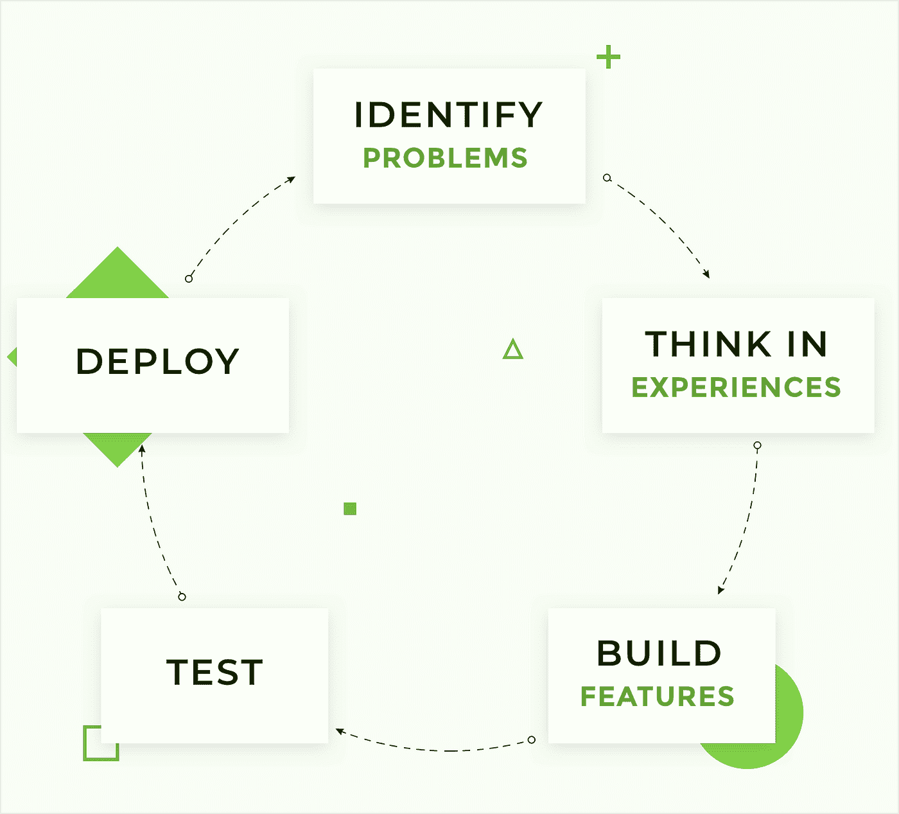

商业模式画布是一种深刻的方法，当然值得你花时间，因为它打破了创始人头脑中所有的创造性混乱，使元素变得清晰:

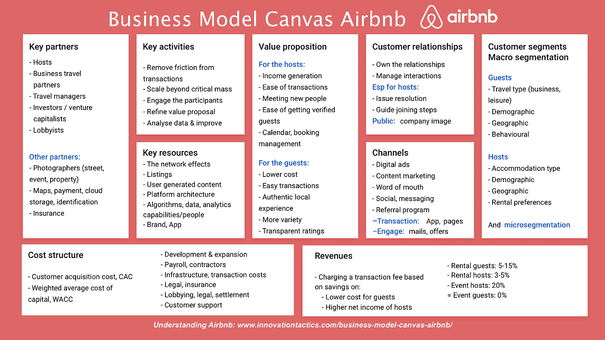

**Source:** [**https://www.innovationtactics.com/business-model-canvas-airbnb/**](https://www.innovationtactics.com/business-model-canvas-airbnb/)

**PADI 旅游预订服务的价值主张如何？**

第一个 Diviac，比 PADI 旅游，存在的目的是帮助潜水员探索更多的水下世界，激励和发展整个潜水社区，为潜水行业的每个人造福。与世界上任何其他旅游公司相比，它提供了更多的潜水目的地和更多的潜水假期，而且在未来几个月里，它将继续扩张，增加潜水度假产品。

[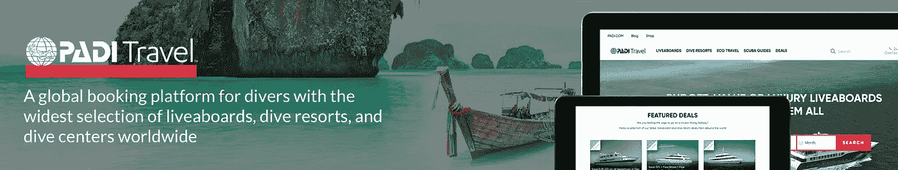](https://pxlme.me/kwwz4kFk)

当你的团队从零开始开发新产品时，这里有一个提示:确保团队中的每个人都理解你所做的事情的价值——理解为什么会改变开发人员的思维模式，并激励每个人拿出创造性的解决方案。

**2)决策之旅:沿着客户头脑中的蛇形线前进**

你如何[开发一个应用](https://pxlme.me/l97ZNB6o)来解决客户的问题，同时提供令人兴奋的体验？了解客户是如何做出决策的，以及在旅程的每一点是什么触发了他们的决策，这将有助于你打造让客户满意的服务。嗯，说起来容易做起来难，让我们深入挖掘，找出一切从哪里开始。

营销人员通常说，一切都始于需求，而后转化为欲望。那么是什么促使人们去潜水旅游呢？显而易见的答案是“他们想看水下的鱼。”但是如果你做一点调查，你会发现人们预订潜水度假的不同原因:

*   尝试一种全新的度假方式
*   试着以冥想的方式潜水，进入一种近乎恍惚的状态
*   成为一名持证潜水员
*   通过遇见鲨鱼来克服生活在他们灵魂深处的电影“大白鲨”的恐惧
*   拍摄海底世界的精彩照片
*   挑战自我，通过洞穴迷宫潜水
*   在沉船和水下博物馆周围游泳
*   去潜水吧(一些热情的潜水者计划去某个度假胜地，专门去看一种研究人员最近发现的特定种类的鱼，通常是一些有趣的种类，就像这条):

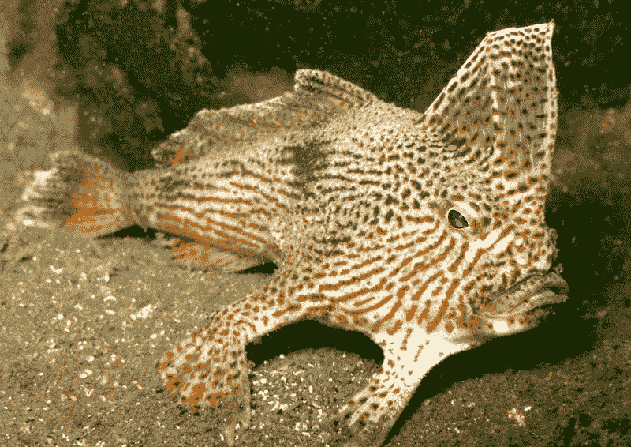

Crawlong Fish, source: [https://news.nationalgeographic.com/news/2008/04/080403-fish-photo.html](https://news.nationalgeographic.com/news/2008/04/080403-fish-photo.html)

所有的原因都是通过团队进行的分析发现的。研究是至关重要的——没有研究，你就无法明确人们做某事的内在动机。

**客户类型**

**潜水是一种狂热，**一旦你尝试过水下，这种体验将会吸引你很长一段时间，鼓励你越来越多地去旅行。因此，我们可以找出寻求潜水旅游的两类顾客:

*   第一类——第一次想去潜水的人，他们通常需要课程和证书方面的指导
*   第二类——专业潜水员，他们确实离不开水肺潜水，他们需要新的体验和新的挑战

朋友？配偶？孩子？—不跟团旅行的潜水者可能会有很可能不是潜水者的同伴陪同，所以重要的是要展示这些地点风景如画，而且陆地上会有一些非潜水者也会喜欢的酷东西。

至于团队，单独旅行和团队旅行的条件通常有很大不同，所以我们决定从一开始就对它们进行分类:

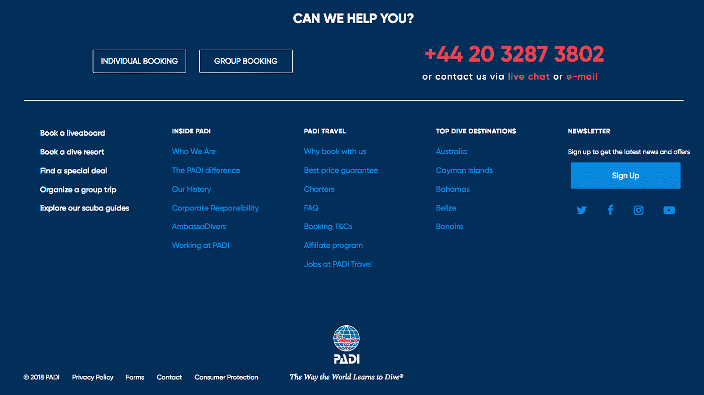

一流的旅游预订服务当然不是万能的，那种服务面向所有人，但实际上不面向任何人。要让你的旅游应用程序出现，要有强大的 UX/用户界面做后盾:规划你的受众，创建用户角色，代表每一类受众的需求、愿望和痛点。之后，根据用户在决策过程中遇到的要点构建一个客户之旅:

人们实际上喜欢计划，所以用很酷的功能来强化这个过程

一方面，人们认为旅行计划是一种很酷的体验，当他们终于可以放松下来，投入到愉快的期待中。但另一方面，客户明白他们需要浏览各种选项，因此需要做出很多选择。

通过实现正确的功能，可以找到“我的应用程序将是一把瑞士军刀，可以回答所有问题”和“我的应用程序将是超级简单和超级直观”之间的最佳平衡点。一个易于使用的预订平台并不是添加尽可能多的功能，而是删除不必要的功能，保持服务简单而又信息丰富。

这里有一个来自 PADI 旅游的例子:一旦用户到达平台的首页，点击几下，他就可以预订他的旅行，只需选择一个目的地和一个 liveaboard。你可能会对这里的人们是否准备在现场预订潜水度假感兴趣。当然，他们没有。然而， [Expedia Media Solutions](http://www.travelmarketreport.com/articles/Consumers-Visit-38-Sites-Before-Booking-Expedia-Says) 的研究表明，人们在预订前平均会去旅游网站 38 次。所以，如果在第 39 次点击的时候，你的平台必须从第一页开始就准备好满足这个需求。

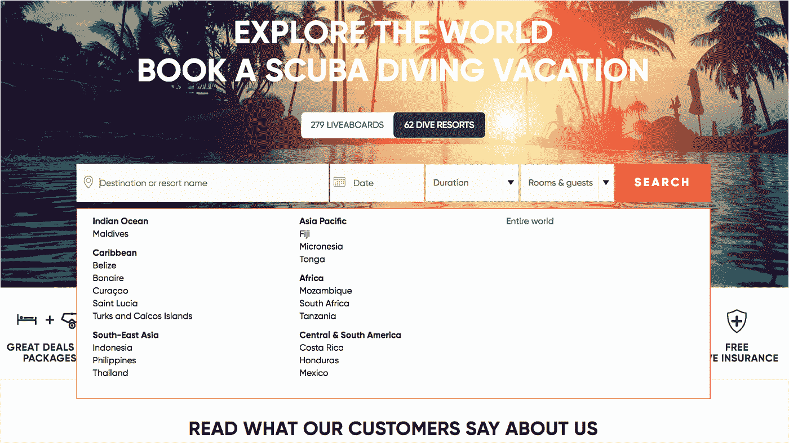

**激发灵感的特色**

为了让顾客感觉他们没有看错，你必须向他们提供选择的证据——通过博客告诉他们热门目的地，让发现过程变得互动，向他们展示令人惊叹的视觉效果，或者，一句话，激励他们并激发更多的探索。

以下是 PADI 旅行社的安排:

*   一个博客，上面有关于标志性海洋生物的文章，链接到菜单的每个部分
*   页脚列出了五大旅游目的地
*   一个潜水目的地向导，它很有趣，无论你已经在这里呆了一段时间还是刚刚浏览网站，它都可以帮助你找到不错的选择:

**简化研究的特性**

好奇的旅行者需要详细的信息，但肯定不需要你收集的所有信息。关键是以正确的比例组织信息。PADI 旅行社的描述不会让你感到饱和，而是指出你必须记住的东西。在这里，顾客可以找到计划目的地的时区、货币甚至插头类型的信息——所以你甚至不用再去谷歌了。重要功能-通知用户全年的气温和水温，因此他们可以轻松检查平均气温和水温，以做出正确的选择。

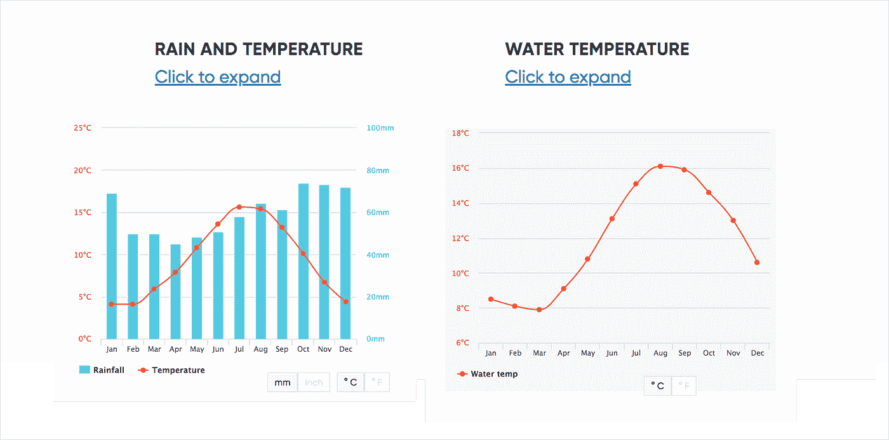

潜水者经常会因为渴望看到某些种类的生物而踮起脚尖，人们决定在那里放一个日历，显示在水下遇到鱼类或哺乳动物的可能性:

至于 Liveaboards——它们都有一个登陆页面，让用户可以进入 Liveaboard 的简历，决定这是不是一家适合他们旅程的公司。

在一系列的 A/B 测试之后，我们发现了一个更好的转换解决方案——所有目的地预订页面都有三个 CTA。这三个按钮涵盖了用户的主要查询:

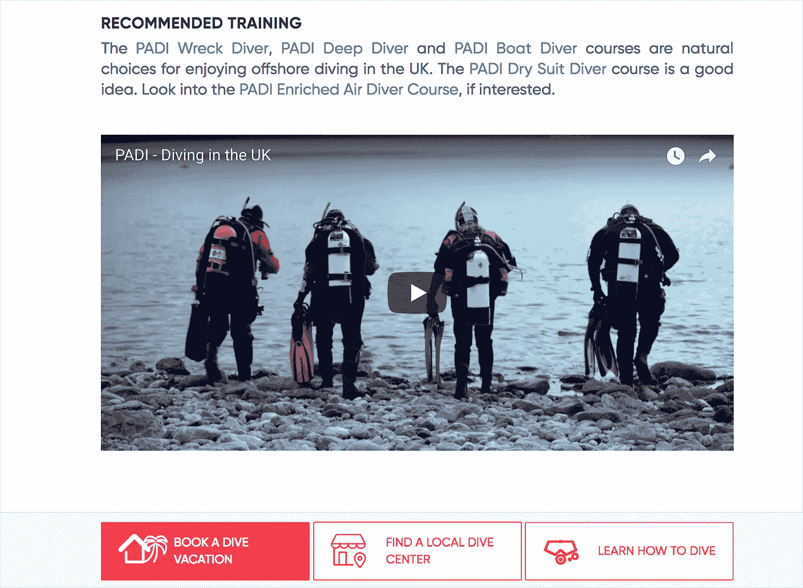

魔鬼在细节中；小事情有助于建立一个完整的画面，所以要注意所有微小的经历，并确保顾客在整个过程中感受到你的帮助。

**4)改变规则，或者在任何情况下保持头脑冷静**

为 PADI 构建旅游平台教会了我们在 Django Stars 的团队，应用程序开发是一门艺术:交付干净代码的艺术，沟通的艺术，以及在压力情况下保持头脑冷静的艺术。正如我在开始时提到的，我们的团队开始为 Diviac 开发应用程序，这是一个苏黎世开发的应用程序，具有稳定的管理和要求:经过多年的合作，我们知道应该期待什么，以及我们如何才能做出最好的贡献。当我们发现迪维克将被 PADI 收购时，我们犹豫不决。第一个是“哇，酷，最大的潜水组织——我们已经起鸡皮疙瘩了”，第二个是“嗯，一切都会改变，我们将有更多的利益相关者，这意味着永恒的发布周期和模糊的反馈”。

幸运的是，我们的猜测被证明是错误的:是的，有一些变化，但在核心上，他们更多的是心态和文化的转变。这是很重要的调整，使服务更加“全球化”，因为有来自美国和其他国家的大量流量。我们需要确保平台按照设计运行，我们的 QA 成员创建了性能测试来检查该解决方案是否能够支持 500 多个并发用户。

保持头部露出水面

或者如何应对动荡

1.  当市场扩大时——重新考虑你的目标受众。回到起点，分析你的价值主张、用户角色和客户旅程是否仍然相关(如果不相关，进行调整)
2.  新用户—新设备。拿出一些统计数据&找出最常用的设备，用这些小工具和手机来测试你的应用
3.  新市场——新规则。注意服务的安全性和法律遵从性。
4.  确保团队中的每一个人都没有冒犯到其他人，并且理解如何确保 UI 和数据架构的一致性
5.  确保敏捷不仅仅停留在纸面上——它在所有涉众和开发人员的脑海中，这样发布周期会更快，反馈会更频繁

沟通是关键，但是不要忘记新的变化会带来新的机会。不要害怕花时间重新定义旧的概念——新的视角可能会带来陈腐的见解。

**5)打磨必备功能**

几乎每个旅游预订应用程序都具备的丰富用户体验可能已经成为你的竞争优势。确保以下功能像时钟一样工作:

*   **日历**

将像 Google Calendar 这样的日历集成到您的预订引擎中，会自动将所有细节添加到用户的日历中，瞧！旅行者掌握了所有的细节，可以记录他们即将到来的假期。

*   **通知**

分散你的客户的注意力非常容易:猫来了，有人打电话，应用程序已经被遗忘了。这就是为什么如果你给你的用户发送新的产品、提醒和提醒，让他们记住留在购物车里的选项，他们会很感激。

通过跟踪用户的旅行历史、位置、行为和浏览习惯，您的平台还可以提供:

*   基于位置的建议
*   导航通知
*   交易信息
*   天气状况通知

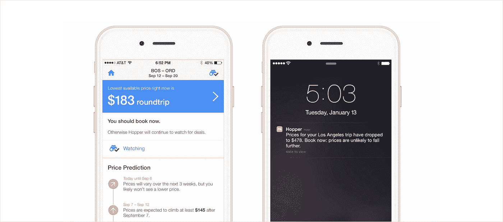

Source: [https://www.referralsaasquatch.com/push-notification-strategy/](https://www.referralsaasquatch.com/push-notification-strategy/)

下面是 Hopper app 如何通知用户降价

在“很高兴知道”的通知和真正重要的通知之间找到平衡，以保持用户的忠诚度和参与度。

*   **复杂的过滤器**

为了让用户的搜索变得简单和整洁，平台必须具备先进的过滤系统。有了大范围的过滤器，用户将能够把所有可用的选择缩小到一个完美的选项。

PADI 旅游有基于多个动态变化规则的过滤和搜索逻辑，允许用户从 120，000 个产品库中搜索各种类型的对象。

下面是 Diviac 搜索如何从基于操作符类型的分类发展而来的:

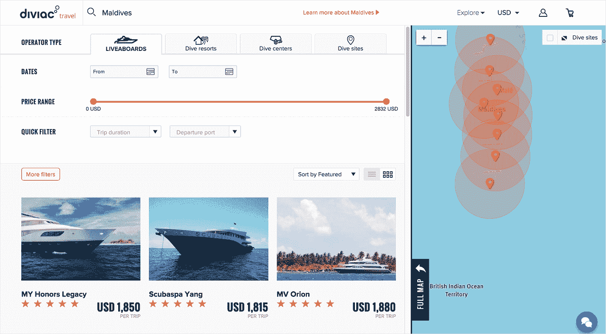

..涉及 15 个类别的过滤搜索:

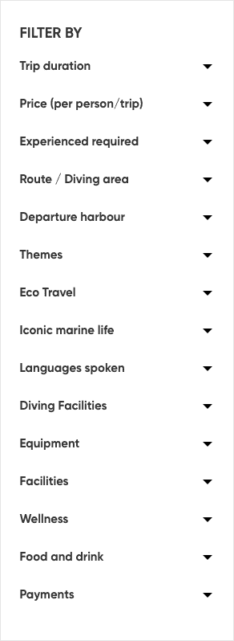

*   **支付管理**

当用户最终做出决定并找到唯一的预订时，确保所有的支付交易对他来说都是顺利和没有麻烦的。否则，在他花了相当多的时间在所有的网上安排后，你将迫使他勉强通过错综复杂的支付丛林。确保所有的事情都以快速简单的方式发生。注意以下要素:

*   *明确价格，不混淆或留下歧义*
*   *轻松切换货币*
*   *安全支付(信用卡、PayPal、Android Pay 和 Apple Pay)*
*   *扫描信用卡详细信息的选项*
*   **管理 CRM 系统**

一个全面的内部流程管理 CRM 是冰山一角，使一切工作没有麻烦。

PADI 旅行社开发了一个内部客户关系管理系统，为旅行社提供了一个全周期的订单和支付管理工具。通过这种方式，代理可以管理每一个步骤，从产品的创建到反馈和评级调整。

在开发平台面向内部的一面时，请记住一些将会受到经理们欢迎的特性:

*   复杂的**分析**不仅显示收入或预订数量方面的明显数据，还计算平均值并显示“计划与实际”对比
*   创建**交互式仪表盘的选项**
*   **高级过滤器**帮助他们快速浏览大量数据
*   一个**精简的包**,针对管理人员的需求，没有不必要的功能。

为了总结所有这些教训和发现，我想提到一位法国海洋学家雅克·库斯托。他不喜欢有百年历史的潜水技术，这种技术限制了他探索海洋的范围，他与 Emile Gagnan 合作对其进行了改进。他们一起发明了用于潜水的氧气罩乐队，让数百万海洋探险者游到更深的海洋深处。“未来掌握在探索的人手中，”他写道。当他描述他的突破时，他写道，“我发明潜水泵的时候正在玩。我认为玩耍是世界上最严肃的事情。”

这个故事讨论了我们从潜水行业的佼佼者身上学到了什么，以及我们如何一起打造(并将继续打造)一项独特的服务。它表明，即使在你的行业中有一个广泛使用的解决方案，但你知道你可以更好地解决用户的问题，那就去做吧。别忘了把整个开发过程当成一场游戏，一场有规则、有控制、有目标、有乐趣的游戏——只有在这种情况下，你才会创造出一个改变游戏规则的新产品。

[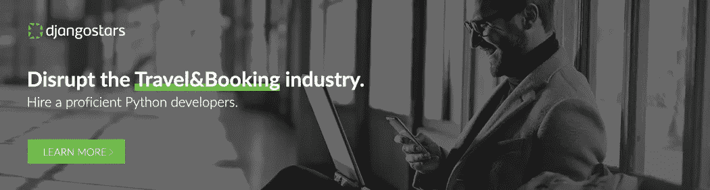](https://pxlme.me/SSi71C2X)

> 如果你觉得这篇文章有用，请点击👏下面的按钮:)