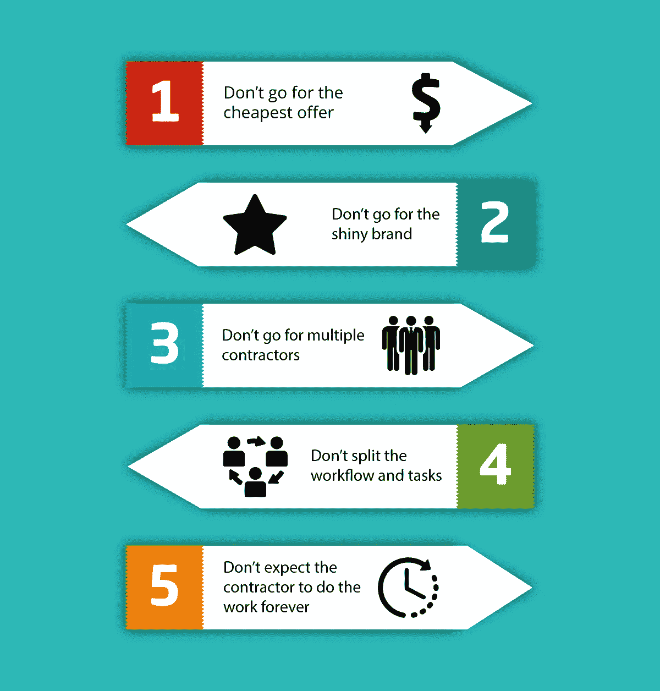

# 选择 IT 外包提供商时的 5 个错误

> 原文：<https://medium.com/hackernoon/5-mistakes-when-%D1%81hoosing-an-it-outsourcing-provider-33b7e20a2155>

许多公司决定外包他们的 IT 任务，以更好地利用他们的资源，并获得外部人才库。这里有 5 个错误，以避免选择 IT 外包提供商。

公司最大的资产是人力资本。建立一个全面的、有能力的、有动力的团队对任何企业来说都是最重要的任务。然而，这是一项可能需要数年才能完成的任务，而且某些任务(如设计、管理和维护 IT 基础设施)必须从第一天就完成。将此类工作外包给值得信赖的承包商是现代快节奏商业世界的发展方向。

IT 外包不再仅仅是一种选择，它正迅速成为许多公司开展业务的主要方式，无论是初创公司还是老牌企业。IT 外包的好处是多方面的，不可低估:

1.  一家 IT 外包公司可以提供一个经验丰富的专业团队，他们可以立即开始为您的项目工作
2.  当与 IT 服务提供商合作时，业务受到 [SLA](https://itsvit.com/blog/sla-benefits-why-do-you-need-sla-and-what-does-it-cover/) 和 [NDA](https://itsvit.com/blog/trust-caution-importance-nda-startups/) 的保护，这意味着问题将得到及时解决，不会发生信息泄露
3.  外包有助于节省成本和缩短产品上市时间，因为经验丰富的承包商为团队提供了既定的工作流程和磨练过的技能，这增加了在预算内及时完成项目的机会。

这些好处似乎好得难以置信，不是吗？嗯，如果你选择的 IT 外包提供商是一个值得信赖的合作伙伴，能够履行他们的义务，这一切都适用。唉，有时情况并非如此，企业必须避免 5 个错误:

1.  不要追求最便宜的报价
2.  不要追求闪亮的品牌
3.  不要选择多个承包商
4.  不要分割工作流程和任务
5.  不要指望承包商永远做这项工作

下面我们来详细阐述一下这些错误的意义和可能带来的危害，这样你会更好的理解如何选择合适的 IT 外包提供商。

# 错误 1:寻求最便宜的报价

你希望外包任务由熟练的专家以很少的费用来完成。然而，工资太低意味着雇佣低水平团队的巨大风险。因此，选择一个价格合理、信誉良好的 IT 服务提供商是最明智的选择。

# 错误 2:追求闪亮的品牌

与号称为三星、丰田或德意志银行提供支持的托管服务提供商合作很愉快。关键是，这些企业客户将永远是与他们合作的外包团队的优先考虑对象，因此如果他们的系统发生了重大问题，这种情况将受到最大的关注。自然，所有其他的任务都将被停止或推迟，直到大客户的危机得到解决。

避免这种情况的唯一方法是完全避免与闪亮的品牌合作，而是选择中档公司。在这种情况下，合作伙伴不会变成数字，所有的请求都会得到同等的重视，从而确保履行 SLA 下的义务。

此外，与行业领袖合作使他们的承包商习惯于大额支票，他们经常大幅提高价格。中型承包商不会相信这种方法，并保持合理的价格。

# 错误 3:选择多个承包商

高管层的老代表可能会选择不把所有鸡蛋放在同一个篮子里，而是雇佣多个承包商。虽然这种方法可能适用于为建筑工人提供办公用品或单独购买制服和头盔，但这永远不适用于 IT 服务。为了确保用户体验不会中断，应该由一个 IT 服务提供商来处理所有与 IT 相关的请求。

此外，承包商可能会雇用分包商，因此您的请求在得到满足之前将通过一个相当复杂的中介链。与提供全方位所需服务的公司合作是简化工作流程和确保服务交付稳定性的最佳方式。

# 错误 4:分割工作流程和孤立任务

例如，让我们以 DevOps 即服务领域为例，想象您的服务器由一个值得信赖的承包商供应、运行、备份和维护，而代码 QA 由另一家声誉良好的公司执行。

当提交一批新的代码进行测试时，DevOps 工程师为其提供一个构建环境，并为 QA 团队创建一个测试代码的标签，该过程处于暂停状态，直到 QA 专家由于 bug 而批准或拒绝代码。这可能只需要几分钟，但是 QA 方面的任何延迟都会影响其他两个团队的工作流程。

这就是为什么当一个团队负责整个工作流程时，采用端到端服务是确保服务交付没有不必要的瓶颈和延迟的唯一方法。

# 错误№5:把所有工作都留给承包商

虽然外包是一个强大的工具，但随着时间的推移，它不会消除建立内部团队的需要。你可以租用专家的技能来做一次性的工作，但是如果你的项目是一个长期的项目，你需要有一个人才团队，他们知道系统的所有细节，并且能够维护和持续改进。

雇佣的员工将根据 SLA 履行他们的职责，但是他们不会为您的项目付出任何不必要的努力。一个好的承包商肯定会努力培训你的内部专家使用他们提供的系统，或者提供一些改进的建议，因为一劳永逸地消除问题的原因比不断地处理后果要好。

# 关于选择 IT 外包提供商时要避免的 5 个错误的最后想法和免费建议

即使记住所有这些要点，找到一个值得信赖的 it 外包合作伙伴仍然是相当复杂的。那么如何选择合适的 IT 外包提供商呢？

我们建议从像 Clutch、Glassdoor 等知名评级公司寻找公正的评论。询问上述 IT 服务提供商的投资组合中提到的客户的评论也有帮助，因为不满意的客户会很快说出不可靠承包商的真相。寻找 It 外包市场领导者也是明智的，因为这些公司肯定会在 under SLA 下工作，并提供 24/7 的勤奋支持。

我们祝您好运，为您的企业找到合适可靠的 IT 外包提供商。只要避免前面提到的 5 个错误，你就会走上正轨！

最初，我把这个故事贴在了我公司的博客上——[https://it svit . com/blog/5-errors-% D1 % 81 选择 it 外包提供商/](https://itsvit.com/blog/5-mistakes-%D1%81hoosing-it-outsourcing-provider/)